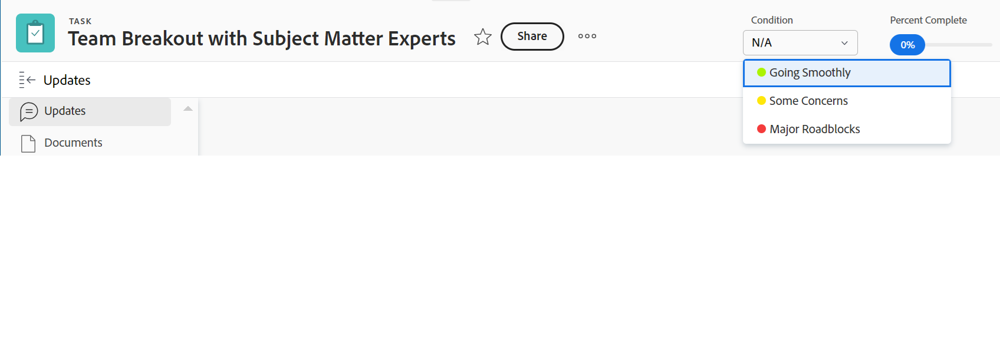

# Uppdatera villkor för aktiviteter och ärenden

{{highlighted-preview}}

Villkoret för en aktivitet eller ett problem är en flagga som anger hur den ska gå. Detta skiljer sig från arbetsobjektets status, som anger det aktuella utvecklingssteget för objektet.

Du kan ställa in villkoret för en uppgift eller ett problem antingen automatiskt eller manuellt.

Villkorsvärdena som vi hänvisar till i den här artikeln är som standard tillgängliga i Workfront. Din Adobe Workfront-administratör kan skapa anpassade villkor för din miljö enligt beskrivningen i [Skapa eller redigera ett anpassat villkor](../../../administration-and-setup/customize-workfront/create-manage-custom-conditions/create-edit-custom-conditions.md).

## Åtkomstkrav {#access-requirements}

Du måste ha följande åtkomst för att kunna utföra stegen i den här artikeln:

<table style="table-layout:auto"> 
 <col> 
 <col> 
 <tbody> 
  <tr> 
   <td role="rowheader">Adobe Workfront</td> 
   <td> 
Alla
 </td> 
  </tr> 
  <tr> 
   <td role="rowheader">Adobe Workfront-licens*</td> 
   <td>

För de nya licenserna:
<ul><li>
Standard för uppgifter
</li>
   <li>
Medarbetare eller högre för problem
</li></ul>

För aktuella licenser:
<ul><li>
Arbeta eller högre för uppgifter
</li>
   <li>
Begär eller högre för problem
</li></ul>
    </td> 
  </tr> 
  <tr> 
   <td role="rowheader">Konfigurationer på åtkomstnivå</td> 
   <td> 
Visa eller öka åtkomst till projekt
 
Redigera åtkomst till uppgifter och ärenden 
</td> 
  </tr> 
  <tr> 
   <td role="rowheader">Objektbehörigheter</td> 
   <td> 
Visa eller öka behörigheter för aktiviteter och ärenden för att visa deras villkor

   
Hantera behörigheter för aktiviteter och problem för att uppdatera villkoret

  </td> 
  </tr> 
 </tbody> 
</table>

*Kontakta Workfront-administratören om du vill veta vilken plan, licenstyp eller åtkomst du har. Mer information finns i [Åtkomstkrav i Workfront-dokumentation](/help/quicksilver/administration-and-setup/add-users/access-levels-and-object-permissions/access-level-requirements-in-documentation.md).

## Förutsättningar

Du måste tilldelas en aktivitet eller ett problem för att kunna uppdatera dess villkor manuellt.

## Leta reda på villkoret för uppgifter och problem

Villkor visas som en flagga som är kopplad till uppgifter eller problem. De kan även kopplas till ett tal som kan visas i rapporter i stället för etiketten. Mer information om hur du associerar villkor med tal finns i [Skapa eller redigera ett anpassat villkor](../../../administration-and-setup/customize-workfront/create-manage-custom-conditions/create-edit-custom-conditions.md).

Du hittar villkoren för åtgärder och problem i följande områden av Workfront:

* Sidan Detaljer visas när en Workfront- eller gruppadministratör har lagt till den i layoutmallen. Mer information finns i [Anpassa detaljvyn med hjälp av en layoutmall](/help/quicksilver/administration-and-setup/customize-workfront/use-layout-templates/customize-details-view-layout-template.md). 

* Rubriken för en uppgift eller ett problem, efter att en Workfront- eller gruppadministratör har lagt till den i layoutmallen. Mer information finns i [Anpassa objektrubriker med hjälp av en layoutmall](/help/quicksilver/administration-and-setup/customize-workfront/use-layout-templates/customize-object-headers.md). 

* Panelen Sammanfattning visas när en Workfront- eller gruppadministratör har lagt till den i layoutmallen. Mer information finns i [Anpassa hem och sammanfattning med en layoutmall](/help/quicksilver/administration-and-setup/customize-workfront/use-layout-templates/customize-home-summary-layout-template.md).

* Rapporter och listor när du visar fältet Villkor i en vy eller gruppering.

  >[!NOTE]
  >
  >När ordet &quot;villkor&quot; visas i fältet Fältnamn i en journalpostrapport, visar detta att villkoret för ett objekt har uppdaterats. När fältet Villkor spåras i journalposter visar värdena för Nytt och Gammalt nummer numret som är associerat med villkoret i stället för dess namn. Om ett villkor ursprungligen inte är definierat för en aktivitet eller ett problem och du senare uppdaterar det, kommer journalposten som hämtar uppdateringen att visa värdet för Gammalt nummer i villkorsfältet som -2 147 483 648.

## Uppdatera villkoret automatiskt genom att uppdatera statusen

När du har tilldelats en uppgift eller ett ärende och du klickar på **Arbeta på den** , Starta aktivitet eller Starta problem, eller uppdatera status för aktiviteten, så ändras villkoret för aktiviteten eller problemet automatiskt till det standardvillkor som är associerat med **Går smidigt**.

Mer information om hur du använder ett anpassat villkor som standardvillkor finns i artiklarna  [Ange ett anpassat villkor som standard för uppgifter och ärenden](../../../administration-and-setup/customize-workfront/create-manage-custom-conditions/set-custom-condition-default-tasks-issues.md) och [Ange ett anpassat villkor som standard för projekt](../../../administration-and-setup/customize-workfront/create-manage-custom-conditions/set-custom-condition-default-projects.md).

Mer information om hur du ändrar aktivitetsstatus finns i [Uppdatera aktivitetsstatus](../../../manage-work/projects/updating-work-in-a-project/update-task-status.md).

Mer information om hur du ändrar utgivningsstatus finns i [Uppdatera utgivningsstatus](../../../manage-work/projects/updating-work-in-a-project/update-issue-status.md).

Mer information om hur du ställer in knappen Work On It (Arbeta på den) på knappen Start Task (Starta aktivitet) eller Start Issue (Starta problem) finns i [Ersätta knappen Work On It (Arbeta på) med en Start-knapp](../../../people-teams-and-groups/create-and-manage-teams/work-on-it-button-to-start-button.md).

## Uppdatera villkoret manuellt

Du måste tilldelas en uppgift eller ett ärende eller ha behörigheten Hantera för att kunna ställa in villkoret på den.

Du kan uppdatera villkoret för en uppgift eller ett problem manuellt i en rapport eller en utgivningslista när du visar fältet Villkor i vyn.

>[!NOTE]
>
>Du kan be system- eller gruppadministratören att lägga till villkorsfältet på panelen Sammanfattning så att det blir enklare att uppdatera det i olika delar av Workfront.
>
>Mer information finns i följande artiklar:
>
>* [Sammanfattning](/help/quicksilver/workfront-basics/the-new-workfront-experience/summary-overview.md)
>* [Anpassa hem och sammanfattning med en layoutmall](/help/quicksilver/administration-and-setup/customize-workfront/use-layout-templates/customize-home-summary-layout-template.md).

<!--old Condition update - in the commenting stream: 
Updating the Condition of a task or issue differs depending on whether you are assigned to it or not:

* If you are using the legacy commenting experience, you can update the Condition in the Updates tab or in a list of tasks or issues if you are assigned to them. This is not supported in the new commenting experience. For information, see [New commenting experience](/help/quicksilver/product-announcements/betas/new-commenting-experience-beta/unified-commenting-experience.md). 
* You can update the Condition in a list of tasks or issues if you are not assigned to them, only if you have Manage permissions to them. In this case, you cannot update the Condition in the Update tab of the task or issue. -->

Gör något av följande om du vill uppdatera villkoret för en uppgift eller ett problem manuellt:

1. Så här uppdaterar du villkoret för en aktivitet eller ett problem i huvud för aktiviteten eller problemet:

   1. (Villkorligt) Om Workfront- eller gruppadministratören har lagt till fältet Villkor i huvud för aktiviteten eller problemet i layoutmallen klickar du på **Villkor** i sidhuvudet och välj bland följande alternativ:
      * Går smidigt
      * Vissa bekymmer
      * Större vägspärrar

      
   1. Klicka på Enter för att spara villkoret.

1. Så här uppdaterar du villkoret för en aktivitet eller ett problem i avsnittet med information om aktiviteten eller problemet:

   1. (Villkorligt) Om Workfront- eller gruppadministratören har lagt till fältet Villkor i avsnittet Detaljer för en uppgift eller ett problem i layoutmallen klickar du på **Information** i den vänstra panelen klickar du på **Villkor** och välj bland följande alternativ:
      * Går smidigt
      * Vissa bekymmer
      * Större vägspärrar
1. Klicka **Spara ändringar**. Aktivitets- eller utgivningsvillkoret uppdateras.

Så här uppdaterar du villkoret för en aktivitet eller ett problem i en rapport eller lista:

1. Gå till en lista över uppgifter eller problem som du har behörighet att hantera. Kontrollera **Villkor** -fältet visas i listvyn.

1. Uppdatera **Villkor** genom att dubbelklicka på det befintliga villkoret och välja ett nytt värde i listrutan.

   

   >[!NOTE]
   >
   >Villkoren kan anpassas efter din miljö, så du kan hitta fler än tre alternativ för Villkor i din miljö. Namnen på villkoren kan skilja sig från namnen ovan. Mer information om hur du anpassar villkor i Workfront finns i [Skapa eller redigera ett anpassat villkor](../../../administration-and-setup/customize-workfront/create-manage-custom-conditions/create-edit-custom-conditions.md).

1. Tryck **Retur** på tangentbordet eller klicka utanför fältet Villkor för att spara den nya aktiviteten eller villkoret för problemet.

<!--   
<li>
(NOTE: drafted because I can't do this anymore)

If you have Manage permissions to the task or issue but are not assigned to it, perhaps as a project manager, add the <strong>Condition</strong> column to any view you use in a task or issue list, then set the <strong>Condition</strong> in inline edit and press Enter.

For information about adding a column to a view, see <a href="../../../reports-and-dashboards/reports/reporting-elements/views-overview.md">Views overview in Adobe Workfront</a>.
</li>   
     -->

