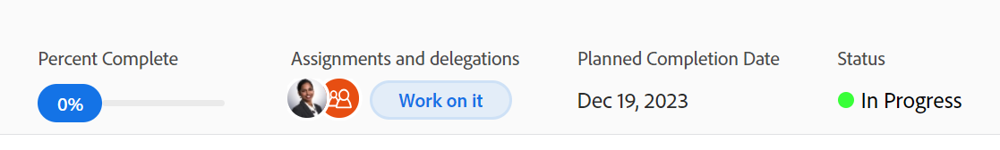

# Uppdatera aktivitetsstatus

<!--Audited: 10/2024-->

Du kan uppdatera en uppgifts status för att informera andra om var uppgiften är (och det övergripande projektet) och hur den fortskrider.

Standardstatusvärdena är Nytt, Pågår och Fullständigt. Din Adobe Workfront-administratör kan lägga till anpassade statusvärden för din organisation. Mer information finns i [Skapa eller redigera en status](../../../administration-and-setup/customize-workfront/creating-custom-status-and-priority-labels/create-or-edit-a-status.md).

Du kan uppdatera uppgiftsstatus manuellt eller låta Workfront uppdatera dem automatiskt när vissa åtgärder utförs.

## Åtkomstkrav

+++ Expandera om du vill visa åtkomstkrav för funktionerna i den här artikeln.

Du måste ha följande åtkomst för att kunna uppdatera uppgifter manuellt:

<table style="table-layout:auto"> 
 <col> 
 <col> 
 <tbody> 
  <tr> 
   <td role="rowheader">Adobe Workfront</td> 
   <td> 
Alla
 </td> 
  </tr> 
  <tr> 
   <td role="rowheader">Adobe Workfront-licens*</td> 
   <td> 
Nytt: Standard
 
   eller
   
Aktuell: Arbete eller högre

   </td> 
  </tr> 
  <tr> 
   <td role="rowheader">Konfigurationer på åtkomstnivå</td> 
   <td> 
Redigera åtkomst till uppgifter
  </td> 
  </tr> 
  <tr> 
   <td role="rowheader">Objektbehörigheter</td> 
   <td> 
Hantera behörigheter för uppgiften
 </td> 
  </tr> 
 </tbody> 
</table>

*Mer information finns i [Åtkomstkrav i Workfront-dokumentation](/help/quicksilver/administration-and-setup/add-users/access-levels-and-object-permissions/access-level-requirements-in-documentation.md).

+++

## Att tänka på när du uppdaterar aktiviteternas status

* När du markerar en uppgift som slutförd uppdateras procentandelen slutförd till 100 %.
* Följande scenarier finns för överordnade uppgifter:
   * Du kan inte uppdatera statusen för en överordnad aktivitet till Fullständig när läget Sammanfattning av slutförande för projektet är inställt på Automatisk och underaktiviteterna inte slutförs.
   * Du kan uppdatera statusen för en överordnad aktivitet till Fullständig när läget Sammanfattning av slutförande för projektet är inställt på Manuell och underaktiviteterna är slutförda eller ofullständiga.

  Mer information finns i [Redigera projekt](../manage-projects/edit-projects.md).

## Uppdatera aktivitetsstatus manuellt

Du kan uppdatera aktivitetsstatus i följande områden i Workfront:

* Uppgiftshuvudet på uppgiftssidan.
* Åtgärdsrutan Redigera när du redigerar en uppgift.
* Avsnittet Uppgiftsinformation på uppgiftssidan.
* I en uppgiftslista eller rapport när statusfältet visas i vyn.
* På sammanfattningspanelen för uppgiften.

Så här uppdaterar du aktivitetsstatus i uppgiftshuvudet manuellt:

1. Gå till en uppgift som du vill uppdatera statusen för.
1. Klicka på fältet **Status** i åtgärdshuvudet och välj en ny status.
1. Om du vill ange en visuell indikation på att aktiviteten har slutförts drar eller dubbelklickar du på bubblan under **Procent färdigt** i uppgiftens huvud

   eller

   Klicka i bubblan i uppgiftens huvud för att ange en procentsats.

   

1. (Valfritt) Gör något av följande för att ange ytterligare information om uppdateringen:

   * Om du vill lägga till en anteckning om uppdateringen går du till avsnittet **Uppdateringar** och klickar på **Ny kommentar**. Skriv sedan en anteckning.

     

   * Om du vill meddela vissa användare om uppdateringen skriver du deras namn i fältet **Tagga personer eller team** som visas när du skriver en kommentar. Mer information finns i [Tagga andra om uppdateringar](/help/quicksilver/workfront-basics/updating-work-items-and-viewing-updates/tag-others-on-updates.md).
   * Om du vill uppdatera aktivitetens implementeringsdatum klickar du på **Aktivitetsinformation** och redigerar sedan fältet **Verkställ datum**. Mer information finns i [Redigera uppgifter](/help/quicksilver/manage-work/tasks/manage-tasks/edit-tasks.md).

   >[!IMPORTANT]
   >
   >  Det är bara uppgiftstilldelningar som kan uppdatera implementeringsdatumet.

<!--old functionality in old commenting: 

1. Go to a task that you are assigned to for which you want to update the status.
1. Click the **Status** field in the task header and select a new status. 
1. (Optional) Do any of the following to provide additional information about the update, then click **Update** or, if the task has the **Complete** status, click **Done:**

   * To add a note about the update, go to the **Updates** area and click **Start a new update**, then type your note.  

   * To notify certain users about the update, type their names in the **Notify** box that appears when you type a note about the update. For more information, see [Tag others on updates](../../../workfront-basics/updating-work-items-and-viewing-updates/tag-others-on-updates.md). 
   * To update the condition of the task, click **Select Condition** to the right of the **Notify** box (these appear when you type a note about the update), then select the condition that best reflects the current condition of the task.
   
   * To update the Commit Date of the task, expand the **Commit Date** drop-down calendar, and select a new Commit Date. 
   * To provide a visual indication of task completion, drag the bubble under Percent Complete or double-click it to enter a percent value.   
     -->

## Uppdatera aktivitetsstatus automatiskt

Workfront uppdaterar automatiskt den befintliga statusen för en aktivitet till en annan status när åtgärderna som anges i tabellen nedan inträffar.

>[!NOTE]
>
>Statuserna i följande tabell är standardsystemstatusar. Din Workfront-administratör eller en gruppadministratör kan byta namn på statusarna i din instans av Workfront. Mer information om hur du skapar och hanterar statusar i Workfront finns i [Skapa eller redigera en status](../../../administration-and-setup/customize-workfront/creating-custom-status-and-priority-labels/create-or-edit-a-status.md).

<table style="table-layout:auto"> 
 <col> 
 <col> 
 <col> 
 <tbody> 
  <tr> 
   <td><b>Åtgärd</b></td> 
   <td><b>Ursprunglig status</b></td> 
   <td><b>Ny status</b></td> 
  </tr> 
  <tr> 
   <td>Uppdatera aktivitetsprocenten slutförd till 100 %</td> 
   <td>Nytt eller Pågående</td> 
   <td>Complete</td> 
  </tr> 
  <tr> 
   <td>Uppdatera procent färdigt för aktiviteten från 100 % till ett lägre tal</td> 
   <td>Complete</td> 
   <td>Pågår</td> 
  </tr> 
  <tr data-mc-conditions=""> 
   <td>Klicka på knappen Starta uppgift för att acceptera att arbeta med en uppgift som du har tilldelats </td> 
   <td>Nytt </td> 
   <td> 
Status som är associerad med knappen Starta uppgift i inställningarna för Hemteam.
 
Mer information om hur du ersätter knappen Arbeta på den med knappen Start Task (Start-aktivitet) finns i <a href="../../../people-teams-and-groups/create-and-manage-teams/work-on-it-button-to-start-button.md" class="MCXref xref">Ersätta knappen Work On It (Arbeta på den) med knappen Start (Start)</a>.
 
Tips! Om du klickar på  Ångra-knappennär du har klickat på Starta aktivitet återställs statusen till Ny. 
 </td> 
  </tr> 
 </tbody> 
</table>
