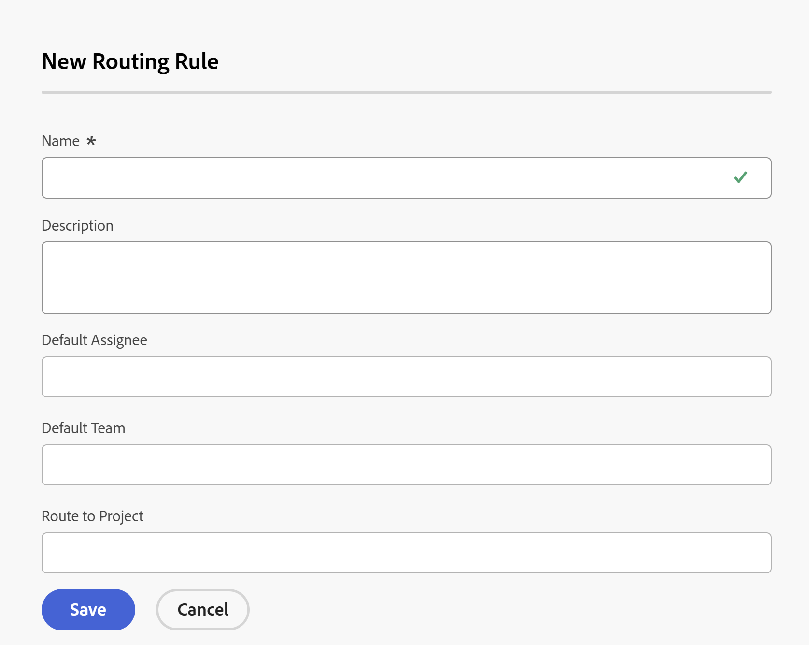

# Skapa routningsregler

<!-- Audited: 12/2023 -->

Routningsreglerna styr vad Adobe Workfront gör med problem när de skickas till en begärandekö. Mer information om hur du skapar frågeköer finns i [Skapa en frågekö](../../../manage-work/requests/create-and-manage-request-queues/create-request-queue.md).

Routningsregler skickar problem till specifika användare eller jobbroller som är bäst utrustade för att lösa det skickade problemet eller den skickade förfrågan. Routningsregler är vanligtvis associerade med köämnen, som används för att kontrollera vilken routningsregel som ska användas för utgåvan eller förfrågan.

När du väl har skapat ett projekt kan du inte flytta routningsregler från ett projekt till ett annat.

## Åtkomstkrav

+++ Expandera om du vill visa åtkomstkrav för funktionerna i den här artikeln.

<table style="table-layout:auto"> 
 <col> 
 <col> 
 <tbody> 
  <tr> 
   <td role="rowheader">
Adobe Workfront
</td> 
   <td> 
Alla 
 </td> 
  </tr> 
  <tr> 
   <td role="rowheader">Adobe Workfront-licens*</td> 
   <td> 
Ny licens: Standard 
 
   eller
   
Aktuell licens: Planera 
 </td> 
  </tr> 
  <tr> 
   <td role="rowheader">Konfigurationer på åtkomstnivå</td> 
   <td> 
Redigera åtkomst till projekt
 </td> 
  </tr> 
  <tr> 
   <td role="rowheader">Objektbehörigheter</td> 
   <td> 
 Hantera behörigheter för projektet
 </td> 
  </tr> 
 </tbody> 
</table>

*Mer information om informationen i den här tabellen finns i [Åtkomstkraven i Workfront-dokumentationen](/help/quicksilver/administration-and-setup/add-users/access-levels-and-object-permissions/access-level-requirements-in-documentation.md).

+++

## Skapa en hanteringsregel

1. Gå till det projekt där du vill lägga till routningsregler för dina begäranden.
1. Klicka på **Routningsregler** i den vänstra panelen. Du kan behöva klicka på **Visa fler** och sedan på **Routningsregler**.
1. Klicka på **Ny routningsregel** för att lägga till den nya regeln. Rutan **Ny routningsregel** öppnas.

   
1. Ange följande information för hanteringsregeln:

   <table style="table-layout:auto"> 
    <col> 
    <col> 
    <thead> 
     </thead> 
    <tbody> 
     <tr> 
      <td role="rowheader"><strong>Namn</strong> </td> 
      <td>Namnet på routningsregeln. Du kan se routningsregeln om du har tillgång till den här informationen i projektet.</td> 
     </tr> 
     <tr> 
      <td role="rowheader"><strong>Beskrivning</strong> </td> 
      <td>Lägg till en beskrivning för routningsregeln.</td> 
     </tr> 
     <tr> 
      <td role="rowheader"><strong>Standardtilldelare*</strong> </td> 
      <td>Lägg till en aktiv användare eller en aktiv jobbroll som de nya utgåvorna ska tilldelas till. Du kan bara ha en standardtilldelare i det här fältet. </td> 
     </tr> 
     <tr> 
      <td role="rowheader"><strong>Standardteam*</strong> </td> 
      <td>Lägg till ett aktivt team som den nya utgåvan ska tilldelas till. Du kan bara ha ett standardteam i det här fältet.

   
<b>ANMÄRKNING</b>

   När utgåvan har skickats in kan du redigera uppdragen och tilldela andra användare, roller eller team. Mer information finns i <a href="../../../manage-work/issues/manage-issues/assign-issues.md">Tilldela problem</a>.

   </td> 
     </tr> 
     <tr> 
      <td role="rowheader"><strong>Dirigera till projekt</strong> </td> 
      <td>Det här är projektet där problemet läggs till.</td> 
     </tr> 
    </tbody> 
   </table>

   >[!NOTE]
   >
   >*Om en användare, en jobbroll eller ett team inaktiveras efter att de har associerats med en routningsregel dirigeras förfrågningarna vidare till dem. Du måste regelbundet inventera alla routningsregler och ersätta inaktiverade tilldelningar med aktiva.

   När du dirigerar ett problem till ett projekt får användare med behörigheter för det aktuella projektet de behörigheter som angetts för det projektet. Mer information om hur du ställer in behörigheter för projekt finns i [Dela ett projekt i Adobe Workfront](../../../workfront-basics/grant-and-request-access-to-objects/share-a-project.md).

1. Klicka på **Spara**.

   Den här processen definierar bara routningsregeln. För att säkerställa att problemet dirigeras när det skickas till begärandekön måste du välja routningsregeln på fliken **Köinformation** under **Standardflöde**.

   Mer information om hur du lägger till en standardväg i en begärandekö finns i [Skapa en begärandekö](../../../manage-work/requests/create-and-manage-request-queues/create-request-queue.md).

   Om du vill associera flera routningsregler med begärandekön måste du skapa flera köämnen och associera vart och ett med en separat routningsregel. Mer information om hur du skapar ett köämne finns i [Skapa köämnen](../../../manage-work/requests/create-and-manage-request-queues/create-queue-topics.md).
