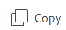

# Kopiera och skicka begäranden

När du skickar in liknande begäranden ofta kan du kopiera en befintlig skickad begäran. I det här fallet kan du kopiera en befintlig begäran, göra minimala ändringar i den och skicka den igen som en ny begäran.

## Åtkomstkrav

+++ Expandera om du vill visa åtkomstkrav för funktionerna i den här artikeln.

<table style="table-layout:auto"> 
 <col> 
 <col> 
 <tbody> 
  <tr> 
   <td role="rowheader">Adobe Workfront package</td> 
   <td> 
Alla 
 </td> 
  </tr> 
  <tr> 
   <td role="rowheader">Adobe Workfront-licens</td> 
   <td> 
Medarbetare eller högre

   
Begäran eller senare

    </td> 
  </tr> 
  <tr> 
   <td role="rowheader">Konfigurationer på åtkomstnivå</td> 
   <td> 
Redigera åtkomst till problem
  </td> 
  </tr> 
  <tr>
   <td role="rowheader">Objektbehörigheter</td> 
   <td>
Åtkomst att lägga till begäranden i en begärandekö
 
Visa eller högre behörigheter för den befintliga begäran
 
Mer information om hur du konfigurerar en begärandekö finns i <a href="../../../manage-work/requests/create-and-manage-request-queues/create-request-queue.md" class="MCXref xref">Skapa en begärandekö</a>. 
 </td> 
  </tr>
  <tr> 
   <td role="rowheader"> Produkt</td> 
   <td> <ul><li>Adobe Workfront</li><li>Du måste ha Adobe Workfront Planning för att kunna visa planeringsförfrågningar eller begära formulär</td> 
  </tr> 
 </tbody> 
</table>

Mer information finns i [Åtkomstkrav i Workfront-dokumentationen](/help/quicksilver/administration-and-setup/add-users/access-levels-and-object-permissions/access-level-requirements-in-documentation.md).

+++

## Förutsättningar

Du måste ha en begäran om att du eller någon i din organisation som tidigare har skickats in ska kunna kopiera den och skicka den igen. Om begäran tillhör någon annan måste du ha åtminstone behörighet att visa den för att kunna kopiera och skicka den som ny.

## Att tänka på när det gäller att kopiera och skicka begäranden som nya

* Du kan bara kopiera och skicka skickade begäranden. Du kan inte kopiera utkast.
* Du kan kopiera och skicka in begäranden som du ursprungligen skickade, eller förfrågningar som andra skickat och du har tillgång till åtminstone Visa.
* Du har alltid tillgång till att kopiera och skicka in en kopia av dina egna förfrågningar, såvida inte någon har tagit bort dina behörigheter till dem.
* Åtkomst till kopierings- och sändningsbegäranden som ursprungligen skickades av andra kan beviljas automatiskt till personer i samma företag när den som skapade frågekö aktiverar **Personer från samma företag ärver samma behörigheter för alla begäranden** i områdena Köinformation eller Redigera projekt. Om du inaktiverar den här inställningen kan endast den som gjorde originalet visa sina egna förfrågningar.

  Mer information finns i följande artiklar:

   * [Skapa en begärandekö](../../../manage-work/requests/create-and-manage-request-queues/create-request-queue.md)
   * [Redigera projekt](../../../manage-work/projects/manage-projects/edit-projects.md)

* Du kan uppdatera kopian av den ursprungliga begäran innan du skickar in den igen som en ny begäran.
* Om följande ändringar inträffar efter det att den ursprungliga begäran har skickats, kan du inte längre kopiera den och skicka den igen:

   * Begärandekön togs bort.
   * Köämnet togs bort.

     >[!TIP]
     >
     >Om köämnet var det enda i begärandekön kan du fortfarande kopiera och skicka begäran, och den kommer att sparas i själva begärandekön.

   * Begärandekön publiceras inte längre som en kö för hjälpbegäranden. Mer information finns i [Skapa en frågekö](../../../manage-work/requests/create-and-manage-request-queues/create-request-queue.md).
   * Om begärandekön inte har något köämne och den ursprungliga begäran skickades före januari 2022.

   * Status för det projekt som är associerat med begärandekön är inte längre Aktuell.

* Du kan kopiera och skicka en kopia av en konverterad begäran om den bevaras i konverteringsprocessen. Mer information finns i [Översikt över konvertering av problem i Adobe Workfront](../../../manage-work/issues/convert-issues/convert-issues.md).

  >[!TIP]
  >
  >Den kopierade begäran är inte länkad till ett matchande objekt.

## Kopiera och skicka begäranden i den äldre begärande upplevelsen

{{step1-to-requests}}

1. (Villkorligt) Om avsnittet Skickat inte visas som standard klickar du på **Skickat** i den vänstra panelen.

   >[!TIP]
   >
   >   Din Workfront- eller gruppadministratör kan anpassa layoutmallen och ta bort områden från huvudmenyn eller den vänstra panelen i din miljö. I så fall kanske de inte är tillgängliga för dig.

1. Leta reda på den begäran som du vill kopiera och skicka som ny, och gör något av följande:

   * Markera den och klicka sedan på ikonen **Kopiera**  i det övre vänstra hörnet i listan Skickade begäranden.

   >[!TIP]
   >
   > Om du inte valde någon begäran först är ikonen Kopiera nedtonad.

   * Klicka på **Mer**-menyn  till höger om namnet på begäran, klicka sedan på **Kopiera och skicka som nytt**

     eller

     Högerklicka på den valda begäran, klicka sedan på **Kopiera och skicka som ny**.

     

     >[!TIP]
     >
     >Om du inte har behörighet att skapa problem får du en varning om att administratören har begränsat dig från att skapa förfrågningar.

1. (Valfritt) Uppdatera följande information vid behov:

   * **Typ av begäran**: begärandekön där den kopierade begäran sparas. Som standard sparas den kopierade begäran i begärandekön för den ursprungliga begäran.
   * **Ämnesgrupper** och **Köämnen**, om de är markerade. Namnen eller ämnesgrupperna och köämnena är anpassade för din miljö. Som standard sparas den kopierade begäran i ämnesgrupperna och i köämnena i den ursprungliga begäran.

     >[!TIP]
     >
     >Om sökvägen ändras från sökvägen till den ursprungliga begäran har kön ändrats av den som skapade kön.

1. (Valfritt) Uppdatera eventuell information från den kopierade begäran. Beroende på vilka fält som den som har skapat kön för begäranden har aktiverat i avsnittet **Fält för nya problem** på underfliken **Köinformation** i projektet, kan du hitta något av följande fält:

   <table style="table-layout:auto"> 
    <col> 
    <col> 
    <tbody> 
     <tr> 
      <td role="rowheader"><strong>Ämne</strong> </td> 
      <td>Visar namnet på den ursprungliga begäran. Uppdatera den om det behövs. Annars namnger Workfront den kopierade begäran <b>Kopian av &lt;namnet på den ursprungliga begäran&gt;</b>. Detta är ett obligatoriskt fält.</td> 
     </tr> 
     <tr> 
      <td role="rowheader"><strong>Beskrivning</strong> </td> 
      <td>Visar beskrivningen av den ursprungliga begäran. Uppdatera den om det behövs.</td> 
     </tr> 
     <tr> 
      <td role="rowheader"><strong>URL</strong> </td> 
      <td> 
Visar URL:en för den ursprungliga begäran. Uppdatera den om det behövs.
 </td> 
     </tr> 
     <tr> 
      <td role="rowheader"><strong>Prioritet</strong> </td> 
      <td> 
Ange prioriteten för din begäran. Prioriteten bör definiera hur snabbt du anser att denna begäran bör lösas. Standardalternativen är:
 
       <ul> 
        <li>Ingen</li> 
        <li>Låg</li> 
        <li>Normal</li> 
        <li>Hög</li> 
        <li>Urgent</li> 
       </ul> 
Din Workfront-administratör kan ändra namnen på prioriteter.
 </td> 
     </tr> 
     <tr> 
      <td role="rowheader"><strong>Allvarlighetsgrad</strong> </td> 
      <td> 
Ange allvarlighetsgraden för din begäran. Allvarlighetsgraden bör definiera hur den här förfrågan påverkar ditt arbete om den inte kan lösas i tid. Standardalternativen är:
 
       <ul> 
        <li>Kosmetisk</li> 
        <li>Orsakar förvirring</li> 
        <li>Fel med tillfälliga lösningar</li> 
        <li>Fel utan någon lösning</li> 
        <li>Allvarligt fel</li> 
       </ul> 
Din Workfront-administratör kan ändra namn på allvarlighetsgrader.
 </td> 
     </tr> 
     <tr> 
      <td role="rowheader"><strong>Primär kontakt</strong> </td> 
      <td>Den primära kontaktpersonen för en begäran är dig som standard, eftersom du är den person som ska besvara eventuella frågor som rör begäran. Du kan dock ändra detta till vilken annan Workfront-användare som helst.</td> 
     </tr> 
     <tr data-mc-conditions=""> 
      <td role="rowheader"><strong>Uppdrag</strong> </td> 
      <td> 
Ange namnet på en aktiv användare, jobbroll eller team som förfrågan ska tilldelas. 
 
 Du kan ange fler än en användare, jobbroll eller team. 
 
Beroende på hur frågekö konfigurerades kan du kanske bara tilldela begäran till en eller två typer av resurser, i stället för till alla tre. 
 
Vi rekommenderar att du använder routningsregler för dina begärandeköer så att de automatiskt kan dirigeras till rätt resurser. 
 </td> 
     </tr> 
     <tr> 
      <td role="rowheader" colspan="2"> 

Beroende på hur frågekö konfigurerades kan du kanske bara tilldela en typ av resurs till begäran (till exempel användare). Om en routningsregel även är associerad med begärandekön och den automatiskt dirigerar begäran till en annan typ av resurs (till exempel ett team), tilldelas din begäran både till den enhet som du anger manuellt när du skickar begäran (användare) och den resurs som anges i routningsregeln (teamet).
 
Mer information finns i följande artiklar:
 
        <ul> 
         <li> 
<a href="../../../manage-work/requests/create-and-manage-request-queues/create-request-queue.md" class="MCXref xref">Skapa en begärandekö</a> 
 </li> 
         <li> 
<a href="../../../manage-work/requests/create-and-manage-request-queues/create-routing-rules.md" class="MCXref xref">Skapa routningsregler</a>   
 </li> 
        </ul> 
 </td> 
     </tr> 
     <tr> 
      <td role="rowheader"><strong>Planerade timmar</strong> </td> 
      <td> 
Beräkna hur många timmar det skulle ta för den här begäran att slutföras.
 </td> 
     </tr> 
     <tr> 
      <td role="rowheader"><strong>Planerat startdatum</strong> </td> 
      <td> 
Det datum då arbetet med denna begäran ska starta.
 </td> 
     </tr> 
     <tr> 
      <td role="rowheader"><strong>Planerat slutförandedatum</strong> </td> 
      <td>Det datum då du vill att den här begäran ska lösas.</td> 
     </tr> 
     <tr> 
      <td role="rowheader"><strong>Status</strong> </td> 
      <td>Standardstatusen för en ny begäran är "Ny". Din Workfront-administratör kan ha ändrat namnet på den här statusen. Du kan också ändra statusen till något annat i den här nedrullningsbara menyn.</td> 
     </tr> 
     <tr> 
      <td role="rowheader"><strong>Dokument</strong> </td> 
      <td> 
Lägg till dokument i din begäran. Dokumenten som bifogas den ursprungliga begäran överförs inte till den kopierade begäran.
 
<b>TIPS</b>

   Beroende på hur frågekö konfigurerades kan avsnittet Dokument visas före eller efter de anpassade fälten.
 
 
 </td>
   </tr> 
    </tbody> 
   </table>

1. (Valfritt) Uppdatera eventuell information i de anpassade formulären, om det behövs.

   >[!TIP]
   >
   >* Alla anpassade formulär som är kopplade till den ursprungliga begäran och värdena som är inkluderade i de anpassade fälten överförs till den kopierade begäran. Detta inkluderar fält som innehåller logik.
   >* Du kan inte ta bort anpassade formulär från den kopierade begäran.

1. Klicka på **Skicka**.

   Den kopierade begäran skickas som en ny begäran i den begärandekö som du angav.

## Kopiera och skicka begäranden i den nya begärandeupplevelsen

Du kan kopiera och skicka begäranden i området Förfrågningar i Workfront eller från widgeten Mina förfrågningar i Hem.

{{step1-to-requests}}

1. Så här öppnar du widgeten Mina förfrågningar i Hem:

   {{step1-to-home}}

   1. Leta reda på widgeten Mina förfrågningar.

      Mer information om widgeten Mina förfrågningar finns i [Använd widgeten Mina förfrågningar](/help/quicksilver/workfront-basics/using-home/using-the-home-area/my-requests-widget.md).

1. I listan **Begäranden** eller widgeten **Mina förfrågningar** i Hem håller du muspekaren över den förfrågan du vill kopiera och klickar sedan på menyn **Mer**  .

1. Klicka på **Kopiera**

   eller

   Högerklicka på den markerade begäran och klicka sedan på **Kopiera**.

   >[!TIP]
   >
   >Om du inte har behörighet att skapa problem får du en varning om att administratören har begränsat dig från att skapa förfrågningar.

1. (Valfritt) Uppdatera eventuell information från den kopierade begäran. Vilka fält som är tillgängliga beror på begärandekön eller vilket begärandeformulär som används för begäran.

   När du anger eller ändrar några fältvärden i den kopierade begäran sparas de som ett utkast.

1. Klicka på **Skicka**.

   Den kopierade begäran skickas som en ny begäran.

