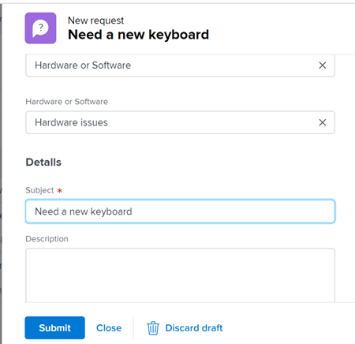

# Skapa begäranden från utkast

Förutom att använda tillgängliga utkast som Workfront föreslår när du anger en ny begäran, kan du även få åtkomst till ett utkast från sektionen Utkast och slutföra den därifrån.

## Åtkomstkrav

+++ Expandera om du vill visa åtkomstkrav för funktionerna i den här artikeln.

<table style="table-layout:auto"> 
 <col> 
 <col> 
 <tbody> 
  <tr> 
   <td role="rowheader">Adobe Workfront package</td> 
   <td> 
Alla 
 </td> 
  </tr> 
  <tr> 
   <td role="rowheader">Adobe Workfront-licens</td> 
   <td> 
Medarbetare eller högre

   
Begäran eller senare

    </td> 
  </tr> 
  <tr> 
   <td role="rowheader">Konfigurationer på åtkomstnivå</td> 
   <td> 
Redigera åtkomst till problem
  </td> 
  </tr> 
  <tr> 
   <td role="rowheader"> Produkt</td> 
   <td> <ul><li>Adobe Workfront</li><li>Du måste ha Adobe Workfront Planning för att kunna visa planeringsförfrågningar eller begära formulär</td> 
  </tr> 
 </tbody> 
</table>

Mer information finns i [Åtkomstkrav i Workfront-dokumentationen](/help/quicksilver/administration-and-setup/add-users/access-levels-and-object-permissions/access-level-requirements-in-documentation.md).

+++

## Krav för att skapa begäranden från utkast

Du måste göra följande innan du kan skapa en begäran från ett utkast:

* Börja skapa en begäran. Då sparas begäran som ett utkast automatiskt i avsnittet Utkast.

  Mer information om hur du skapar begäranden finns i [Skapa och skicka Adobe Workfront-begäranden](../../../manage-work/requests/create-requests/create-submit-requests.md).

## Skapa begäranden från utkast

Hur du skapar begäranden från utkast skiljer sig mellan den nya begärande upplevelsen och den äldre upplevelsen.

* [Skapa förfrågningar från utkast i den nya begärande upplevelsen](#create-requests-from-drafts-in-the-new-requesting-experience)
* [Skapa förfrågningar från utkast i den gamla begärande upplevelsen](#create-requests-from-drafts-in-the-legacy-requesting-experience)

### Skapa förfrågningar från utkast i den nya begärande upplevelsen

1. Öppna utkastet.

   Utkast finns på följande platser:

   * I listan över förfrågningar i området Begäranden
   * I listan över förfrågningar i widgeten Mina förfrågningar i Hem
   * I dialogrutan Ny begäran (innehåller endast utkast av begäranden som skapats med det valda formuläret)

   >[!NOTE]
   >
   >Utkast som har skapats i den tidigare begärande upplevelsen är inte tillgängliga i den nya begärande upplevelsen.

1. Uppdatera informationen för begäran enligt beskrivningen i [Skapa och skicka Adobe Workfront-begäranden](../../../manage-work/requests/create-requests/create-submit-requests.md).
1. (Valfritt och villkorligt) Klicka på **Ignorera** utkast när du vill ta bort utkastet. Då tas utkastet bort.

   Om du har ignorerat utkastet av misstag kan du omedelbart klicka på **Ångra** i meddelandet längst ned på skärmen. Det här alternativet är bara tillgängligt i några sekunder.

   Mer information om hur du tar bort utkast finns i [Ta bort en skickad begäran eller ett begärandeutkast](../../../manage-work/requests/create-requests/delete-request-draft.md).

1. (Valfritt) Om du vill spara ändringar i utkastet utan att skicka det, lämnar du sidan Ny begäran. Ändringarna sparas automatiskt.

1. När du är klar med informationen för begäran klickar du på **Skicka**.

   När du skickar begäran tas utkastet bort och kan inte återställas.

### Skapa förfrågningar från utkast i den gamla begärande upplevelsen

{{step1-to-requests}}

1. Välj **Utkast** på den vänstra panelen.

   Ett utkast för varje köämne i varje begärandekö visas i den här listan.

   

1. (Valfritt) Klicka på en kolumnrubrik om du vill sortera listan efter den kolumnen.

1. Granska informationen om varje utkast i följande kolumner i listan Utkast:

   | Ämne | Det här namnet gav du din begäran när du började skapa den. |
   | --- | --- |
   | Sökväg | Namnet på begärandekön, ämnesgrupper och köämnen där du ursprungligen tänkte skicka begäran. |
   | Anmälningsdatum | Det datum då du initierade skapandet av begäran. |
   | Senaste uppdateringsdatum | Den sista uppdateringen. Om du inte har uppdaterat det sedan du först startade begäran ska transaktionsdatumet och det senaste uppdateringsdatumet vara samma. |

   {style="table-layout:auto"}

1. (Valfritt) Använd snabbfiltret i det övre högra hörnet av listan Utkast för att börja skriva namnet på en utkast, begärandekö, köämne eller ämnesgrupp och klicka sedan på namnet på ett utkast för att öppna det.

   >[!TIP]
   >
   >Du kan inte använda permanenta filter i delen Utkast i området Förfrågningar. Det finns heller inga alternativ för att ändra eller ändra visningen av utkastlistan.

1. Uppdatera informationen för begäran enligt beskrivningen i [Skapa och skicka Adobe Workfront-begäranden](../../../manage-work/requests/create-requests/create-submit-requests.md).
1. (Valfritt och villkorligt) Klicka på **Ignorera** utkast när du vill ta bort utkastet. Detta tar bort utkastet som inte kan återställas. Mer information om hur du tar bort utkast finns i [Ta bort ett utkast för en begäran](../../../manage-work/requests/create-requests/delete-request-draft.md).

1. (Valfritt) Klicka på **Avbryt** i det nedre vänstra hörnet på sidan om du vill återställa åtgärden och behålla utkastet.

1. När du är klar med informationen för begäran gör du något av följande:

   * Klicka på **Skicka** om du är redo att skicka begäran. Begäran sparas i avsnittet Skickat. Beroende på hanteringsregeln för begärandekön kan den här begäran dirigeras till ett annat projekt än det som angetts som en begärandekö. Mer information om routningsregler finns i [Skapa routningsregler](../../../manage-work/requests/create-and-manage-request-queues/create-routing-rules.md).

     eller

     Klicka på **Stäng** om du inte är redo att skicka det och du kanske kommer tillbaka och slutför det senare. Din begäran sparas i avsnittet Utkast och blir tillgänglig nästa gång du skickar en begäran för den här kön.

     

     När du skickar begäran tas utkastet bort och kan inte återställas.

