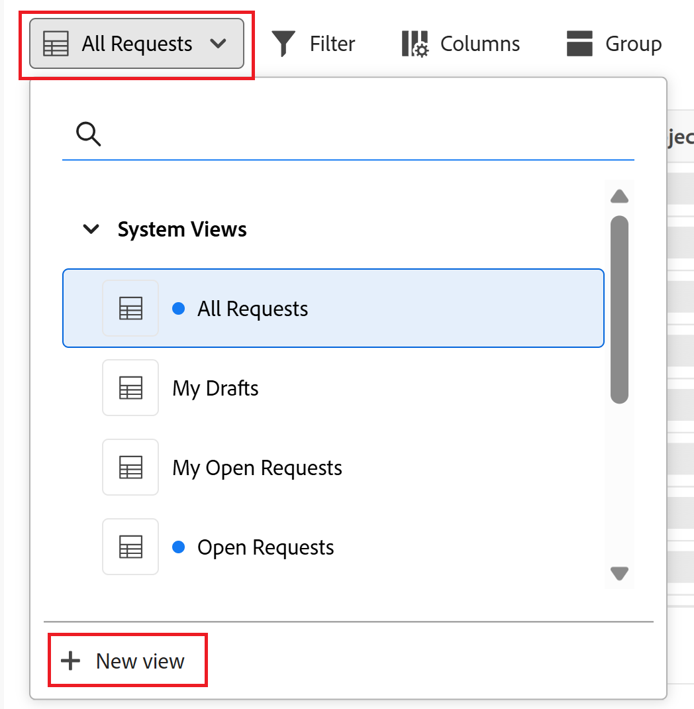

# Skapa och hantera vyer i området Förfrågningar

Informationen på den här sidan hänvisar till funktioner som ännu inte är allmänt tillgängliga. Det är bara tillgängligt i förhandsvisningsmiljön för alla kunder. Efter de månatliga releaserna i Production finns samma funktioner även i produktionsmiljön för kunder som aktiverat snabba releaser. 

Mer information om snabba releaser finns i [Aktivera eller inaktivera snabba releaser för din organisation](/help/quicksilver/administration-and-setup/set-up-workfront/configure-system-defaults/enable-fast-release-process.md). 

Om du använder den nya begärandeupplevelsen i Adobe Workfront kan du skapa och spara vyer för området Förfrågningar. De här vyerna innehåller filter, kolumnuppsättningar  och grupperingar.

>[!IMPORTANT]
>
>* Den här funktionen är bara tillgänglig i den nya begärandeupplevelsen i området Begäranden.
>* Visningsinställningarna är också tillgängliga i widgeten Mina förfrågningar i Hem. Vyerna från området Begäranden är dock olika de som finns i widgeten Mina förfrågningar.
>* Listan över förfrågningar i området Förfrågningar och i widgeten Mitt arbete använder den utökade listan i Workfront. Mer information finns i [Använd förbättrade listor](/help/quicksilver/workfront-basics/navigate-workfront/use-lists/enhanced-lists.md).

## Åtkomstkrav

+++ Expandera om du vill visa åtkomstkrav för funktionerna i den här artikeln.

<table style="table-layout:auto"> 
 <col> 
 <col> 
 <tbody> 
 <tbody> 
  <tr> 
   <td role="rowheader">Adobe Workfront package</td> 
   <td> 
Alla Workfront- eller Workflow-paket

   
Alla Worfront Planning-licenser, för att visa Workfront Planning-begäranden i begärandelistor

    </td> 
  </tr> 
  <tr> 
   <td role="rowheader">Adobe Workfront-licens</td> 
   <td> 
Medarbetare eller högre

   
Begäran eller senare

    </td> 
  </tr> 
  <tr> 
   <td role="rowheader">Konfigurationer på åtkomstnivå</td> 
   <td> 
Redigera åtkomst till problem
  
Du måste vara Workfront-administratör för att kunna lägga till vyer i layoutmallar</td> 
  </tr> 
  <!--
  <tr> 
   <td role="rowheader"> Product</td> 
   <td> <ul><li>Adobe Workfront</li><li>You must have Adobe Workfront Planning to view Planning requests or request forms</td> 
   </tr> 
   -->
 </tbody> 
</table>

Mer information om informationen i den här tabellen finns i [Åtkomstkrav i Workfront-dokumentationen](/help/quicksilver/administration-and-setup/add-users/access-levels-and-object-permissions/access-level-requirements-in-documentation.md).

+++

## Systemvyer för begäranden

Förutom de vyer du kan skapa själv erbjuder Workfront följande systemvyer för området Förfrågningar och widgeten Mina förfrågningar i Hem:

* **Alla begäranden**: Alla begäranden som du eller någon annan har skickat i köer eller arbetsytor som du har behörighet att visa. Detta är inte tillgängligt för widgeten Mina förfrågningar.
* **Mina förfrågningar**: Förfrågningar som du har skickat, oavsett status.
* **Mina öppna begäranden**: Begäranden som du har skickat in och som fortfarande är öppna.
* **Mina utkast**: Utkast för dina förfrågningar som ännu inte har skickats.
* **Öppna begäranden**: Begäranden som du eller någon annan har skickat i köer eller för arbetsytor som du har behörighet att visa som fortfarande är öppna. Detta är inte tillgängligt för widgeten Mina förfrågningar.

Du kan inte redigera systemvyer. Du kan ändra elementen i dem och sedan kopiera vyn och redigera eller dela kopian.

## Skapa en vy för begäranden

Du kan skapa en vy under Förfrågningar i Workfront när du använder den nya upplevelsen av förfrågningar. När du har aktiverat och skapat nya begäranden kan du även skapa vyer för widgeten Mina förfrågningar i Hem.

1. Så här kommer du åt listan **Begäranden**:

   {{step1-to-requests}}

   1. Kontrollera att inställningen **Använd ny upplevelse** är aktiverad.

1. Så här kommer du åt widgeten **Mina förfrågningar** hemma:

   {{step1-to-home}}

   1. Lägg till eller gå till widgeten **Mina förfrågningar**.

1. Klicka på listrutan **Vyer**  i listan över förfrågningar och klicka på **Ny vy**.

   

1. Ange ett namn för den nya vyn och klicka på **Skapa**.
1. Fortsätt till [Redigera en vy för begäranden](#edit-a-view-for-requests).

## Redigera en vy för begäranden

Du kan redigera befintliga vyer, inklusive vyer som du just har skapat i området Förfrågningar eller widgeten Mina förfrågningar i Hem.

Genom att redigera en vy kan du ändra följande element i vyn:

* Namn
* Filter
* Kolumner

* Gruppering
* Formatera celler
* Radhöjd

Mer information finns i [Använd förbättrade listor](/help/quicksilver/workfront-basics/navigate-workfront/use-lists/enhanced-lists.md).

<!-- 
hide these details - all the information is in "Use enhanced lists" - we need one point of messaging for this feature: 

1. To access a list of requests in the Requests are: 
   
   {{step1-to-requests}}

1. Ensure the **Use new experience** setting is turned on.
1. In the **Requests** list, locate the view that you want to edit from the **Views** dropdown menu .

1. Click the **Views** dropdown  and click the three-dot menu next to the view, select **Rename**, then type in the new name for the view.
1. Press Enter to save the new name. 
1. Click the **Views** dropdown  and select the view you want to edit.
1. To add a field as a column, click the **Add column** icon  in the upper-right corner of the list. 

   The **Column manager** opens.
1. Click the plus icon next to the field that you want to add as a column to the view, then click **Save**.

   Fields associated with the objects in the list are available to add as columns. <!-keeping this general, and not referring to custom fields because there are some native fields that are supported and there will be more in the future->

   >[!TIP]
   >
   >Fields you add to the columns must exist before they are available in the **Column manager**.

1. (Optional) Click **Columns** to open the **Fields visibility and order** box. 
1. Turn on the setting for each field  you want to show in the list, turn it off to hide it, or drag and drop the fields in a different order.

1. (Optional) Click **Filters** and start adding conditions for what requests you want to view. 

    You can filter by the following request fields:  

    * **Workspace**: The workspace the request form is associated with.
    * **Object type**: The record type the request form is associated with.
    * **Entry date**: The date when the request was submitted.
    * **Request form**: The name of the request form used to submit the request.
    * **Status**: The status of the request.
    * **Entered by**: The name of the user who added the request. If the request was added by someone outside of Workfront, the **Entered by** field shows `N/A`.

    You can also filter by any fields that have been added to the view for any object visible in the view.

    You can have multiple filters joined by either **And** or **Or**.
    The request list is filtered automatically, as you add the filter conditions. 
-->

<!--
1. (Optional) Click **Group** and select the column that you want to group by.

-->

>[!IMPORTANT]
>
> * Ändringar av vyer sparas automatiskt.
> * Ändringar av vyer är bara synliga för alla som använder vyn när du delar en ny kopia av vyn efter att du har ändrat den.
> * Använd jokertecknet **Jag (inloggad användare)** i alla fält där användare har värdet.

## Lägga till vyn med förfrågningar i en layoutmall

En Workfront-administratör kan lägga till en ny vy i layoutmallar för området Förfrågningar.

Instruktioner finns i [Anpassa filter, vyer och grupperingar med hjälp av en layoutmall](/help/quicksilver/administration-and-setup/customize-workfront/use-layout-templates/customize-fvg-list-controls-layout-template.md).

## Dela en vy

Du kan dela vyer som du skapar med andra användare, team, grupper eller företag.

När du har delat en vy kan andra användare visa de uppdaterade vyelementen som du har redigerat för vyn innan de delar den.

Om de uppdaterar vyn visas inte ändringarna för andra, såvida de inte kopierar samma vy och behåller ändringarna innan de delar kopian.

Mer information finns i [Använd förbättrade listor](/help/quicksilver/workfront-basics/navigate-workfront/use-lists/enhanced-lists.md). 

<!--
Let's just redirect to Use enhanced lists so we avoid duplicating information. 

1. To access a list of requests in the Requests are: 
   
   {{step1-to-requests}}

1. Ensure the **Use new experience** setting is turned on.
1. In the **Requests** list, locate the view that you want to share.
1. Hover over the view that you want to share, then click on the three-dot menu to the right of the view name, then click  **Share**.
1. In the **Share** box, enter the people, teams, roles, groups, or companies that you want to share the view with, then select them from the list when they appear.
1. Click **Save**.

   The view is shared with the entities you indicate. 
-->