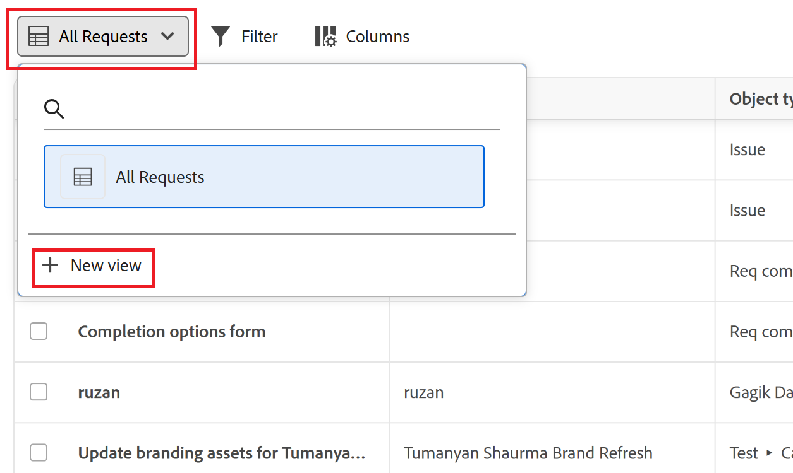

# Skapa och hantera vyer i området Förfrågningar

Den markerade informationen på den här sidan hänvisar till funktioner som ännu inte är allmänt tillgängliga. Den är bara tillgänglig i sandlådemiljön för förhandsgranskning.

Om du använder den nya begärandefunktionen kan du skapa och spara vyer för området Förfrågningar. De här vyerna innehåller filter och kolumnupplägg.

Vyer kan skapas och hanteras under Begäranden i Workfront.

>[!IMPORTANT]
>
>* Den här funktionen är bara tillgänglig i den nya upplevelsen av begärande.
>* Visningsinställningar är inte tillgängliga i widgeten Mina förfrågningar i Hem.

## Åtkomstkrav

+++ Expandera om du vill visa åtkomstkrav för funktionerna i den här artikeln.

<table style="table-layout:auto"> 
 <col> 
 <col> 
 <tbody> 
 <tbody> 
  <tr> 
   <td role="rowheader">Adobe Workfront package</td> 
   <td> 
Alla 
 </td> 
  </tr> 
  <tr> 
   <td role="rowheader">Adobe Workfront-licens</td> 
   <td> 
Medarbetare eller högre

   
Begäran eller senare

    </td> 
  </tr> 
  <tr> 
   <td role="rowheader">Konfigurationer på åtkomstnivå</td> 
   <td> 
Redigera åtkomst till problem
  
Du måste vara Workfront-administratör för att kunna lägga till vyer i layoutmallar</td> 
  </tr> 
  <tr> 
   <td role="rowheader"> Produkt</td> 
   <td> <ul><li>Adobe Workfront</li><li>Du måste ha Adobe Workfront Planning för att kunna visa planeringsförfrågningar eller begära formulär</td> 
  </tr> 
 </tbody> 
</table>

Mer information om informationen i den här tabellen finns i [Åtkomstkrav i Workfront-dokumentationen](/help/quicksilver/administration-and-setup/add-users/access-levels-and-object-permissions/access-level-requirements-in-documentation.md).

+++

## Skapa en vy i området Förfrågningar

Du kan skapa en vy under Förfrågningar i Workfront.

1. Så här öppnar du listan över förfrågningar:

   {{step1-to-requests}}

1. Klicka på listrutan **Vyer**  i listan över förfrågningar och välj **Ny vy**.

   

1. Ange ett namn för den nya vyn och klicka på **Skapa**.
1. Fortsätt till [Redigera en vy i området Förfrågningar](#edit-a-view-in-the-requests-area).

## Redigera en vy i området Förfrågningar

Du kan redigera befintliga vyer, inklusive vyer som du just har skapat.

1. Så här öppnar du listan över förfrågningar:

   {{step1-to-requests}}
1. Leta reda på vyn som du vill redigera i listan över förfrågningar.

1. (Valfritt) Om du vill byta namn på en vy klickar du på listrutan **Vyer**  och klickar på menyn med tre punkter bredvid vyn. Välj sedan **Byt namn** och skriv in det nya namnet för vyn.
1. Klicka på listrutan **Vyer**  och välj den vy som du vill redigera.
1. Om du vill lägga till ett anpassat fält som en kolumn klickar du på ikonen **Lägg till kolumn**  till höger på skärmen och sedan på plusikonen bredvid det anpassade formulärfältet som du vill lägga till som en kolumn i vyn.

   Anpassade fält i formulär som är kopplade till objektet i listan kan läggas till som kolumner.

   >[!TIP]
   >
   >Du kan för närvarande inte lägga till kolumner i produktionsmiljön.
1. (Valfritt) Klicka på **Kolumner** och dölj, visa eller ordna om kolumnerna i listan med förfrågningar.

   

   >[!TIP]
   >
   >Du kan inte lägga till fler kolumner i produktionsmiljön.

1. (Valfritt) Klicka på **Filter** och börja lägga till villkor för vilka begäranden du vill visa på fliken Planering.

   

   Du kan filtrera efter följande fält:

   * **Workspace**: Den arbetsyta som förfrågningsformuläret är associerat med.
   * **Posttyp**: Posttyp som begärandeformuläret är associerat med.
   * **Anmälningsdatum**: Datumet då begäran skickades.
   * **Formulär för begäran**: Namnet på det begärandeformulär som användes för att skicka begäran.
   * **Status**: Status för begäran.
   * **Anges av**: Namnet på den användare som lade till begäran. Om begäran har lagts till av någon utanför Workfront visas **Angivet av**-fältet `N/A`.

   I förhandsvisningsmiljön kan du även filtrera efter anpassade fält som har lagts till i vyn.

   Du kan ha flera filter kopplade av antingen **And** eller **Or**.
Begärandelistan filtreras automatiskt när du lägger till filtervillkoren.

>[!IMPORTANT]
>
> * Ändringar av vyer sparas automatiskt.
> * Ändringar av vyer är synliga för alla som använder vyn.

## Lägg till vyn i en layoutmall.

En Workfront-administratör kan lägga till den nya vyn i layoutmallar.

Instruktioner finns i [Anpassa filter, vyer och grupperingar med hjälp av en layoutmall](/help/quicksilver/administration-and-setup/customize-workfront/use-layout-templates/customize-fvg-list-controls-layout-template.md).

## Dela en vy

Du kan dela vyer som du skapar med andra användare, team eller grupper.

1. Så här öppnar du listan över förfrågningar:

   {{step1-to-requests}}

1. Leta reda på den vy som du vill dela i listan över förfrågningar.
1. Håll muspekaren över den vy som du vill dela och klicka sedan på menyn med tre punkter när den visas.
1. Välj **Dela**.
1. I den dialogruta som öppnas anger du namnen på de användare, team eller grupper som du vill dela vyn med och markerar dem sedan i listan när de visas.
1. Klicka på **Spara**.

