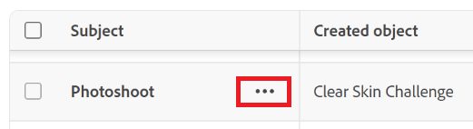

# Ta bort en skickad begäran eller en begäran om utkast

Du kan ta bort Adobe Workfront- eller Adobe Workfront Planning-skickade begäranden eller begära utkast som du har skapat eller har behörighet att hantera.

Workfront-administratörer och Workfront Planning Workspace-administratörer kan även ta bort begäranden och begära utkast som de inte skapat.

Du kan inte visa planeringsförfrågningar i den äldre upplevelsen av förfrågningar.

I den här artikeln beskrivs hur du kan ta bort utkast av begäranden i den nya upplevelsen av begäranden. Borttagningen av Workfront- och Planning-begäranden eller deras utkast är identisk.

Mer information finns i:

* [Skapa och skicka Adobe Workfront-förfrågningar](../../../manage-work/requests/create-requests/create-submit-requests.md)
* [Skapa begäranden från utkast](../../../manage-work/requests/create-requests/create-requests-from-drafts.md)
* [Skicka Adobe Workfront Planning-begäranden för att skapa poster](/help/quicksilver/planning/requests/submit-requests.md)

## Åtkomstkrav

+++ Expandera om du vill visa åtkomstkrav för funktionerna i den här artikeln.

<table style="table-layout:auto"> 
 <col> 
 <col> 
 <tbody> 
  <tr> 
   <td role="rowheader">Adobe Workfront package</td> 
   <td> 
Alla Workfront- eller Workflow-paket

Alla Workfront Planning-paket för att hantera planeringsbegäranden 
 </td> 
  </tr> 
  <tr> 
   <td role="rowheader">Adobe Workfront-licens</td> 
   <td> 
Medarbetare eller högre

   
Begäran eller senare

    </td> 
  </tr> 
  <tr> 
   <td role="rowheader">Konfigurationer på åtkomstnivå</td> 
   <td> 
Du måste vara Workfront-administratör eller planeringshanterare för att kunna ta bort begäranden som du inte har skapat.

Du måste ha behörighet att redigera för problem.
  </td> 
  </tr> 
  <tr> 
   <td role="rowheader">Objektbehörigheter</td> 
   <td> 
Du måste ha skapat begäran eller utkastet för att kunna ta bort det i den nya begärandeupplevelsen, eller vara Workfront-administratör eller planeringshanterare för att ta bort utkast av begäranden som du inte har skickat in.
   

Du måste ha redigeringsbehörighet för de problem som du tar bort.
  </td> 
  </tr>

</tbody> 
</table>

Mer information finns i [Åtkomstkrav i Workfront-dokumentationen](/help/quicksilver/administration-and-setup/add-users/access-levels-and-object-permissions/access-level-requirements-in-documentation.md).

+++

## Ta bort förfrågningar eller begära utkast i den nya begärandeupplevelsen

Du kan ta bort begäranden och utkast i följande områden:

* Under Begäranden i Workfront
* I widgeten Mina förfrågningar i Hem
* Från en begärandesida

Följande användare kan ta bort utkast av begäranden:

* Workfront-administratörer kan ta bort begäranden och utkast som de eller andra skickat in.
* Arbetsytehanterare för Workfront Planning kan ta bort begäranden och utkast på den planeringsyta som de administrerar.
* Användare kan ta bort begäranden och utkast som de har skickat in.

### Ta bort en begäran eller ett utkast från området Förfrågningar eller widgeten Mina förfrågningar i Hem

{{step1-to-requests}}

1. Så här kommer du åt widgeten **Mina förfrågningar** i **Hem**:

   {{step1-to-home}}

   1. Leta reda på widgeten **Mina förfrågningar**.

      Mer information om widgeten **Mina förfrågningar** finns i [Använd widgeten Mina förfrågningar](/help/quicksilver/workfront-basics/using-home/using-the-home-area/my-requests-widget.md).

1. I listan **Förfrågningar** eller widgeten **Mina förfrågningar** i **Hem** håller du muspekaren över den förfrågan eller det utkast som du vill ta bort och klickar sedan på menyn **Mer**  .

1. Klicka på **Ta bort**

   eller

   Högerklicka på den markerade begäran och klicka sedan på **Ta bort**.

   >[!TIP]
   >
   >Om du inte har behörighet att skapa problem får du en varning om att administratören har begränsat dig från att skapa förfrågningar.

1. Klicka på **Ta bort** i den dialogruta som öppnas.

   Begäran eller utkastet tas bort.

   Borttagna begäranden sparas i papperskorgen och en Workfront-administratör kan återställa dem i upp till 30 dagar. Det går inte att återställa utkast.

### Ta bort begäranden gruppvis från en lista

{{step1-to-requests}}

1. Så här kommer du åt widgeten **Mina förfrågningar** i **Hem**:

   {{step1-to-home}}

   1. Leta reda på widgeten **Mina förfrågningar**.

      Mer information om widgeten Mina förfrågningar finns i [Använd widgeten Mina förfrågningar](/help/quicksilver/workfront-basics/using-home/using-the-home-area/my-requests-widget.md).

1. I listan **Förfrågningar** eller widgeten **Mina förfrågningar** klickar du i rutan till vänster om varje förfrågan som du vill ta bort.
1. Klicka på **Ta bort** i det blå fältet längst ned på sidan.

   >[!NOTE]
   >
   >Om alternativet **Ta bort** inte visas i det blå fältet har du inte behörighet att ta bort en eller flera av de markerade förfrågningarna.

### Krav för att ta bort utkast för begäranden

Du måste göra följande innan du kan ta bort ett begärandeutkast:

* Börja skapa en begäran. Då sparas begäran som ett utkast automatiskt i avsnittet Utkast.

  Mer information om hur du skapar begäranden finns i [Skapa och skicka Adobe Workfront-begäranden](../../../manage-work/requests/create-requests/create-submit-requests.md).

## Ta bort utkast av begäranden i den tidigare begärande upplevelsen

Du kan ta bort utkast när de har sparats som utkast om du inte längre tycker att de är relevanta. Du kan inte återställa borttagna utkastbegäranden.

Du kan inte komma åt planeringsförfrågningar eller deras utkast från den tidigare begärande upplevelsen.

{{step1-to-requests}}

1. Klicka på **Utkast** på den vänstra panelen.

   Alla utkast för alla begärandeköer visas i den här listan.

1. Markera ett utkast i listan och klicka sedan på **Ta bort** överst i listan.
1. Klicka på **Ja, ta bort den**.

   Utkastet tas bort och kan inte återställas.

