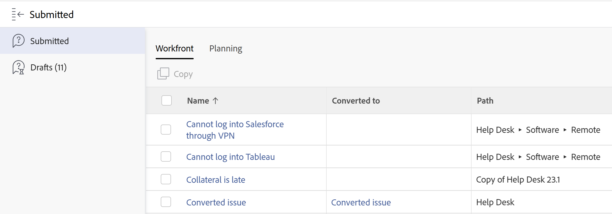

# Visa skickade begäranden

Du kan visa förfrågningar som du eller någon annan har skickat, eller förfrågningar som du har startat men som du aldrig har slutfört. De oavslutade förfrågningarna sparas som utkast.

Du kan hitta skickade begäranden i följande områden i Adobe Workfront:

* Området med förfrågningar i Workfront
* Widgeten Mina förfrågningar i Hem

I området Förfrågningar visas följande förfrågningar, beroende på hur du väljer att visa dem:

* Workfront begär när du använder äldre upplevelse
* Både Workfront och Planning begär när du använder den nya upplevelsen.

  >[!NOTE]
  >
  >* Du kan bara visa dina egna utkastbegäranden.
  >* I den nya begärandeupplevelsen finns inskickade begäranden och utkast i samma lista.
  >* Utkast som har skapats i den äldre upplevelsen visas inte i den nya begärandeupplevelsen.

## Åtkomstkrav

+++ Expandera om du vill visa åtkomstkrav för funktionerna i den här artikeln.

<table style="table-layout:auto"> 
 <col> 
 <col> 
 <tbody> 
  <tr> 
   <td role="rowheader">Adobe Workfront package</td> 
   <td> 
Alla 
 </td> 
  </tr> 
  <tr> 
   <td role="rowheader">Adobe Workfront-licens</td> 
   <td> 
Medarbetare eller högre

   
Begäran eller senare

    </td> 
  </tr> 
  <tr> 
   <td role="rowheader">Konfigurationer på åtkomstnivå</td> 
   <td>
Redigera åtkomst till problem
</td> 
  </tr>
  <tr>
   <td role="rowheader">Objektbehörigheter</td> 
   <td>
Visa behörigheter eller högre för begäranden
</td> 
  </tr> 
  <tr> 
   <td role="rowheader"> Produkt</td> 
   <td> <ul><li>Adobe Workfront</li><li>Du måste ha Adobe Workfront Planning för att kunna visa planeringsförfrågningar eller begära formulär</td> 
  </tr> 
 </tbody> 
</table>

Mer information finns i [Åtkomstkrav i Workfront-dokumentationen](/help/quicksilver/administration-and-setup/add-users/access-levels-and-object-permissions/access-level-requirements-in-documentation.md).

+++

## Visa skickade begäranden i området Begäranden

Hur skickade begäranden visas skiljer sig åt beroende på om du använder den nya eller gamla upplevelsen av att begära.

* [Visa skickade begäranden i den nya begärande upplevelsen](#view-submitted-requests-in-the-new-requesting-experience)
* [Visa skickade begäranden i den äldre begärande upplevelsen](#view-submitted-requests-in-the-legacy-requesting-experience)

### Visa skickade begäranden i den nya begärande upplevelsen

Du kan visa skickade begäranden i området Begäranden, som innehåller länkar till objekt som skapats av planeringsbegäranden.

>[!NOTE]
>
>Länkar till skapade objekt är bara tillgängliga i den nya begärandefunktionen för planeringsbegäranden, där själva begäran skapade ett objekt. Om en Workfront-begäran konverteras till ett projekt eller annat objekt är ingen länk till det konverterade objektet tillgänglig i listan över förfrågningar i den nya begärandeupplevelsen.

Så här visar du förfrågningar som du eller andra användare har skickat in i den nya begärandeupplevelsen:

{{step1-to-requests}}

1. Kontrollera att växlingsknappen **Använd ny upplevelse** i skärmens övre högra hörn är aktiverad.

   Listan över förfrågningar visas.

1. (Valfritt) Om du vill söka efter en begäran börjar du skriva i sökfältet längst upp till höger i listan. Sökresultaten visas när du skriver.
1. (Valfritt) Klicka på **Filter** och börja lägga till villkor för de begäranden som du vill visa.

   Du kan filtrera efter följande fält:

   * **Workspace**: Den arbetsyta som förfrågningsformuläret är associerat med.
   * **Posttyp**: Posttyp som begärandeformuläret är associerat med.
   * **Anmälningsdatum**: Datumet då begäran skickades.
   * **Formulär för begäran**: Namnet på det begärandeformulär som användes för att skicka begäran.
   * **Status**: Status för begäran.
   * **Anges av**: Namnet på den användare som lade till begäran. Om begäran har lagts till av någon utanför Workfront visas **Angivet av**-fältet `N/A`.

   Du kan ha flera filter kopplade av antingen **And** eller **Or**.
Begärandelistan filtreras automatiskt när du lägger till filtervillkoren.
1. (Valfritt) Använd vyer för att fokusera på de förfrågningar som du vill visa.

   Instruktioner finns i [Skapa eller redigera vyer i området Förfrågningar](/help/quicksilver/manage-work/requests/create-requests/create-views-for-requests-list.md).
1. (Valfritt) Kontrollera status för en begäran genom att markera kolumnen Status. Följande statusvärden är tillgängliga i den nya upplevelsen av begärande:

   * **Utkast**: Den här begäran har inte skickats ännu.
   * **Väntande granskning**: (Endast planering) Den här begäran har godkännare och ingen av godkännarna har öppnat begäran.
   * **I granskning**: (endast planering) Den här begäran har godkännare och minst en godkännare har öppnat begäran, men inget beslut har fattats.
   * **Avvisad**: (Endast planering) Den här begäran har godkännare och har avvisats.
   * **Pågår**:
      * Workfront-begäranden: Begäran har konverterats och arbetet pågår.
      * Workfront Planning-begäranden: Begärandeslutförandet mappas till ett specifikt Planning-fält och fältvärdet matchar ännu inte slutförandevärdet.

        Mer information finns i [Konfigurera information](/help/quicksilver/planning/requests/create-request-form.md#set-up-configuration-details) i artikeln Skapa och hantera ett begärandeformulär i Adobe Workfront Planning.
   * **Fullständigt**: Begäran har slutförts.

>[!NOTE]
>
>* Om du har Workfront Planning visas dina Workfront- och Planning-begäranden i samma lista. Workfront-begäranden visar värdet `Issue` i kolumnen Objekttyp.
>* Listan över begäranden visas med 50 begäranden. Om du vill visa fler begäranden bläddrar du längst ned i listan.

### Visa skickade begäranden i den äldre begärande upplevelsen

Så här visar du begäranden som du eller andra användare har skickat in i den tidigare begärande upplevelsen:

{{step1-to-requests}}

1. (Villkorligt) Om din organisation har köpt ett Workfront Planning-paket klickar du på fliken **Workfront** för att visa Workfront-begäranden.
1. Klicka på **Skickat** i den vänstra panelen för att visa alla skickade begäranden.

   Du kan visa upp till 2 000 förfrågningar och de kan visas på flera sidor.

   >[!TIP]
   >
   >Du kan inte anpassa kolumnerna i listan Skickade begäranden.

   

1. Följande kolumner visas som standard:

   <table style="table-layout:auto"> 
      <col> 
      <col> 
      <tbody> 
      <tr> 
         <td role="rowheader">Namn</td> 
         <td> 
Namnet på begäran.
 
Klicka på namnet på en begäran för att öppna den. 
 
<b>TIPS</b>

   Om problemet inte kunde bevaras när det konverterades till en aktivitet eller ett projekt är namnet på problemet nedtonat och kan inte längre klickas. Mer information om hur du konverterar problem finns i <a href="../../../manage-work/issues/convert-issues/convert-issues.md" class="MCXref xref">Översikt över hur du konverterar problem i Adobe Workfront</a>. 
 </td>
   </tr> 
      <tr> 
         <td role="rowheader">Konverterad till</td> 
         <td> 
Namnet på det matchande objektet som kan vara en uppgift eller ett projekt som begäran konverterades till. 
 
Klicka på namnet på uppgiften eller projektet för att öppna dem. 
 
Om begäran inte konverterades är det här fältet tomt. 
 </td> 
      </tr> 
      <tr> 
         <td role="rowheader">Sökväg</td> 
         <td>Namnet på begärandekön, ämnesgrupper och köämnen där begäran ursprungligen skickades. </td> 
      </tr> 
      <tr> 
         <td role="rowheader">Status</td> 
         <td>Aktuell status för begäran eller det objekt som löser problemet (uppgift eller projekt)</td> 
      </tr> 
      <tr> 
         <td role="rowheader">Anmälningsdatum</td> 
         <td>Datumet då begäran skickades eller datumet då det matchande objektet skapades om begäran togs bort när den konverterades. </td> 
      </tr> 
      <tr> 
         <td role="rowheader">Senaste uppdateringsdatum</td> 
         <td> 
Datumet då begäran uppdaterades senast.
 
Listan Skickade begäranden sorteras som standard efter det här fältet. 
 </td> 
      </tr> 
      </tbody> 
      </table>

1. (Valfritt) Klicka på rubriken för en kolumn för att sortera efter den.

   >[!TIP]
   >
   >När du navigerar bort från listan Skickade begäranden bevaras det valda sorteringsalternativet.

1. (Valfritt) Markera en begäran i listan och klicka sedan på ikonen **Öppna sammanfattning**  för att öppna panelen Sammanfattning och visa ytterligare information om begäran, lägga till kommentarer, dokument eller tilldela den. Mer information om panelen Sammanfattning finns i [Översikt över sammanfattning](../../../workfront-basics/the-new-workfront-experience/summary-overview.md).

   >[!TIP]
   >
   >Om panelen Sammanfattning redan är öppen ändras ikonen Öppna sammanfattning till Stäng sammanfattning.

1. (Valfritt och villkorligt) Klicka på ikonen **X** i det övre högra hörnet eller på ikonen **Stäng sammanfattning**  för att stänga sammanfattningspanelen.

   Om en utgåva konverterades till en uppgift eller ett projekt och utgåvan togs bort i konverteringsprocessen är panelen Sammanfattning tom. Mer information om hur du konverterar problem finns i [Översikt över hur du konverterar problem i Adobe Workfront](../../../manage-work/issues/convert-issues/convert-issues.md).

1. Välj något av filtren i tabellen nedan från **Filterikonen**  i det övre högra hörnet av listan.

   >[!TIP]
   >
   >Du kan inte ändra filter i avsnittet Skickat i området Begäranden.

   <table style="table-layout:auto"> 
    <col> 
    <col> 
    <tbody> 
     <tr> 
      <td role="rowheader">Alla</td> 
      <td>Alla skickade begäranden, oavsett status eller vem som skickade dem.</td> 
     </tr> 
     <tr> 
      <td role="rowheader">Öppna</td> 
      <td> 
Alla skickade begäranden som är öppna, oavsett vem som har skickat dem. Det är bara begäranden om att du har minst behörighet att visa här om du inte har skickat in dem själv. 
 
Förfrågningar utan faktiskt slutförandedatum eller vars matchande objekt inte har något faktiskt slutförandedatum visas på underfliken Öppna.
 
<b>TIPS</b>

   Begäranden som har en status som inte är lika med Stängt betraktas som öppna.
 </td>
   </tr> 
     <tr> 
      <td role="rowheader">Mina förfrågningar</td> 
      <td>Begäranden som du har skickat oavsett status. </td> 
     </tr> 
     <tr> 
      <td role="rowheader">Mina öppna förfrågningar</td> 
      <td> 
Begäranden som du har skickat och som fortfarande är öppna. 
 
Förfrågningar utan faktiskt slutförandedatum eller vars matchande objekt inte har något faktiskt slutförandedatum visas på underfliken Mina öppna förfrågningar. 
 
<b>TIPS</b>

   Begäranden som inte har en status som motsvarar stängda betraktas som öppna.
 </td>
   </tr> 
    </tbody> 
   </table>

1. (Valfritt) Klicka på ikonen **Filtrera sida**  högst upp i listan om du vill söka efter en begäran per namn. Listan uppdateras med resultat som matchar dina sökvillkor.

1. (Villkorligt) Om du bara vill visa Workfront Request-köer söker du efter eller filtrerar efter `Issue` objekttyper.

   <!--
   <li value="9" data-mc-conditions="QuicksilverOrClassic.Draft mode"> 
Click the <strong>Complete</strong> subtab to view requests that have been completed.
 
(NOTE: this step will stay drafted even after release. We can't see Completed at this time!)  Requests with an Actual Completion Date or whose resolving object has an Actual Completion Date are listed in the Complete subtab. Once a request receives an Actual Completion Date, it stays in the Recently Completed area for 10 business days. After that, it is moved to the Completed area.  For information about resolving and resolvable objects, see the article <a href="../../../manage-work/issues/convert-issues/resolving-and-resolvable-objects.md" class="MCXref xref">Overview of Resolving and Resolvable Objects </a>.
 </li>
   -->

   <!--
   <li value="10" data-mc-conditions="QuicksilverOrClassic.Draft mode">(Optional) Select an option from the <strong>Sort by</strong> drop-down menu to sort the requests by the following criteria:   (NOTE: this step will stay drafted even after release. We can't see Completed at this time!)  
   <ul>
   <li><strong>Assigned To</strong>: Requests are sorted alphabetically by the name of the assignee using the following criteria: 
   <ul>
   <li>All requests assigned to users are sorted first, in the order of the users' names.</li>
   <li>Requests assigned to job roles are sorted secondly, in the order of the job roles' names and are listed after all the requests assigned to users.</li>
   <li>Requests that are assigned to teams are sorted last, in the order of the teams' names and are listed after all the requests assigned to users and those assigned to job roles.</li>
   <li>All unassigned requests are listed last, in the order of their Entry Date. </li>
   </ul></li>
   <li><strong>Submitted On</strong>: Requests are sorted chronologically by the date when they were submitted.</li>
   <li><strong>Recently Updated</strong> (this is the default): Requests are sorted chronologically by the date of their last update.</li>
   <li><strong>Name</strong>: Requests are sorted alphabetically by name. </li>
   <li><strong>Priority</strong>: Requests are sorted in the order of their priority.</li>
   <li><strong>Queue</strong>: Requests are sorted alphabetically by the name of the requests queue where they were submitted. </li>
   <li><strong>Status</strong>: Requests are sorted alphabetically by their status. </li>
   </ul></li>
   -->

1. Klicka på **Utkast** för att visa alla utkast. Workfront sparar ett obegränsat antal utkast för varje begärandekö i den här mappen. När du anger en ny begäran för ett köämne som redan har ett utkast, uppmanas du att använda ett befintligt utkast. Mer information finns i [Skapa begäranden från utkast](../../../manage-work/requests/create-requests/create-requests-from-drafts.md).

1. (Valfritt och villkorligt) Om din organisation har köpt ett Workfront Planning-paket klickar du på fliken **Planning** och sedan på **Skickat** i den vänstra panelen för att visa Workfront Planning-begäranden.

   Använd **Filter** och **Kolumner** för att uppdatera informationen i listan Planeringsbegäran.

   

   Mer information finns i [Skicka Adobe Workfront Planning-begäranden för att skapa poster](/help/quicksilver/planning/requests/submit-requests.md).

1. (Valfritt) Kontrollera status för en begäran genom att markera kolumnen Status. Följande statusvärden är tillgängliga i den nya upplevelsen av begärande:

   * Utkast: Denna begäran har ännu inte skickats.
   * Pågår
   * Complete

