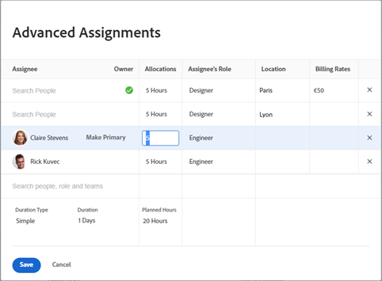

# Skapa avancerade uppdrag

{{highlighted-preview}}

Du kan hantera uppgifter eller ärenden med hjälp av avancerade uppdrag.

Du kan justera följande uppdragsinformation när du gör avancerade uppdrag:

* Tilldela användare till uppgiften eller problemet (detta kan utföras utanför ett avancerat uppdrag).
* Justera och omfördela det antal timmar som varje tilldelad tilldelas.
* Avgör vilken användare som ska utses till ägare eller primär tilldelad till uppgiften eller utgåvan.
* Ange vilken roll varje användare ska ha när de arbetar med uppgiften eller problemet.
* Åsidosätt faktureringssatsen för en jobbroll.

>[!NOTE]
>
>När du tilldelar användare arbetstid påverkar tillgängligheten enligt sina scheman de planerade och planerade datumen för uppgifter och problem. Mer information om scheman finns i [Skapa ett schema](../../../administration-and-setup/set-up-workfront/configure-timesheets-schedules/create-schedules.md).

## Områden i Adobe Workfront där du kan göra avancerade uppdrag

I den här artikeln beskrivs hur du får åtkomst till avancerade tilldelningar i uppgiftens eller ärendets huvud.

Dessutom kan du göra avancerade uppdrag inom följande områden av Workfront:

* I listor och rapporter när fältet Uppdrag visas i vyn.
* I avsnittet Uppdrag när du redigerar en uppgift. Mer information finns i [Redigera uppgifter](../../../manage-work/tasks/manage-tasks/edit-tasks.md).
* I huvud för uppgift eller utgåva, i området Uppdrag.
* I Arbetsbelastningsutjämnaren. Mer information finns i [Tilldela arbete manuellt med hjälp av Utjämning av arbetsbelastning](../../../resource-mgmt/workload-balancer/assign-work-in-workload-balancer-manually.md).

## Åtkomstkrav

Du måste ha följande åtkomst för att kunna utföra stegen i den här artikeln:

<table style="table-layout:auto"> 
 <col> 
 <col> 
 <tbody> 
  <tr> 
   <td role="rowheader">Adobe Workfront-plan*</td> 
   <td> 
Alla
 </td> 
  </tr> 
  <tr> 
   <td role="rowheader">Adobe Workfront-licens*</td> 
   <td> 
Arbeta eller högre
 </td> 
  </tr> 
  <tr> 
   <td role="rowheader">Konfigurationer på åtkomstnivå*</td> 
   <td> 
Redigera åtkomst till uppgifter och ärenden
 
<b>ANMÄRKNING</b>

Om du fortfarande inte har åtkomst frågar du Workfront-administratören om de anger ytterligare begränsningar för din åtkomstnivå. Information om hur en Workfront-administratör kan ändra åtkomstnivån finns i <a href="../../../administration-and-setup/add-users/configure-and-grant-access/create-modify-access-levels.md" class="MCXref xref">Skapa eller ändra anpassade åtkomstnivåer</a>.
 </td>
</tr> 
  <tr> 
   <td role="rowheader">Objektbehörigheter</td> 
   <td> 
Contribute eller högre behörighet för en uppgift eller ett ärende
 
Mer information om hur du begär ytterligare åtkomst finns i <a href="../../../workfront-basics/grant-and-request-access-to-objects/request-access.md" class="MCXref xref">Begär åtkomst till objekt </a>.
 </td> 
  </tr> 
 </tbody> 
</table>

&#42;Kontakta Workfront-administratören om du vill veta vilken plan, licenstyp eller åtkomst du har.

## Gör avancerade uppdrag

1. Gå till projektet där du vill tilldela en uppgift eller ett problem.
1. Klicka **Uppgifter** eller **Problem** i den vänstra panelen klickar du på namnet på en uppgift eller ett problem i listan.

   >[!TIP]
   >
   >Du kan göra avancerade uppdrag direkt i uppgifts- eller utleveranslistan om två eller flera personer har tilldelats. Klicka inuti **Uppdrag** på samma rad som uppgiften eller problemet och klicka sedan på **Ikonen Personer** för att öppna fönstret Avancerade uppdrag. Gå till steg 5 om du vill fortsätta skapa avancerade uppdrag.\
   >
   >

1. Klicka **Tilldela till** i **Uppdrag** fält i huvudet för uppgiften eller utgåvan

   eller

   Klicka på uppdragsnamnet om uppgiften eller utgåvan redan har tilldelats.

1. Klicka **Avancerat**.

   

1. I **Sök efter personer, roller och team** börjar du skriva namnet på en användare, roll eller team och klickar sedan på namnet när det visas i listrutan.

   >[!NOTE]
   >
   >Om användarens namn innehåller ett specialtecken måste du inkludera specialtecknet i sökfältet.

1. (Valfritt) Fortsätt lägga till tilldelningar i dialogrutan **Sök efter personer, roller eller team** om du vill lägga till flera resurser till uppgiften eller utgåvan.

   >[!TIP]
   >
   >* Du kan tilldela flera användare, jobbroller eller team. Du kan bara tilldela aktiva användare, jobbroller och team.
   >
   >
   >* När du lägger till en användartilldelning bör du observera avataren, användarens primära roll eller användarens e-postadress för att skilja mellan användare med identiska namn. Användarna måste vara associerade med minst en jobbroll för att kunna visa den när du lägger till dem.
   >
   >
   >* När du lägger till en jobbrolltilldelning kan du söka efter jobbrollen eller platsen. Välj rollen för system-/standardjobb om du vill använda standardfaktureringsnivån för tilldelningen, eller välj en jobbroll för tariffkort om du vill åsidosätta hastigheten på tilldelningsnivån. Mer information om priskort finns i [Hantera tariffkort](/help/quicksilver/administration-and-setup/set-up-workfront/configure-system-defaults/manage-rate-cards.md).
   >
   >
   >* Om en användare, jobbroll eller ett team tilldelades innan de inaktiverades, förblir de tilldelade till arbetsuppgiften. I det här fallet rekommenderar vi följande:
   >   
   >   * Tilldela om arbetsuppgiften till aktiva resurser.
   >   * Associera användarna i ett inaktiverat team med ett aktivt team och omfördela arbetsposten till det aktiva teamet.
   >   
   >

1. För varje användare i **Tilldelad** -kolumn anger du följande information:

   * **Ägare**: Håll muspekaren över namnet på den som ska tilldelas och klicka **Gör primär** i fältet Ägare om du vill markera den som tilldelats uppgiften som ägare av utgåvan. En grön kryssruta anger att den angivna användaren är den primära kontakten för uppgiften eller problemet. Adobe Workfront markerar den första användaren eller jobbrollen som du tilldelar en uppgift eller ett problem som ägare eller primär tilldelning. Ett team kan inte utses till primär ägare av en uppgift eller ett problem.

     >[!IMPORTANT]
     >
     >Beroende på hur din Workfront-administratör eller gruppadministratör konfigurerar dina projektinställningar kan Workfront använda schemat för aktivitetsägaren för att beräkna tidslinjen för uppgiften när du har flera användare tilldelade till uppgiften. Mer information om tilldelning av flera uppgifter finns i avsnittet Tilldela flera användare till en uppgift i artikeln [Tilldela uppgifter](../../../manage-work/tasks/assign-tasks/assign-tasks.md).

   * **Allokeringar** : När varaktighetstypen för en uppgift är Enkel anger du antalet timmar som varje användare eller jobbroll ska tilldelas till uppgiften. Summan av alla tilldelade timmar för varje användare är lika med talet i **Planerade timmar** fältet längst ned i kolumnen Allokeringar. I alla andra fall anger du hur många procent av tiden (eller allokeringen) som du vill att den som ska tilldelas ska lösa uppgiften eller problemet.

     <!--   
     
(NOTE: make sure this is right in the new UI for both classic and QS???)
   
     -->

     >[!TIP]
     >
     >
     >   
     >   
     >   * När du har ändrat tilldelningar för uppgifter manuellt kan aktiviteternas planerade timmar uppdateras. Mer information finns i avsnittet Uppdatera planerade timmar för aktiviteter när användartilldelningar hanteras i artikeln [Översikt över planerade timmar](../../../manage-work/tasks/task-information/planned-hours.md).
     >   * Du kan inte ändra tilldelningar manuellt för utleveranser.
     >   * Du kan inte ändra allokeringar för team som tilldelats aktiviteter manuellt.
     >   
     >

   * **Uppdragarens roll:** Välj den roll som användaren ska använda när uppdraget slutförs.  Användarens primära roll visas som standard. Klicka i rutan Tilldelningens roll för att välja en annan roll.  När du tilldelar uppgiften eller utgåvan till en roll först, och sedan lägger till en användare som kan slutföra rollen som ett andra uppdrag, filtreras listan med föreslagna användare för de användare som kan uppfylla de roller som redan tilldelats uppgiften och utgåvan.

     

   

   * **Plats**: Platsen kommer från tariffkortet om ett kurskort som är kopplat till projektet använder platser med jobbrollerna. Platsen kan inte ändras.

   * **Faktureringstaxor**: Faktureringsfrekvensen för en användare beror på systempriset för användaren eller den associerade jobbrollen. Faktureringssatsen för en jobbroll kommer från systempriset eller från tariffkortet, om ett tariffkort är kopplat till projektet. Befintliga faktureringstariffer visas inte i det här fältet. Klicka i fältet för att ändra faktureringsfrekvensen för den här specifika aktivitetstilldelningen.

   

   * **Typ av varaktighet**: Detta är bara tillgängligt för uppgifter. Klicka på namnet på varaktighetstypen och välj en varaktighetstyp i listrutan. Mer information om varaktighetstyper finns i [Översikt över aktivitetsvaraktighet och varaktighetstyp](../../../manage-work/tasks/taskdurtn/task-duration-and-duration-type.md).

   * **Varaktighet:** Du kan uppdatera det här fältet för en uppgift när du har behörigheten Hantera för uppgiften.

     Mer information finns i [Översikt över aktivitetsvaraktighet och varaktighetstyp](../../../manage-work/tasks/taskdurtn/task-duration-and-duration-type.md). När du redigerar uppdragsinformation gruppvis visas en liknande dialogruta där du kan tilldela användare, timmar, tilldelning och aktivitetsägare.

   * **Planerade timmar**: Uppdatera antalet planerade timmar när varaktighetstypen är Beräknad tilldelning eller Enkel. Allokeringsprocenten eller timmarna för varje resurs fördelas jämnt som ett resultat. Workfront beräknar de planerade timmarna när varaktighetstypen är Beräknad arbetstid eller Anläggningsstyrd. Mer information finns i [Översikt över aktivitetsvaraktighet och varaktighetstyp](../../../manage-work/tasks/taskdurtn/task-duration-and-duration-type.md).

     Exempelbild i produktionsmiljön:

     

     

     Exempelbild i förhandsvisningsmiljön:

     

     

1. Klicka **Spara**.
