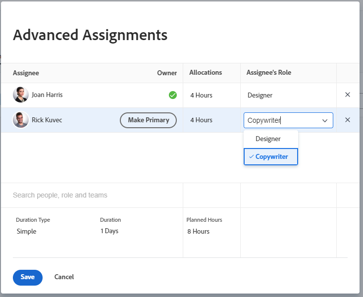

# Skapa avancerade uppdrag

{{highlighted-preview}}

<!-- Audited: 11/2025-->

<!--remove the bullet indicated when we get rid of the new/old experience of editing tasks-->

<!--

 

The highlighted information on this page refers to functionality not yet generally available. It is available only in the Preview environment for all customers. The same features will also be available in the Production environment for all customers starting with  a week from the Preview release.      

For more information, see [Interface modernization](/help/quicksilver/product-announcements/product-releases/interface-modernization/interface-modernization.md).  

-->

Du kan hantera uppgifter och ärenden med hjälp av avancerade uppdrag.

Du kan justera följande uppdragsinformation när du gör avancerade uppdrag:

* Tilldela användare till uppgiften eller problemet (detta kan utföras utanför ett avancerat uppdrag).
* Justera och omfördela det antal timmar som varje tilldelad tilldelas.
* Avgör vilken användare som ska utses till ägare eller primär tilldelad till uppgiften eller utgåvan.
* Ange vilken roll varje användare ska ha när de arbetar med uppgiften eller problemet.
* Lägg till information om fakturering och kostnadstariff på tilldelningsnivå.
* Granska följande information för varje tilldelning: planerade timmar, total kostnad och totala intäkter.

>[!NOTE]
>
>När du tilldelar användare arbetstid påverkar tillgängligheten enligt sina scheman de planerade och planerade datumen för uppgifter och problem. Mer information om scheman finns i [Skapa ett schema](../../../administration-and-setup/set-up-workfront/configure-timesheets-schedules/create-schedules.md).

## Områden i Adobe Workfront där du kan göra avancerade uppdrag

I den här artikeln beskrivs hur du får åtkomst till avancerade uppdrag i uppgiftens eller problemets huvud.

Dessutom kan du göra avancerade uppdrag inom följande områden av Workfront:

* I listor och rapporter när fältet Uppdrag visas i vyn.
* I avsnittet Uppdrag när du redigerar en uppgift. Mer information finns i [Redigera uppgifter](../../../manage-work/tasks/manage-tasks/edit-tasks.md). <!--When we remove the old/ new experience: take this bullet out completely; in the new Edit Task experience, this is no longer possible-->
* I huvud för uppgift eller utgåva, i området Uppdrag.
* I Arbetsbelastningsutjämnaren. Mer information finns i [Tilldela arbete manuellt med hjälp av arbetsbelastningsutjämnaren](../../../resource-mgmt/workload-balancer/assign-work-in-workload-balancer-manually.md).

## Åtkomstkrav

+++ Expandera om du vill visa åtkomstkrav för funktionerna i den här artikeln.

<table style="table-layout:auto"> 
 <col> 
 <col> 
 <tbody> 
  <tr> 
   <td>Adobe Workfront package</td> 
   <td> 
Så här lägger du till fakturerings- och kostnadstariffer för aktivitetstilldelningar och använder den avancerade sökningen: Arbetsflöde Ultimate
 
Så här skapar du avancerade uppdrag: Alla Workfront- eller arbetsflödespaket
</td> 
  </tr> 
  <tr> 
   <td>Adobe Workfront-licens</td> 
   <td> 
Standard

   
Arbeta eller högre

   </td> 
  </tr> 
  <tr> 
   <td role>Konfigurationer på åtkomstnivå</td> 
   <td> 
Redigera åtkomst till uppgifter och ärenden
  </td> 
  </tr> 
  <tr> 
   <td>Objektbehörigheter</td> 
   <td> 
Contribute eller högre behörighet för aktiviteten eller problemet
</td> 
  </tr> 
 </tbody> 
</table>

Mer information finns i [Åtkomstkrav i Workfront-dokumentationen](/help/quicksilver/administration-and-setup/add-users/access-levels-and-object-permissions/access-level-requirements-in-documentation.md).

+++

## Skapa avancerade uppdrag - Ultimate-paket för arbetsflöde

Den här layouten för avancerade uppdrag gäller endast för uppgifter. Mer information finns i [Skapa avancerade uppdrag - alla andra paket](#create-advanced-assignments--all-other-packages).

1. Gå till det projekt där du vill tilldela en uppgift.
1. Klicka på **Åtgärder** eller **Problem** i den vänstra panelen och klicka sedan på namnet på en uppgift i listan.

   >[!TIP]
   >
   >Du kan göra avancerade uppdrag direkt i uppgiftslistan. Klicka i fältet **Uppdrag** på samma rad som uppgiften och klicka sedan på **Avancerat** längst ned i listan eller på ikonen **Personer** i det övre högra hörnet av uppdragsrutan för att öppna fönstret Avancerade uppdrag. Gå till steg 5 om du vill fortsätta skapa avancerade uppdrag.
   >

1. Klicka på **Tilldela till** i fältet **Tilldelningar** i uppgiftens huvud

   eller

   Klicka på ett av de tilldelade namnen om uppgiften redan är tilldelad.

1. Klicka på **Avancerat**.

   

   Fönstret Avancerade uppdrag visas.

   

1. Granska information om aktivitetens varaktighet efter behov. Dessa fält är endast skrivskyddade från avancerade uppdrag och du kan uppdatera dem i uppgiften.

   Mer information om aktivitetens varaktighet, varaktighetstyper, tidsenheter och planerade timmar finns i [Översikt över aktivitetens varaktighet och varaktighetstyp](/help/quicksilver/manage-work/tasks/taskdurtn/task-duration-and-duration-type.md).

   >[!NOTE]
   >
   >Om en datakolumn som du vill visa inte visas kan du lägga till den. Se [Lägg till och ta bort kolumner i listan Avancerade uppdrag](#add-and-remove-columns-on-the-advanced-assignments-list) nedan.

1. (Valfritt) Välj **Timmar**, **FTE** eller **Procent** för att visa allokeringarna.

   Du kan se hur mycket en användare tilldelas i planerade timmar, som en procentandel av sin kapacitet eller i heltidsekvivalenter (0-1-skala). Standardinställningen är Timmar.

   Mer information om FTE finns i [Konfigurera inställningar för resurshantering](/help/quicksilver/administration-and-setup/set-up-workfront/configure-system-defaults/configure-resource-mgmt-preferences.md).

1. Klicka på **Ny rad** om du vill lägga till en tilldelning till aktiviteten.

1. Klicka i kolumnen **Tilldelad** för att lägga till en användare eller ett team. Börja skriva namnet på användaren eller teamet och klicka sedan på namnet när det visas i listrutan.

   >[!NOTE]
   >
   >Om namnet innehåller ett specialtecken måste du ta med specialtecknet i sökfältet.

   När du lägger till en användare som har en primär jobbroll fylls rollen **Tilldelad** i.

   Om användaren har attribut tilldelade till sin profil fylls attributen i i aktivitetstilldelningen.

1. Om du vill lägga till en jobbroll när du inte känner användaren som ska arbeta med uppgiften klickar du i kolumnen **Tilldelad roll**. Börja skriva namnet på jobbrollen och klicka sedan på namnet när det visas i listrutan.

   >[!NOTE]
   >
   >Om namnet innehåller ett specialtecken måste du ta med specialtecknet i sökfältet.

   Om jobbrollen har attribut tilldelade från ett projekts tariffkort fylls attributen i i aktivitetstilldelningen.

   När du tilldelar en användare senare med hjälp av fältet Tilldelning följer den grundläggande sökningen den här algoritmen:

   * Fullständig matchning: Jobbroll och alla attribut
   * Partiell matchning: Jobbroll och vissa attribut
   * Endast matchning av jobbroll

   Mer information om avancerad sökning finns i [Använd avancerad sökning](#use-the-advanced-search) i den här artikeln.

1. (Valfritt) Fortsätt lägga till tilldelningar i nya rader om du vill lägga till flera resurser till uppgiften.

   >[!TIP]
   >
   >* Du kan tilldela flera användare, jobbroller eller team. Du kan bara tilldela aktiva användare, jobbroller och team. Högst 200 tilldelningar per uppgift tillåts.
   >
   >
   >* När du lägger till en användartilldelning bör du lägga märke till avataren, användarens primära roll eller användarens e-postadress för att skilja mellan användare med identiska namn.
   >Användarna måste vara associerade med minst en jobbroll för att kunna visa den när du lägger till dem.
   >Du måste ha inställningen Visa kontaktinformation aktiverad på din åtkomstnivå för att användare ska kunna visa användarnas e-postmeddelanden. Mer information finns i [Bevilja åtkomst för användare](../../../administration-and-setup/add-users/configure-and-grant-access/grant-access-other-users.md).
   >
   >
   >* Om en användare, en jobbroll eller ett team tilldelades innan de inaktiverades, förblir de tilldelade till arbetsuppgiften. I det här fallet rekommenderar vi följande:
   >   
   >   * Tilldela om arbetsuppgiften till aktiva resurser.
   >   * Associera användarna i ett inaktiverat team med ett aktivt team och omfördela arbetsposten till det aktiva teamet.

1. Markera en tilldelad som aktivitetsägare genom att markera kryssrutan för raden och klicka på **Ange primär** i åtgärdsfältet längst ned i fönstret Avancerade uppdrag.

   Som standard markeras den första användaren eller jobbrollen som du tilldelar en uppgift som ägare eller primär tilldelning. Ett team kan inte utses till primär ägare för en uppgift.

   Om aktivitetens primära ägare inte visas kan du lägga till kolumnen **Är primär** i tabellen.

   >[!IMPORTANT]
   >
   >Beroende på hur din Workfront-administratör eller gruppadministratör konfigurerar dina projektinställningar kan Workfront använda schemat för aktivitetsägaren för att beräkna tidslinjen för uppgiften när du har flera användare tilldelade till uppgiften. Mer information om tilldelning av flera uppgifter finns i avsnittet [Att tänka på vid flera tilldelningar till jobbroller, team och användare](/help/quicksilver/manage-work/tasks/assign-tasks/assign-tasks.md#considerations-for-multiple-assignments-to-job-roles-teams-and-users) i artikeln [Tilldela uppgifter](../../../manage-work/tasks/assign-tasks/assign-tasks.md).

1. Ange följande information för varje användare i kolumnen **Tilldelad**:

   * (Valfritt) **Jobbroll för fakturering**: Sök efter och välj jobbrollen för fakturering för den här specifika personen och uppgiften.

     Jobbrollen för fakturering används bara för den här tilldelningen och används inte automatiskt för användarens andra tilldelningar. En användares primära roll är till exempel Designer, men vid en uppgift agerar han/hon som Senior Designer och faktureringssatsen bör återspegla detta. Jobbrollen för fakturering gäller endast användare och kan inte användas för andra jobbroller.

     När en jobbroll för fakturering används för användartilldelningen kan den hastighet som är kopplad till jobbrollen för fakturering användas i stället för användar- eller jobbrollstarifferna vid fakturerings- och intäktsberäkningar.

     En jobbroll på projektnivå för fakturering kan också anges för en användare, och det värdet används för alla användarens tilldelningar i det projektet.

     Mer information finns i [Konfigurera en jobbroll för fakturering](/help/quicksilver/manage-work/projects/project-finances/set-up-job-role-for-billing.md).

   * **Allokering**: När varaktighetstypen för en aktivitet är Enkel anger du antalet timmar som varje användare eller jobbroll ska tilldelas till aktiviteten. Summan av alla tilldelade timmar för varje användare är lika med talet i fältet **Planerade timmar** högst upp i fönstret Avancerade tilldelningar. I alla andra fall anger du hur många procent av tiden (eller allokeringen) som du vill att den som ska tilldelas ska lösa uppgiften.

     >[!TIP]
     >
     >När du har ändrat tilldelningar för uppgifter manuellt kan aktiviteternas planerade timmar uppdateras. Observera att du inte kan ändra allokeringar för team som tilldelats aktiviteter manuellt. Mer information finns i avsnittet [Uppdatera planerade timmar för aktiviteter när användartilldelningar hanteras](/help/quicksilver/manage-work/tasks/task-information/planned-hours.md#update-task-planned-hours-when-managing-user-allocations) i artikeln [Översikt över planerade timmar](/help/quicksilver/manage-work/tasks/task-information/planned-hours.md).

   * **Attribut**: Alla attribut som är tillgängliga för användaren visas i attributfälten. Administratören ställer in attributen och de läggs till i användarprofilen eller kopplas till en jobbroll på ett kurskort. Mer information finns i [Definiera tariffattribut](/help/quicksilver/administration-and-setup/manage-enterprise-operations/define-rate-attributes.md) och [Redigera en användares profil](/help/quicksilver/administration-and-setup/add-users/create-and-manage-users/edit-a-users-profile.md).

     Attribut är för närvarande skrivskyddade för användartilldelningar. De kan redigeras för jobbroller.

   * **Tariffvaluta**: Valutan för fakturerings- och kostnadstarifferna har standardvärdet från projektet, men du kan ändra valutan för den här tilldelningen.

   * (Valfritt) **Faktureringstaxa**: Faktureringstaxan kan komma från andra delar av systemet, till exempel betalkort. Mer information finns i [Översikt över intäkt- och kostnadshierarkin](/help/quicksilver/manage-work/projects/project-finances/overview-revenue-cost-hierarchy.md). Du kan manuellt åsidosätta faktureringssatsen för den här specifika tilldelningen i det här fältet, och den åsidosätter alla andra avgifter för användaren i intäktsberäkningar.
   * (Valfritt) **Kostnadsnivå**: Kostnadsnivån kan komma från andra områden i systemet. Mer information finns i [Översikt över intäkt- och kostnadshierarkin](/help/quicksilver/manage-work/projects/project-finances/overview-revenue-cost-hierarchy.md). Du kan manuellt åsidosätta kostnadstariffen för den här specifika tilldelningen i det här fältet, och den åsidosätter alla andra avgifter för användaren i kostnadsberäkningar.
   * **Kan faktureras**: Välj det här alternativet om du vill inkludera tilldelningen i ekonomiska beräkningar. Avmarkera det här alternativet om du vill exkludera tilldelningen från ekonomiska beräkningar.

     Det här fältet är aktiverat som standard för alla tilldelningar när aktiviteten har en intäktstyp.

1. (Valfritt) Om du vill visa tilldelningsdata efter datum för en användare eller roll markerar du tabellraden och klickar på **Visa efter datum** i åtgärdsfältet längst ned i fönstret Avancerade tilldelningar. Mer information finns i [Visa tilldelningsdata efter datum](#view-assignment-data-by-dates) i den här artikeln.
1. (Valfritt) Om du vill ta bort en eller flera uppdrag från listan markerar du kryssrutan för varje rad och klickar på **Ta bort** i åtgärdsfältet längst ned i fönstret Avancerade uppdrag.
1. Klicka på **Spara** eller **Spara och stäng** när du är klar med redigeringen av avancerade uppdrag.

### Lägga till och ta bort kolumner i listan Avancerade uppdrag

Fälten måste finnas innan du kan lägga till dem i listan.

1. Klicka på **+** överst till höger i listan för att öppna **kolumnhanteraren**.

   

1. Välj fliken **Egenskaper** eller fliken **KPI:er** för att välja vilken typ av fält du vill lägga till.

   Egenskaper som plats eller kostnadsställe ger sammanhangsberoende information. Tidsfördelade nyckeltal, t.ex. intäkter eller kostnadsfördelningsvärden över tidsperioder.

1. Sök efter ett befintligt objektfält i avsnittet **Tillgängligt** och klicka sedan på **+** till höger om fältnamnet för att lägga till det i kolumnen **Markerat**.
1. Klicka på **-** till höger om ett fält i avsnittet **Markerad** för att ta bort det från listan.
1. Klicka på **Spara**.

   Mer information om kolumnhanteraren finns i [Använda förbättrade listor](/help/quicksilver/workfront-basics/navigate-workfront/use-lists/enhanced-lists.md).

### Använda en vy i listan Avancerade uppdrag

En vy är en anpassad uppsättning kolumnarrangemang som du kan tillämpa på listan.

1. Klicka på listrutan **Vyer** och välj den vy som du vill använda i listan.

   **Systemvyer** är vyer som systemadministratören har lagt till och som inte kan ändras. **Mina vyer** är vyer som du har skapat eller delat med dig.

1. Klicka på **Ny vy** i listrutan **Vyer** för att skapa en vy.

   När du lägger till, tar bort eller sorterar om kolumnerna sparas ändringarna automatiskt i vyn. Nästa gång du använder den här vyn behåller kolumnerna det sätt som du anger dem.

   Mer information om vyer finns i [Använd förbättrade listor](/help/quicksilver/workfront-basics/navigate-workfront/use-lists/enhanced-lists.md).

### Använda avancerad sökning

Den avancerade sökningen hjälper dig att hitta rätt användare eller jobbroll att lägga till i uppdraget.

1. Gör något av följande om du vill öppna det avancerade sökfönstret:

   * Klicka på **Avancerad sökning** längst upp till höger i fönstret Avancerade uppdrag.
   * Markera en uppdragsrad och klicka på **Avancerad sökning** i åtgärdsfältet längst ned i fönstret Avancerade uppdrag. Då öppnas den avancerade sökningen med filter som automatiskt tillämpas på det specifika uppdraget.

1. Välj fliken Användare eller Jobbroller i det avancerade sökfönstret.
1. Använd filter efter behov:

   1. Klicka på **Filter** ovanför listan.
   1. Klicka på **Lägg till villkor** i rutan Filter.
   1. Välj ett fält att filtrera efter.
   1. Välj en filtermodifierare, till exempel &quot;Har någon av,&quot; &quot;Har ingen av,&quot; &quot;Är före&quot; eller &quot;Är efter&quot;. Modifieringsalternativen varierar beroende på vilken typ av fält du filtrerar efter.
   1. Markera fältvärdet eller -värdena. Beroende på vilken fälttyp du filtrerar efter kan du uppmanas att välja objektet från en lista, söka efter det eller använda en kalender för att välja ett datumintervall.

   Filtret tillämpas automatiskt på listan. Mer information om filter finns i [Använd förbättrade listor](/help/quicksilver/workfront-basics/navigate-workfront/use-lists/enhanced-lists.md).

1. Sök efter en jobbroll eller användare.

   När du söker efter en användare som matchar en jobbrolltilldelning visas endast fullständiga matchningar (jobbroll och alla attribut).

1. Klicka på **+** för att lägga till kolumner i tabellen. Mer information finns i [Lägga till och ta bort kolumner i listan Avancerade uppdrag](#add-and-remove-columns-on-the-advanced-assignments-list).
1. Markera en eller flera användare eller jobbroller och klicka på **Lägg till användare** eller **Lägg till roller** i åtgärdsfältet längst ned i fönstret.

   Uppdragen läggs till i fönstret Avancerade uppdrag.

### Visa tilldelningsdata per datum

Fönstret **Visa efter datum** för avancerade tilldelningar visar hela den datumgiltiga historiken för tilldelningen för en viss användare eller roll. Både tidigare och framtida ändringar visas.

Exempel på datumeffektiva objekt som kan påverka uppdragshistoriken är:

* Användarens primära/andra jobbroller
* Jobbroll på projektnivå för fakturering
* Fakturering/kostnadstariffer för användarprofiler
* Åsidosätt fakturering/kostnadstariffer för projekt (användare eller jobbroll)
* Klassificera kortpriser efter jobbroll/attribut
* Användarattribut
* Användarschema

Observera att detta inte är en heltäckande lista och att fältet som ändrats inte nödvändigtvis visas i tabellen över tilldelningsdata, men det påverkar fakturering och kostnadstariffer eller attribut för användaren eller jobbrollen.

Du kan bara visa tilldelningsdata efter datum för en enskild användare eller roll.

1. Markera tabellraden för en användare eller roll och klicka på **Visa efter datum** i åtgärdsfältet längst ned i fönstret Avancerade uppdrag.

   Fönstret **Visa efter datum** visas. Informationen är skrivskyddad.

   Varje rad i tabellen representerar en datumgiltig ändring av uppdraget. Om inga datumändringar har gjorts får tabellen en rad med aktuella data. Markerade fält pekar på vad som har ändrats och start- och slutdatumet för varje uppdatering visas. Om faktureringstakten till exempel ändrades från 202 den 20 augusti till 2005 den 21 augusti markeras avgiften. Texten inom parentes anger var ändringen gjordes av hastigheten, t.ex. ett projekt.

   

   När du är klar med granskningen av data klickar du på pilen längst upp till vänster för att gå tillbaka till fönstret Avancerade uppdrag.

## Skapa avancerade uppdrag - alla andra paket

Den här layouten för avancerade uppdrag gäller för både uppgifter och ärenden.

1. Gå till projektet där du vill tilldela en uppgift eller ett problem.
1. Klicka på **Åtgärder** eller **Problem** i den vänstra panelen och klicka sedan på namnet på en uppgift eller ett problem i listan.

   >[!TIP]
   >
   >Du kan göra avancerade uppdrag direkt i uppgifts- eller utleveranslistan. Klicka i fältet **Uppdrag** på samma rad som uppgiften eller utgåvan och klicka sedan på **Avancerat** längst ned i listan eller på ikonen **Personer** i det övre högra hörnet av uppdragsrutan för att öppna fönstret Avancerade uppdrag. Gå till steg 5 om du vill fortsätta skapa avancerade uppdrag.
   >

1. Klicka på **Tilldela till** i fältet **Tilldelningar** i huvudet på uppgiften eller problemet

   eller

   Klicka på ett av de tilldelade namnen om uppgiften eller utgåvan redan har tilldelats.

1. Klicka på **Avancerat**.

   

1. I fältet **Sök efter personer, roller och team** börjar du skriva namnet på en användare, roll eller team och klickar sedan på namnet när det visas i listrutan.

   >[!NOTE]
   >
   >Om användarens namn innehåller ett specialtecken måste du inkludera specialtecknet i sökfältet.

1. (Valfritt) Fortsätt lägga till tilldelningar i rutan **Sök efter personer, roller och team** om du vill lägga till flera resurser för aktiviteten eller problemet.

   >[!TIP]
   >
   >* Du kan tilldela flera användare, jobbroller eller team. Du kan bara tilldela aktiva användare, jobbroller och team.
   >
   >
   >* När du lägger till en användartilldelning bör du lägga märke till avataren, användarens primära roll eller användarens e-postadress för att skilja mellan användare med identiska namn.
   >Användarna måste vara associerade med minst en jobbroll för att kunna visa den när du lägger till dem.
   >Du måste ha inställningen Visa kontaktinformation aktiverad på din åtkomstnivå för att användare ska kunna visa användarnas e-postmeddelanden. Mer information finns i [Bevilja åtkomst för användare](../../../administration-and-setup/add-users/configure-and-grant-access/grant-access-other-users.md).
   >
   >
   >* Om en användare, en jobbroll eller ett team tilldelades innan de inaktiverades, förblir de tilldelade till arbetsuppgiften. I det här fallet rekommenderar vi följande:
   >   
   >   * Tilldela om arbetsuppgiften till aktiva resurser.
   >   * Associera användarna i ett inaktiverat team med ett aktivt team och omfördela arbetsposten till det aktiva teamet.

1. Ange följande information för varje användare i kolumnen **Tilldelad**:

   * **Ägare**: Håll markören över namnet på den som har tilldelats och klicka på **Gör primär** i fältet Ägare om du vill markera den som tilldelats uppgiften eller utfärdaren. En grön kryssruta anger att den angivna användaren är den primära kontakten för uppgiften eller problemet. Adobe Workfront markerar den första användaren eller jobbrollen som du tilldelar en uppgift eller ett problem som ägare eller primär tilldelning. Ett team kan inte utses till primär ägare av en uppgift eller ett problem.

     >[!IMPORTANT]
     >
     >Beroende på hur din Workfront-administratör eller gruppadministratör konfigurerar dina projektinställningar kan Workfront använda schemat för aktivitetsägaren för att beräkna tidslinjen för uppgiften när du har flera användare tilldelade till uppgiften. Mer information om tilldelning av flera uppgifter finns i avsnittet [Att tänka på vid flera tilldelningar till jobbroller, team och användare](/help/quicksilver/manage-work/tasks/assign-tasks/assign-tasks.md#considerations-for-multiple-assignments-to-job-roles-teams-and-users) i artikeln [Tilldela uppgifter](../../../manage-work/tasks/assign-tasks/assign-tasks.md).

   * **Allokeringar**: När varaktighetstypen för en aktivitet är Enkel anger du antalet timmar som varje användare eller jobbroll ska tilldelas till aktiviteten. Summan av alla tilldelade timmar för varje användare är lika med talet i fältet **Planerade timmar** längst ned i kolumnen Allokeringar. I alla andra fall anger du hur många procent av tiden (eller allokeringen) som du vill att den som ska tilldelas ska lösa uppgiften eller problemet.

     >[!TIP]
     >   
     >   * När du har ändrat tilldelningar för uppgifter manuellt kan aktiviteternas planerade timmar uppdateras. Mer information finns i avsnittet [Uppdatera planerade timmar för aktiviteter när användartilldelningar hanteras](/help/quicksilver/manage-work/tasks/task-information/planned-hours.md#update-task-planned-hours-when-managing-user-allocations) i artikeln [Översikt över planerade timmar](/help/quicksilver/manage-work/tasks/task-information/planned-hours.md).
     >   * Du kan inte ändra tilldelningar manuellt för utleveranser.
     >   * Du kan inte ändra allokeringar för team som tilldelats aktiviteter manuellt.

   * **Tilldelningens roll:** Välj den roll som användaren ska använda när den här tilldelningen utförs.  Användarens primära roll visas som standard. Klicka i rutan **Tilldelningens roll** för att välja en annan roll. När du tilldelar uppgiften eller utgåvan till en roll först, och sedan lägger till en användare som kan slutföra rollen som ett andra uppdrag, filtreras listan med föreslagna användare för de användare som kan uppfylla de roller som redan tilldelats uppgiften och utgåvan.

     

   * **Varaktighetstyp**: Detta är endast tillgängligt för aktiviteter. Klicka på namnet på varaktighetstypen och välj en varaktighetstyp i listrutan. Mer information om varaktighetstyper finns i [Översikt över aktivitetsvaraktighet och varaktighetstyp](../../../manage-work/tasks/taskdurtn/task-duration-and-duration-type.md).

   * **Varaktighet:** Du kan uppdatera det här fältet för en aktivitet när du har behörigheten Hantera för aktiviteten.

     Mer information finns i [Översikt över aktivitetsvaraktighet och varaktighetstyp](../../../manage-work/tasks/taskdurtn/task-duration-and-duration-type.md). När du redigerar uppdragsinformation gruppvis visas en liknande dialogruta där du kan tilldela användare, timmar, tilldelning och aktivitetsägare.

   * **Planerade timmar**: Uppdatera antalet planerade timmar när varaktighetstypen är Beräknad tilldelning eller Enkel. Allokeringsprocenten eller timmarna för varje resurs fördelas jämnt som ett resultat. Workfront beräknar de planerade timmarna när varaktighetstypen är Beräknad arbetstid eller Anläggningsstyrd. Mer information finns i [Översikt över aktivitetsvaraktighet och varaktighetstyp](../../../manage-work/tasks/taskdurtn/task-duration-and-duration-type.md).

1. Klicka på **Spara**.

