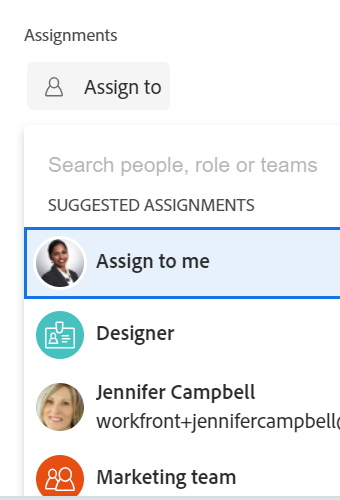

# Översikt över smarta uppdrag

<!--
The highlighted information on this page refers to functionality not yet generally available. It is available only in the Preview environment for all customers.   
  
For information about the current release schedule, see [First Quarter 2024 release overview](/help/quicksilver/product-announcements/product-releases/24-q1-release-activity/24-q1-release-overview.md). 
-->

När du hanterar uppgifter och ärenden kan du använda smarta tilldelningar för att identifiera vem som är bäst på att slutföra arbetet. Smarta tilldelningar är förslag som Adobe Workfront ger dig när du tilldelar resurser arbetsobjekt baserat på en algoritm som avgör vilken resurs som passar bäst för jobbet.

>[!NOTE]
>
>Smarta tilldelningar tar inte hänsyn till användarens tillgänglighet. Men deras tillgänglighet enligt scheman påverkar planerade och planerade datum för uppgifter och ärenden när de tilldelas. Mer information om scheman finns i artikeln [Skapa ett schema](../../../administration-and-setup/set-up-workfront/configure-timesheets-schedules/create-schedules.md).

Den här artikeln innehåller allmän information om smarta tilldelningar. Mer information om hur du använder smarta tilldelningar för att tilldela uppgifter och utgåvor till användare finns i [Gör smarta uppdrag](../../../manage-work/tasks/assign-tasks/make-smart-assignments.md).

## Översikt över smarta uppdrag

Tänk på följande när du arbetar med smarta uppdrag:

* Algoritmen fungerar oberoende för uppgifter och problem. Det innebär att listan med föreslagna användare för problem kan skilja sig från listan med föreslagna användare för en uppgift eftersom Workfront skapar listorna enligt kriterier som gäller problem och uppgifter separat.
* Smarta tilldelningar rekommenderar inte jobbroller eller team. De är i stället förslag från användare som bäst lämpar sig för att slutföra en uppgift eller ett problem.
* De föreslagna uppdragen är alltid aktiva användare.
* Användaren som visas först bör vara den bästa matchningen för uppgiften.

## Hitta förslag på smarta uppdrag

Du kan visa smarta uppdrag i följande områden där du kan tilldela uppgifter eller ärenden:

* En uppgiftslista eller utgivningslista eller rapport <!--edit this to say just issue list or report and update screen shot - add new one-->

  

<!--
* A task list or report (******insert shot here*****)
-->

* En aktivitets- eller utgivningsrubrik

  

* Åtgärds- eller ärendesammanfattningspanelen

  

* Uppdragsfältet för ett objekt som visas i hemområdet

  

<!--removed for scheduling deprecation: 

* Resource Scheduling

  

  >[!CAUTION]
  >
  >Resource Scheduling is a deprecated feature. For more information, see [Deprecation of Resource Scheduling tools in Adobe Workfront](../../../resource-mgmt/resource-mgmt-overview/deprecate-resource-scheduling.md).

-->
* Utjämning av arbetsbelastning

  

## Kriterier för smarta tilldelningar

<!--

Smart assignments work differently for tasks than for issues.  

### Smart assignments criteria for tasks

Task smart assignments work in two phases:  

#### First phase of smart assignment calculation criteria for tasks 

Workfront calculates a similarity score for every assignment. The calculation for the similarity score and the order in which the assignments are listed take into account the following:  

* A score of 100% is given to an existing assignment where the task, project, and portfolio names are identical to the task you're trying to assign. The project and portfolio names of the task of an existing assignment must also match the project and portfolio of the task you are trying to assign.   

* If only some of this information from other assignments matches on the existing tasks, the score might be lower.  

  For example, if you are assigning a task called "My second task" on a project called "My project" in a portfolio called "My portfolio" and you have an existing task called "My task" in another project called "My project" in a portfolio called "My portfolio", the user assigned to "My task" might get a score of 95% because the name of the existing task and the task you're trying to assign now are similar, but not identical.  
 
    >[!TIP]
    >
    >  Workfront looks for matches only in the Name fields of tasks, projects, and portfolios and not in any other fields. 

* An assignment could get a higher score when they are assigned to a lot of tasks in the system that are similar in names. For example, if a team called "Development" is assigned to 50% of the tasks in the system containing "AI" in the name and you are now assigning another task with "AI" in the name, the score of the "Development" team is higher. In this case, the names of  projects and portfolios are not as important.  

* Taking into account this scoring system, the first 7 suggestions are listed as smart assignments, in the descending order of their scores. Assignments with scores lower than 40% do not display.  

* If several assignments have identical scores, they display in descending order of the date on which the assignments were made.  
For example, if Rick was assigned to a similar task earlier today and Jennifer was assigned to a similar task two days ago, Rick displays first.  

* If there are no matches using this calculation, the second step of smart assignments applies which is calculated using a different algorithm.  

#### Second phase of smart assignment calculation criteria for tasks

If the first step of task smart assignments has found no matches, Workfront calculates smart assignments for tasks in the same way that it calculates them for issues.  

### Smart assignments criteria for tasks and issues 

 

>[!NOTE]
>
>The following criteria applies for tasks only when the first phase of the task smart assignment calculation did not find any matches. The following criteria always applies for issues, by default. 

-->

Användare rekommenderas i listrutan Smarta tilldelningar baserat på en kombination av följande kriterier (listas i ordning från viktigaste till minst viktiga):

1. Användare som har tilldelats andra arbetsobjekt de senaste 30 dagarna av användaren som har gjort uppdraget. De första 50 användarna som matchar det här villkoret visas. Den användare som oftast tilldelas visas först.

2. Om arbetsuppgiften tilldelas till ett team eller en roll filtreras listan med föreslagna användare med hänsyn till de befintliga tilldelningarna nedan. I det här fallet visas endast följande användare i listan med förslag:

   * Användare vars hemteam är det team som tilldelats arbetsuppgiften.
   * Användare vars primära roll är den roll som tilldelats arbetsuppgiften.

>[!TIP]
>
>* Om ingen roll eller team har tilldelats för uppgiften eller utgåvan visas alla användare som har tilldelats de senaste 30 dagarna, upp till 50 användare.
>
>* Om du inte har gjort några uppdrag under de senaste 30 dagarna visas endast användare som tillhör det tilldelade teamet eller har rollen tilldelad till arbetsposten i listan med smarta uppdrag.

<!--the commented out piece in the tip above was live before but I am not totally sure that smart assignments look at your team. I think they look JUST at the team/ role assigned to the work item; see this help site request for more info: https://experience.adobe.com/#/@adobeinternalworkfront/so:hub-Hub/workfront/issue/62fd222200037eb87572c5b6ad6bf53e/overview -->
<!--

<h3>Smart assignments criteria for the Production environment</h3>

(NOTE: drafted,this was the case BEFORE we updated the logic in the WB - with the 21.4 release)

Smart assignments display on tasks and issues when the following conditions are met:

<ul>
<li>The task or issue is subordinate to a parent task or issue that has a user, team, or job role currently assigned. </li>
</ul>

Smart assignments display the top twenty recommendations based on a proprietary algorithm that uses your own team information.

Users are recommended in the smart assignments drop-down list based on a combination of the following criteria (listed in order from most important to least important):

<ul>
<li>The user has the team assigned to the task or issue designated as their Home Team</li>
<li>The user is also assigned to the parent task</li>
<li>The user has the same primary job role as is currently assigned to the task or issue</li>
<li>The user has the team assigned to the parent task or issue designated as their Home Team</li>
<li>The user is associated with the same primary job role currently assigned to the parent task</li>
<li>The user is a member of the same team as the user who assigned the task or issue and the team is designated as their Home Team</li>
<li>The user is a member of the same Home Group as the user who is assigning the task or issue</li>
<li>The user has the same primary job role as the user who is assigning the task or issue.</li>
</ul>

-->

<!--

<h2>Make smart assignments</h2>

(NOTE:&nbsp;this was moved to its own article: make-smart-assignments.) 

Smart assignments are available in most locations where you can make assignments in Workfront.

You can use smart assignments on tasks and issues that have previously been assigned to a job role or a team.
 <note type="note">
You must have a Plan or a Work license and have at least Contribute permissions to a task or an issue to be able to make assignments to the task or the issue. You must have the Make Assignments option enabled in your permission level to make assignments.
</note>

To use smart assignments:

<ol>
<li value="1">Navigate to an issue or a task and click one of the following fields to edit them:  
<ul>
<li>
The <strong>Assignments</strong> field in the task or issue header
</li>
<li>The <strong>Assignments</strong> field of a task or issue list using in-line editing in a task or issue list. </li>
<li>The <strong>Assignee</strong> field after you have clicked <strong>Advanced</strong> from a task or an issue. </li>
</ul></li>
<li value="2"> 
Place your cursor in the assignment field, and wait for two seconds, then the <strong>Suggestions</strong> list is displayed.
 
Users displayed in this list are the smart assignment suggestions for the task or the issue. 
 
  
 </li>
<li value="3"> 
Select the user in the recommendations list by clicking their name. 
 
If there are no suggestions, the suggestion list does not open.
 </li>
<li value="4">(Optional) If you do not want to use one of the recommended users from the smart assignments list, start typing the name of the desired user and select the name when it appears in the list.</li>
<li value="5">Click <strong>Enter</strong> to make the assignment. </li>
</ol>

-->
