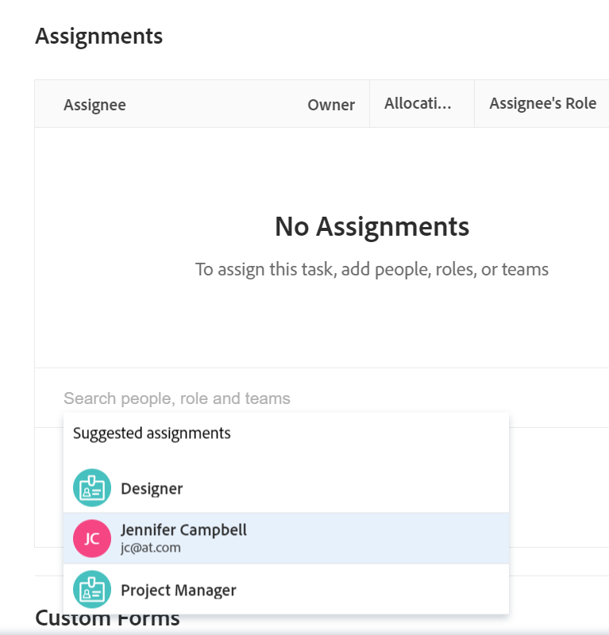

# Översikt över smarta uppdrag

<!--keep the yellow around the Rate card job roles and the Preview intro for those-->

Den markerade informationen på den här sidan hänvisar till funktioner som ännu inte är allmänt tillgängliga. Den är bara tillgänglig i förhandsvisningsmiljön för alla kunder, eller i produktionsmiljön för kunder som aktiverat snabba versioner.

Mer information om snabba releaser finns i [Aktivera eller inaktivera snabba releaser för din organisation](/help/quicksilver/administration-and-setup/set-up-workfront/configure-system-defaults/enable-fast-release-process.md).

Mer information om den aktuella versionen finns i [Översikt över utgåvan för tredje kvartalet 2024](/help/quicksilver/product-announcements/product-releases/24-q3-release-activity/24-q3-release-overview.md).

När du hanterar uppgifter och ärenden kan du använda smarta tilldelningar för att identifiera vem som är bäst på att slutföra arbetet. Smarta tilldelningar är förslag som Adobe Workfront ger dig när du tilldelar resurser arbetsobjekt baserat på en algoritm som avgör vilken resurs som passar bäst för jobbet. Smarta uppdrag kan vara användare, jobbroller eller team.

>[!NOTE]
>
>När du föreslår användare tar smarta tilldelningar inte hänsyn till användarens tillgänglighet. Men deras tillgänglighet enligt scheman påverkar planerade och planerade datum för uppgifter och ärenden när de tilldelas. Mer information om scheman finns i artikeln [Skapa ett schema](../../../administration-and-setup/set-up-workfront/configure-timesheets-schedules/create-schedules.md).

Den här artikeln innehåller allmän information om smarta tilldelningar. Mer information om hur du använder smarta tilldelningar för att tilldela uppgifter och utgåvor till användare finns i [Skapa smarta tilldelningar](../../../manage-work/tasks/assign-tasks/make-smart-assignments.md).

## Översikt över smarta uppdrag

Tänk på följande när du arbetar med smarta uppdrag:

* Algoritmen fungerar oberoende för uppgifter och problem. Det innebär att listan med föreslagna användare för problem kan skilja sig från listan med föreslagna användare för en uppgift eftersom Workfront skapar listorna enligt kriterier som gäller problem och uppgifter separat.
* Smarta tilldelningar rekommenderar inte jobbroller eller team. De är i stället förslag från användare som bäst lämpar sig för att slutföra en uppgift eller ett problem.
* De föreslagna uppdragen är alltid aktiva användare.
* Användaren som visas först bör vara den bästa matchningen för uppgiften.

## Hitta förslag på smarta uppdrag

Du kan visa smarta uppdrag i följande områden där du kan tilldela uppgifter eller ärenden:

* En problemlista eller rapport i uppdragskolumnen

  

* En uppgiftslista eller rapport i uppdragskolumnen

  

* En uppgiftsrubrik i uppdragsfältet

  

* En ärenderubrik i uppdragsfältet

  

* Åtgärdens eller ärendets sammanfattningspanel i uppdragsområdet

  

* Fältet Uppdrag i rutan Ny uppgift när du lägger till en uppgift i ett projekt

  

<!--this is not possible in the new home  - we have Summary there: 
* The Assignments field for an item listed in the Home area, when you open a task or issue

  
-->

* Utjämning av arbetsbelastning i området Tilldelad den här till när du tilldelar en uppgift eller ett problem

  

## Kriterier för smarta tilldelningar

Smarta uppdrag fungerar annorlunda för uppgifter än för ärenden.

### Kriterier för smarta tilldelningar för uppgifter

Beräkningen av smarta tilldelningar för aktiviteten fungerar i två faser som använder två olika algoritmer.

Beroende på vilken algoritm som hittar den smarta tilldelningen visas tilldelningarna under två separata avsnitt i fältet Uppdrag. Mer information finns i [Skapa smarta uppdrag](/help/quicksilver/manage-work/tasks/assign-tasks/make-smart-assignments.md).

#### Första fasen i beräkningen av smart tilldelning för uppgifter

I den första fasen av beräkningen av smarta tilldelningar beräknar Workfront likhetspoäng för varje uppdrag.

>[!NOTE]
>
>Den första fasen i beräkningen av smarta tilldelningar gäller inte följande aktivitetsområden:
>
>* Masstilldelningar i arbetsbelastningsutjämnaren.
>* Anslutna kort på kort.

Beräkningen av likhetspoängen och den ordning i vilken tilldelningarna listas tar hänsyn till följande:

* En poäng på 100 % ges till ett befintligt uppdrag där namnen på aktiviteten, projektet och portföljen är identiska med de uppgifter du försöker tilldela. Projekt- och portföljnamnen för en uppgift i en befintlig tilldelning måste också matcha projektet och portföljen för den uppgift du försöker tilldela.

* Om endast en del av den här informationen från andra uppdrag matchar de befintliga aktiviteterna kan poängen vara lägre än 100 %.

  Om du till exempel tilldelar en uppgift med namnet&quot;Min andra uppgift&quot; för ett projekt med namnet&quot;Mitt projekt&quot; i en portfölj med namnet&quot;Min portfölj&quot; och du har en befintlig uppgift med namnet&quot;Min uppgift&quot; i ett annat projekt med namnet&quot;Mitt projekt&quot; i en portfölj med namnet&quot;Min portfölj&quot;, kan användaren som tilldelats&quot;Min uppgift&quot; få resultatet 95 % eftersom namnet på den befintliga uppgiften och den uppgift du försöker tilldela nu är liknande, men inte identiska .

  >[!TIP]
  >
  >  Workfront söker endast efter matchningar i namnfälten för uppgifter, projekt och portföljer och inte i andra fält.

* Ett uppdrag kan få ett högre poängvärde när det tilldelas till många uppgifter i systemet som har liknande namn. Om till exempel ett team som heter&quot;Utveckling&quot; tilldelas 50 % av uppgifterna i systemet som innehåller&quot;AI&quot; i namnet och du nu tilldelar en annan uppgift med&quot;AI&quot; i namnet, blir poängen för&quot;Utvecklingsteamet&quot; högre. I det här fallet är projektnamnen och portföljerna inte lika viktiga.

* Med hänsyn till detta poängsystem listas de första 7 förslagen som smarta tilldelningar i fallande ordning efter poängen. Uppdrag med bakgrundsmusik som är lägre än 40 % visas inte.

* Om flera tilldelningar har identiska poäng, visas de i den ordning som tilldelningarna gjordes, med början från det senaste datumet.

  Om Rick till exempel tilldelades en liknande uppgift tidigare i dag och Jennifer tilldelades en liknande uppgift för två dagar sedan visas Rick först.

* Uppdrag som identifieras i den här fasen listas i    **Föreslagna tilldelningar** i uppdragsfältet för uppgifter.

* Om det inte finns några matchningar som använder den här beräkningen startar den andra fasen av smarta tilldelningar, som beräknas med en annan algoritm.

#### Andra fasen av beräkning av smart tilldelning för uppgifter

Om det första steget i smarta uppdrag inte hittar några träffar, beräknar Workfront smarta tilldelningar för uppgifter på samma sätt som när de beräknas för problem.

Mer information finns i avsnittet [Kriterier för smarta tilldelningar för uppgifter och problem](#smart-assignments-criteria-for-tasks-and-issues) i den här artikeln.

Uppdrag som identifieras i den här fasen visas i avsnitten **Användare och team**, **Jobbrolltilldelningar** och **Klassificera kortroller** i fältet Uppdrag. Mer information om tariffkort finns i [Hantera tariffkort](/help/quicksilver/administration-and-setup/set-up-workfront/configure-system-defaults/manage-rate-cards.md). <!--keep the rate cards roles in yellow after the release of assignments to Prod-->

### Kriterier för smarta uppdrag för uppgifter och ärenden

>[!NOTE]
>
>Följande villkor gäller endast för uppgifter när den första fasen i beräkningen av den smarta tilldelningen inte hittade några matchningar. Mer information finns i avsnittet [Första fasen i beräkningen av smart tilldelning för aktiviteter](#first-phase-of-smart-assignment-calculation-for-tasks) i den här artikeln. Följande kriterier gäller alltid för problem som standard.

Användare rekommenderas i listrutan Smarta tilldelningar baserat på en kombination av följande kriterier (listas i ordning från viktigaste till minst viktiga):

1. Användare som har tilldelats andra arbetsobjekt de senaste 30 dagarna av användaren som har gjort uppdraget. De första 50 användarna som matchar det här villkoret visas. Den användare som oftast tilldelas visas först.

2. Om arbetsuppgiften tilldelas till ett team eller en roll filtreras listan med föreslagna användare med hänsyn till de befintliga tilldelningarna nedan. I det här fallet visas endast följande användare i listan med förslag:

   * Användare vars hemteam är det team som tilldelats arbetsuppgiften.
   * Användare vars primära roll är den roll som tilldelats arbetsuppgiften.

>[!TIP]
>
>* Om ingen roll eller team har tilldelats för uppgiften eller utgåvan visas alla användare som har tilldelats de senaste 30 dagarna, upp till 50 användare.
>
>* Om du inte har gjort några uppdrag under de senaste 30 dagarna visas endast användare som tillhör det tilldelade teamet eller har rollen tilldelad till arbetsposten i listan med smarta uppdrag.

<!--the commented out piece in the tip above was live before but I am not totally sure that smart assignments look at your team. I think they look JUST at the team/ role assigned to the work item; see this help site request for more info: https://experience.adobe.com/#/@adobeinternalworkfront/so:hub-Hub/workfront/issue/62fd222200037eb87572c5b6ad6bf53e/overview -->
<!--

<h3>Smart assignments criteria for the Production environment</h3>

(NOTE: drafted,this was the case BEFORE we updated the logic in the WB - with the 21.4 release)

Smart assignments display on tasks and issues when the following conditions are met:

<ul>
<li>The task or issue is subordinate to a parent task or issue that has a user, team, or job role currently assigned. </li>
</ul>

Smart assignments display the top twenty recommendations based on a proprietary algorithm that uses your own team information.

Users are recommended in the smart assignments drop-down list based on a combination of the following criteria (listed in order from most important to least important):

<ul>
<li>The user has the team assigned to the task or issue designated as their Home Team</li>
<li>The user is also assigned to the parent task</li>
<li>The user has the same primary job role as is currently assigned to the task or issue</li>
<li>The user has the team assigned to the parent task or issue designated as their Home Team</li>
<li>The user is associated with the same primary job role currently assigned to the parent task</li>
<li>The user is a member of the same team as the user who assigned the task or issue and the team is designated as their Home Team</li>
<li>The user is a member of the same Home Group as the user who is assigning the task or issue</li>
<li>The user has the same primary job role as the user who is assigning the task or issue.</li>
</ul>

-->

<!--

<h2>Make smart assignments</h2>

(NOTE:&nbsp;this was moved to its own article: make-smart-assignments.) 

Smart assignments are available in most locations where you can make assignments in Workfront.

You can use smart assignments on tasks and issues that have previously been assigned to a job role or a team.
 <note type="note">
You must have a Plan or a Work license and have at least Contribute permissions to a task or an issue to be able to make assignments to the task or the issue. You must have the Make Assignments option enabled in your permission level to make assignments.
</note>

To use smart assignments:

<ol>
<li value="1">Navigate to an issue or a task and click one of the following fields to edit them:  
<ul>
<li>
The <strong>Assignments</strong> field in the task or issue header
</li>
<li>The <strong>Assignments</strong> field of a task or issue list using in-line editing in a task or issue list. </li>
<li>The <strong>Assignee</strong> field after you have clicked <strong>Advanced</strong> from a task or an issue. </li>
</ul></li>
<li value="2"> 
Place your cursor in the assignment field, and wait for two seconds, then the <strong>Suggestions</strong> list is displayed.
 
Users displayed in this list are the smart assignment suggestions for the task or the issue. 
 
  
 </li>
<li value="3"> 
Select the user in the recommendations list by clicking their name. 
 
If there are no suggestions, the suggestion list does not open.
 </li>
<li value="4">(Optional) If you do not want to use one of the recommended users from the smart assignments list, start typing the name of the desired user and select the name when it appears in the list.</li>
<li value="5">Click <strong>Enter</strong> to make the assignment. </li>
</ol>

-->
