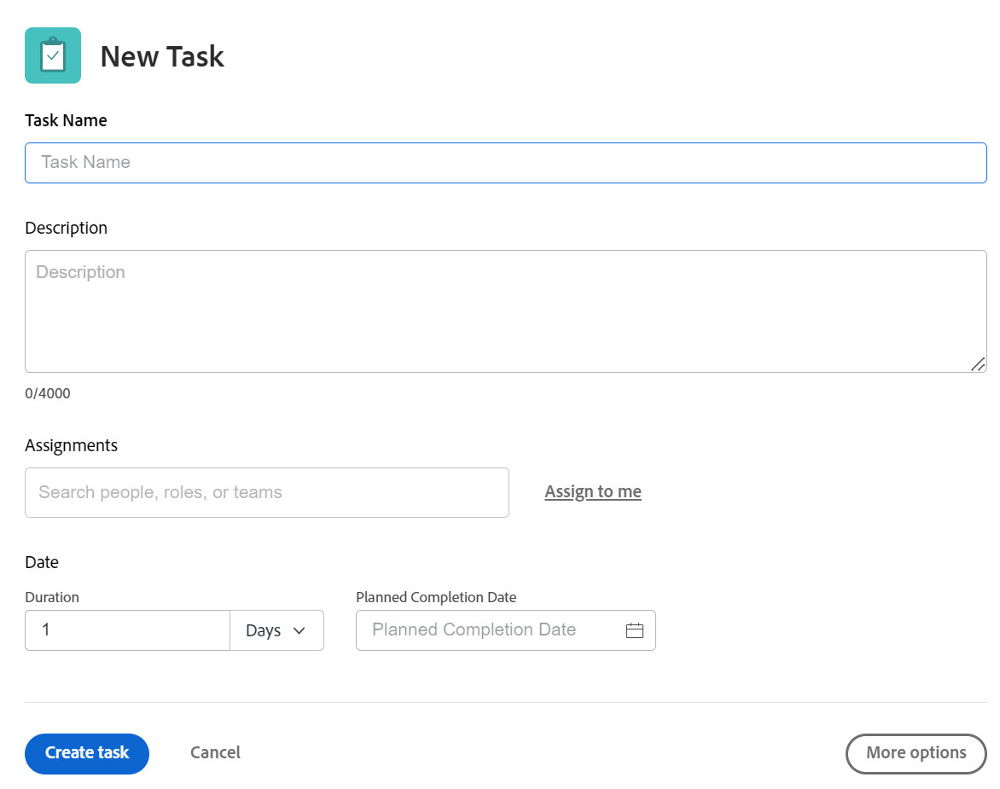
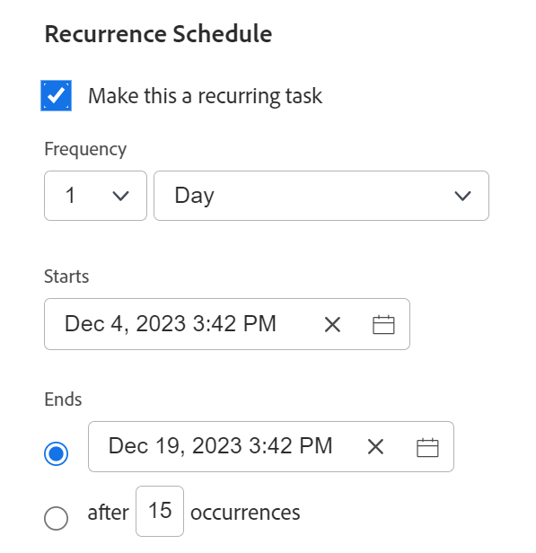

# Skapa återkommande uppgifter

<!--Audited: 01/2024-->

Du kan skapa återkommande uppgifter för uppgifter som du måste upprepa som en del av ett enda projekt.

Allmän information om återkommande aktiviteter, inklusive effekten av att redigera en befintlig återkommande uppgift, finns i [Översikt över återkommande aktiviteter](../../../manage-work/tasks/manage-tasks/recurring-tasks-overview.md).

## Åtkomstkrav

+++ Expandera om du vill visa åtkomstkrav för funktionerna i den här artikeln.

<table style="table-layout:auto"> 
 <col> 
 <col> 
 <tbody> 
  <tr> 
   <td role="rowheader">Adobe Workfront package</td> 
   <td> 
Alla
 </td> 
  </tr> 
  <tr> 
   <td role="rowheader">Adobe Workfront-licens</td> 
   <td> 
Standard
 
   
Arbeta eller högre
 </td> 
  </tr> 
  <tr> 
   <td role="rowheader">Konfigurationer på åtkomstnivå</td> 
   <td> 
Redigera åtkomst till uppgifter och projekt
 </td> 
  </tr> 
  <tr> 
   <td role="rowheader">Objektbehörigheter</td> 
   <td> 
Contribute-behörigheter till projektet med möjlighet att lägga till uppgifter eller högre
 
   
När du skapar en uppgift får du automatiskt behörigheten Hantera för uppgiften
 
    </td> 
  </tr> 
 </tbody> 
</table>

Mer information finns i [Åtkomstkrav i Workfront-dokumentation](/help/quicksilver/administration-and-setup/add-users/access-levels-and-object-permissions/access-level-requirements-in-documentation.md).

+++

<!--Old:

<table style="table-layout:auto"> 
 <col> 
 <col> 
 <tbody> 
  <tr> 
   <td role="rowheader">Adobe Workfront plan*</td> 
   <td> 
Any
 </td> 
  </tr> 
  <tr> 
   <td role="rowheader">Adobe Workfront license*</td> 
   <td> 
New: Standard
 
   
Current: Work or higher
 </td> 
  </tr> 
  <tr> 
   <td role="rowheader">Access level configurations*</td> 
   <td> 
Edit access to Tasks and Projects
 </td> 
  </tr> 
  <tr> 
   <td role="rowheader">Object permissions</td> 
   <td> 
Contribute permissions to the project with ability to Add Tasks or higher
 
   
When you create a task you automatically receive Manage permissions to the task
 
   
 For information about task permissions, see <a href="../../../workfront-basics/grant-and-request-access-to-objects/share-a-task.md" class="MCXref xref">Share a task </a>.
  </td> 
  </tr> 
 </tbody> 
</table>

&#42;To find out what plan, license type, or access you have, contact your Workfront administrator. For more information about access requirements, see [Access requirements in Workfront documentation](/help/quicksilver/administration-and-setup/add-users/access-levels-and-object-permissions/access-level-requirements-in-documentation.md). -->

## Skapa en återkommande uppgift

>[!NOTE]
>
>Du kan inte skapa en återkommande uppgift genom att ändra en befintlig uppgift. Du måste skapa en ny uppgift.

1. Gå till projektet där du vill skapa en återkommande uppgift och klicka sedan på avsnittet **Åtgärder** i den vänstra panelen.
1. Klicka på **Ny aktivitet**.

   Dialogrutan Ny uppgift visas.

   

1. Klicka på **Fler alternativ** och ange ett namn för aktiviteten i fältet **Uppgiftsnamn**.
1. Fortsätt uppdatera aktiviteten på samma sätt som om du lade till en ny uppgift. Mer information om hur du lägger till en ny uppgift finns i [Skapa uppgifter i ett projekt](../../../manage-work/tasks/create-tasks/create-tasks-in-project.md).

   >[!TIP]
   >
   >   Varaktighet och Planerade timmar som anges för en ny återkommande aktivitet är Varaktighet och Planerade timmar för varje förekomst. Den överordnade aktivitetens varaktighet är tiden mellan det planerade startdatumet för den första aktiviteten och det planerade slutförandedatumet för den senaste aktiviteten. Den överordnade uppgiftens planerade timmar är det totala antalet planerade timmar från alla förekomster.

1. Klicka på **Översikt** i den vänstra panelen.
1. Bläddra ned till avsnittet **Återkommande schema** och välj sedan alternativet **Gör detta till en återkommande uppgift**.

   

1. I listrutan **Täthet** väljer du antalet tidsenheter när du vill att uppgiften ska utföras och typen av tidsenheter. Välj bland följande alternativ:

   <table style="table-layout:auto"> 
    <col> 
    <col> 
    <thead> 
     <tr> 
      <th>Upprepningstyp</th> 
      <th>Beskrivning</th> 
     </tr> 
    </thead> 
    <tbody> 
     <tr> 
      <td role="rowheader"><strong>Dag</strong> </td> 
      <td> 
Uppgiften upprepas varannan dag, varannan dag, var tredje dag och så vidare, beroende på vilken gräns du väljer. Du kan konfigurera aktiviteter så att de upprepas upp till var sjätte dag. Standardinställningen är 1 dag. 
 </td> 
     </tr> 
     <tr> 
      <td role="rowheader"><strong>Arbetsdag</strong> </td> 
      <td> 
 Uppgiften upprepas varannan arbetsdag, varannan arbetsdag, var tredje arbetsdag och så vidare, beroende på vilken gräns du väljer. Du kan konfigurera aktiviteter så att de upprepas upp till var sjätte arbetsdag.
 
Det här alternativet använder det standardschema som definieras av systemadministratören, vilket beskrivs i <a href="../../../administration-and-setup/set-up-workfront/configure-timesheets-schedules/create-schedules.md" class="MCXref xref">Skapa ett schema</a>.
 </td> 
     </tr> 
     <tr> 
      <td role="rowheader"><strong>Vecka</strong> </td> 
      <td> 
 Uppgiften upprepas varje vecka, varannan vecka, var tredje vecka och så vidare, beroende på vilken frekvens du väljer.
 
I fältet <strong>Upprepningar</strong> väljer du den dag i veckan då du vill att varje uppgift ska utföras. Du kan välja flera dagar. 
 </td> 
     </tr> 
     <tr> 
      <td role="rowheader"><strong>Månad</strong> </td> 
      <td> 
Uppgiften upprepas varje månad, varannan månad, var tredje månad och så vidare, beroende på vilken frekvens du väljer. Du kan välja mellan 1 och 12 månader. 
 
I fältet <strong>Upprepningar</strong> väljer du bland följande alternativ när du vill att uppgiften ska utföras:
 
       <ul> 
        <li> 
<strong>varje månad den &lt;månadsdatum&gt;</strong> 
 
Du kan välja dagar mellan 1 och 30 eller så kan du välja <strong>senaste</strong>. Du kan till exempel välja "varje månad den 30:e". 
 </li> 
        <li> 
<strong>varje månad den &lt;number&gt; &lt;veckodag&gt;</strong> 
 
I den första listrutan kan du välja ett tal mellan 1 och 4 för veckonumret i månaden eller så kan du välja "senaste". 
 
I den andra listrutan kan du välja vilken veckodag som helst. 
 
Du kan t.ex. välja "varje månad den andra tisdagen". 
 </li> 
       </ul> </td> 
     </tr> 
    </tbody> 
   </table>

   >[!NOTE]
   >
   >Om du har ett schemaundantag associerat med projektets schema kan återkommande aktiviteter inte starta under undantaget. Återkommande aktiviteter som inträffar under schemaundantaget är schemalagda att starta den första arbetsdagen efter undantaget. Mer information om schemaundantag finns i artikeln [Skapa ett schema](../../../administration-and-setup/set-up-workfront/configure-timesheets-schedules/create-schedules.md).

1. I fältet **Börjar** väljer du det datum och den tidpunkt då du vill att de återkommande aktiviteterna ska börja.
1. I fältet **Slutar** väljer du datum och tid när du vill att de återkommande aktiviteterna ska slutföras

   eller

   Välj **efter `<number>` förekomster** för att ange hur många gånger den återkommande aktiviteten ska inträffa. Workfront skapar samma antal återkommande aktiviteter för uppgifterna som det antal du anger i det här fältet.

1. Klicka på **Skapa uppgift.**

   Uppgiftslistan visas. Den återkommande uppgiften skapas som en överordnad uppgift och alla återkommande aktiviteter är dess underordnade. Workfront genererade automatiskt namnen på de underordnade uppgifterna med det namn du angav för den överordnade uppgiften följt av ett nummer. De återkommande uppgifterna placeras i slutet av uppgiftslistan.

   Mer information om vilka fält som fylls i automatiskt från den överordnade återkommande aktiviteten finns i [Översikt över återkommande aktiviteter](../../../manage-work/tasks/manage-tasks/recurring-tasks-overview.md).

   

1. (Valfritt) Ändra varje återkommande uppgift på samma sätt som andra uppgifter i projektet.

   Du kan till exempel lägga till uppdrag, föregående aktiviteter, varaktigheter och ändra annan information om uppgiften, inklusive anpassade fält.

   >[!IMPORTANT]
   >
   >Om du ändrar den överordnade upprepningen efter att de underordnade objekten har ändrats individuellt kan det leda till att informationen skiljer sig mellan de underordnade och den överordnade. Mer information finns i [Översikt över återkommande aktiviteter](../../../manage-work/tasks/manage-tasks/recurring-tasks-overview.md).
