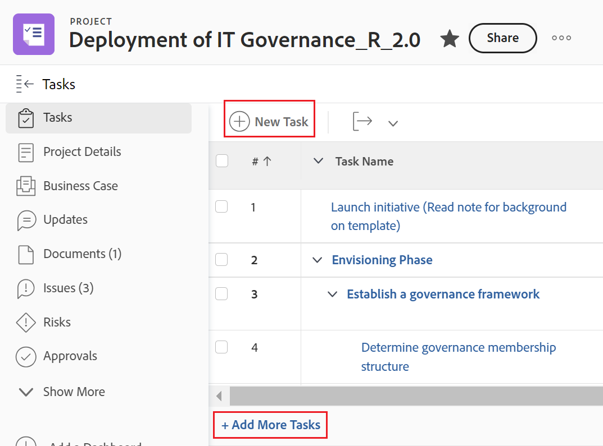

# Skapa uppgifter i ett projekt

<!-- Audited: 10/2024 -->

Du kan skapa uppgifter i Adobe Workfront på följande sätt:

* Skapa en aktivitet i ett projekt från grunden när projektet har skapats.

  När du har skapat ett projekt kan du lägga till uppgifter och ändra dem för att ordna projektplanen. Mer information om hur du skapar ett projekt finns i [Skapa ett projekt](../../../manage-work/projects/create-projects/create-project.md).

* Skapa uppgifter genom att lägga till en mall i ett projekt.

  Mer information finns i [Koppla en mall till ett projekt](/help/quicksilver/manage-work/projects/create-and-manage-templates/attach-template-to-project.md).

* Skapa personliga uppgifter och flytta dem till ett projekt.

  Du kan skapa personliga uppgifter genom att göra något av följande:

   * Skapa en tillfällig arbetsbegäran och skicka den till en användare
   * Skapa en att göra-uppgift i hemområdet

  Mer information om hur du skapar personliga uppgifter som inte finns i ett projekt finns i [Skapa personliga uppgifter](/help/quicksilver/workfront-basics/updating-work-items-and-viewing-updates/create-personal-tasks.md).

  Du kan flytta personliga uppgifter till ett projekt och de blir arbetsuppgifter.

I den här artikeln beskrivs hur du skapar uppgifter från grunden och hur du kan flytta personliga uppgifter till ett projekt.

Du kan också skapa uppgifter på följande sätt:

* Genom att kopiera eller duplicera befintliga uppgifter. Mer information finns i [Kopiera och duplicera uppgifter](../../../manage-work/tasks/manage-tasks/copy-and-duplicate-tasks.md).
* Genom att flytta uppgifter från ett projekt till ett annat. Mer information finns i [Flytta aktiviteter](../../../manage-work/tasks/manage-tasks/move-tasks.md).

## Åtkomstkrav

+++ Expandera om du vill visa åtkomstkrav för funktionerna i den här artikeln.

<table style="table-layout:auto"> 
 <col> 
 <col> 
 <tbody> 
  <tr> 
   <td role="rowheader">Adobe Workfront</td> 
   <td> 
Alla
 </td> 
  </tr> 
  <tr> 
   <td role="rowheader"> 
Adobe Workfront-licens
 </td> 
   <td>
Aktuell: Arbete eller högre
 
   eller
   
Nytt: Standard
 </td> 
  </tr> 
  <tr> 
   <td role="rowheader">Konfigurationer på åtkomstnivå*</td> 
   <td> 
Redigera åtkomst till uppgifter och projekt
</td> 
  </tr> 
  <tr> 
   <td role="rowheader">Objektbehörigheter</td> 
   <td> 
Contribute-behörigheter till projektet med möjlighet att lägga till uppgifter eller högre
 
När du skapar en uppgift får du automatiskt behörigheten Hantera för uppgiften
 
 Mer information om aktivitetsbehörigheter finns i <a href="../../../workfront-basics/grant-and-request-access-to-objects/share-a-task.md" class="MCXref xref">Dela en uppgift </a>. 
 
Mer information om hur du begär ytterligare behörigheter finns i <a href="../../../workfront-basics/grant-and-request-access-to-objects/request-access.md" class="MCXref xref">Begär åtkomst till objekt </a>.
 </td> 
  </tr> 
 </tbody> 
</table>

Mer information om informationen i den här tabellen finns i [Åtkomstkrav i Workfront-dokumentationen](/help/quicksilver/administration-and-setup/add-users/access-levels-and-object-permissions/access-level-requirements-in-documentation.md).

+++

## Skapa uppgifter i ett projekt

1. Gå till det projekt där du vill skapa en uppgift.
1. Klicka på **Åtgärder** i den vänstra panelen.
1. (Villkorligt) Om du visar uppgiftslistan i en flexibel vy klickar du på ikonen **Listvy**  i det övre högra hörnet för att visa uppgiftslistan.
1. (Valfritt) Klicka på ikonen **Planeringsläge**  och välj **Manuell sparning**. Välj sedan antingen **Standard** eller **Tidslinjeplanering**. Detta inaktiverar alternativet **Spara automatiskt** som är aktiverat som standard.

   

   >[!TIP]
   >
   >Du kan ångra ändringarna när du väljer Spara manuellt.

1. Skapa en ny uppgift genom att göra något av följande:

   * Klicka på **Ny aktivitet** överst i uppgiftslistan.
   * Klicka på **Lägg till fler aktiviteter** längst ned i uppgiftslistan.

   

1. (Villkorligt) Om du klickade på **Ny aktivitet** gör du följande:

   1. Ange något av fälten i den begränsade listan med fält i rutan **Ny uppgift** och klicka sedan på **Skapa uppgift** om du snabbt vill skapa en uppgift.

      eller

      Om du vill uppdatera alla fält för uppgiften klickar du på **Fler alternativ** för att öppna rutan **Skapa uppgift** .

      

      Rutan **Skapa uppgift** öppnas.

      

       

      >[!NOTE]
      >
      >Beroende på hur din Workfront-administratör konfigurerar vår layoutmall kan fälten i rutan Skapa uppgift visa olika fält i din miljö. Mer information finns i [Anpassa detaljvyn med hjälp av en layoutmall](../../../administration-and-setup/customize-workfront/use-layout-templates/customize-details-view-layout-template.md).

   1. Ange information för följande områden i den vänstra panelen i rutan Skapa uppgift:

      * Aktivitetsnamn
      * Ökning
      * Uppdrag
      * Anpassad Forms
      * Ekonomi
      * Inställningar

        Mer information om hur du definierar alla uppgiftsrelaterade fält i en uppgift finns i [Redigera uppgifter](../../../manage-work/tasks/manage-tasks/edit-tasks.md).

   1. (Villkorlig och valfri) Om du vill att aktiviteten ska vara återkommande uppdaterar du fältet **Återkommande frekvens**. Mer information om hur du skapar återkommande aktiviteter finns i [Skapa återkommande aktiviteter](../../../manage-work/tasks/create-tasks/create-recurring-tasks.md).
   1. (Valfritt) Klicka på **Dokument** i den vänstra panelen för att bifoga ett dokument till den nya aktiviteten och klicka sedan på **Lägg till eller länka filer** för att lägga till ett dokument till uppgiften från datorn, en annan tjänst eller för att länka dokument och mappar från datorn eller en annan tjänst.

1. (Villkorligt) Om du klickade på **Lägg till fler uppgifter** i steg 5 börjar du ange aktivitetsinformationen med hjälp av redigering online och trycker sedan på Retur.

   <!--
   
(NOTE: ensure this stays accurate)

   -->

   Vi rekommenderar att du använder det här alternativet särskilt när du lägger till flera uppgifter i listan.

   

1. (Villkorligt) Gör något av följande:

   * Om du klickade på **Ny aktivitet** i steg 5 klickar du på **Skapa aktivitet** för att spara ändringarna och lägga till den nya aktiviteten i projektet.

     <!--   
     
(NOTE: is this step still right?)
   
     -->

   * Om du klickade på **Lägg till fler uppgifter** i steg 5 gör du följande:

     <!--   
     
(NOTE: is this step still right?) 
   
     -->

      1. Klicka var som helst i webbläsaren för att skicka ändringarna eller tryck på Retur.
      1. (Valfritt) I uppgiftslistan markerar du den nyligen skapade aktiviteten och klickar sedan på **Indrag**.

         Detta gör den nya uppgiften till en underordnad uppgift eller underuppgift till den föregående uppgiften.

         Mer information om underordnade uppgifter finns i [Skapa underaktiviteter](/help/quicksilver/manage-work/tasks/create-tasks/create-subtasks.md).

      1. (Villkorligt) Om du inaktiverade alternativet **Spara automatiskt** efter att du tryckt på **Lägg till fler uppgifter** kan du göra följande:

         * Klicka på **Ångra** när du vill ångra den senaste ändringen eller **Avbryt** om du vill ångra alla ändringar du har gjort i uppgiftslistan.
         * Om du tidigare klickade på **Ångra** klickar du på **Gör om** för att tillämpa den senaste ändringen som du avbröt.
         * Klicka på **Spara** om du vill spara ändringarna i uppgiftslistan.

## Skapa uppgifter genom att flytta en personlig uppgift till ett projekt

1. (Villkorligt) Se till att du eller andra användare har skapat personliga uppgifter.

   Mer information finns i [Skapa personliga uppgifter](/help/quicksilver/workfront-basics/updating-work-items-and-viewing-updates/create-personal-tasks.md).
1. Skapa ett personligt uppgiftsfilter och tillämpa det på en uppgiftsrapport eller uppgiftslista.

   Mer information finns i [Filtrera: personliga uppgifter](/help/quicksilver/reports-and-dashboards/reports/custom-view-filter-grouping-samples/filter-personal-tasks.md).

   
1. Klicka på ett aktivitetsnamn i den personliga aktivitetsrapporten för att öppna den.

   Workfront sparar personliga uppgifter i ett personligt projekt som inte finns med i listan och som alltid namnges enligt följande mönster: &quot;&lt; Användarens fullständiga namn > Uppgifter. Ett personligt projekt kan till exempel heta &quot;Rick&#39;s Tasks&quot;.

1. Klicka på **Mer-menyn**  på uppgiftssidan och klicka sedan på **Flytta**. Mer information om att flytta uppgifter finns i [Flytta uppgifter](/help/quicksilver/manage-work/tasks/manage-tasks/move-tasks.md).

   När du är klar med att flytta uppgiften visas den i det markerade projektet. Projektets tidslinje kan påverkas av tidslinjen för den nya aktiviteten.
