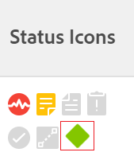

# Koppla milstolpar till uppgifter

<!--Audited: 01/2024-->

Du kan associera milstolpar med uppgifter för att ange när du når viktiga steg i projektets livstid.

## Åtkomstkrav

+++ Expandera om du vill visa åtkomstkrav för funktionerna i den här artikeln.

<table style="table-layout:auto"> 
 <col> 
 <col> 
 <tbody> 
  <tr> 
   <td role="rowheader">Adobe Workfront-plan*</td> 
   <td> 
Alla
 </td> 
  </tr> 
  <tr> 
   <td role="rowheader">Adobe Workfront-licens*</td> 
   <td> 
Ny licens: Standard
 
   
Aktuell licens: Arbeta eller högre
 
   </td> 
  </tr> 
  <tr> 
   <td role="rowheader">Konfigurationer på åtkomstnivå*</td> 
   <td> 
Redigera åtkomst till uppgifter
 
<b>ANMÄRKNING</b>

Om du inte har åtkomst frågar du Workfront-administratören om de anger ytterligare begränsningar för din åtkomstnivå. Mer information om hur en Workfront-administratör kan ändra åtkomstnivån finns i <a href="../../../administration-and-setup/add-users/configure-and-grant-access/create-modify-access-levels.md" class="MCXref xref">Skapa eller ändra anpassade åtkomstnivåer</a>.
 </td>
</tr> 
  <tr> 
   <td role="rowheader">Objektbehörigheter</td> 
   <td> 
Hantera behörigheter för uppgiften
 
Mer information om hur du begär ytterligare åtkomst finns i <a href="../../../workfront-basics/grant-and-request-access-to-objects/request-access.md" class="MCXref xref">Begär åtkomst till objekt </a>.
 </td> 
  </tr> 
 </tbody> 
</table>

Kontakta Workfront-administratören om du vill veta vilken plan, licenstyp eller åtkomst du har.

+++

## Förutsättningar

Innan du kan associera en milstolpe med en uppgift måste följande finnas:

* Workfront-administratören måste skapa en milstolpe-sökväg enligt beskrivningen i [Skapa en milstolpe-sökväg](../../../administration-and-setup/customize-workfront/configure-approval-milestone-processes/create-milestone-path.md).

* Du måste associera en milstolpe-sökväg till ett projekt.

  Mer information finns i [Redigera projekt](/help/quicksilver/manage-work/projects/manage-projects/edit-projects.md).

* Om du vill associera en milstolpe-sökväg med ett projekt måste projektet ha statusen Planering eller Aktuell.

  >[!TIP]
  >
  >För att få bästa möjliga överblick över hur milstolparna i dina projekt utvecklas i vyn Milstolpe bör du skapa överordnade uppgifter och associera dem med varje större fas i projektet. Koppla sedan dessa överordnade uppgifter till var och en av milstolparna i milstolpen.

## Koppla en milstolpe till en uppgift

När en milstolpe-sökväg har associerats med ett projekt kan uppgifter tilldelas en milstolpe.

1. Gå till en aktivitet, klicka på ikonen **Mer**  till höger om aktivitetsnamnet och sedan på **Redigera**.

   Aktiviteter och milstolpar har ett 1:1-förhållande. Du kan inte koppla samma milstolpe till flera uppgifter. Varje aktivitet kan länkas till en enskild milstolpe, eller varje milstolpe kan mappas till en aktivitet.

1. Klicka på **Inställningar** och välj sedan en milstolpe i fältet **Milstolpe** för aktiviteten.
1. Klicka på **Spara**.
1. (Valfritt) Lägg till kolumnen **Statusikoner** i en lista över uppgifter för att identifiera vilka aktiviteter som har milstolpar. Diamantindikatorn för milstolpe visas i kolumnen Statusikoner.

   Mer information finns i [Skapa eller redigera vyer i Adobe Workfront](/help/quicksilver/reports-and-dashboards/reports/reporting-elements/create-edit-views.md).

   

1. (Valfritt) Gå till en lista med projekt och markera vyn **Milstolpe** för att identifiera förloppet för dina milstolpeuppgifter.

   
