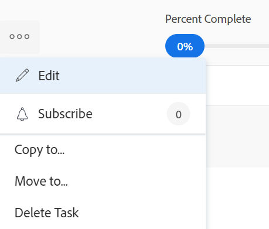

# Kopiera och duplicera uppgifter

Du kan kopiera en uppgift från ett projekt till ett annat projekt, eller så kan du duplicera en uppgift i samma projekt.

Du kan kopiera eller duplicera en eller flera uppgifter eller överordnade uppgifter åt gången.

## Åtkomstkrav

+++ Expandera om du vill visa åtkomstkrav för funktionerna i den här artikeln. 

<table style="table-layout:auto"> 
 <col> 
 <col> 
 <tbody> 
  <tr> 
   <td role="rowheader">Adobe Workfront package</td> 
   <td> 
Alla
 </td> 
  </tr> 
  <tr> 
   <td role="rowheader">Adobe Workfront-licens</td> 
   <td> 
Standard
 
   
Arbeta eller högre
 </td> 
  </tr> 
  <tr> 
   <td role="rowheader">Konfigurationer på åtkomstnivå</td> 
   <td> 
Redigera åtkomst till uppgifter och projekt
</td> 
  </tr> 
  <tr> 
   <td role="rowheader">Objektbehörigheter</td> 
   <td> 
Hantera behörigheter för en uppgift
 
Contribute eller högre behörighet för projektet
 
   </td> 
  </tr> 
 </tbody> 
</table>

Mer information finns i [Åtkomstkrav i Workfront-dokumentation](/help/quicksilver/administration-and-setup/add-users/access-levels-and-object-permissions/access-level-requirements-in-documentation.md).

+++

<!--Old:

<table style="table-layout:auto"> 
 <col> 
 <col> 
 <tbody> 
  <tr> 
   <td role="rowheader">Adobe Workfront plan*</td> 
   <td> 
Any 
 </td> 
  </tr> 
  <tr> 
   <td role="rowheader">Adobe Workfront license*</td> 
   <td> 
Current license: Standard
 
   Or
   
Legacy license: Work or higher 
 </td> 
  </tr> 
  <tr> 
   <td role="rowheader">Access level configurations*</td> 
   <td> 
Edit access to Tasks and Projects
 
<b>NOTE</b>
   
   If you still don't have access, ask your Workfront administrator if they set additional restrictions in your access level. For information on how a Workfront administrator can modify your access level, see <a href="../../../administration-and-setup/add-users/configure-and-grant-access/create-modify-access-levels.md" class="MCXref xref">Create or modify custom access levels</a>.
 </td> 
  </tr> 
  <tr> 
   <td role="rowheader">Object permissions</td> 
   <td> 
Manage permissions to a task
 
Contribute or higher permissions to the project
 
   
For information on requesting additional access, see <a href="../../../workfront-basics/grant-and-request-access-to-objects/request-access.md" class="MCXref xref">Request access to objects </a>.
 </td> 
  </tr> 
 </tbody> 
</table>-->

## Att tänka på vid kopiering av uppgifter

Tänk på följande när du kopierar en uppgift:

* När du kopierar en uppgift från ett projekt till ett annat kan uppgiftsdatumen beräknas om. Omberäkningen tar hänsyn till den tidsplan som det nya projektet använder och projektets Schedule From-information.
* Anpassade formulär kopieras med uppgiften. Informationen i de anpassade fälten överförs endast till de kopierade uppgifterna när du väljer att kopiera anpassade data när du kopierar uppgiften.
* Du kan välja att kopiera vissa objekt som är associerade med uppgiften till den kopierade uppgiften under kopieringsprocessen. Som standard överförs dock inte följande objekt till den kopierade uppgiften:
   * Problem
   * Inloggade timmar
   * Användarkommentarer <!--not sure about this, enable only if requested by users and verified by Product: System activity comments transfer to the new task if they relate to information that you specifically select to be copied. For example, if you select to copy Expenses to the new task, system comments that identify adding expenses to the task will transfer to the copied task. -->
* Följande objekt flyttas som standard till den kopierade uppgiften:

   * Milstolpar överförs till den kopierade aktiviteten och tas bort från den ursprungliga aktiviteten.
   * Underaktiviteter överförs till den nya aktiviteten.

* Du kan kopiera en uppgift åt gången eller kopiera flera uppgifter åt gången när du redigerar uppgifter i en lista.

## Kopiera uppgifter i en lista {#copy-tasks-in-a-list}

1. Gå till det projekt som innehåller uppgiften eller aktiviteterna som du vill kopiera.

   eller

   Gå till en uppgiftsrapport.

1. (Villkorligt) Klicka på **Åtgärder** i den vänstra panelen om du öppnade projektet som innehåller aktiviteterna.
1. Klicka på ikonen **Planeringsläge**  och kontrollera att alternativet **Spara automatiskt** är aktiverat.

   

   >[!IMPORTANT]
   >
   >Du kan bara kopiera uppgifter i en lista när du sparar ändringarna automatiskt. Mer information om hur du sparar alternativ när du redigerar uppgifter finns i [Redigera uppgifter i en lista](../../../manage-work/tasks/manage-tasks/edit-tasks-in-a-list.md).

1. Markera den eller de uppgifter du vill kopiera och gör något av följande:

   * Klicka på menyn **Mer** överst i uppgiftslistan och klicka sedan på **Kopiera till**.
   * Högerklicka på de markerade uppgifterna och klicka sedan på **Kopiera till**.
   * När du markerar en aktivitet klickar du på ikonen **Mer**  bredvid aktivitetsnamnet i listan och sedan på **Kopiera till**.

   

1. Fortsätt med kopieringen av uppgiften enligt beskrivningen i avsnittet [Kopiera en uppgift på aktivitetsnivå](#copy-a-task-at-the-task-level) med början från steg 4.

   <!--
      (NOTE: is this still accurate?!)
   -->

## Kopiera en uppgift på aktivitetsnivå {#copy-a-task-at-the-task-level}

Förutom att kopiera uppgifter i en lista med uppgifter kan du även kopiera en uppgift när du har öppnat den.

1. Hitta en uppgift i ditt Workfront-system genom att söka efter den.
1. Klicka på namnet på uppgiften för att öppna den.
1. Klicka på listrutan **Mer**  bredvid namnet på uppgiften och klicka sedan på **Kopiera till**.

   

   I rutan Kopiera uppgift visas.

1. (Valfritt) Uppdatera **aktivitetsnamnet**.

   >[!TIP]
   >
   >Det här fältet är nedtonat och går inte att redigera när du väljer att kopiera flera uppgifter i en lista. Du kan hålla muspekaren över fältet Uppgiftsnamn så visas en lista med alla markerade uppgifter.
   >
   >

1. Skriv namnet på **målprojektet** där du vill kopiera uppgiften i fältet **Välj målprojekt**.

   >[!TIP]
   >
   >* Projektets namn är skiftlägeskänsligt.
   >* Du kan också börja skriva referensnumret eller ange projektets ID. Detta kan hjälpa dig att skilja mellan projekt med identiska namn.
   >* Endast 100 projekt visas i listan.

   Det aktuella projektnamnet visas som standard. Om du vill kopiera uppgiften inom samma projekt låter du det här fältet vara oförändrat.

1. (Villkorligt) Klicka på **begär åtkomst** för att begära åtkomst till projektet, om du inte har åtkomst till det valda projektet.
1. (Villkorligt) Fortsätt att kopiera uppgiften till det valda målprojektet utan att begära åtkomst om du har åtkomst till att lägga till uppgifter i någon av uppgifterna i målprojektet.

   

   >[!TIP]
   >
   >Liknande meddelanden visas om det valda projektet väntar på godkännande, är slutfört eller inte alls, när Workfront-administratören förhindrar att uppgifter läggs till i dessa projekt. Mer information finns i [Konfigurera systemomfattande projektinställningar](../../../administration-and-setup/set-up-workfront/configure-system-defaults/set-project-preferences.md).

1. Klicka på **Alternativ** i den vänstra panelen och avmarkera sedan de uppgiftsattribut som du inte vill kopiera med uppgiften. Alla alternativ är markerade som standard.

   >[!TIP]
   >
   >Om du markerar och sedan avmarkerar **Markera alla** avmarkeras alla alternativ.

   Avmarkera följande alternativ om du inte vill överföra dem till den kopierade uppgiften. I följande tabell beskrivs vad som händer när alternativen avmarkeras:

   <table style="table-layout:auto"> 
    <col> 
    <col> 
    <tbody> 
     <tr> 
      <td role="rowheader">Begränsning</td> 
      <td> 
Aktivitetsbegränsningen anges till Så snart som möjligt eller Sent som möjligt baserat på inställningen för projektschemaläge.
 
 När du väljer det här alternativet överförs den aktuella begränsningen av uppgiften till den kopierade uppgiften. 
 
Obs! När du flyttar eller kopierar en uppgift med datumspecifika begränsningar till ett annat projekt och villkorsdatumen för aktiviteten ligger utanför datumen för det nya projektet, ändras antingen aktivitetsbegränsningen till Så snart som möjligt eller Så sent som möjligt, eller så justeras datumen för planerad start eller planerad slutförning för projekten. Exempel på datumspecifika begränsningar är Måste starta, Måste sluta den, Starta inte tidigare än, Starta inte senare än, osv. Mer information om uppgiftsbegränsningar och hur aktivitetsbegränsningar eller projektdatum kan påverkas finns i <a href="../../../manage-work/tasks/task-constraints/task-constraint-overview.md" class="MCXref xref">Översikt över aktivitetsbegränsning</a> och sök efter en specifik begränsning.
 </td> 
     </tr> 
     <tr> 
      <td role="rowheader">Uppdrag</td> 
      <td> 
Alla uppdrag tas bort från uppgiften. 
 </td> 
     </tr> 
     <tr> 
      <td role="rowheader">Godkännandeprocess</td> 
      <td>Alla godkännandeprocesser tas bort från uppgiften.</td> 
     </tr> 
     <tr> 
      <td role="rowheader">Förlopp</td> 
      <td>Aktivitetsstatusen är Ny. I annat fall behåller den kopierade uppgiften status för den befintliga uppgiften.</td> 
     </tr> 
     <tr> 
      <td role="rowheader">Ekonomisk information</td> 
      <td>Den ekonomiska informationen för aktiviteten tas bort.</td> 
     </tr> 
     <tr> 
      <td role="rowheader">Alla föregående</td> 
      <td> 
Det innebär att beroenden inte överförs till de kopierade uppgifterna. 
 
När du väljer det här alternativet bevaras föregående aktiviteter i gruppen med kopierade uppgifter, andra tas bort.
 </td> 
     </tr> 
     <tr> 
      <td role="rowheader">Dokument</td> 
      <td> 
Dokumenten som är kopplade till uppgiften överförs inte till den kopierade uppgiften. Detta inkluderar versioner, korrektur och länkade dokument.
 
Detta inkluderar inte dokumentgodkännanden. Dokumentgodkännanden kan aldrig kopieras när en uppgift kopieras.
 </td> 
     </tr> 
     <tr> 
      <td role="rowheader">Påminnelsemeddelanden</td> 
      <td>Påminnelserna för aktiviteten överförs inte till den kopierade aktiviteten. </td> 
     </tr> 
     <tr> 
      <td role="rowheader">Utgifter</td> 
      <td>Utgifterna som är inloggade på uppgiften överförs inte till den kopierade uppgiften. </td> 
     </tr> 
     <tr> 
      <td role="rowheader">Behörigheter</td> 
      <td>Workfront tar bort namnen på alla enheter som visas i delningslistan för uppgiften. </td> 
     </tr> 
     <tr> 
      <td role="rowheader">Anpassade data</td> 
      <td> 
Värdena för de anpassade fälten rensas och de anpassade formulären överförs till den kopierade uppgiften. 
 
När du väljer det här alternativet överförs både formulären och värdena för de anpassade fälten till den kopierade uppgiften. 
 </td> 
     </tr> 
    </tbody> 
   </table>

1. (Valfritt) Klicka på **Markera överordnad** på den vänstra panelen och markera sedan den uppgift i målprojektet som du vill ska vara överordnad den kopierade uppgiften.

   >[!TIP]
   >
   >När du väljer att kopiera flera uppgifter i en lista blir alla markerade uppgifter underordnade den markerade överordnade.

   Välj en överordnad genom att göra något av följande:

   * Välj en av de överordnade i projektplanen i uppgiftslistan.
   * Klicka på sökikonen  och sök efter en överordnad uppgift efter namn.

   Uppgiften visas i listan.

   

1. Markera alternativknappen för den överordnade när du har hittat den.

   Om du inte väljer en överordnad uppgift kopieras uppgifterna som huvuduppgifter i stället för underuppgifter och placeras i slutet av uppgiftslistan i målprojektet.

1. Klicka på **Kopiera uppgift**

   eller

   Klicka på **Kopiera uppgifter** när du markerar flera uppgifter i en lista.
De kopierade aktiviteterna finns nu i det angivna projektet och är antingen underaktiviteter till den valda överordnade aktiviteten eller de sista aktiviteterna i projektet.

## Duplicera uppgifter

Du kan snabbt duplicera en uppgift i en uppgiftslista om du behöver en identisk uppgift i samma projekt.

* [Att tänka på vid duplicering av uppgifter](#considerations-for-duplicating-tasks)
* [Duplicera uppgifter](#duplicate-tasks)

### Att tänka på vid duplicering av uppgifter {#considerations-for-duplicating-tasks}

* Du kan bara duplicera en uppgift i en uppgiftslista när listan sorteras efter uppgiftsnummer.
* Den nya aktiviteten får samma namn som den ursprungliga aktiviteten.
* Du kan inte välja vilken information som ska dupliceras till den nya uppgiften. Nästan all information från den ursprungliga aktiviteten överförs som standard till den duplicerade aktiviteten, inklusive den överordnade relationen.
* Följande objekt överförs inte till den nya uppgiften:

   * Inloggade timmar
   * Anteckningar
   * Problem
   * Endast de föregående som ingår i samma grupp med kopierade uppgifter kopieras också med de efterföljande uppgifterna.

     **EXEMPEL**

     Om du till exempel kopierar Task 2 och dess föregångare, Task 1, samtidigt, får du en kopia av Task 2 och en kopia av Task 1. Kopian av uppgift 1 kommer att vara föregångaren till kopian av uppgift 2. Men om du bara kopierar Task 2 utan att kopiera dess föregångare har kopian ingen föregångare.

* När du duplicerar en överordnad uppgift dupliceras även alla underordnade uppgifter, även när de underordnade uppgifterna inte har markerats.
* Du kan duplicera en eller flera uppgifter samtidigt.

  Du kan dock inte duplicera flera uppgifter som inte är sekventiella samtidigt.

* Milstolpar flyttas till den nya aktiviteten och tas bort från den ursprungliga aktiviteten.

### Duplicera uppgifter

1. Gå till det projekt som innehåller uppgiften eller aktiviteterna som du vill duplicera.
1. Klicka på **Åtgärder** i den vänstra panelen.
1. Gör något av följande:

   * (Villkorligt) Klicka på ikonen **Planera läge**  och kontrollera att alternativet **Spara automatiskt** är aktiverat, markera de uppgifter du vill duplicera och klicka sedan på menyn **Mer**  > **Duplicera** .

     

   * (Villkorligt) Klicka på ikonen **Planera läge**  > **Spara manuellt** > **Standard** eller **Planera tidslinje** och gör sedan följande:

      1. Markera den eller de uppgifter du vill duplicera och klicka på **Duplicera**.
      1. (Valfritt) Klicka på **Ångra** om du vill ångra ändringarna och inte duplicera uppgifterna.
      1. (Valfritt och villkorligt) Klicka på **Gör om** om du tidigare klickat på **Ångra** för att behålla ändringarna och duplicera åtgärderna.

      1. Klicka på **Spara** för att spara ändringarna.

         Uppgifterna dupliceras och läggs till i samma projekt som de ursprungliga uppgifterna.
