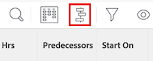

# Översikt över projektets kritiska sökväg

<!-- Audited: 5/2025 -->

Att fastställa ett projekts kritiska sökväg är ett automatiskt sätt för Adobe Workfront att flagga en sekvens av uppgifter i ett projekt som kan påverka projektets tidslinje. Uppgifter som kan påverka projektets tidslinje flaggas som uppgifter för kritisk sökväg.

Följande funktioner kan påverka projektets kritiska väg:

* Projektets arbetsstruktur.

  Mer information finns i [Bestämma struktur för arbetsfördelning i ett projekt](../../../manage-work/projects/planning-a-project/determine-project-work-breakdown-structure.md).

* Den tid (varaktighet) som varje aktivitet tar att slutföra.
* Beroenden mellan aktiviteterna.

  Tänk på följande:

   * När en aktivitet på den kritiska sökvägen har en föregående relation, är dess föregångare och efterföljande också på den kritiska vägen om ändringarna av föregående eller efterföljande datum direkt påverkar deras underordnade.

     >[!TIP]
     >
     >När en uppgifts efterföljande datum inte direkt påverkar datumet för de beroende aktiviteterna eller projektets datum, ligger efterföljande aktivitet inte på den kritiska sökvägen.
     >
     >
     >     >
     >

   * När en underaktivitet identifieras som en kritisk sökvägsuppgift identifieras även den överordnade aktiviteten som en kritisk sökvägsuppgift om det planerade startdatumet och den överordnade aktivitetens tid är samma som underaktivitetens.

Med dessa funktioner i åtanke beräknar systemet den kritiska sökvägen genom att använda den längsta vägen mellan den tidigaste uppgiften och den uppgift som bestämmer projektets slut. Vid beräkning av kritisk sökväg beaktas den tidigaste och senaste gången som varje uppgift kan starta och slutföras utan att projektet blir längre. Den här processen avgör vilka uppgifter som är&quot;kritiska&quot; (och tillhör den längsta banan) och vilka som har&quot;totalt flytande&quot; (kan fördröjas utan att projektet blir längre).

Eventuella förseningar i en uppgiftsaktivitet på den kritiska vägen påverkar direkt projektets planerade slutförandedatum (det finns inget flytande på den kritiska vägen).

## Åtkomstkrav

+++ Expandera om du vill visa åtkomstkrav för funktionerna i den här artikeln.

<table style="table-layout:auto"> 
 <col> 
 <col> 
 <tbody> 
  <tr> 
   <td role="rowheader">Adobe Workfront package</td> 
   <td> 
Alla
 </td> 
  </tr> 
  <tr> 
   <td role="rowheader">Adobe Workfront-licens</td> 
   <td> 
   
Standard

   
Arbeta eller högre

    </td> 
  </tr> 
  <tr> 
   <td role="rowheader">Konfigurationer på åtkomstnivå</td> 
   <td> 
Visa eller öka åtkomsten till uppgifter
</td> 
  </tr> 
  <tr> 
   <td role="rowheader">Objektbehörigheter</td> 
   <td> 
Visa eller högre behörigheter för en uppgift 
</td> 
  </tr> 
 </tbody> 
</table>

Mer information finns i [Åtkomstkrav i Workfront-dokumentation](/help/quicksilver/administration-and-setup/add-users/access-levels-and-object-permissions/access-level-requirements-in-documentation.md).

+++

<!--Old:

<table style="table-layout:auto"> 
 <col> 
 <col> 
 <tbody> 
  <tr> 
   <td role="rowheader">Adobe Workfront plan</td> 
   <td> 
Any
 </td> 
  </tr> 
  <tr> 
   <td role="rowheader">Adobe Workfront license</td> 
   <td> 
   
New: Standard

   
Or

   
Current: Work or higher

    </td> 
  </tr> 
  <tr> 
   <td role="rowheader">Access level configurations</td> 
   <td> 
View or higher access to Tasks
 
Note: If you still don't have access, ask your Workfront administrator if they set additional restrictions in your access level. For information on how a Workfront administrator can modify your access level, see <a href="../../../administration-and-setup/add-users/configure-and-grant-access/create-modify-access-levels.md" class="MCXref xref">Create or modify custom access levels</a>.
 </td> 
  </tr> 
  <tr> 
   <td role="rowheader">Object permissions</td> 
   <td> 
View or higher permissions on a task 
 
For information on requesting additional access, see <a href="../../../workfront-basics/grant-and-request-access-to-objects/request-access.md" class="MCXref xref">Request access to objects </a>.
 </td> 
  </tr> 
 </tbody> 
</table>-->

## Visa den kritiska sökvägen

Du kan visa de uppgifter som hör till den kritiska sökvägen i följande områden i Workfront-programmet:

* [Visa den kritiska sökvägen i Gantt-schemat](#view-the-critical-path-in-the-gantt-chart)
* [Visa den kritiska sökvägen i en uppgiftslista eller rapport](#view-the-critical-path-in-a-task-list-or-report)

### Visa den kritiska sökvägen i Gantt-diagrammet {#view-the-critical-path-in-the-gantt-chart}

Så här visar du uppgifter på den kritiska sökvägen i Gantt-schemat:

{{step1-to-projects}}

1. Välj ett projekt i projektlistan.

1. Klicka på **Åtgärder** i den vänstra panelen. Fliken **Uppgifter** öppnas.

1. Klicka på ikonen **Gantt-schema** i det övre högra hörnet av uppgiftslistan.

   

1. Klicka på ikonen **Alternativ**  i det övre högra hörnet av Gantt-diagramavsnittet och välj sedan alternativet **Kritisk bana** i listrutan som visas. De uppgifter som finns på den kritiska banan har nu en röd linje ovanför tidslinjen.

   

### Visa den kritiska sökvägen i en uppgiftslista eller rapport {#view-the-critical-path-in-a-task-list-or-report}

Så här visar du vilka uppgifter som finns på den kritiska sökvägen i en lista över uppgifter:

{{step1-to-projects}}

1. Välj ett projekt i projektlistan.

1. Klicka på **Åtgärder** i den vänstra panelen. Fliken **Uppgifter** öppnas.

1. Klicka på ikonen **Visa**  och välj sedan **Status** . De åtgärder som finns på den kritiska sökvägen visar en **Kritisk sökväg** -flagga i kolumnen **Flaggor** i listan.

   eller

   Klicka på ikonen **Filter**  och välj sedan **+ Nytt filter**.
1. I det första fältet skriver du *Är kritisk* och markerar den när den visas under avsnittet **Åtgärder** i listan.

   

1. Kontrollera att **Är true** är markerat i den andra listrutan.

   

1. Stäng filterpanelen. I aktivitetslistan visas nu bara uppgifter som finns på den kritiska sökvägen.
