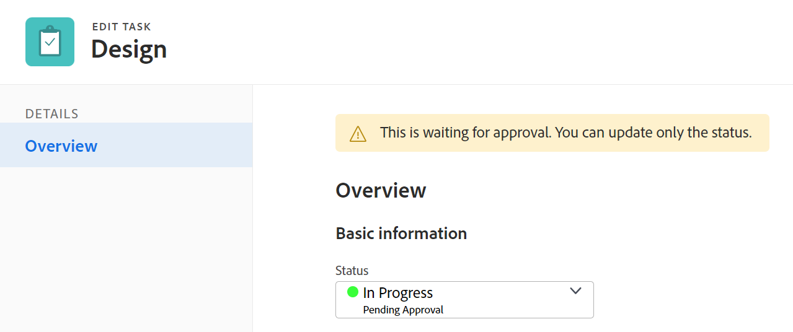
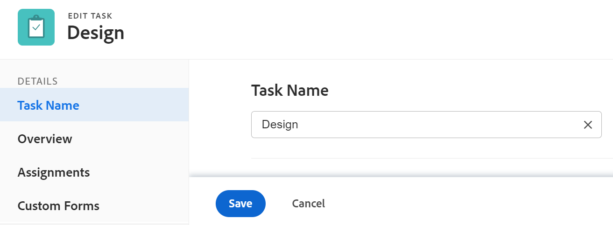
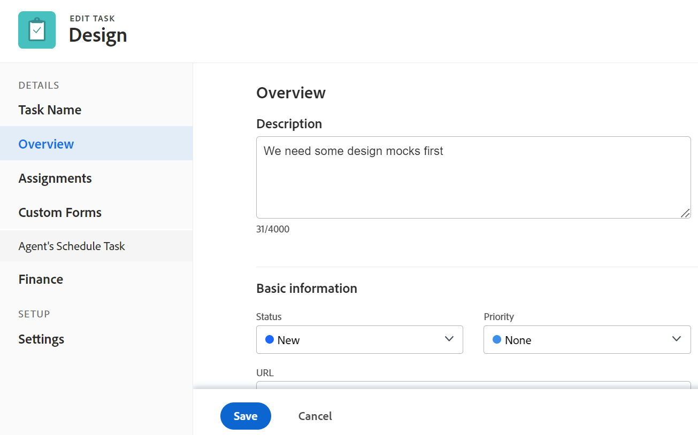
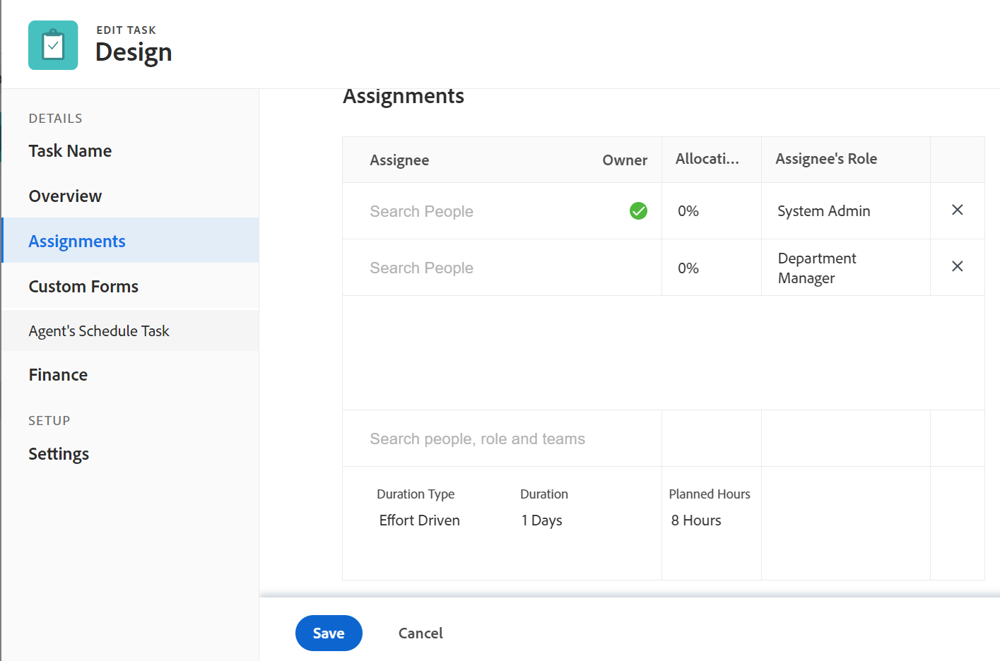
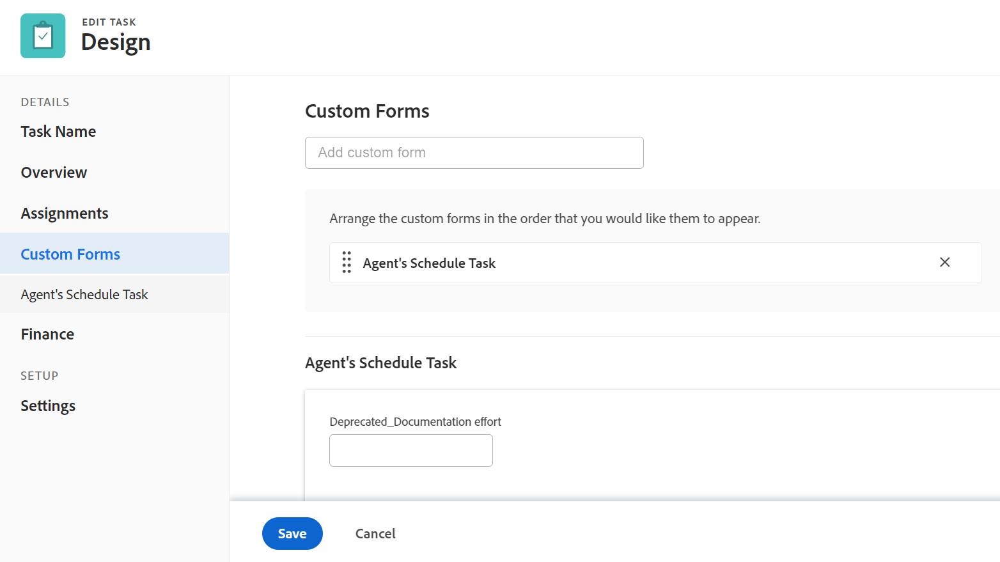
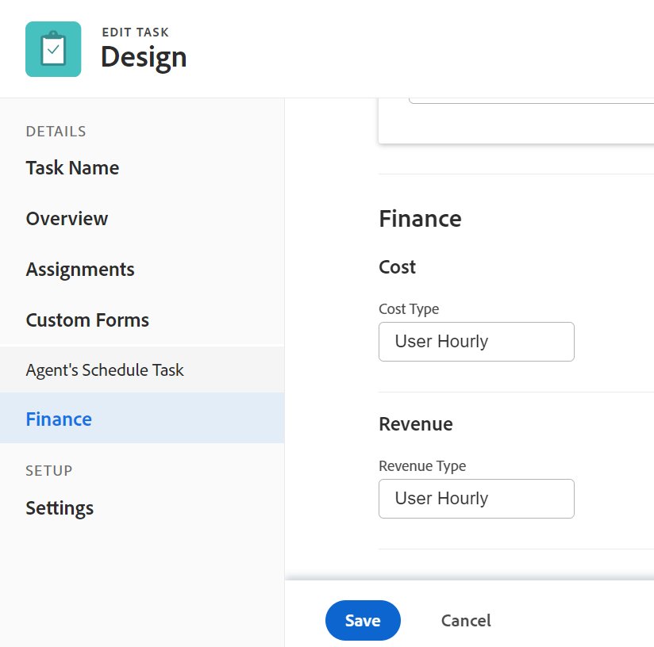
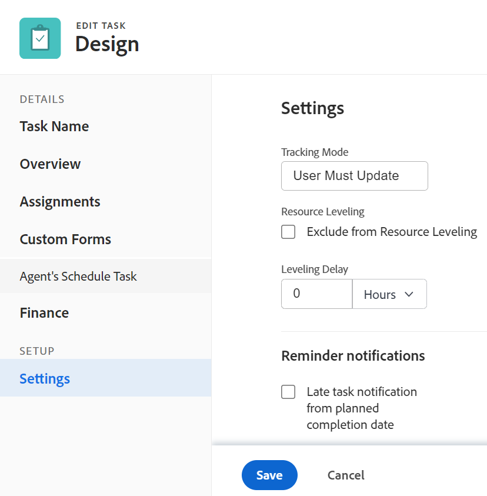
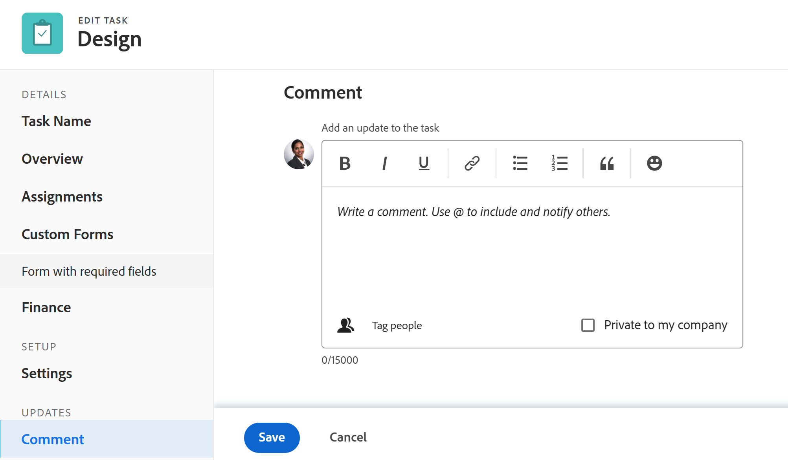

# Redigera uppgifter

<!--Audited: 10/2025-->

<!--take out prod and preview references at release, or new and old experience-->

<!--

(NOTE: some information in this area is repeated in the following articles. If you need to update a field, update it in both:

** Task finances in details

** Task information in overview)

-->

Den markerade informationen på den här sidan avser funktioner som ännu inte är allmänt tillgängliga. Det är bara tillgängligt i förhandsvisningsmiljön för alla kunder. Samma funktioner är också tillgängliga i produktionsmiljön för alla kunder från och med en vecka från förhandsversionen.

Mer information finns i [Översikt över den andra utgåvan av kvartal 2026](/help/quicksilver/product-announcements/product-releases/26-q2-release-activity/26-q2-release-overview.md).

Du kan redigera information om åtgärder som du har skapat eller om du har behörighet att göra det i Contribute eller Hantera.

## Åtkomstkrav

+++ Expandera om du vill visa åtkomstkrav för funktionerna i den här artikeln. 

<table style="table-layout:auto"> 
 <col> 
 <col> 
 <tbody> 
  <tr> 
   <td role="rowheader">Adobe Workfront package</td> 
   <td> 
Alla
 </td> 
  </tr> 
  <tr> 
   <td role="rowheader">Adobe Workfront-licens</td> 
   <td> 
Standard

   
Arbeta eller högre
 </td> 
  </tr> 
  <tr> 
   <td role="rowheader">Åtkomstnivå</td> 
   <td> 
Redigera åtkomst till uppgifter och projekt
 </td> 
  </tr> 
  <tr> 
   <td role="rowheader">Objektbehörigheter</td> 
   <td> 
    <ul> 
     <li> 
Contribute-behörigheter för en uppgift om du vill redigera följande information i området Uppgiftsinformation: 

     <ul>
     <li>Beskrivning</li>
     <li>Status</li>
     </ul>  
      </li> 
     <li> 
Hantera behörigheter för en uppgift för att redigera all information i området Detaljer och i rutan Redigera uppgift
 </li> 
    </ul> 
    <ul> 
     <li> 
Contribute eller högre behörighet för projektet
 </li> 
    </ul> </td> 
  </tr> 
 </tbody> 
</table>

*Mer information finns i [Åtkomstkrav i Workfront-dokumentation](/help/quicksilver/administration-and-setup/add-users/access-levels-and-object-permissions/access-level-requirements-in-documentation.md).

+++

<!--Old:

<table style="table-layout:auto"> 
 <col> 
 <col> 
 <tbody> 
  <tr> 
   <td role="rowheader">Adobe Workfront plan</td> 
   <td> 
Any 
 </td> 
  </tr> 
  <tr> 
   <td role="rowheader">Adobe Workfront license*</td> 
   <td> 
Standard

   
Work or higher
 </td> 
  </tr> 
  <tr> 
   <td role="rowheader">Access level</td> 
   <td> 
Edit access to Tasks and Projects
 </td> 
  </tr> 
  <tr> 
   <td role="rowheader">Object permissions</td> 
   <td> 
    <ul> 
     <li> 
Contribute permissions to a task to edit the following information in the Task Details area: 

     <ul>
     <li>Description</li>
     <li>Status</li>
     </ul>  
      </li> 
     <li> 
Manage permissions to a task to edit all the information in the Details area and the Edit Task box
 </li> 
    </ul> 
    <ul> 
     <li> 
Contribute or higher permissions to the project
 </li> 
    </ul> </td> 
  </tr> 
 </tbody> 
</table>-->

## Begränsningar för redigering av uppgifter

Det finns vissa begränsningar som kan hindra dig från att redigera uppgifter.

Tänk på följande när du redigerar uppgifter:

* När du uppdaterar uppgifter utlöses meddelanden för projekt som har statusen Aktuell. För att undvika förvirring för användare som är tilldelade till aktiviteterna bör du begränsa redigeringsuppgifterna så mycket som möjligt när projektet har statusen Aktuell.
* Du kan inte redigera uppgifter som ingår i en godkännandeprocess. Du kan bara logga tid eller uppdatera status för en aktivitet i en godkännandeprocess.

  

* Du kan bara redigera och lägga till dokument i uppgifter i ett projekt som har statusen Fullständigt, Dölj eller Väntar på godkännande när Workfront-administratören eller en gruppadministratör har aktiverat den här funktionen i området Projektinställningar. Mer information om hur du anger projektinställningar finns i [Konfigurera systemomfattande projektinställningar](../../../administration-and-setup/set-up-workfront/configure-system-defaults/set-project-preferences.md).

* Du kan alltid redigera följande information för en uppgift när projektet har markerats som Slutfört, Dölj eller pågår i en godkännandeprocess:

   * Loggtid
   * Redigera befintliga utgifter
   * Bifoga ett eget formulär

* Andra användare måste uppdatera sina sidor innan de kan visa de uppdateringar du gör för en uppgift.

## Redigera en uppgift i en lista

Du kan redigera aktivitetsinformation i en lista med uppgifter genom att infoga redigeringsfält som visas i vyn för listan.

Mer information om hur du redigerar uppgifter i listor finns i [Redigera uppgifter i en lista](../../../manage-work/tasks/manage-tasks/edit-tasks-in-a-list.md).

## Redigera en uppgift i en lista med hjälp av Sammanfattning

Du kan redigera en uppgift i en lista med hjälp av panelen Sammanfattning. Mer information om hur du redigerar en uppgift i panelen Sammanfattning finns i avsnittet Redigera en uppgift i sammanfattningen i artikeln [Redigera uppgifter i en lista](../../../manage-work/tasks/manage-tasks/edit-tasks-in-a-list.md).

## Redigera en uppgift i rutan Redigera uppgift

Du kan redigera en uppgift i området Redigera uppgift eller Uppgiftsinformation. I följande steg beskrivs hur du redigerar en uppgift i rutan Redigera uppgift.

{{step1-click-main-menu}}

1. Klicka på **Projekt** och sedan på namnet på ett projekt för att öppna det.
1. Klicka på **Åtgärder** i den vänstra panelen.
1. Klicka på den uppgift som du vill redigera.
1. (Villkorligt) Om du vill redigera begränsad information om en aktivitet klickar du på **Uppgiftsinformation** i den vänstra panelen.

   

   Överväg att redigera information i följande områden i avsnittet Uppgiftsinformation:

   * **Översikt**

     Det här området utökas som standard.

   * **Anpassad Forms**

     Namnen på tullformulär visas bara om det finns anpassade formulär kopplade till objektet.

   * **Ekonomi**

   >[!NOTE]
   >
   >Beroende på hur Workfront-administratören eller gruppadministratören ändrade din layoutmall kan det hända att fälten i området Uppgiftsinformation ordnas om eller inte visas. Mer information finns i [Anpassa detaljvyn med hjälp av en layoutmall](../../../administration-and-setup/customize-workfront/use-layout-templates/customize-details-view-layout-template.md).

   Om du vill ha information om de fält som visas i avsnittet Uppgiftsinformation kan du fortsätta redigera uppgiften i rutan Redigera uppgift enligt beskrivningen nedan.

   Så här redigerar du information i detaljavsnittet:

   1. (Valfritt) Klicka på ikonen **Komprimera alla**  i det övre högra hörnet om du vill komprimera alla områden.
   1. (Valfritt och villkorligt) När ett område är komprimerat klickar du på **högerpilen**  bredvid varje område för att expandera det område som du vill redigera.
   1. Mer information om hur du redigerar information på fliken Uppgiftsinformation finns i följande artiklar:

      * [Hantera aktivitetsinformation i området Översikt över aktivitetsinformation](../../../manage-work/tasks/manage-tasks/task-information-in-overview.md)
      * [Hantera aktivitetsfinanser i avsnittet Uppgiftsinformation](../../../manage-work/tasks/manage-tasks/task-finances-in-details.md)

   1. (Valfritt) Om det inte finns några anpassade formulär kopplade till aktiviteten börjar du skriva namnet på ett formulär i fältet **Lägg till anpassat formulär**, markerar det när det visas i listan och klickar sedan på **Spara ändringar**.
   1. (Valfritt) Klicka på ikonen **Exportera**  om du vill exportera översiktsinformation och anpassad formulärinformation till en PDF-fil. Klicka sedan på **Exportera**. Välj bland följande:

      * Markera alla (visas bara när det finns minst ett anpassat formulär bifogat)
      * Översikt
      * Namnet på ett eller flera anpassade formulär

      PDF-filen hämtas till din dator.

      

      Mer information finns i [Exportera anpassade formulär och objektinformation](../../../workfront-basics/work-with-custom-forms/export-custom-forms-details.md).

1. (Villkorligt) Om du vill redigera all information om aktiviteten, som en användare med behörigheten Hantera, klickar du på **Mer**-menyn  bredvid namnet på aktiviteten och sedan på **Redigera**.

   eller

   Välj en åtgärd i en lista med uppgifter och klicka sedan på ikonen **Redigera**  överst i listan.

   Rutan Redigera uppgift öppnas.

   >[!IMPORTANT]
   >
   >Du måste ha behörighet att hantera uppgiften för att kunna se alternativet Redigera.

   Alla uppgiftsfält är tillgängliga i rutan Redigera uppgift och grupperas efter de områden som visas i den vänstra panelen.

   >[!NOTE]
   >
   >Beroende på hur Workfront-administratören eller gruppadministratören ändrade din layoutmall kan det hända att fälten i området Uppgiftsinformation ordnas om eller inte visas. Mer information finns i [Anpassa detaljvyn med hjälp av en layoutmall](../../../administration-and-setup/customize-workfront/use-layout-templates/customize-details-view-layout-template.md).

   Det kan vara bra att ange information i följande avsnitt:

   * [Aktivitetsnamn](#task-name)
   * [Översikt](#overview)
   * [Uppdrag](#assignments)
   * [Anpassad Forms](#Custom%C2%A0F)
   * [Ekonomi](#finance)
   * [Inställningar](#settings)
   * [Kommentar](#comment)

   >[!NOTE]
   >
   >Beroende på hur din Workfront-administratör eller gruppadministratör konfigurerar din layoutmall kan det hända att fälten i rutan Redigera uppgift ordnas om eller inte visas. Mer information finns i [Anpassa detaljvyn med hjälp av en layoutmall](../../../administration-and-setup/customize-workfront/use-layout-templates/customize-details-view-layout-template.md).

### Aktivitetsnamn {#task-name}

1. Börja redigera din uppgift enligt beskrivningen ovan.
1. Klicka på **Uppgiftsnamn** i den vänstra panelen.

   

1. Uppdatera aktivitetens namn.

1. Klicka på **Spara** eller fortsätt med följande avsnitt.

### Översikt {#overview}

1. Börja redigera din uppgift enligt beskrivningen ovan.
1. Klicka på **Översikt** i den vänstra panelen.

   

1. Uppdatera följande information om uppgiften:

   <table style="table-layout:auto"> 
    <col> 
    <col> 
    <tbody> 
     <tr> 
      <td role="rowheader">Beskrivning</td> 
      <td>Lägg till ytterligare information om uppgiften. </td> 
     </tr> 
     <tr> 
      <td colspan="2" role="rowheader">Grundläggande informationsavsnitt </td> 
     </tr> 
     <tr> 
      <td role="rowheader">Status</td> 
      <td> 
Välj status för uppgiften som anger i vilket utvecklingsstadium uppgiften befinner sig.
 
<b>TIPS</b>

   Du kan uppdatera aktivitetsstatus i uppgiftshuvudet. 

   
Din Workfront- eller gruppadministratör kan anpassa namnen på uppgiftsstatusvärdena. Mer information finns i <a href="/help/quicksilver/administration-and-setup/customize-workfront/creating-custom-status-and-priority-labels/create-or-edit-a-status.md">Skapa eller redigera en status</a>. 
      </td> 
     </tr> 
     <tr> 
      <td role="rowheader">Prioritet</td> 
      <td> 
Det här är en visuell flagga som gör att du kan prioritera dina uppgifter. 
 
Välj bland följande alternativ: 
 
       <ul> 
      <li> 
 Ingen
 </li> 
      <li> 
 Låg 
 </li> 
      <li> 
Normal 
 </li> 
      <li> 
Hög 
 </li> 
      <li> 
 Urgent 
 </li> 
       </ul> 
Beroende på vilka projektinställningar du har valt av Workfront-administratören kan prioritetsnamnen vara olika för dig. Mer information om aktivitetsprioriteter finns i <a href="../../../manage-work/tasks/task-information/task-priority.md" class="MCXref xref">Uppdatera aktivitetsprioritet</a>. 
 </td> 
     </tr> 
     <tr> 
      <td colspan="2" role="rowheader">Avsnittet Uppgiftsdatum och -begränsningar </td> 
     </tr> 
     <tr> 
      <td role="rowheader">Aktivitetsbegränsning</td> 
      <td> 
Bestäm när uppgiften ska slutföras genom att ange en aktivitetsbegränsning. 
 
Välj bland följande alternativ: 
 
       <ul> 
      <li> 
Fasta datum 
 
Ange en <strong>planerad start</strong> och ett <strong>planerat slutförandedatum</strong>. 
 </li> 
      <li> 
måste börja  
 
Ange ett <strong>planerat startdatum</strong>. 
 </li> 
      <li> 
Måste avslutas  
 
Ange ett <strong>planerat slutförandedatum</strong>. 
 </li> 
       </ul> 
       <ul> 
      <li> 
Så snart som möjligt
 </li> 
      <li> 
Så sent som möjligt
 </li> 
      <li> 
Tidigaste tillgängliga tid
 </li> 
      <li> 
 Senaste tillgängliga tid
 </li> 
      <li> 
Starta inte senare än 
 </li> 
      <li> 
Ange ett planerat startdatum
 </li> 
      <li> 
Starta inte tidigare än  
 
Ange ett <strong>planerat startdatum</strong>. 
 </li> 
      <li> 
 Avsluta inte senare än 
 
Ange ett <strong>planerat slutförandedatum</strong>. 
 </li> 
      <li> 
 Avsluta inte tidigare än 
 
Ange ett <strong>planerat slutförandedatum</strong>
 </li> 
       </ul> 
Mer information om uppgiftsbegränsning finns i <a href="../../../manage-work/tasks/task-constraints/task-constraint-overview.md" class="MCXref xref">Översikt över uppgiftsbegränsning</a>.
 </td> 
     </tr> 
     <tr> 
      <td role="rowheader">Bekräfta datum och tid</td> 
      <td> 
Detta är det datum då användaren som tilldelats uppgiften åtar sig att slutföra den. Detta kan skilja sig från det planerade slutförandedatumet. Endast tilldelningar kan redigera det här fältet. Mer information om implementeringsdatum i Workfront finns i <a href="../../../manage-work/projects/updating-work-in-a-project/overview-of-commit-dates.md" class="MCXref xref">Genomför datumöversikt</a>. 
 </td> 
     </tr> 
     <tr> 
      <td role="rowheader">Planerat startdatum och starttid</td> 
      <td> 
När aktiviteten är planerad att starta. Det planerade startdatumet för en uppgift anges och påverkas av ett antal faktorer:
 
       <ul> 
      <li>Beroende på den systemomfattande inställningen för det planerade startdatumet för aktiviteten kan startdatumet för en ny aktivitet i ett projekt antingen vara idag eller startdatumet för projektet som standard. Gruppadministratören för den grupp som är associerad med projektet kan också ange den här inställningen för gruppen. Mer information om aktivitetsinställningar på systemnivå eller gruppnivå finns i <a href="../../../administration-and-setup/set-up-workfront/configure-system-defaults/set-task-issue-preferences.md" class="MCXref xref">Konfigurera inställningar för aktiviteter och problem i hela systemet</a>.</li> 
      <li>Beroende på vad som föregår uppgiften väljs det planerade startdatumet av Workfront som nästa tillgängliga datum efter att föregående aktiviteter har slutförts, eller startats, beroende på vilket förhållande som föregick aktiviteten. Mer information om föregående relationer finns i <a href="../../../manage-work/tasks/use-prdcssrs/predecessors-overview.md" class="MCXref xref">Översikt över föregående aktiviteter</a>.</li> 
      <li>Projektledaren eller aktivitetsägaren kan manuellt ange det planerade startdatumet när aktivitetsbegränsningen är antingen Fast datum eller Måste starta på. Mer information om uppgiftsbegränsningar finns i <a href="../../../manage-work/tasks/task-constraints/task-constraint-overview.md" class="MCXref xref">Översikt över uppgiftsbegränsning</a>.</li> 
       </ul> </td> 
     </tr> 
     <tr> 
      <td role="rowheader">Planerat slutförandedatum och tid</td> 
      <td> 
Det förväntade slutförandedatumet som visas när aktiviteten är planerad. Workfront anger det planerade slutförandedatumet med hjälp av några av följande faktorer:
 
       <ul> 
      <li>Det planerade slutförandedatumet beräknas från det planerade startdatumet genom att lägga till aktivitetens varaktighet till det planerade startdatumet. När projektledaren eller Workfront anger aktivitetens varaktighet utlöses en uppdatering av det planerade slutförandedatumet. Om det planerade datumet ändras beror det ofta på att aktivitetens varaktighet har uppdaterats.</li> 
      <li>Projektledaren eller aktivitetsägaren kan manuellt ange det planerade slutförandedatumet när aktivitetsbegränsningen är Fast datum eller Måste avslutas den. Mer information om uppgiftsbegränsningar finns i <a href="../../../manage-work/tasks/task-constraints/task-constraint-overview.md" class="MCXref xref">Översikt över uppgiftsbegränsning</a>.</li> 
      <li>Om aktivitetens varaktighetstyp ändras och antalet resurser på aktiviteterna ändras samtidigt, ändras även det planerade slutförandedatumet. Mer information om varaktighetstyper finns i <a href="../../../manage-work/tasks/taskdurtn/task-duration-and-duration-type.md" class="MCXref xref">Översikt över aktivitetsvaraktighet och varaktighetstyp</a>.</li> 
       </ul> </td> 
     </tr> 
     <tr> 
      <td role="rowheader">Faktiskt startdatum och -tid</td> 
      <td> 
Ange ett faktiskt startdatum för aktiviteten. Standardvärdet fylls i automatiskt när du ändrar aktivitetens status till Pågår. Det faktiska startdatumet kan även ändras manuellt av projektledaren eller aktivitetsägaren. 
 </td> 
     </tr> 
     <tr> 
      <td role="rowheader">Faktiskt slutförandedatum och -tid</td> 
      <td> 
Ange det faktiska datumet och den faktiska tiden när uppgiften slutförs. Standarddatumet och standardtiden när en uppgift slutförs sammanfaller alltid med den faktiska tiden när statusen blir Slutförd. Det faktiska slutförandedatumet kan även ändras manuellt av projektledaren eller aktivitetsägaren. 
 </td> 
     </tr> 
     <tr> 
      <td role="rowheader"><b>Avsnittet Arbetstid</b></td> 
     </tr> 
     <tr> 
      <td role="rowheader">Arbetsinsats </td> 
      <td>

   
Den mängd arbete som krävs för att slutföra uppgiften. Projektledaren kan välja att använda det här fältet i stället för Planerade timmar för att beräkna hur mycket arbete som krävs för att slutföra en uppgift. Det här fältet är bara synligt när följande villkor är uppfyllda:
 
      <ul> 
      <li> 
Aktiviteten har en enkel varaktighetstyp. 
 
<b>TIPS</b>

   Om du ändrar uppgiftens varaktighet, tonas det här fältet ned. 
 </li>
   <li>Projektledaren har aktiverat fältet Använd arbetsinsats för att automatiskt beräkna aktivitetsplanerade timmar i projektet. </li> 
      </ul> 
      
Välj bland följande alternativ:
 
      <ul> 
      <li>Liten</li> 
      <li>Medium  (det här är standardvärdet för en ny aktivitet)</li> 
      <li>Stor</li> 
      </ul> 
      
<b>ANMÄRKNING</b>

   Om du uppdaterar mängden arbetsinsats kan aktivitetens planerade timmar uppdateras. Uppdateringen görs omedelbart om projektets uppdateringstyp är Automatisk. När projektets uppdateringstyp är Manuell måste du beräkna om tidslinjen för att se de uppdaterade planerade timmarna. 

   
Mer information om hur du använder Arbetsinsats i stället för Planerade timmar för att beräkna aktivitetsinsats finns i <a href="../../../manage-work/tasks/task-information/work-effort.md" class="MCXref xref">Översikt över arbetsinsats</a>. 
 
    </td> 
     </tr> 
    </tbody> 
   </table>

1. Klicka på **Spara** eller fortsätt med följande avsnitt.

### Uppdrag {#assignments}

Det är olika att redigera uppdrag i rutan Redigera uppgift beroende på vilken miljö du väljer.

#### Redigera uppdragsområdet i produktionsmiljön

>[!NOTE]
>
>Vissa kunder kan redigera uppdrag i rutan Redigera uppgift i sina produktionsmiljöer på samma sätt som de redigerar dem i sin förhandsvisningsmiljö.
>
>Mer information om hur du redigerar uppgifter i förhandsvisningsmiljön finns i avsnittet [Redigera uppdragsområdet i förhandsvisningsmiljön](#edit-the-assignments-area-in-the-preview-environment) i den här artikeln. 

1. Börja redigera din uppgift enligt beskrivningen ovan.
1. Klicka på **Uppdrag** i den vänstra panelen.

   Området Uppdrag öppnas i den nya upplevelsen.

1. (Villkorligt) Gör följande när du använder den nya funktionen:

   1. Börja skriva namnet på en användare, jobbroll eller team i fältet **Sök efter personer, roller eller team** och markera dem sedan när de visas i listan

      eller

      Klicka på **Tilldela mig** för att tilldela uppgiften till dig själv.

   1. Uppdatera följande information:

      <table style="table-layout:auto"> 
         <col> 
         <col> 
         <tbody> 
         <tr> 
         <td role="rowheader">Varaktighetstyp</td> 
         <td> 
Detta identifierar relationen mellan följande: 
 
         <ul> 
         <li> 
Antalet resurser som tilldelats en aktivitet 
 </li> 
         <li> 
Den totala arbetsinsats som krävs för att slutföra uppgiften 
 </li> 
         <li> 
 Aktivitetens totala varaktighet. 
 </li> 
         </ul> 
Workfront-administratören eller en gruppadministratör väljer standardinställningen för varaktighetstyp för uppgifterna i ditt system eller din grupp. Mer information om hur du anger standardinställningar för projekt finns i <a href="../../../administration-and-setup/set-up-workfront/configure-system-defaults/set-task-issue-preferences.md" class="MCXref xref">Konfigurera systemomfattande uppgifter och inställningar för problem</a>. 
 
Med varaktighetstyper kan du ange konsekventa resurstilldelningar baserat på uppgiftens behov. Mer information om varaktighetstypen för en aktivitet finns i <a href="../../../manage-work/tasks/taskdurtn/task-duration-and-duration-type.md" class="MCXref xref">Översikt över aktivitetsvaraktighet och varaktighetstyp</a>. 
 
Välj bland följande alternativ: 
 
         <ul> 
         <li> 
Beräknad tilldelning 
 </li> 
         <li> 
 Beräknat arbete 
 </li> 
         <li> 
Ansträngningsstyrd 
 </li> 
         <li> 
Enkel
 </li> 
         </ul> </td> 
         </tr> 
         <td role="rowheader">Varaktighet per förekomst</td> 
         <td> 
Detta visas endast på den överordnade för återkommande uppgifter. Den visar varaktigheten för varje återkommande uppgift, enligt definition när uppgiften skapades. Mer information om hur du skapar återkommande aktiviteter finns i <a href="../../../manage-work/tasks/create-tasks/create-recurring-tasks.md" class="MCXref xref">Skapa återkommande aktiviteter</a>. 
 
 <b>OBS!</b>          
         Varaktigheter som ändras i enskilda återkommande aktiviteter visar inte det värde som anges i det här fältet. 
 </td> 
         </tr>
         <tr> 
         <td role="rowheader">Varaktighet</td> 
         <td> 
         
 
         
 
         
Det här är den tid som du tillåter att en uppgift förblir öppen innan den är slutförd. 
 
         
<b>VIKTIGT</b>

      Eftersom aktivitetens varaktighet vanligtvis är tiden mellan planerad start och planerad slutförandetid, påverkar det tidslinjen för projektet.

      
Så här anger du aktivitetens varaktighet och tidsenhet:
 
         <ul> 
         <li> 
Skriv in tidslängden och välj en tidsenhet i listrutan.
 
<b>TIPS</b>

         När du uppdaterar varaktigheten för uppgifter i en uppgiftslista kan du använda förkortningen för tidsenheten. 
 </li> 
         </ul> 
         
 Du kan välja mellan alternativen för normal tid eller förfluten tid i följande tabell: 
 
         <table style="table-layout:auto"> 
         <col> 
         <col data-mc-conditions=""> 
         <tbody> 
         <tr> 
         <td>Tidsenhet</td> 
         <td>Förkortning</td> 
         </tr> 
         <tr> 
         <td>Minuter</td> 
         <td>M</td> 
         </tr> 
         <tr> 
         <td>Timmar</td> 
         <td>H</td> 
         </tr> 
         <tr> 
         <td>Dagar. Det här är standardinställningen. </td> 
         <td>D</td> 
         </tr> 
         <tr> 
         <td>Veckor</td> 
         <td>B</td> 
         </tr> 
         <tr> 
         <td>Månader</td> 
         <td>T</td> 
         </tr> 
         <tr> 
         <td>Förflutna minuter</td> 
         <td>EM</td> 
         </tr> 
         <tr> 
         <td>Förflutna timmar</td> 
         <td>EH</td> 
         </tr> 
         <tr> 
         <td>Förflutna dagar</td> 
         <td>ED</td> 
         </tr> 
         <tr> 
         <td>Förflutna veckor</td> 
         <td>FV</td> 
         </tr> 
         <tr> 
         <td>Förflutna månader</td> 
         <td>ET</td> 
         </tr> 
         </tbody> 
         </table>

      
<b>ANMÄRKNING</b>

      
Förfluten tid är en tidsenhet för en uppgifts varaktighet. Det är tiden mellan det planerade startdatumet och det planerade slutförandedatumet för en aktivitet som omfattar helger, helger och ledig tid. Med andra ord är förfluten tid en del av kalenderdagarna.

      Med normal tid räknas helger, helger och ledig tid som undantag från uppgiftens varaktighet. Mer information om aktivitetens varaktighet finns i <a href="../../../manage-work/tasks/taskdurtn/task-duration-and-duration-type.md" class="MCXref xref">Översikt över aktivitetsvaraktighet och varaktighetstyp</a>. 

      </td> 
         </tr> 
         <tr> 
         <td role="rowheader">Planerade timmar</td> 
         <td> 
Ange antalet planerade timmar för aktiviteten, i timmar. Detta är den faktiska tid det skulle ta för de som tilldelats uppgiften att slutföra den. Du kan bara ange antalet planerade timmar för en aktivitet när varaktighetstypen är inställd på Beräknad tilldelning. Mer information om varaktighetstyper finns i <a href="../../../manage-work/tasks/taskdurtn/task-duration-and-duration-type.md" class="MCXref xref">Översikt över aktivitetsvaraktighet och varaktighetstyp</a>.
 
         <b>OBS!</b>
         

         När du skapar återkommande uppgifter är de planerade timmarna för varje förekomst. De planerade timmarna för de överordnade uppgifterna är det totala antalet planerade timmar från alla förekomster. Mer information om hur du skapar återkommande aktiviteter finns i <a href="../../../manage-work/tasks/create-tasks/create-recurring-tasks.md" class="MCXref xref">Skapa återkommande aktiviteter</a>.
         

      </td> 
         </tr> 
         </tbody> 
         </table>

      <!--<tr> 
      <td role="rowheader">Allocation</td> 
      <td> 
If your Task Constraint is Calculated Work or Effort Driven, specify the <strong>Allocation %</strong> (allocation percentage) for each assignee. This is the amount of time from the schedule of the assignee that they can spend on this task. Changing the allocation percentage for an assignee will change the Planned Hours of a task. 
 
When the Task Constraint is Simple, you can specify the following:
 
         <ul> 
         <li> 
Allocation Hours of each assignee.
 </li> 
         <li> 
Planned Hours of the task
 </li> 
         <li> 
Duration of the task
 </li> 
         </ul> </td> 
      </tr> 
      <tr> 
      <td role="rowheader">Assignee's Role</td> 
      <td> 
Select a role from the <strong>Assignee's Role</strong> drop-down menu when you selected a person as an assignee. This is the role that the assignee can fulfill on this task. 
 
<b>TIP</b>
         Only the job roles associated with each assignee in their profile appear in the drop-down menu.
 </td> 
         </tr>
         </tbody> 
         </table>-->

   1. (Valfritt) Klicka på **Byt till gammal upplevelse** längst ned i rutan **Redigera uppgift**.
Uppdragsområdet öppnas i den gamla versionen.

      

1. (Villkorligt) Gör följande när du använder den gamla funktionen:

   1. Klicka på **Sök efter personer, roller eller team** och börja skriva namnet på en användare, roll eller team som du vill tilldela uppgiften. Klicka sedan på den eller tryck på Retur när den visas i listan.

      >[!TIP]
      >
      >* Om användarens namn innehåller ett specialtecken måste du inkludera specialtecknet i sökfältet.
      >* Du kan tilldela flera användare, jobbroller eller team. Du kan bara tilldela aktiva användare, jobbroller och team.
      >
      >* Om en användare, jobbroll eller ett team tilldelades innan de inaktiverades, förblir de tilldelade till arbetsuppgiften. I det här fallet rekommenderar vi följande:
      >
      >* Tilldela om arbetsuppgiften till aktiva resurser.
      >* Associera användarna i ett inaktiverat team med ett aktivt team och omfördela arbetsposten till det aktiva teamet.

   1. (Valfritt) Hovra över en tilldelad persons namn och klicka sedan på **Gör primär** för att ange om en tilldelad är den primära tilldelaren eller ägaren av uppgiften. Ett team kan inte vara den primära tilldelaren för en uppgift.
   1. (Valfritt) Uppdatera följande fält:

      <table style="table-layout:auto"> 
      <col> 
      <col> 
      <tbody> 
      <tr> 
         <td role="rowheader">Varaktighetstyp</td> 
         <td> 
Detta identifierar relationen mellan följande: 
 
         <ul> 
         <li> 
Antalet resurser som tilldelats en aktivitet 
 </li> 
         <li> 
Den totala arbetsinsats som krävs för att slutföra uppgiften 
 </li> 
         <li> 
 Aktivitetens totala varaktighet. 
 </li> 
         </ul> 
Workfront-administratören eller en gruppadministratör väljer standardinställningen för varaktighetstyp för uppgifterna i ditt system eller din grupp. Mer information om hur du anger standardinställningar för projekt finns i <a href="../../../administration-and-setup/set-up-workfront/configure-system-defaults/set-task-issue-preferences.md" class="MCXref xref">Konfigurera systemomfattande uppgifter och inställningar för problem</a>. 
 
Med varaktighetstyper kan du ange konsekventa resurstilldelningar baserat på uppgiftens behov. Mer information om varaktighetstypen för en aktivitet finns i <a href="../../../manage-work/tasks/taskdurtn/task-duration-and-duration-type.md" class="MCXref xref">Översikt över aktivitetsvaraktighet och varaktighetstyp</a>. 
 
Välj bland följande alternativ: 
 
         <ul> 
         <li> 
Beräknad tilldelning 
 </li> 
         <li> 
 Beräknat arbete 
 </li> 
         <li> 
Ansträngningsstyrd 
 </li> 
         <li> 
Enkel
 </li> 
         </ul> </td> 
      </tr> 
      <tr data-mc-conditions="QuicksilverOrClassic.Quicksilver"> 
         <td role="rowheader">Varaktighet per förekomst</td> 
         <td> 
Detta visas endast på den överordnade för återkommande uppgifter. Den visar varaktigheten för varje återkommande uppgift, enligt definition när uppgiften skapades. Mer information om hur du skapar återkommande aktiviteter finns i <a href="../../../manage-work/tasks/create-tasks/create-recurring-tasks.md" class="MCXref xref">Skapa återkommande aktiviteter</a>. 
 
 <b>OBS!</b>

      Varaktigheter som ändras i enskilda återkommande aktiviteter visar inte det värde som anges i det här fältet. 
 </td>
      </tr> 
      <tr> 
         <td role="rowheader">Varaktighet</td> 
         <td> 
         
 
         
 
         
Det här är den tid som du tillåter att en uppgift förblir öppen innan den är slutförd. 
 
         
<b>VIKTIGT</b>

      Eftersom aktivitetens varaktighet vanligtvis är tiden mellan planerad start och planerad slutförandetid, påverkar det tidslinjen för projektet.

      
Så här anger du aktivitetens varaktighet och tidsenhet:
 
         <ul> 
         <li> 
Skriv in tidslängden och välj en tidsenhet i listrutan.
 
<b>TIPS</b>

         När du uppdaterar varaktigheten för uppgifter i en uppgiftslista kan du använda förkortningen för tidsenheten. 
 </li> 
         </ul> 
         
 Du kan välja mellan alternativen för normal tid eller förfluten tid i följande tabell: 
 
         <table style="table-layout:auto"> 
         <col> 
         <col data-mc-conditions=""> 
         <tbody> 
         <tr> 
         <td>Tidsenhet</td> 
         <td>Förkortning</td> 
         </tr> 
         <tr> 
         <td>Minuter</td> 
         <td>M</td> 
         </tr> 
         <tr> 
         <td>Timmar</td> 
         <td>H</td> 
         </tr> 
         <tr> 
         <td>Dagar. Det här är standardinställningen. </td> 
         <td>D</td> 
         </tr> 
         <tr> 
         <td>Veckor</td> 
         <td>B</td> 
         </tr> 
         <tr> 
         <td>Månader</td> 
         <td>T</td> 
         </tr> 
         <tr> 
         <td>Förflutna minuter</td> 
         <td>EM</td> 
         </tr> 
         <tr> 
         <td>Förflutna timmar</td> 
         <td>EH</td> 
         </tr> 
         <tr> 
         <td>Förflutna dagar</td> 
         <td>ED</td> 
         </tr> 
         <tr> 
         <td>Förflutna veckor</td> 
         <td>FV</td> 
         </tr> 
         <tr> 
         <td>Förflutna månader</td> 
         <td>ET</td> 
         </tr> 
         </tbody> 
      </table>

      
<b>ANMÄRKNING</b>

      
Förfluten tid är en tidsenhet för en uppgifts varaktighet. Det är tiden mellan det planerade startdatumet och det planerade slutförandedatumet för en aktivitet som omfattar helger, helger och ledig tid. Med andra ord är förfluten tid en del av kalenderdagarna.

      Med normal tid räknas helger, helger och ledig tid som undantag från uppgiftens varaktighet. Mer information om aktivitetens varaktighet finns i <a href="../../../manage-work/tasks/taskdurtn/task-duration-and-duration-type.md" class="MCXref xref">Översikt över aktivitetsvaraktighet och varaktighetstyp</a>. 

      
 
         
 </td> 
         </tr> 
         <tr> 
         <td role="rowheader">Planerade timmar</td> 
         <td> 
Ange antalet planerade timmar för aktiviteten, i timmar. Detta är den faktiska tid det skulle ta för de som tilldelats uppgiften att slutföra den. Du kan bara ange antalet planerade timmar för en aktivitet när varaktighetstypen är inställd på Beräknad tilldelning. Mer information om varaktighetstyper finns i <a href="../../../manage-work/tasks/taskdurtn/task-duration-and-duration-type.md" class="MCXref xref">Översikt över aktivitetsvaraktighet och varaktighetstyp</a>.
 
         <b>OBS!</b>
         

         När du skapar återkommande uppgifter är de planerade timmarna för varje förekomst. De planerade timmarna för de överordnade uppgifterna är det totala antalet planerade timmar från alla förekomster. Mer information om hur du skapar återkommande aktiviteter finns i <a href="../../../manage-work/tasks/create-tasks/create-recurring-tasks.md" class="MCXref xref">Skapa återkommande aktiviteter</a>.
         

      </td> 
         </tr> 
         <tr> 
         <td role="rowheader">Allokering</td> 
         <td> 
Om aktivitetsbegränsningen är Beräknad arbets- eller insatsstyrd anger du <strong>Allokering %</strong> (allokeringsprocent) för varje tilldelad. Det här är den tid från schemat för den tilldelande personen som de kan lägga på den här aktiviteten. Om du ändrar allokeringsprocenten för en tilldelad ändrar du planerad tid för en uppgift. 
 
När aktivitetsbegränsningen är enkel kan du ange följande:
 
            <ul> 
            <li> 
Allokeringstimmar för varje tilldelad.
 </li> 
            <li> 
Planerade timmar för uppgiften
 </li> 
            <li> 
Uppgiftens varaktighet
 </li> 
            </ul> </td> 
         </tr> 
         <tr> 
         <td role="rowheader">Uppdragarens roll</td> 
         <td> 
Välj en roll i listrutan <strong>Tilldelarens roll</strong> när du har valt en person som tilldelad. Detta är den roll som den som tilldelas kan utföra den här uppgiften. 
 
<b>TIPS</b>

      Endast de jobbroller som är kopplade till varje tilldelad i deras profil visas i listrutan.
 </td>
      </tr>
      </tbody>
      </table>

1. Klicka på **Spara** eller fortsätt med följande avsnitt.

#### Redigera uppdragsområdet i förhandsvisningsmiljön

>[!TIP]
>
>När du redigerar grupptilldelningar visas en indikator med flera värden för de fält vars värden skiljer sig åt mellan de markerade aktiviteterna.
>
>Du kan inte se de enskilda tilldelningarna för varje vald uppgift.

1. Börja redigera din uppgift enligt beskrivningen ovan.
1. Klicka på **Uppdrag** i den vänstra panelen.

   

1. Klicka på **Sök efter personer, roller eller team** och börja skriva namnet på en användare, roll eller team som du vill tilldela uppgiften. Klicka sedan på den eller tryck på Retur när den visas i listan.

   >[!TIP]
   >
   >* Om användarens namn innehåller ett specialtecken måste du inkludera specialtecknet i sökfältet.
   >* Du kan tilldela flera användare, jobbroller eller team. Du kan bara tilldela aktiva användare, jobbroller och team.
   >
   >* Om en användare, jobbroll eller ett team tilldelades innan de inaktiverades, förblir de tilldelade till arbetsuppgiften. I det här fallet rekommenderar vi följande:
   >
   >* Tilldela om arbetsuppgiften till aktiva resurser.
   >* Associera användarna i ett inaktiverat team med ett aktivt team och omfördela arbetsposten till det aktiva teamet.

1. (Valfritt) Hovra över en tilldelad persons namn och klicka sedan på **Gör primär** för att ange om en tilldelad är den primära tilldelaren eller ägaren av uppgiften. Ett team kan inte vara den primära tilldelaren för en uppgift.
1. (Valfritt) Uppdatera följande fält:

   <table style="table-layout:auto"> 
    <col> 
    <col> 
    <tbody> 
     <tr> 
      <td role="rowheader">Varaktighetstyp</td> 
      <td> 
Detta identifierar relationen mellan följande: 
 
       <ul> 
      <li> 
Antalet resurser som tilldelats en aktivitet 
 </li> 
      <li> 
Den totala arbetsinsats som krävs för att slutföra uppgiften 
 </li> 
      <li> 
 Aktivitetens totala varaktighet. 
 </li> 
       </ul> 
Workfront-administratören eller en gruppadministratör väljer standardinställningen för varaktighetstyp för uppgifterna i ditt system eller din grupp. Mer information om hur du anger standardinställningar för projekt finns i <a href="../../../administration-and-setup/set-up-workfront/configure-system-defaults/set-task-issue-preferences.md" class="MCXref xref">Konfigurera systemomfattande uppgifter och inställningar för problem</a>. 
 
Med varaktighetstyper kan du ange konsekventa resurstilldelningar baserat på uppgiftens behov. Mer information om varaktighetstypen för en aktivitet finns i <a href="../../../manage-work/tasks/taskdurtn/task-duration-and-duration-type.md" class="MCXref xref">Översikt över aktivitetsvaraktighet och varaktighetstyp</a>. 
 
Välj bland följande alternativ: 
 
       <ul> 
      <li> 
Beräknad tilldelning 
 </li> 
      <li> 
 Beräknat arbete 
 </li> 
      <li> 
Ansträngningsstyrd 
 </li> 
      <li> 
Enkel
 </li> 
       </ul> </td> 
     </tr> 
     <tr data-mc-conditions="QuicksilverOrClassic.Quicksilver"> 
      <td role="rowheader">Varaktighet per förekomst</td> 
      <td> 
Detta visas endast på den överordnade för återkommande uppgifter. Den visar varaktigheten för varje återkommande uppgift, enligt definition när uppgiften skapades. Mer information om hur du skapar återkommande aktiviteter finns i <a href="../../../manage-work/tasks/create-tasks/create-recurring-tasks.md" class="MCXref xref">Skapa återkommande aktiviteter</a>. 
 
 <b>OBS!</b>

   Varaktigheter som ändras i enskilda återkommande aktiviteter visar inte det värde som anges i det här fältet. 
 </td>
   </tr> 
     <tr> 
      <td role="rowheader">Varaktighet</td> 
      <td> 
      
 
      
 
      
Det här är den tid som du tillåter att en uppgift förblir öppen innan den är slutförd. 
 
      
<b>VIKTIGT</b>

   Eftersom aktivitetens varaktighet vanligtvis är tiden mellan planerad start och planerad slutförandetid, påverkar det tidslinjen för projektet.

   
Så här anger du aktivitetens varaktighet och tidsenhet:
 
      <ul> 
      <li> 
Skriv in tidslängden och välj en tidsenhet i listrutan.
 
<b>TIPS</b>

      När du uppdaterar varaktigheten för uppgifter i en uppgiftslista kan du använda förkortningen för tidsenheten. 
 </li> 
      </ul> 
      
 Du kan välja mellan alternativen för normal tid eller förfluten tid i följande tabell: 
 
      <table style="table-layout:auto"> 
      <col> 
      <col data-mc-conditions=""> 
      <tbody> 
      <tr> 
      <td>Tidsenhet</td> 
      <td>Förkortning</td> 
      </tr> 
      <tr> 
      <td>Minuter</td> 
      <td>M</td> 
      </tr> 
      <tr> 
      <td>Timmar</td> 
      <td>H</td> 
      </tr> 
      <tr> 
      <td>Dagar. Det här är standardinställningen. </td> 
      <td>D</td> 
      </tr> 
      <tr> 
      <td>Veckor</td> 
      <td>B</td> 
      </tr> 
      <tr> 
      <td>Månader</td> 
      <td>T</td> 
      </tr> 
      <tr> 
      <td>Förflutna minuter</td> 
      <td>EM</td> 
      </tr> 
      <tr> 
      <td>Förflutna timmar</td> 
      <td>EH</td> 
      </tr> 
      <tr> 
      <td>Förflutna dagar</td> 
      <td>ED</td> 
      </tr> 
      <tr> 
      <td>Förflutna veckor</td> 
      <td>FV</td> 
      </tr> 
      <tr> 
      <td>Förflutna månader</td> 
      <td>ET</td> 
      </tr> 
      </tbody> 
   </table>

   
<b>ANMÄRKNING</b>

   
Förfluten tid är en tidsenhet för en uppgifts varaktighet. Det är tiden mellan det planerade startdatumet och det planerade slutförandedatumet för en aktivitet som omfattar helger, helger och ledig tid. Med andra ord är förfluten tid en del av kalenderdagarna.

   Med normal tid räknas helger, helger och ledig tid som undantag från uppgiftens varaktighet. Mer information om aktivitetens varaktighet finns i <a href="../../../manage-work/tasks/taskdurtn/task-duration-and-duration-type.md" class="MCXref xref">Översikt över aktivitetsvaraktighet och varaktighetstyp</a>. 

   
 
      
 </td> 
      </tr> 
      <tr> 
      <td role="rowheader">Planerade timmar</td> 
      <td> 
Ange antalet planerade timmar för aktiviteten, i timmar. Detta är den faktiska tid det skulle ta för de som tilldelats uppgiften att slutföra den. Du kan bara ange antalet planerade timmar för en aktivitet när varaktighetstypen är inställd på Beräknad tilldelning. Mer information om varaktighetstyper finns i <a href="../../../manage-work/tasks/taskdurtn/task-duration-and-duration-type.md" class="MCXref xref">Översikt över aktivitetsvaraktighet och varaktighetstyp</a>.
 
      <b>OBS!</b>
      

      När du skapar återkommande uppgifter är de planerade timmarna för varje förekomst. De planerade timmarna för de överordnade uppgifterna är det totala antalet planerade timmar från alla förekomster. Mer information om hur du skapar återkommande aktiviteter finns i <a href="../../../manage-work/tasks/create-tasks/create-recurring-tasks.md" class="MCXref xref">Skapa återkommande aktiviteter</a>.
      

   </td> 
      </tr> 
      <tr> 
      <td role="rowheader">Allokering</td> 
      <td> 
Om aktivitetsbegränsningen är Beräknad arbets- eller insatsstyrd anger du <strong>Allokering %</strong> (allokeringsprocent) för varje tilldelad. Det här är den tid från schemat för den tilldelande personen som de kan lägga på den här aktiviteten. Om du ändrar allokeringsprocenten för en tilldelad ändrar du planerad tid för en uppgift. 
 
När aktivitetsbegränsningen är enkel kan du ange följande:
 
         <ul> 
         <li> 
Allokeringstimmar för varje tilldelad.
 </li> 
         <li> 
Planerade timmar för uppgiften
 </li> 
         <li> 
Uppgiftens varaktighet
 </li> 
         </ul> </td> 
      </tr> 
      <tr> 
      <td role="rowheader">Uppdragarens roll</td> 
      <td> 
Välj en roll i listrutan <strong>Tilldelarens roll</strong> när du har valt en person som tilldelad. Detta är den roll som den som tilldelas kan utföra den här uppgiften. 
 
<b>TIPS</b>

   Endast de jobbroller som är kopplade till varje tilldelad i deras profil visas i listrutan.
 </td>
   </tr>
   </tbody>
   </table>

1. Klicka på **Spara** eller fortsätt med följande avsnitt.

### Anpassad Forms

Du kan definiera anpassade standardformulär som automatiskt ska kopplas till uppgifter när uppgifterna läggs till i ett projekt. Mer information om hur du konfigurerar projektet så att det innehåller anpassade standardformulär för uppgifter för alla nya uppgifter finns i avsnittet Åtgärder i artikeln [Redigera projekt](../../../manage-work/projects/manage-projects/edit-projects.md).

1. Börja redigera uppgiften enligt beskrivningen ovan.
1. Klicka på **Egen Forms** i den vänstra panelen eller klicka på namnet på ett anpassat formulär om det redan är kopplat.

   

1. Klicka på **Lägg till anpassat formulär** och markera det eller de anpassade formulär som du vill associera med uppgiften. Du måste skapa anpassade formulär innan de kan väljas i det här fältet. Endast aktiva anpassade formulär visas i listan.

   Mer information om hur du skapar anpassade formulär finns i [Skapa ett anpassat formulär](/help/quicksilver/administration-and-setup/customize-workfront/create-manage-custom-forms/form-designer/design-a-form/design-a-form.md).Du kan lägga till upp till tio anpassade formulär i en uppgift

1. (Villkorligt) Om du har kopplat ett anpassat formulär till uppgiften kan du redigera alla fält i formuläret. Du måste ange alla obligatoriska fält innan du kan spara uppgiften.

   >[!NOTE]
   >
   >Beroende på hur din Workfront-administratör anger behörigheter för avsnitten i ditt anpassade formulär kan inte alla visa eller redigera samma fält i ett visst anpassat formulär. Behörigheterna att redigera fält i ett avsnitt i ett anpassat formulär beror på vilka behörigheter du har för själva uppgiften. Mer information om hur du anger aktivitetsbehörigheter finns i [Dela en uppgift](../../../workfront-basics/grant-and-request-access-to-objects/share-a-task.md).

1. Klicka på **Spara** eller fortsätt med följande avsnitt.

### Ekonomi {#finance}

1. Börja redigera din uppgift enligt beskrivningen i avsnittet [Redigera uppgifter](#Edit2) i den här artikeln.
1. Klicka på **Ekonomi** i den vänstra panelen.

   

1. Uppdatera följande fält:

   <table style="table-layout:auto"> 
    <col> 
    <col> 
    <tbody> 
     <tr> 
      <td role="rowheader">Kostnadstyp</td> 
      <td> 
Ange uppgiftens kostnadstyp. Detta avgör hur kostnaden för uppgiften beräknas, baserat på antalet timmar för uppgifterna. 
 
Välj bland följande alternativ: 
 
       <ul> 
        <li> 
Ingen kostnad
 </li> 
        <li> 
Fast en timme 
 </li> 
        <li> 
 Användare per timme 
 </li> 
        <li> 
 Roll timvis
 </li> 
       </ul> 
Mer information om spårningskostnader finns i <a href="../../../manage-work/projects/project-finances/track-costs.md" class="MCXref xref">Spåra kostnader</a> . Workfront-administratören eller en gruppadministratör väljer standardinställningen för kostnadstyp för uppgifterna i ditt system eller din grupp. Mer information om hur du anger standardinställningar för projekt finns i <a href="../../../administration-and-setup/set-up-workfront/configure-system-defaults/set-project-preferences.md" class="MCXref xref">Konfigurera systemomfattande projektinställningar</a> .
 </td> 
     </tr> 
     <tr> 
      <td role="rowheader">Intäktstyp</td> 
      <td> 
Ange uppgiftens intäktstyp. Det här avgör hur Intäkten för uppgiften beräknas, baserat på antalet timmar för uppgifterna. 
 
Välj bland följande alternativ: 
 
       <ul> 
      <li> 
 Ej fakturerbar 
 </li> 
      <li> 
Användare per timme 
 </li> 
      <li> 
Roll timvis 
 </li> 
      <li> 
Fast en timme 
 </li> 
      <li> 
Användartimme med versaler 
 </li> 
      <li> 
Roll timvis med ändpunkt 
 </li> 
      <li> 
Användarens timma plus fast 
 </li> 
      <li> 
Roll timvis plus fast 
 </li> 
      <li> 
Fast intäkt 
 </li> 
       </ul> 
Mer information om att spåra intäkter finns i <a href="../../../manage-work/projects/project-finances/billing-and-revenue-overview.md" class="MCXref xref">Översikt över fakturering och intäkter</a> . 
 
Din Workfront-administratör eller gruppadministratör väljer standardinställningen för Intäktstyp för uppgifterna i ditt system eller din grupp. Mer information om hur du anger standardinställningar för projekt finns i <a href="../../../administration-and-setup/set-up-workfront/configure-system-defaults/set-project-preferences.md" class="MCXref xref">Konfigurera systemomfattande projektinställningar</a>.
 </td> 
     </tr> 
    </tbody> 
   </table>

1. Klicka på **Spara** eller fortsätt med följande avsnitt.

### Inställningar {#settings}

1. Börja redigera din uppgift enligt beskrivningen i avsnittet [Redigera uppgifter](#Edit2) i den här artikeln.
1. Klicka på **Inställningar** i den vänstra panelen.

   

1. Uppdatera följande fält:

   <table style="table-layout:auto"> 
    <col> 
    <col> 
    <tbody> 
     <tr> 
      <td role="rowheader">Spårningsläge</td> 
      <td> 
Ange hur aktivitetens förloppsstatus ska spåras. 
 
Välj bland följande alternativ: 
 
       <ul> 
      <li> 
 Användaren måste uppdatera 
 </li> 
      <li> 
Anta i tid 
 </li> 
      <li> 
Ignorera sena varningar
 </li> 
      <li> 
 Komplettera automatiskt 
 </li> 
      <li> 
Föregående 
 </li> 
       </ul> 
Mer information om spårningsläget för uppgifter finns i <a href="../../../manage-work/tasks/task-information/task-tracking-mode.md" class="MCXref xref">Översikt över spårningsläget för aktiviteter</a>.
 </td> 
     </tr> 
     <tr> 
      <td role="rowheader">Resursutjämning</td> 
      <td> 
Markera fältet <strong>Uteslut från resursnivå</strong> om du vill att de resurser som tilldelats aktiviteten ska exkluderas från utjämning.
 </td> 
     </tr> 
     <tr> 
      <td role="rowheader">Levelingfördröjning</td> 
      <td> 
Ange Leveling Delay i timmar. 
 
 Mer information om fördröjning av utjämning finns i <a href="../../../manage-work/tasks/task-information/task-leveling-delay.md" class="MCXref xref">Uppdatera aktivitetens nivåfördröjning</a>. 
 </td> 
     </tr> 
     <tr> 
      <td role="rowheader">Godkännandeprocess</td> 
      <td> 
Välj en godkännandeprocess som du vill associera med uppgiften. Workfront-administratören måste definiera godkännandeprocesser på systemnivå innan du kan koppla dem till uppgifter. En användare med administrativ åtkomst till godkännandeprocesser kan också skapa gruppspecifika godkännandeprocesser. 
 
Mer information om hur du skapar godkännandeprocesser finns i <a href="../../../administration-and-setup/customize-workfront/configure-approval-milestone-processes/create-approval-processes.md">Skapa en godkännandeprocess för arbetsobjekt</a>. Tänk på följande när du lägger till godkännandeprocesser: 
 
       <ul>

   <li> 
Endast aktiva godkännandeprocesser visas i listan. 
 </li>

   <li> 
Systemomfattande och gruppspecifika godkännandeprocesser visas i listan. En godkännandeprocess som är associerad med en annan grupp än den som projektet har visas inte i listan. 

   
<b>VIKTIGT</b>

   Om projektgruppen ändras blir den tidigare bifogade gruppspecifika godkännandeprocessen en godkännandeprocess för enstaka användning. Mer information om hur ändringar i projektgruppen eller ändringar i godkännandeprocessen påverkar godkännandeinställningarna finns i <a href="../../../administration-and-setup/customize-workfront/configure-approval-milestone-processes/how-changes-affect-group-approvals.md">Hur ändringar i grupp- och godkännandeprocessen påverkar tilldelade godkännandeprocesser</a>. 

   </li>

   <li> 
Du kan definiera standardgodkännandeprocesser som automatiskt kopplas till uppgifter när uppgifterna läggs till i ett projekt. Mer information om hur du konfigurerar projektet så att det omfattar standardprocesser för godkännande av uppgifter finns i avsnittet Åtgärder i artikeln <a href="../../../manage-work/projects/manage-projects/edit-projects.md" class="MCXref xref">Redigera projekt</a>. 
 </li>

   <li> 
Följande scenarier finns när gruppredigeringsuppgifter utförs: 
 
      <ul> 
      <li> 
När du väljer flera uppgifter från samma grupp visas både godkännandeprocesser på systemnivå och på gruppnivå i det här fältet. 
 </li> 
      <li> 
När du väljer flera uppgifter från olika grupper visas endast godkännandeprocesser på systemnivå i det här fältet. 
 </li> 
      <li> 
När någon av uppgifterna har en enda godkännandeprocess, ersätts den av den process på systemnivå eller på gruppnivå som du väljer. 
 </li>

   </ul> </li> 
      </ul> </td> 
     </tr> 
    </tbody> 
   </table>
    </li>

1. Klicka på **Spara** eller fortsätt med följande avsnitt.

<!--notes from the table: 
(NOTE: this bullet stays here although the sections it might appear in are QS only, so we can use the snippet for both Qs and classic)
       -->

### Kommentar

1. Börja redigera din uppgift enligt beskrivningen i avsnittet [Redigera uppgifter](#Edit2) i den här artikeln.
1. Klicka på **Kommentar** i den vänstra panelen.

   

1. Lägg till en uppdatering i det tillgängliga utrymmet.
1. (Valfritt) Lägg till något av följande i uppdateringen:

   * Lägg till användare eller team i uppdateringen i **Tagga personer** eller använd @ för att inkludera dem i uppdateringen.
   * Markera kryssrutan **Privat till mitt företag** för att hålla uppdateringen privat för personer i ditt företag.

   >[!TIP]
   >
   >Inställningen **Privat till mitt företag** är bara tillgänglig när din Workfront-profil är associerad med ett företag.

1. Klicka på **Spara**.

## Redigera en uppgift i uppgiftshuvudet (begränsat)

Du kan redigera en begränsad mängd information i uppgiftshuvudet.

Systemadministratören eller gruppadministratören kan anpassa fälten som visas i uppgiftshuvudet. Mer information finns i [Anpassa objektrubriker med hjälp av en layoutmall](../../../administration-and-setup/customize-workfront/use-layout-templates/customize-object-headers.md).

Följande fält inkluderas som standard i uppgiftshuvudet:

* Uppgiftsnamn
* Procent färdigt

  Mer information finns i [Visa och uppdatera Procent färdigt för uppgifter](/help/quicksilver/manage-work/projects/updating-work-in-a-project/view-update-percent-complete-for-tasks.md).
* Uppdrag
* Planerat slutförandedatum

  >[!CAUTION]
  >
  >Vissa aktivitetsbegränsningar och andra beroenden kan hindra dig från att redigera det planerade slutförandedatumet för en aktivitet. Mer information om uppgiftsbegränsningar finns i [Översikt över uppgiftsbegränsningar](../../../manage-work/tasks/task-constraints/task-constraint-overview.md).

* Status
* Fatta godkännandebeslut om du har angett som godkännare i en aktuell godkännandeprocess

## Redigera flera uppgifter samtidigt

Du kan redigera flera uppgifter samtidigt i en lista och uppdatera all information om dem samtidigt när du väljer att automatiskt spara de ändringar du gör i uppgifterna i listan.

Mer information om att spara flera uppgifter samtidigt finns i avsnittet Redigera uppgifter gruppvis i artikeln [Redigera uppgifter i en lista](../../../manage-work/tasks/manage-tasks/edit-tasks-in-a-list.md).
