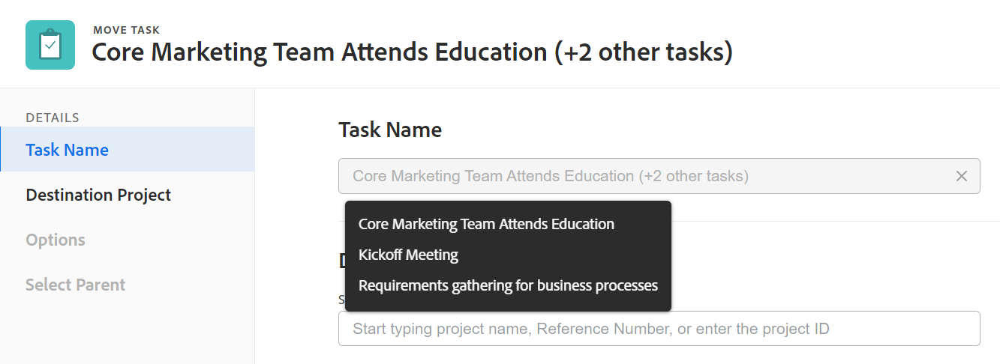
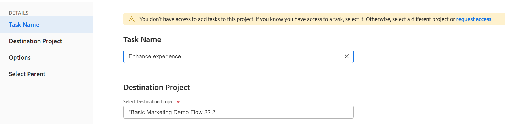
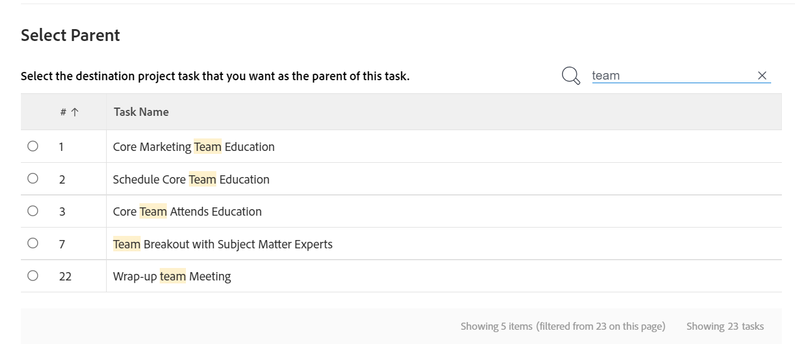

# Flytta uppgifter

<!--Audited: 5/2025-->

<!--The highlighted information on this page refers to functionality not yet generally available. It is available only in the Preview environment for all customers. After the monthly releases to Production, the same features are also available in the Production environment for customers who enabled fast releases.    

For information about fast releases, see [Enable or disable fast releases for your organization](/help/quicksilver/administration-and-setup/set-up-workfront/configure-system-defaults/enable-fast-release-process.md). -->

Du kan flytta uppgifter i Adobe Workfront mellan följande objekt:

* En ad hoc-uppgift för ett projekt.
* En uppgift från ett projekt till ett annat projekt.
* En uppgift från ett projekt under en annan överordnad i ett annat projekt.
* En uppgift inom samma projekt under en annan överordnad aktivitet.

Du kan flytta en uppgift på aktivitetsnivå eller flytta en uppgift från en lista med uppgifter.

Du kan flytta en enskild uppgift eller flytta flera uppgifter åt gången från en lista med uppgifter.

## Åtkomstkrav

+++ Expandera om du vill visa åtkomstkrav för funktionerna i den här artikeln. 

<table style="table-layout:auto"> 
 <col> 
 <col> 
 <tbody> 
  <tr> 
   <td role="rowheader">Adobe Workfront package</td> 
   <td> 
Alla
 </td> 
  </tr> 
  <tr> 
   <td role="rowheader">Adobe Workfront-licens</td> 
   <td> 
Standard 
 
 
Arbeta eller högre
 </td> 
  </tr> 
  <tr> 
   <td role="rowheader">Konfigurationer på åtkomstnivå</td> 
   <td> 
Redigera åtkomst till uppgifter och projekt
 </td> 
  </tr> 
  <tr> 
   <td role="rowheader">Objektbehörigheter</td> 
   <td> 
Hantera behörigheter för uppgifter
 
Contribute eller högre behörigheter för projektet med möjlighet att lägga till uppgifter
  </td> 
  </tr> 
 </tbody> 
</table>

Mer information finns i [Åtkomstkrav i Workfront-dokumentation](/help/quicksilver/administration-and-setup/add-users/access-levels-and-object-permissions/access-level-requirements-in-documentation.md).

+++

<!--Old:

<table style="table-layout:auto"> 
 <col> 
 <col> 
 <tbody> 
  <tr> 
   <td role="rowheader">Adobe Workfront plan</td> 
   <td> 
Any
 </td> 
  </tr> 
  <tr> 
   <td role="rowheader">Adobe Workfront license</td> 
   <td> 
New: Standard 
 
 
or
  

Current: Work or higher 
 </td> 
  </tr> 
  <tr> 
   <td role="rowheader">Access level configurations</td> 
   <td> 
Edit access to Tasks and Projects
 </td> 
  </tr> 
  <tr> 
   <td role="rowheader">Object permissions</td> 
   <td> 
Manage permissions to the tasks
 
Contribute or higher permissions to the project with ability to Add Tasks
  </td> 
  </tr> 
 </tbody> 
</table>-->

## Att tänka på när du flyttar uppgifter

Tänk på följande när du flyttar en uppgift:

* Din system- eller gruppadministratör kan hindra dig från att flytta uppgifter som har loggat timmar beroende på hur de konfigurerar Tillåt användare att flytta uppgifter och problem med loggade timmar i inställningsområdet. Mer information finns i [Konfigurera uppgifter och utgåvinställningar för hela systemet](/help/quicksilver/administration-and-setup/set-up-workfront/configure-system-defaults/set-task-issue-preferences.md).

* När du flyttar en uppgift från ett projekt till ett annat kan uppgiftsdatumen beräknas om. Omberäkningen tar hänsyn till den tidsplan som det nya projektet använder och projektets Schedule From-information.

* Du kan flytta vissa objekt som är kopplade till uppgiften till den flyttade aktiviteten under den flyttade processen. Som standard överförs dock följande objekt till den flyttade aktiviteten:

   * Problem
   * Inloggade timmar
   * Användarkommentarer
   * Anpassade formulär och anpassad fältinformation
   * Underaktiviteter

* Som standard flyttas inte följande objekt med uppgiften:

   * Milstolpar

## Flytta aktiviteter i en lista

{{step1-to-projects}}

1. På sidan **Projekt** markerar du det projekt som innehåller den eller de uppgifter som du vill flytta.
1. Klicka på **Åtgärder** i den vänstra panelen för att visa uppgiftslistan.
1. Klicka på ikonen **Planeringsläge**  och kontrollera att alternativet **Spara automatiskt** är aktiverat. Markera sedan den eller de uppgifter du vill flytta.

   

   >[!IMPORTANT]
   >
   >Du kan inte flytta uppgifter när växeln **Spara automatiskt** är inaktiverad.

1. (Valfritt och villkorligt) Om du vill flytta de markerade aktiviteterna inom samma projekt klickar du på de markerade uppgifterna och drar och släpper dem sedan där du vill att de ska flyttas till projektet. Aktivitetshierarkin ändras och informationen som är kopplad till varje uppgift flyttas tillsammans med uppgifterna.

1. (Villkorligt) Markera den eller de uppgifter som du vill flytta och gör något av följande:

   * Klicka på **Mer**-menyn  högst upp i uppgiftslistan och klicka sedan på **Flytta till**.
   * Högerklicka på de markerade aktiviteterna och klicka sedan på **Flytta till**.
   * När du markerar en aktivitet klickar du på ikonen **Mer**  bredvid aktivitetsnamnet i listan och sedan på **Flytta till**.

   Rutan **Flytta aktivitet** visas.

1. Fortsätt med att flytta aktiviteten enligt beskrivningen i avsnittet [Flytta en aktivitet på aktivitetsnivå](#move-a-task-at-the-task-level) i den här artikeln.

   <!--
   is this still accurate?!
   -->

## Flytta en uppgift på aktivitetsnivå {#move-a-task-at-the-task-level}

Förutom att flytta uppgifter från en lista med uppgifter kan du flytta en uppgift på aktivitetsnivå efter att du har öppnat den.

1. Hitta en uppgift i ditt Workfront-system genom att söka efter den.
1. Klicka på namnet på uppgiften för att öppna den.
1. Klicka på listrutan **Mer**  bredvid aktivitetsnamnet och klicka sedan på **Flytta till**. Sidpanelen **Flytta aktivitet** visas.

1. (Valfritt) Uppdatera **aktivitetsnamnet**. Aktiviteten flyttas med det nya namnet på den nya platsen.

   >[!TIP]
   >
   >Fältet **Uppgiftsnamn** är nedtonat och kan inte redigeras när du väljer att flytta flera uppgifter i en lista. Du kan hovra över fältet **Uppgiftsnamn** och en lista över alla markerade uppgifter visas.
   >
   >
   >

1. I fältet **Välj målprojekt** skriver du namnet på det projekt som du vill flytta aktiviteten till. Om du vill flytta aktiviteten inom samma projekt skriver du namnet på det aktuella projektet.

   >[!TIP]
   >
   >* Projektnamnet är skiftlägeskänsligt.
   >* Du kan söka efter ett projekt genom att skriva referensnumret eller genom att ange projektets ID. Detta kan hjälpa dig att skilja mellan projekt med identiska namn.
   >* Endast 100 projekt visas i listan.

1. (Villkorligt) Om du inte har åtkomst till projektet klickar du på **Begär åtkomst**.
1. (Villkorligt) Fortsätt att flytta aktiviteten till målprojektet utan att begära åtkomst om du har åtkomst till att lägga till aktiviteter i någon av åtgärderna i målprojektet.

   

   >[!TIP]
   >
   >Liknande meddelanden visas om det valda projektet väntar på godkännande, är slutfört eller inte alls när Workfront-administratören förhindrar att uppgifter läggs till i dessa projekt. Mer information finns i [Konfigurera systemomfattande projektinställningar](../../../administration-and-setup/set-up-workfront/configure-system-defaults/set-project-preferences.md).

1. (Valfritt) I avsnittet **Alternativ** avmarkerar du något av objekten i tabellen nedan för att ta bort dem från de flyttade uppgifterna. Alla alternativ är markerade som standard.

   >[!IMPORTANT]
   >
   >Om du avmarkerar objekt i listan **Alternativ** går data förlorade. Information från den befintliga aktiviteten tas bort och kan inte återställas.

   <table style="table-layout:auto"> 
    <col> 
    <col> 
    <tbody> 
     <tr> 
      <td role="rowheader">Markera alla</td> 
      <td>Avmarkera det här alternativet om du vill ta bort all information från aktiviteten när den flyttas till den nya platsen. </td> 
     </tr> 
     <tr> 
      <td role="rowheader">Begränsning</td> 
      <td> 
Aktivitetsbegränsningen anges till Så snart som möjligt eller Sent som möjligt baserat på inställningen för projektschemaläge.
 
 När du väljer det här alternativet överförs den aktuella begränsningen för uppgiften med uppgiften. 
 
      
Obs! När du flyttar eller kopierar en uppgift med datumspecifika begränsningar till ett annat projekt och villkorsdatumen för aktiviteten ligger utanför de nya projektdatumen, ändras antingen aktivitetsbegränsningen till Så snart som möjligt eller Sent som möjligt, eller så justeras datumen för planerad start eller planerad slutförning för projekten.

   Nedan följer exempel på datumspecifika begränsningar:
   <ul>
      <li> Starta den</li>
      <li> Måste avslutas</li>
      <li> Starta tidigast</li>
      <li> Starta senast</li>
      </ul>

   Mer information finns i <a href="../../../manage-work/tasks/task-constraints/task-constraint-overview.md" class="MCXref xref">Översikt över uppgiftsbegränsning</a>.
 </td>
   </tr> 
     <tr> 
      <td role="rowheader">Uppdrag</td> 
      <td> 
Alla uppdrag tas bort från uppgiften. 
 </td> 
     </tr> 
     <tr> 
      <td role="rowheader">Godkännandeprocess</td> 
      <td>Alla godkännandeprocesser tas bort från uppgiften.</td> 
     </tr> 
     <tr> 
      <td role="rowheader">Förlopp</td> 
      <td>Uppgiftsstatus anges till Nytt. I annat fall bevaras den befintliga aktivitetsstatusen. </td> 
     </tr> 
     <tr> 
      <td role="rowheader">Ekonomisk information</td> 
      <td>Den ekonomiska informationen för aktiviteten tas bort och Workfront uppdaterar uppgiftens kostnadstyp till Ingen kostnad och aktivitetens intäktstyp till Inte fakturerbar. </td> 
     </tr> 
     <tr> 
      <td role="rowheader">Alla föregående</td> 
      <td> 
När du väljer det här alternativet blir beroendet en föregångare mellan projekt när du flyttar aktiviteten till ett annat projekt. 
 </td> 
     </tr> 
     <tr> 
      <td role="rowheader">Dokument</td> 
      <td> 
Dokumenten som är kopplade till uppgiften överförs inte till den flyttade uppgiften. Detta inkluderar versioner, korrektur och länkade dokument.
 
Detta inkluderar inte dokumentgodkännanden. Dokumentgodkännanden kan aldrig flyttas när en uppgift flyttas.
 
      
Obs! Om du väljer att inte låta dokumenten flyttas tillsammans med uppgiften, kommer dokumenten att tas bort och placeras i papperskorgen under 30 dagar. En administratör kan återställa dem och de återställs vid den flyttade åtgärden. 

   
Om uppgiften tas bort efter att den har flyttats placeras de återställda dokumenten i området Dokument på administratörens användarsida, som återställer dem.

   </td> 
     </tr> 
     <tr> 
      <td role="rowheader">Påminnelsemeddelanden</td> 
      <td>Påminnelserna för aktiviteten överförs inte till den flyttade aktiviteten. </td> 
     </tr> 
     <tr> 
      <td role="rowheader">Utgifter</td> 
      <td>Utgifterna som är inloggade på aktiviteten överförs inte till den flyttade aktiviteten. </td> 
     </tr> 
     <tr> 
      <td role="rowheader">Behörigheter</td> 
      <td> 
Workfront tar bort namnen på alla enheter som visas i delningslistan för uppgiften. 
 </td> 
     </tr> 
    </tbody> 
   </table>

1. (Valfritt) I avsnittet **Markera överordnad** väljer du den uppgift i målprojektet som ska bli överordnad den flyttade aktiviteten.

   >[!TIP]
   >
   >När du väljer att flytta flera uppgifter i en lista blir alla markerade uppgifter underordnade den markerade överordnade.

   Välj en överordnad genom att göra något av följande:

   * Välj en av de överordnade i projektplanen i uppgiftslistan.
   * Klicka på sökikonen  och sök efter en överordnad uppgift efter namn.

   Uppgiften visas i listan.

   

   >[!NOTE]
   >
   >Om du inte väljer någon överordnad uppgift flyttas uppgifterna som huvuduppgifter i stället för underuppgifter, och de placeras i slutet av uppgiftslistan i målprojektet.

1. Klicka på **Flytta aktivitet**. Aktiviteterna flyttas till det angivna projektet som antingen underaktiviteter till en överordnad aktivitet eller som de sista aktiviteterna i projektet.
