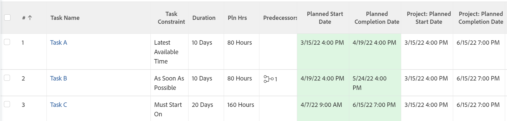
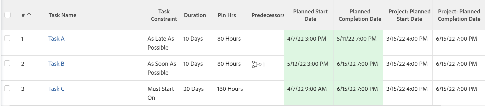

# Översikt över aktivitetsbegränsning: Så sent som möjligt

ALAP (Late As Possible) är en Adobe Workfront-aktivitetsbegränsning som gör att slutföringstiden för uppgiften ligger så nära projektets slut som möjligt.

Om du använder den här begränsningen kan föregående eller beroende aktiviteter schemaläggas om.

Mer information om föregående relationer finns i [Använda föregående aktiviteter: artikelindex](../../../manage-work/tasks/use-prdcssrs/use-task-predecessors.md).

Så sent som möjligt är standardbegränsningen om ett projekt använder schemaläggningsläget Schemalägg från slutförandedatum och system- eller gruppstandardvärdet för startdatumet för en aktivitet baseras på projektplanerat datum.

Mer information om var du ska ange standardbegränsning för en ny uppgift finns i [Konfigurera systemomfattande uppgifter och inställningar för problem](../../../administration-and-setup/set-up-workfront/configure-system-defaults/set-task-issue-preferences.md).

Mer information om hur du uppdaterar aktivitetsbegränsningen för en aktivitet finns i [Uppdatera aktivitetsbegränsningen för en aktivitet](../../../manage-work/tasks/task-constraints/update-task-constraint-of-task.md).

<!--

<h2>Use the As Late As Possible Task Constraint</h2>

(NOTE: replaced with new article linked above) 

To update the Task Constraint to As Late As Possible: 

<ol>
<li value="1">Go to a task whose Task Constraint you want to update.</li>
<li value="2"> 
Click the <strong>More</strong> icon  next to the task name, then click <strong>Edit</strong>.
 </li>
<li value="3"> 
In the <strong>Overview</strong> section, expand the <strong>Task Constraint</strong> drop-down menu.
 </li>
<li value="4"> 
Select <strong>As Late As Possible</strong>.
 </li>
<li value="5">Click <strong>Save Changes</strong>. </li>
</ol>

-->

## Skillnaden mellan den senaste tillgängliga tiden och så sen som möjligt

<!--

(NOTE: [! This section is duplicated in "Latest Available Time"] - inserted a snippet for both articles (Alina)) 

-->

Begränsningen Senaste tillgängliga tid skiljer sig från begränsningen som Sate As Possible när följande kriterier finns:

* Projektet är schemalagt från startdatum
* Aktiviteter i projektet har en föregående relation
* Efterföljande aktivitet har en flexibel uppgiftsbegränsning

I den här situationen:

* **Senaste tillgängliga tid:** Om du använder den senaste tillgängliga tidsbegränsningen för föregående aktivitet prioriteras den efterföljande aktivitetens flexibla begränsning.

  **Exempel:** Till exempel är Aktivitet A en föregångare till Aktivitet B. Aktivitet A har den senaste tillgängliga tidsbegränsningen och aktivitet B har begränsningen Per så snart som möjligt. I så fall är uppgift A schemalagd så nära projektets början som möjligt.

  

* **Så här sent som möjligt:** I det här scenariot prioriterar föregående aktivitet med begränsningen Så sent som möjligt för föregående aktivitet.

  **Exempel:** Till exempel är Aktivitet A en föregångare till Aktivitet B. Aktivitet A har begränsningen Så sent som möjligt och aktivitet B har begränsningen Så snart som möjligt. I så fall är uppgift A schemalagd så nära projektets slut som möjligt.

  

<!--

(NOTE: this content was here before but it was wrong - according to this issue in Hub, per Dev, the correct functionality is in the snippet above: https://hub.workfront.com/task/6193c6910004bce9de07cda7757f3ce8/updates?email-source=subscribedCommunication) 

The Latest Available Time constraint differs from the As Late As Possible constraint when the following criteria exist:

<ul>
<li> The project is scheduled From Completion </li>
<li> Tasks in the project have a predecessor relationship </li>
<li> The predecessor task has a flexible task constraint </li>
</ul>

 In this situation: 

<ul>
<li> 
<strong>Latest Available Time:</strong> Using the Latest Available Time constraint on the successor task gives priority to flexible constraint of the predecessor.
 
For example, Task A is a predecessor to Task B. Task B has the Latest Available Time constraint and Task A has the As Soon As Possible constraint. In this situation, the task is scheduled as close to the start of the project as possible.
 </li>
<li> 
<strong>As Late As Possible:</strong> In this scenario, using the As Late As Possible constraint on the successor task gives the priority to the successor task.
 
For example, Task A is a predecessor to Task B. Task B has the As Late As Possible constraint and Task A has the As Soon As Possible constraint. In this situation, the task is scheduled as close to the end of the project as possible.
 </li>
</ul>

-->
