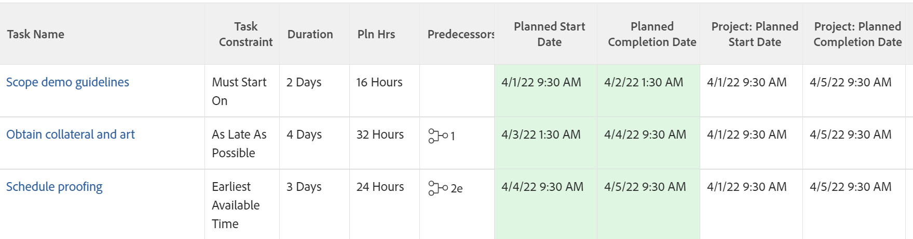

# Översikt över uppgiftsbegränsning: Tidigast tillgänglig tid

Tidigaste tillgängliga tid är en aktivitetsbegränsning som schemalägger att en uppgift påbörjas så snart som möjligt efter att ha övervägt eventuella föregående relationer.

Mer information om hur du uppdaterar aktivitetsbegränsningen för en aktivitet finns i [Uppdatera aktivitetsbegränsningen för en aktivitet](../../../manage-work/tasks/task-constraints/update-task-constraint-of-task.md).

<!--

(NOTE: replaced with new article linked above) 

-->

<!--

To update the Task Constraint to Earliest Available Time:

-->

<!--
   <li value="1" data-mc-conditions="QuicksilverOrClassic.Draft mode">Go to a task whose constraint you want to modify. </li>
   -->

<!--
   
Click <strong>Edit Task</strong>.

   -->

<!--
   
Click the <strong>More</strong> icon  next to the task name, then click <strong>Edit</strong>.

   -->

<!--
   
In the <strong>Overview</strong> section, expand the <strong>Task Constraint</strong> drop-down menu.

   -->

<!--
   
Select <strong>Earliest Available Time</strong>.

   -->

<!--
   <li value="5" data-mc-conditions="QuicksilverOrClassic.Draft mode">Click <strong>Save Changes</strong>.</li>
   -->

## Skillnaden mellan tidigaste tillgängliga tid och så snart som möjligt

<!--

(NOTE: [! This section is duplicated in "Earliest Available Time"])

-->

Begränsningen Tidigaste tillgängliga tid skiljer sig från villkoret Så snart som möjligt när alla följande villkor är uppfyllda:

* Projektet är schemalagt från slutförande
* Aktiviteter i projektet har en föregående relation
* Föregående aktivitet har en flexibel aktivitetsbegränsning

I den här situationen:

* **Tidigaste tillgängliga tid:** Om du använder den tidigaste tillgängliga tidsbegränsningen för efterföljande aktivitet prioriteras föregående åtgärds flexibla begränsning.

  **EXEMPEL**

  Aktivitet A är en föregångare till aktivitet B. Aktivitet B har den tidigaste tillgängliga tidsbegränsningen och aktivitet A har begränsningen Så sent som möjligt. I sådana fall är uppdrag B schemalagt så nära att projektet har slutförts som möjligt.

  

* **Så snart som möjligt:** I det här scenariot ger begränsningen Så snart som möjligt för efterföljande aktivitet prioriteten för efterföljande aktivitet.

  **EXEMPEL**

  Aktivitet A är en föregångare till Aktivitet B. Aktivitet B har begränsningen Så snart som möjligt och Aktivitet A har begränsningen Så sent som möjligt. I så fall är uppgift B schemalagd så nära projektets början som möjligt.

  
