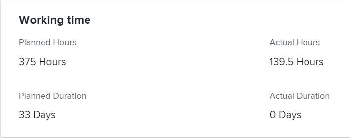

# Översikt över planerade timmar

<!-- Audited: 01/2024 -->

Planerade timmar som är associerade med en aktivitet, utgåva eller projekt representerar den tid som krävs för att de tilldelade användarna ska kunna slutföra uppgiften, utgåvan eller projektet.

## Överväganden om planerade timmar i Adobe Workfront

* Planerade timmar är främst kopplade till arbetsuppgifter (uppgifter och ärenden) i Adobe Workfront. De planerade timmarna från arbetsobjekt räknas upp till de planerade timmarna för deras projekt.
* Som standard distribuerar Workfront aktiviteten och skickar planerade timmar lika mycket till alla dagar under aktivitetens eller ärendets varaktighet.
* När användare och roller tilldelas till uppgifter och ärenden, kopplas de planerade timmarna för uppgifterna och problemen till användar- eller rolltilldelningar.
* Du måste definiera värdet för Planerade timmar för uppgifter och ärenden om du vill använda verktygen för resurshantering i Workfront.
* Du kan bara ändra värdet för Planerade timmar för uppgifter för vissa varaktighetstyper.

  Mer information om hur du ändrar planerade timmar för aktiviteter i relation till aktiviteternas varaktighetstyp finns i avsnittet [Uppdatera planerade timmar för aktivitet baserat på varaktighetstyp](#update-task-planned-hours-based-on-duration-type) i den här artikeln.

* Du kan när som helst ändra värdet för Planerade timmar i frågor.
* Du kan inte ändra värdet för Planerade timmar för projekt eller för överordnade uppgifter eftersom de är en beräknad summa av alla planerade timmar för alla deras aktiviteter och underaktiviteter.
* Genom att hantera användartilldelningar med hjälp av resurshanteringsverktyg kan antalet planerade timmar för uppgifter, utgåvor och projekt samt antalet tilldelningar som är kopplade till arbetsobjekt ändras.

## Planerade timmar för uppgifter jämfört med planerade timmar för projekt {#planned-hours-on-tasks-vs-planned-hours-on-projects}

Planerade timmar från uppgifter räknas upp till projektets planerade timmar. Planerade timmar från problem kan inte alltid anpassas till projektets planerade timmar.

I det här avsnittet beskrivs skillnaderna mellan aktiviteten och projektets planerade timmar. Här beskrivs också var du kan se problem med planerade timmar som följer med projektet.

### Planerade timmar för uppgifter {#planned-hours-on-tasks}

De planerade timmarna för en uppgift anger hur lång tid det faktiska arbetet kan ta. Som standard distribuerar Workfront den totala mängden planerade timmar jämnt för varje dag under varaktigheten för varje uppgift. Det dagliga antalet planerade timmar blir daglig allokering för uppgiften. Om aktiviteten tilldelas flera resurser tilldelas varje resurs som standard ett lika stort antal timmar per dag.

Med hjälp av Utjämning av arbetsbelastning kan du ändra de dagliga allokeringarna för användare som tilldelats till aktiviteterna. Detta kan även uppdatera aktivitetens planerade timmar när aktivitetens varaktighetstyp är Enkel. Mer information finns i avsnittet Uppdatera planerade timmar för aktiviteter när användartilldelningar hanteras i artikeln [Hantera användartilldelningar i arbetsbelastningsutjämnaren](../../../resource-mgmt/workload-balancer/manage-user-allocations-workload-balancer.md).

När en aktivitet innehåller underaktiviteter är planerad timme för den överordnade aktiviteten summan av alla planerade timmar för alla underaktiviteter. Du kan inte uppdatera de planerade timmarna för en överordnad aktivitet.

>[!NOTE]
>
>Till skillnad från planerade timmar är faktiska timmar för en överordnad aktivitet timmar som loggas direkt i den överordnade aktiviteten. De representerar inte summan av de faktiska timmarna för de underordnade uppgifterna.\
>Mer information om faktiska timmar finns i [Visa faktiska timmar](../../../manage-work/tasks/task-information/actual-hours.md).

### Planerade timmar för projekt {#planned-hours-on-projects}

Du kan inte redigera antalet planerade timmar i ett projekt. Planerade timmar i ett projekt är en beräknad summa av alla planerade timmar från alla aktiviteter i projektet.

Huruvida problem ingår i beräkningen av Planerade timmar beror på var i projektet du visar Planerade timmar. Du kan visa projektplanerade timmar på följande platser i ett projekt:

* **Avsnittet Projektinformation och rutan Redigera projekt**: Endast de planerade timmarna för aktiviteterna i projektet beaktas. De planerade timmarna för problemen i projektet beaktas inte när det totala antalet planerade timmar för projektet visas i avsnittet Projektinformation eller rutan Redigera projekt.

* **Utjämning av arbetsbelastning**: Endast de planerade timmar som är associerade med de uppgifter som visas i vyn Utjämning av arbetsbelastning i Utjämning av arbetsbelastning för projekt. Dagliga tilldelningar för användare kan ändra projektets planerade timmar per dag i Utjämning av arbetsbelastning.
* **Användningsavsnitt**: De planerade timmarna som är associerade med användarna som är tilldelade till aktiviteterna och problemen i projektet beaktas när det totala antalet planerade timmar för projektet visas i användningsavsnittet.
* **Rollallokeringspanelen** i uppgiftslistan: Planerade timmar för aktiviteterna och problemen i projektet som har tilldelats en jobbroll eller en användare som är associerad med en jobbroll visas i det här området. Planerade timmar som är associerade med uppgifter och problem som inte har tilldelats eller tilldelats till team visas inte i det här området. Mer information finns i [Visa projektplanerade timmar på panelen Rolltilldelning](../../../manage-work/projects/planning-a-project/view-planed-hours-in-role-allocation-panel.md).

## Fördelning av planerade timmar under en uppgifts varaktighet

Som standard distribuerar Workfront de planerade timmarna jämnt över varaktigheten för en aktivitet och tilldelar samma antal planerade timmar för varje dag i aktiviteten, beroende på tillgängligheten för projektschemat.

Om en uppgift till exempel är inställd på 16.00 och schemat har 1 timme kvar på aktivitetens första dag, placerar Workfront en planerad timme på uppgiftens första dag. Därefter delas resten av de planerade timmarna lika mellan resten av dagarna i aktivitetens varaktighet.

>[!NOTE]
>
>Den planerade timmen per dag eller den dagliga tilldelningen är fördelningen av planerade timmar för varje dag under uppgiftens varaktighet. Om aktiviteten har ett uppdrag representerar det här numret antalet planerade timmar per dag och tilldelning. Om aktiviteten har flera tilldelningar skiljer sig Planerade timmar per dag och tilldelning från planerade timmar per dag för aktiviteten. Det finns ingen visuell representation i Workfront av antalet planerade timmar per dag per uppdrag för uppgifter med flera uppdrag.

## Hitta och förstå värden för planerade timmar

Du kan hitta värden för Planerade timmar i olika områden av Workfront.

Antalet visade timmar beror antingen på arbetsobjekten i projektet eller på vilket område och vilket objekt du visar dem i.

Du hittar Planerade timmar i följande områden i Workfront:

* [Detaljavsnittet för ett projekt, en aktivitet eller ett problem](#the-details-section-of-a-project-task-or-issue)
* [Rutan Redigera aktivitet eller Redigera problem](#the-edit-task-or-edit-issue-box)
* [Rapporter](#reports)
* [Arbetsbelastningsutjämnaren](#the-workload-balancer)
* [Resursplaneraren](#the-resource-planner)
* [Användningsrapporten](#the-utilization-report)
* [Panelen Rolltilldelning](#the-role-allocation-panel)

### Avsnittet Detaljer för ett projekt, en uppgift eller ett ärende {#the-details-section-of-a-project-task-or-issue}

Planerade timmar i detaljavsnittet för en aktivitet, utgåva eller ett projekt är det totala antalet planerade timmar som är associerat med artikeln.

Mer information om projektplanerade timmar finns i avsnittet [Planerade timmar för aktiviteter kontra planerade timmar för projekt](#planned-hours-on-tasks-vs-planned-hours-on-projects) i den här artikeln.

### Rutan Redigera uppgift eller Redigera problem {#the-edit-task-or-edit-issue-box}

De planerade timmarna i rutan Redigera för en uppgift eller utgåva är de totala planerade timmarna för respektive objekt.

Mer information om projektplanerade timmar finns i avsnittet [Planerade timmar för aktiviteter kontra planerade timmar för projekt](#planned-hours-on-tasks-vs-planned-hours-on-projects) i den här artikeln.

För uppgifter kan du bara redigera antalet planerade timmar för vissa varaktighetstyper. Mer information finns i avsnittet [Uppdatera planerade timmar för aktivitet baserat på varaktighetstyp](#update-task-planned-hours-based-on-duration-type) i den här artikeln.

Du kan visa den individuella allokeringen av planerade timmar för varje användare eller jobbroll som tilldelats uppgiften eller utgåvan i uppdragsområdet.

### Rapporter {#reports}

Du kan lägga till fältet Planerade timmar i projekt-, uppgifts- och problemrapporter.

Kolumnen Planerade timmar inkluderas som standard i standardvyn för en uppgiftslista.

Planerade timmar för en aktivitet, utgåva eller projektrapport är den totala planerade timmen för respektive objekt när de visas i detaljavsnittet eller i redigeringsrutan för objekten.

Mer information om hur du skapar rapporter finns i [Skapa en anpassad rapport](../../../reports-and-dashboards/reports/creating-and-managing-reports/create-custom-report.md).

>[!NOTE]
>
>Om du skapar en projektrapport (ekonomiska data) och grupperar den efter datum kan en del av projektets planerade timmar visas i Planerade timmar, beroende på tidslinjen för aktiviteterna i projektet. Som standard distribuerar Workfront de planerade timmarna för uppgifter lika för varje dag i aktivitetens varaktighet. De planerade timmarna för en viss tidsram matchar den fördelning som Workfront har angett för den tidsramen i rapporten Projekt (ekonomiska data).

<!--
### The Scheduling areas  {#the-scheduling-areas}

The Planned Hours for tasks and issues display in the Scheduling areas in the Planned Hours field.

You can view the daily allocation of Planned Hours for each user assigned to a task or an issue in the Scheduling areas.

The daily hour amount represents one of the following:

* the default amount equally distributed by Workfront for each day of the Duration of the tasks or issues
* the adjusted daily allocation managed by resource managers.

  For information about adjusting daily allocations in the Scheduling tools, see [Manage user allocations in the Scheduling areas](../../../resource-mgmt/resource-scheduling/manage-allocations-scheduling-areas.md).
-->

### Utjämning av arbetsbelastning {#the-workload-balancer}

Följande planerade timmar för uppgifter, utgåvor och projekt visas i Utjämning av arbetsbelastning till höger om namnet på uppgiften, utgåvan eller projektet:

* För uppgifter och ärenden visas de planerade timmar som är kopplade till dem.
* För projekt, totalt antal planerade timmar från de uppgifter och utgåvor som visas på skärmen.

  >[!TIP]
  >
  >Utjämningen av arbetsbelastning visar inte alla planerade timmar för ett projekt så som de visas i området Projektinformation.

Du kan visa den dagliga fördelningen av planerade timmar för varje användare som tilldelats en uppgift eller ett problem i Utjämning av arbetsbelastning.

Det dagliga timbeloppet för Planerade timmar representerar något av följande:

* standardbeloppet som fördelas jämnt av Workfront för varje dag i varaktigheten för uppgifterna, utgivningarna eller projektet
* den justerade dagliga allokeringen hanteras av resurshanterare

  Mer information om hur du justerar dagliga tilldelningar i arbetsbelastningsutjämnaren finns i [Hantera användartilldelningar i arbetsbelastningsutjämnaren](../../../resource-mgmt/workload-balancer/manage-user-allocations-workload-balancer.md).

### Resursplaneraren {#the-resource-planner}

Resursplaneraren visar Planerade timmar för projekt, uppgifter och ärenden.

Du kan visa veckoallokeringar av planerade timmar för användare och jobbroller som är associerade med arbetsobjekt i kolumnen PLN i resursplaneraren.

>[!TIP]
>
>Dagliga allokeringsjusteringar i belastningsutjämnaren påverkar veckoallokeringar för aktiviteter och utgåvor i resursplaneraren.

Antalet planerade timmar för varje objekt varierar beroende på vilken vy du använder i resursplaneraren. Mer information finns i [Översikt över timmar-, FTE- och kostnadsinformation i projekt- och rollvyerna i resursplaneraren](../../../resource-mgmt/resource-planning/overview-of-planner-hour-fte-cost-information-in-role-project-views.md).

Veckotimbeloppet för planerade timmar för uppgifter och ärenden representerar något av följande:

* standardbeloppet för veckovis fördelning som är lika stort av Workfront för varje dag under varaktigheten för uppgifterna eller utställningarna
* den justerade veckotilldelningen som hanteras av resurshanterare i arbetsbelastningsutjämnaren

  Mer information om hur du justerar dagliga tilldelningar i arbetsbelastningsutjämnaren finns i [Hantera användartilldelningar i arbetsbelastningsutjämnaren](../../../resource-mgmt/workload-balancer/manage-user-allocations-workload-balancer.md).

Veckobeloppet för projekt, användare och roller påverkas av antalet planerade timmar per vecka för de uppgifter och problem som är kopplade till dem.

### Användningsrapporten {#the-utilization-report}

Projektets planerade timmar är de som är kopplade till tilldelningarna för varje uppgift och ärende.

>[!IMPORTANT]
>
>Observera att de planerade timmarna i användningsrapporten är kopplade till tilldelningarna och inte till själva uppgifterna och problemen. De planerade timmarna i användningsrapporten matchar inte alltid de planerade timmarna för projektets uppgifter och problem. Planerade timmar matchar emellertid de timmar som är associerade med tilldelningarna för uppgifter och ärenden.

Du kan visa följande typer av planerade timmar i användningsrapporten:

* den totala planerade timmen för alla uppdrag i projektet under hela projektperioden
* det totala antalet planerade timmar för alla tilldelningar för det angivna datumintervallet (du kan ange en enskild vecka eller månad).

  När användarens dagliga allokering för timmar har justerats med hjälp av Utjämning av arbetsbelastning kan de planerade timmarna för ett visst datumintervall påverkas om de datum som valts i utnyttjanderapporten bara innehåller en del av en uppgifts eller utställningens varaktighet. Mer information om hur du justerar daglig allokering för användare finns i [Hantera användarallokeringar i Utjämning av arbetsbelastning](../../../resource-mgmt/workload-balancer/manage-user-allocations-workload-balancer.md).

Mer information finns i [Visa information om resursutnyttjande](../../../resource-mgmt/resource-utilization/view-utilization-information.md).

### Panelen Rolltilldelning

De planerade timmarna på panelen Rollallokering representerar antalet planerade timmar som är associerade med varje jobbroll som är tilldelad aktiviteterna eller problemen i projektet under projektets totala längd. Antalet matchar rollen Planerade timmar från resursplaneraren.

>[!TIP]
>
>Observera att de planerade timmar som är associerade med användare inte visas på panelen Rolltilldelning.

Mer information finns i [Visa rollallokering för projekt och initiativ i Utjämning av arbetsbelastning](../../../scenario-planner/show-role-allocation-workload-balancer.md).

## Uppdatera planerade timmar för aktivitet baserat på varaktighetstyp {#update-task-planned-hours-based-on-duration-type}

Du kan bara uppdatera det totala antalet planerade timmar för uppgifter när du redigerar uppgifter om aktiviteterna har en viss varaktighetstyp.

Följande scenarier finns:

* Du kan bara ändra planerade timmar för uppgifter när du använder typerna Beräknad tilldelning eller Enkel varaktighet när du redigerar en uppgift.

  Mer information om den beräknade varaktighetstypen för tilldelning finns i [Översikt över varaktighetstypen: Beräknad tilldelning](../../../manage-work/tasks/taskdurtn/calculated-assignment.md).

  Mer information om den enkla varaktighetstypen finns i [Översikt över varaktighetstypen: Enkel](../../../manage-work/tasks/taskdurtn/simple-duration-type.md).

* Du kan bara uppdatera planerade timmar för uppgifter i Utjämning av arbetsbelastning för uppgifter av typen Enkel varaktighet när du hanterar användarnas tilldelningar till uppgifter. Mer information om hur du hanterar användartilldelningar i arbetsbelastningsutjämnaren finns i [Hantera användartilldelningar i arbetsbelastningsutjämnaren](../../../resource-mgmt/workload-balancer/manage-user-allocations-workload-balancer.md).
* Du kan inte ändra planerade timmar för uppgifter med varaktighetstypen insatsstyrd eller beräknad arbetstid. I dessa fall fastställer Workfront planerade timmar baserat på aktivitetens varaktighet. I detta fall är dock Planerade timmar alltid lika med varaktigheten (i timmar) och de påverkas inte av den procentuella allokeringen av de tilldelade resurserna.

  Mer information om varaktighetstypen för aktivitetsstyrd finns i [Översikt över varaktighetstypen: ansträngningsstyrd](../../../manage-work/tasks/taskdurtn/effort-driven.md).

  Mer information om den beräknade varaktighetstypen för arbete finns i [Översikt över varaktighetstypen: Beräknat arbete](../../../manage-work/tasks/taskdurtn/calculated-work.md).

## Uppdatera planerade timmar för aktiviteter vid hantering av användarallokeringar

Du kan uppdatera planerade timmar för uppgifter när du manuellt uppdaterar användar- eller jobbrollsallokeringar till uppgifter. Detta är bara möjligt när aktiviteter har varaktighetstypen Enkel.

Mer information finns i [Översikt över varaktighetstyp: Enkel](../../../manage-work/tasks/taskdurtn/simple-duration-type.md).

Du kan uppdatera den övergripande allokeringen av användare och roller som tilldelats uppgiften, eller användarens dagliga allokeringar när du använder Utjämning av arbetsbelastning.

Information om hur du hanterar övergripande användar- och jobbrollallokeringar för uppgifter finns i [Hantera användar- och rollallokeringstimmar för uppgifter](../../../manage-work/tasks/assign-tasks/manage-allocation-hours-on-tasks.md).

Mer information om hur du hanterar dagliga tilldelningar för uppgifter finns i [Hantera användartilldelningar i Utjämning av arbetsbelastning](../../../resource-mgmt/workload-balancer/manage-user-allocations-workload-balancer.md).

Följande scenarier gäller när du manuellt uppdaterar användar- eller jobbrollallokeringar för uppgifter:

* När du inte har uppdaterat de enskilda användar- eller rollallokeringarna manuellt för att utlösa en ändring av aktiviteten Planerade timmar, ändras inte de planerade timmarna när du lägger till, tar bort eller ersätter tilldelningar för aktiviteten. När du lägger till en ny tilldelning till aktiviteten, fördelas de enskilda allokeringarna mellan alla tilldelningar.
* När du har uppdaterat allokeringarna manuellt för att utlösa en ändring av aktiviteten Planerade timmar, minskar antalet planerade timmar när du tar bort tilldelningar från aktiviteten. De ändras inte när du ersätter ett uppdrag.
* När du har uppdaterat allokeringarna manuellt för att utlösa en ändring av aktiviteten Planerade timmar och lägger till en tilldelning till aktiviteten, tilldelas den nya tilldelningen 0 timmar som standard. Du måste uppdatera deras allokering manuellt till uppgiften, vilket kan påverka de planerade timmarna.
* När du inte har uppdaterat allokeringarna manuellt för att utlösa en ändring av aktiviteten Planerade timmar och du tar bort alla tilldelningar för aktiviteten, ändras inte de planerade timmarna.
* När du har uppdaterat allokeringarna manuellt för att utlösa en ändring av aktiviteten Planerade timmar och du tar bort alla tilldelningar för aktiviteten, tas även de planerade timmarna bort och aktivitetens planerade timmar blir 0.

>[!NOTE]
>
>Om en aktivitet till exempel har 10 planerade timmar och du har två tilldelningar, tilldelas de som standard 5 timmar vardera.
>
>* Om du inte uppdaterar den enskilda användarallokeringen eller dagliga allokeringen med hjälp av Utjämning av arbetsbelastning och du tar bort någon eller alla tilldelningar från aktiviteten, återstår 10 timmar av aktiviteten Planerade timmar.
>* Om du manuellt ändrar tilldelningarna för tilldelningarna till 4 respektive 6 timmar, och du tar bort användaren som tilldelats till 6 timmar samt deras jobbroll, uppdateras aktiviteten Planerade timmar till 4 timmar. Om du även tar bort användaren som är tilldelad till 4 timmar men behåller den jobbroll som är associerad med den borttagna användaren, blir aktivitetens planerade timmar 4 timmar. Om du tar bort den sista användaren som är tilldelad till 4 timmar samt deras jobbroll och uppgiften fortfarande inte är tilldelad, blir aktiviteten Planerade timmar 0.

## Uppdatera planerade timmar för aktiviteter automatiskt med Arbetsinsats

När du använder Arbetsinsats för att uppskatta den insats som krävs för att slutföra en uppgift uppdateras antalet planerade timmar för aktiviteterna automatiskt. Detta är endast möjligt för uppgifter med en enkel varaktighetstyp.

Mer information om hur du använder Arbetsinsats för att beräkna aktivitetsinsats finns i [Översikt över arbetsinsats](../../../manage-work/tasks/task-information/work-effort.md).

<!--

(NOTE: this issue has the explanation of how Planned Hours should work - from Vazgen and Anna: https://hub.workfront.com/issue/6217dced00730b7034c4b808339a35ce/

-->

<!--

Details of their comments: 

-->

<!--

Anna Asatryan

3/22/2022 At 3:16 PM

 

to Mark Paul, Corrie Butler, Arman Simonyan, Gagik Khalatyan, Alina Wilson, Artur Sargsyan, Vazgen Babayan, Anna Asatryan

I have done some rough calculations on what the planned hours/revenues should look like Book.xlsx . And if we look, for example at the 2 users highlighted in one of the screenshots their planned hours look way off from what the calculation looks like in the spreadsheet (i.e. equally distributed allocation). When looking at the Workload balancer (the second screenshot), as an example for the user Yashas Mitta, I can see that the allocation has been modified. Obviously the utilization report calculates the allocations based on the modified contouring using the new work per day calculation. The project financial report uses the old, equal distribution of allocation along the full duration of the task. Hence. there is a difference when grouping per periods.

Vazgen Babayan

I believe we will need to prioritise syncing the project financial data report with the new work per day.

Alina Wilson

@Anna Asatryan , do you have a definition of what we should say in documentation (glossary, for example) for how the Planned Hours (or Planned Revenue) is calculated, keeping in mind that we don't document the concept of "workPerDay". We call them "daily allocations", for example, but let me know if that's accurate, too.

Vazgen Babayan

Last Thursday at 3:13 PM

I think an important note here is that regardless the calculation, even if the both views used the same formula, they will not display the same data, because the underlying data sources are different. The Financial Data report does not respect user-entered allocations in Workload Balancer at this moment. So there will be a clear discrepancy, as Anna showed in her message. My recommendation for communication will be to explain that the data sources are different so there can be a mismatch in data and that we will look into addressing that on our roadmap.

Alina Wilson

So far, I hear you guys say this (with my questions for confirmation/ comments in bold):

- the utilization report calculates the allocations based on the modified contouring using the new work per day calculation (so this is what we see in the Workload Balancer, right?)

- the project financial report uses the old, equal distribution of allocation along the full duration of the task (this is before the daily allocations for example were modified in the WB, right?)

I have these additional questions:

- what does the Project Details show? Which Planned Hours, for instance - because earlier, we had a question about this also. - which numbers?

- what does any Planned Hours/ Planned Revenue field that can be pulled in any other report (outside of Financial Data and Utilization reports) show? - which numbers?

- are there any other areas I am not thinking of that we need to document, @Corrie Butler

I will try to document all the possible areas where these display but please help. Thanks!

Vazgen Babayan

Last Saturday at 3:41 PM

<ul>
<li> 
Confirming the first two points 
 </li>
</ul>

For the following questions

<ul>
<li> 
Project details show an aggregated sum of task planned hours. It doesn't have anything to do with the work per day because it always deals with total numbers for the whole duration of the Project/Task.
 </li>
<li> 
Same thing applies to the Planned Hours and Planned Revenue fields in reports - they show totals for the whole Project/Task duration and thus have no use of work per day.
 </li>
<li> 
Can't think of any other fields related to this right now.
 </li>
<li> 
In general, if I were to summarize the system behavior, it's as follows:
 </li>
<li> 
Every area that only deals with total numbers of Planned Hours / Planned Revenue, uses the numbers entered on the tasks. Those are Task / Project Details, reports exposing those fields.
 </li>
<li> 
Areas that deal with time-sensitive portions of Planned Hours / Planned Revenue, use work per day. Those are all Resource Management tools - Workload Balancer, Resource Planner, Utilization Report, importing projects via Scenario Planner.
 </li>
<li> 
All the areas in the second point support user-edited allocations made in Workload Balancer.
 </li>
<li> 
Scheduling area and Project Financial Data reports use the old version of the work per day, which doesn't respect user-edited allocations from Workload Balancer.
 </li>
<li> 
Scheduling will be removed this year, and we need to do work to move the Project Financial Data reports to the new work per day sometime after Q3.
 </li>
</ul>

Alina Wilson

@Vazgen Babayan , one clarifying question: when you say "Scheduling and Project Financial Data reports use the old version of the work per day, which doesn't respect user-edited allocations from WB" - you mean that those use the system default which spreads the allocations evenly, correct? Because you can edit (daily) allocations in Scheduling tools, but it doesn't use that, correct? It uses the default of the daily allocation that the system figures out when dividing the Planned Hours by the number of days in the Duration. Please let me know. And thanks!

Anna Asatryan

Yesterday at 11:42 AM

@Alina Wilson , that's correct, when saying "Scheduling and Project Financial Data reports use the old version of the work per day, which doesn't respect user-edited allocations from WB" Vazgen meant that it spreads the allocation evenly.

As for the scheduling, the allocation modification that's being done there isn't reflected anywhere else in the application other than in the Scheduling itself. That's probably one of the reasons it's being deprecated.

-->

<!--

   

-->

<!--

(NOTE: everything below is drafted because I replaced it with the table above)

-->

<!--

You can find the Planned Hours information on tasks, issues, or projects in the following locations:

-->

<!--

The Planned Hours in the Details  section  of a task, issue, or project are the total Planned Hours of the respective item. 

Finding the Planned Hours in the Details  section  is identical for tasks, issues, and projects. 
 <note type="tip">
You cannot edit the Planned Hours of projects manually, as they are a calculation of all Planned Hours of all the tasks on the project.
</note>

To locate the Planned Hours value on the Details  section  of a task: 

<ol>
<li value="1">Go to a task for which you want to review the Planned Hours.</li>
<li value="2"> 
Click <strong>Task Details</strong> in the left panel. 
 </li>
<li value="3"> 
Click the <strong>Overview</strong> area and notice the Planned Hours value.
 
This value represents the time it would take the user assigned to the task to complete it. 
 </li>
</ol>

-->

<!--

<h3> </h3>

The Planned Hours in the Edit box of a task, issue, or project are the total Planned Hours of the respective item. 

Finding the Planned Hours while editing a task or an issue is identical. 
 <note type="tip">
You cannot edit the Planned Hours of projects manually, as they are a calculation of all Planned Hours of all the tasks on the project.
</note>

To locate the value of Planned Hours while editing a task:

<ol>
<li value="1">Go to the task or issue you want to view Planned Hours for.</li>
<li value="2"> 
Click the <strong>More</strong> icon  next to the task name, then click <strong>Edit</strong>.
 
The Planned Hours are located in the <strong>Overview</strong> section. 
 </li>
</ol>

-->

<!--

The Planned Hours column is included in the Standard view of a task list, by default. For issues and projects, you can add it to the view, when you are editing the view or when you build a report. 

The Planned Hours in a task, issue, or project report are the total Planned Hours of the respective item as they display in the Details  section  or the Edit box of the items. 

Adding the Planned Hours column to a project view is similar to building a view in a project report. 

To show Planned Hours in a project report:

<ol>
<li value="1"> 
Click the <strong>Main Menu</strong> icon  in the upper-right corner of Workfront, then click <strong>Reports</strong>. 
 </li>
<li value="2">Click <strong>New Report</strong>, then choose <strong>Project</strong> as your object.</li>
<li value="3">Click <strong>Add Column</strong>, and start typing <strong>Planned Hours</strong> when the <strong>Show in this column</strong> drop-down field is displayed. Select the field when it appears in the list.</li>
<li value="4"> 
Click <strong>Save + Close</strong> to save the report. 
 
The Planned Hours column shows the total number of Planned Hours on each project. 
 </li>
</ol>

-->

<!--

Planned Hours in Resource Management tools
 <note type="important">
When viewing Planned Hours in the Resource Management tools by a specific time frame, the daily allocations for each work item and the daily allocations for the resources assigned to the work items during that time frame can influence the daily Planned Hours of projects or work items.
</note>

You can see the value of Planned Hours for your tasks, issues, or projects when using the following Resource Management tools:

<ul>
<li> 
Resource Planner
 
For information about using the Resource Planner, see <a href="../../../resource-mgmt/resource-planning/get-started-resource-planner.md" class="MCXref xref">Resource Planner overview</a>.
 </li>
<li> 
Utilization Report.
 
For information about the utilization report, see <a href="../../../reports-and-dashboards/reports/using-built-in-reports/resource-utilization-report.md" class="MCXref xref">Overview of the Resource Utilization report</a>.
 </li>
<li>

Workload Balancer or Scheduling areas in the following sections:

<ul>
<li>Scheduling or Workload Balancer sections in the Resourcing area</li>
<li>Scheduling or Workload Balancer section at the project level</li>
<li>Schedule or Workload Balancer section at the team level</li>
</ul>

 
For information about scheduling resources, see <a href="../../../resource-mgmt/resource-scheduling/get-started-resource-scheduling.md" class="MCXref xref">Get started with Resource Scheduling</a>.
 
For information about the Workload Balancer, see <a href="../../../resource-mgmt/workload-balancer/overview-workload-balancer.md" class="MCXref xref">Workload Balancer overview</a>. 
 </li>
<li> 
<b>Role Allocation panel</b> in the project  task list or  Workload Balancer: The Planned Hours for the tasks and the issues on the project that are assigned to a job role or a user associated with a job role are taken into account in this area. For more information, see <a href="../../../manage-work/projects/planning-a-project/view-planed-hours-in-role-allocation-panel.md" class="MCXref xref">View project Planned Hours in the Role Allocation panel</a>. 
 </li>
</ul>

-->
