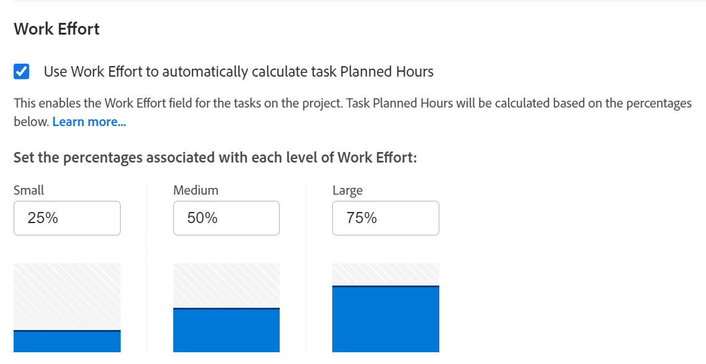

# Översikt över arbetsinsats

<!--Audited: 01/2024-->

<!--
(NOTE: Linked to the UI >> in the Project/ Template edit box > Tasks area> Learn more)
-->

Som projektledare kan du bestämma hur du vill beräkna hur mycket arbete som krävs för att slutföra uppgifter i ett projekt. Beräkna mängden arbete som behövs för att slutföra uppgifter med hjälp av någon av följande indikatorer:

<table style="table-layout:auto"> 
 <col> 
 <col> 
 <tbody> 
  <tr> 
   <td role="rowheader">Planerade timmar</td> 
   <td> <p> En manuell numerisk post eller en Adobe Workfront-beräkning som visar hur många timmar det skulle ta för resurserna som tilldelats en aktivitet för att slutföra den. </p> <p>Tänk på följande om Planerade timmar: </p> 
    <ul> 
     <li>Det här är standardmetoden. </li> 
     <li>Du kan bara uppdatera planerade timmar manuellt för uppgifter med varaktighetstypen Beräknat uppdrag eller Enkelt. </li> 
    </ul> <p>Mer information om planerade timmar finns i <a href="../../../manage-work/tasks/task-information/planned-hours.md" class="MCXref xref">Översikt över planerade timmar</a>. </p> </td> 
  </tr> 
  <tr> 
   <td role="rowheader">Arbetsinsats </td> 
   <td> <p>En manuell etikett som definierar om det tar en användare en liten, medelstor eller stor del av det dagliga arbetet att slutföra en uppgift. <!--
      <MadCap:conditionalText data-mc-conditions="QuicksilverOrClassic.Draft mode">
       The level of effort is estimated to be a percentage of the daily amount of working time. (NOTE: keep this drafted. Vazgen said it's not needed, but waiting for feedback from users)
      </MadCap:conditionalText>
     --> </p> <p>Tänk på följande när det gäller arbetsinsats:</p> 
    <ul> 
     <li>Det här fältet är bara tillgängligt för uppgifter med en enkel varaktighetstyp. </li> 
     <li>Du kan aktivera användningen av den här etiketten och definiera den procentandel av arbetstiden som är associerad med den på projektnivå. </li> 
    </ul> </td> 
  </tr> 
 </tbody> 
</table>

I den här artikeln beskrivs vad Arbete är och hur du bör använda det när du beräknar mängden arbete för dina uppgifter.

>[!NOTE]
>
>Planerade timmar och arbetsinsatser påverkar varandra. Om du uppdaterar de planerade timmarna kan arbetsinsatsen uppdateras och arbetsinsatsen kan uppdatera aktivitetens planerade timmar.

## Åtkomstkrav

+++ Expandera om du vill visa åtkomstkrav för funktionerna i den här artikeln.

<table style="table-layout:auto"> 
 <col> 
 <col> 
 <tbody> 
  <tr> 
   <td role="rowheader">Adobe Workfront package</td> 
   <td> <p>Alla</p> </td> 
  </tr> 
  <tr> 
   <td role="rowheader">Adobe Workfront-licens</td> 
   <td> <p>Standard</p>
   <p>Plan</p>
   </td> 
  </tr> 
  <tr> 
   <td role="rowheader">Konfigurationer på åtkomstnivå</td> 
   <td> <p>Redigera åtkomst till projekt och uppgifter</p> </td> 
  </tr> 
  <tr> 
   <td role="rowheader">Objektbehörigheter</td> 
   <td> <p>Hantera behörigheter för ett projekt och dess uppgifter</p>  </td> 
  </tr> 
 </tbody> 
</table>

Mer information finns i [Åtkomstkrav i Workfront-dokumentation](/help/quicksilver/administration-and-setup/add-users/access-levels-and-object-permissions/access-level-requirements-in-documentation.md).

+++

<!--Old:

<table style="table-layout:auto"> 
 <col> 
 <col> 
 <tbody> 
  <tr> 
   <td role="rowheader">Adobe Workfront plan</td> 
   <td> <p>Any</p> </td> 
  </tr> 
  <tr> 
   <td role="rowheader">Adobe Workfront license*</td> 
   <td> <p>Current: Plan </p>
   Or
   <p>New: Standard </p>
    </td> 
  </tr> 
  <tr> 
   <td role="rowheader">Access level configuration</td> 
   <td> <p>Edit access to Projects and Tasks</p> </td> 
  </tr> 
  <tr> 
   <td role="rowheader">Object permissions</td> 
   <td> <p>Manage permissions to a project and its tasks</p>  </td> 
  </tr> 
 </tbody> 
</table>-->

## Att tänka på vid användning av Arbetsinsats

* När projektaktiviteterna har 0 planerade timmar och du aktiverar inställningen Använd arbetsinsats för att automatiskt beräkna inställningen Planerade timmar för aktiviteten i projektet, kommer standardnivån för arbetsinsats som är associerad med dem att vara Medium. Planerade timmar uppdateras automatiskt för uppgifter av typen enkel varaktighet. Mer information finns i avsnittet [Nivåer för arbetsinsats](#levels-of-work-effort) i den här artikeln.
* När projektaktiviteterna har planerade timmar som är större än 0 och du aktiverar inställningen Använd arbetsinsats för att automatiskt beräkna inställningen för planerade timmar för aktiviteten i projektet, uppdateras nivån för arbetsinsats enligt antalet planerade timmar utan att ändra antalet planerade timmar för uppgifter av typen Enkel varaktighet. Mer information finns i avsnittet [Hur Workfront beräknar arbetsinsats baserat på Planerade timmar](#how-workfront-calculates-work-effort-based-on-planned-hours) i den här artikeln.
* När projektaktiviteterna har 0 planerade timmar och du aktiverar inställningen Använd arbetsinsats för att automatiskt beräkna inställningen Planerade timmar för aktiviteten i projektet och sedan uppdatera nivån för arbetsinsats från Medium till Liten eller Stor, uppdateras även Planerade timmar. Mer information finns i avsnittet [Hur Workfront beräknar planerade timmar baserat på arbetsinsats](#how-workfront-calculates-planned-hours-based-on-work-effort) i den här artikeln.
* När du infogar redigeringsuppgifter och ändrar både fältet Planerade timmar och Arbetsinsats för aktiviteten samtidigt, uppdateras de planerade timmarna med det värde du anger, medan värdet för Arbetsinsats beräknas baserat på dina uppdaterade planerade timmar.
* När du uppdaterar värdet för arbetsinsats för en uppgift beräknas varaktigheten inte längre automatiskt baserat på de planerade timmarna. Mer information om hur varaktigheten beräknas för enkla varaktighetsuppgifter finns i [Översikt över varaktighetstyp: Enkel](../../../manage-work/tasks/taskdurtn/simple-duration-type.md).
* När du ändrar varaktighetstypen för en uppgift från Enkel till någon annan typ, är fältet Arbetskraft dolt för uppgiften. De planerade timmarna förblir oförändrade.
* Du kan inte uppdatera arbetsinsats för en överordnad aktivitet. Arbetsinsats för en överordnad uppgift beräknas automatiskt baserat på antalet planerade timmar för aktiviteterna som är en sammanslagning av alla underordnade uppgifter. Mer information om överordnade aktiviteter finns i [Skapa underaktiviteter](../../../manage-work/tasks/create-tasks/create-subtasks.md).

## Aktivera användning av Arbetskraft i stället för Planerade timmar

1. Gå till ett projekt och klicka på **Mer**-menyn  och klicka sedan på **Redigera**.
1. Klicka på **Aktivitetsinställningar** och välj sedan alternativet **Använd arbetsinsats för att automatiskt beräkna planerade timmar för aktiviteter**. Detta är som standard avmarkerat.

   

   Mer information om hur du aktiverar användningen av Arbetsinställningar för ett projekt finns i avsnittet Aktivitetsinställningar i artikeln [Redigera projekt](../../../manage-work/projects/manage-projects/edit-projects.md) .

1. Klicka på **Åtgärder** på den vänstra panelen och klicka sedan på namnet på en uppgift för att komma åt den.
1. Klicka på ikonen **Mer**  och klicka sedan på **Redigera**. Kontrollera att aktiviteten har en enkel varaktighetstyp.

   >[!TIP]
   >
   >Du kan även uppdatera arbetsinsatsen för en uppgift i avsnittet Uppgiftsinformation.

1. Klicka på listrutan Arbetskraft i området **Översikt** för att korrigera mängden arbete som krävs för att slutföra uppgiften.

   

   Mer information om hur du uppdaterar fältet Arbetskraft för en uppgift finns i följande artiklar:

   * Avsnittet Översikt i artikeln [Redigera uppgifter](../../../manage-work/tasks/manage-tasks/edit-tasks.md)
   * [Hantera aktivitetsinformation i området Översikt över aktivitetsinformation](../../../manage-work/tasks/manage-tasks/task-information-in-overview.md)

## Arbetsinsatser {#levels-of-work-effort}

Som projektledare kan du identifiera tre nivåer av arbetsinsats för dina projekt. Varje nivå av insats motsvarar en procentandel av den dagliga tiden som användarna måste slutföra uppgiften.

När du ställer in arbetsinsatsen måste du ställa dig själv frågan:&quot;Hur mycket tid ska en användare tillbringa på den här uppgiften dagligen för att få den klar i tid?&quot;

I följande tabell visas de möjliga nivåerna av arbetsinsats och deras standardprocentsatser. Som projektledare kan du uppdatera procentsatserna så att de passar din organisations behov. Det gör du när du redigerar ett projekt. Mer information om hur du redigerar projekt finns i [Redigera projekt](../../../manage-work/projects/manage-projects/edit-projects.md).

Som Workfront-administratör definierar du de normala timmarna per arbetsdag i området Projektinställningar i installationsprogrammet. Detta är den dagliga tiden som räknas som arbetstid. Mer information om hur du konfigurerar projektinställningar för din instans av Workfront finns i [Konfigurera systemomfattande projektinställningar](../../../administration-and-setup/set-up-workfront/configure-system-defaults/set-project-preferences.md).

>[!NOTE]
>
>I exemplen nedan antar vi att Workfront-administratören har angett det normala antalet timmar per arbetsdag till 8 timmar.

<table style="table-layout:auto"> 
 <col> 
 <col> 
 <tbody> 
  <tr> 
   <td>Arbetsinsats</td> 
   <td>Procentvärden</td> 
  </tr> 
  <tr> 
   <td>Liten </td> 
   <td>En liten arbetsinsats för att slutföra en uppgift anges till 25 % av de normala timmarna per arbetsdag. Det innebär att en uppgift som tilldelats denna nivå av arbetsinsats bör ta upp till 2 timmar om dagen att slutföra på en dag. <code>(0.25*8=2)</code></td> 
  </tr> 
  <tr> 
   <td>Medium</td> 
   <td> <p>En Medium-nivå för att slutföra en uppgift är 50 % av de normala timmarna per arbetsdag. Det innebär att en uppgift som tilldelats denna nivå av arbetsinsats bör ta mer än 2 och mindre än 6 timmar att slutföra på en dag. <code>(0.50*80=4)</code> </p> <p>Obs! När inställningen Använd arbetsinsats för att automatiskt beräkna aktivitetens planerade timmar är aktiverad i projektet är det här standardinställningen för en aktivitet, om aktiviteten hade 0 planerade timmar innan den här inställningen var aktiverad. Detta gör att aktiviteten Planerade timmar uppdateras till 4 timmar. </p> </td> 
  </tr> 
  <tr> 
   <td>Stor</td> 
   <td>En stor arbetsinsats för att slutföra en uppgift anges till 75 % av de normala timmarna per arbetsdag. Det innebär att en uppgift som tilldelats denna nivå av arbetsinsats bör ta minst sex timmar att slutföra på en dag. <code>(0.75*8=6)</code></td> 
  </tr> 
 </tbody> 
</table>

## Hur Workfront beräknar planerade timmar baserat på arbetsinsats {#how-workfront-calculates-planned-hours-based-on-work-effort}

När du aktiverar inställningen Använd arbetsinsats för att automatiskt beräkna inställningen för aktivitetsplanerade timmar för ett projekt, beräknas antalet planerade timmar för en aktivitet med en enkel varaktighetstyp enligt följande formel:

```
Task Planned Hours = Number of days in task Duration * Work Effort percentage * Typical hours per work day
```

En uppgift med en varaktighet på 3 dagar och en arbetsinsats på Medium har till exempel 12 planerade timmar:

```
Planned Hours = 3*4=12
```

där värdet för Normal arbetstid är 8 timmar.

>[!TIP]
>
>När en aktivitet tilldelas till flera resurser fördelas de planerade timmarna jämnt mellan varje resurs för varje dag som aktiviteten varar.

## Hur Workfront beräknar arbetsinsatsen baserat på planerade timmar {#how-workfront-calculates-work-effort-based-on-planned-hours}

När du aktiverar inställningen Använd arbetsinsats för att automatiskt beräkna inställningen Planerade timmar för en uppgift i ett projekt och du redan har planerade timmar för uppgiften eller redigerar antalet planerade timmar för uppgiften, uppdaterar Workfront värdet för Arbetsinsats.

Workfront använder följande formel för att uppdatera arbetsinsatsen enligt de planerade timmarna:

```
Work Effort level = Task Planned Hours / Duration / Typical hours per work day
```

Om du till exempel har en aktivitet med en varaktighet på 2 dagar och du uppdaterar de planerade timmarna från 8 till 20 timmar, uppdateras arbetsinsatsen för aktiviteten från Medium till Stor:

```
Work Effort level = 20 / 2 / 8 = 125 % = Large
```

## Hitta arbetsinsats för uppgifter och projekt

* [Arbetsinsats för projekt](#work-effort-for-projects)
* [Arbetsinsats för uppgifter](#work-effort-for-tasks)

### Arbetsinsats för projekt {#work-effort-for-projects}

Du hittar avsnittet Arbetsinsats i ett projekt i följande område:

* Området Uppgiftsinställningar i rutan Redigera projekt

### Arbetsinsats för uppgifter {#work-effort-for-tasks}

Du hittar fältet Arbetsinsats för en uppgift i följande områden:

* Området Översikt i rutan Redigera uppgift
* Området Översikt i avsnittet Uppgiftsinformation, i området Arbetstid
* En uppgiftslista eller rapport
