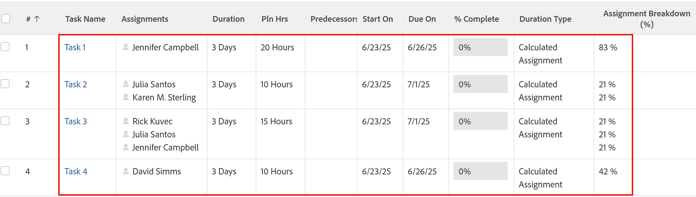

# Översikt över varaktighetstyp: Beräknat uppdrag

<!-- Audited: 5/2025 -->

Beräknad tilldelning är en varaktighetstyp som du kan ange för en uppgift i Adobe Workfront. Allmän information om varaktighetstyper i Workfront finns i [Översikt över aktivitetsvaraktighet och varaktighetstyp](../../../manage-work/tasks/taskdurtn/task-duration-and-duration-type.md).

## Översikt över den beräknade varaktighetstypen för tilldelning

<!--
<p data-mc-conditions="QuicksilverOrClassic.Draft mode">(NOTE: This Hub issue has a powerpoint that highlights information that is useful to users when using Calculated Assignment duration type. I don't think we can use the powerpoint, because it's old. I also don't know if the things they discuss are still relevant, since the PP is from 2015. I've closed the issue, but I'm putting a link here just in case the info is useful. https://hub.workfront.com/issue/5a9dd7d5007d02a8966014557c23cc89/updates)</p>
-->

* När du använder en beräknad tilldelningens varaktighetstyp måste du ange både en varaktighet och ett antal planerade timmar för aktiviteten. Workfront dividerar sedan beloppet för Planerade timmar med antalet timmar i Varaktighet, och sedan med antalet resurser som tilldelats aktiviteten för att beräkna allokeringsprocenten (beräknar tilldelningen) för varje resurs. Varje resurs får samma värde för sin allokeringsprocent. I det här fallet kan du inte ändra allokeringsvärdena för varje resurs.
* Workfront eller en gruppadministratör kan ange systemets eller gruppens standardvaraktighetstyp som beräknad tilldelning. I det här fallet skapas alla nya uppgifter med den här varaktighetstypen. Mer information om hur du ändrar uppgifter och utgåvor som en del av dina projektinställningar på system- eller gruppnivå finns i [Konfigurera uppgifter och ärenden för hela systemet](../../../administration-and-setup/set-up-workfront/configure-system-defaults/set-task-issue-preferences.md).

  I det här fallet har aktiviteten standardvärdet en dagslängd och 0 timmars planerade timmar som standard. Såvida inte projektledaren anger en mer korrekt varaktighet och fyller i fältet Planerade timmar med en realistisk uppskattning, verkar resurserna vara underallokerade.

Beräknad tilldelning är den önskade varaktighetstypen i följande situationer:

* När uppdrag har ett aktivitetsfönster men inte hela den tid som tilldelats för att slutföra arbetet. Du har till exempel tilldelats att leverera en rapport till den ansvarige i slutet av veckan. Du har fem dagar på dig, men det tar bara 10 timmar att göra ett utkast.
* När en enskild resurs tilldelas till en aktivitet eftersom projektledaren kan uppskatta planerad varaktighet och planerad ansträngningsmängd oberoende av varandra.

  Du kan använda den beräknade varaktighetstypen för arbete för samma resultat, men projektledaren måste ange en procentallokering för resursen för att det beräknade värdet för Planerade timmar ska påverkas. Detta gör projektplaneringen svårare och mer tidskrävande.

Allokeringsprocenten för varje resurs beräknas enligt följande:

```
Planned Hours / Duration / Number of Resources = Allocation Percentage for each resource
```

I scenariot nedan har till exempel varje uppgift en varaktighet på 3 dagar. Projektledaren anger manuellt både tidslängd (3 dagar eller 24 timmar) och Planerade timmar, och som resultat beräknas allokeringsprocenten (eller tilldelningsprocenten):



## Ändra varaktighetstypen för en aktivitet till Beräknat uppdrag

Mer information om hur du ändrar varaktighetstypen för en aktivitet finns i [Uppdatera varaktighetstypen för en aktivitet](../../../manage-work/tasks/taskdurtn/update-duration-type-of-task.md).

<!--
<p data-mc-conditions="QuicksilverOrClassic.Draft mode">(NOTE: replaced with new article linked above)</p>
-->

<!--
<ol data-mc-conditions="QuicksilverOrClassic.Draft mode">
<li value="1">Go to a task for which you want to change the Duration Type.</li>
<li value="2"> <p data-mc-conditions="QuicksilverOrClassic.Quicksilver">Click <strong>Task Details</strong> in the left panel, then in the Overview area double click <strong>Duration Type</strong>. </p> </li>
<li value="3">Select <strong>Calculated Assignment</strong> from the drop-down menu.</li>
<li value="4">Click <strong>Save</strong> <strong>Changes</strong>.</li>
</ol>
-->
