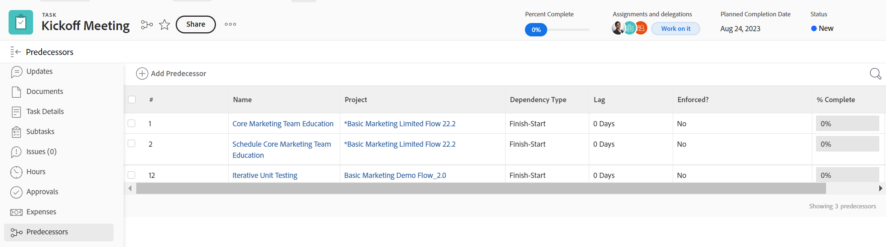
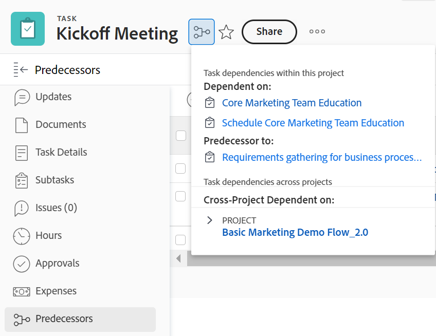

# Översikt över föregående aktiviteter

<!--Audited: 12/2023-->

<!-- 

CONTEXT SENSITIVE HELP article. DO NOT CHANGE THE NAME OF THE ARTICLE/ DO NOT MOVE OR DELETE! -->

En föregångare är den uppgift som en annan aktivitet (kallas efterföljande eller beroende uppgift) är beroende av. Adobe Workfront stöder fem typer av beroenden av föregångare. Mer information om föregående beroenden finns i [Översikt över typer av uppgiftsberoenden](../../../manage-work/tasks/use-prdcssrs/task-dependency-types.md).

## Översikt över Föregående

Förståelse av föregångarfunktioner är viktigt för att förstå tidslinjerna i dina projekt.

Det finns aktivitetsföregångarrelationer både mellan aktiviteter i ett enskilt projekt och mellan aktiviteter från olika projekt.

Om du är beroende av flera projekt kan du skapa föregående projekt mellan aktiviteter från två olika projekt.

Oavsett om föregående och efterföljande aktiviteter tillhör samma projekt eller två olika projekt beräknas beroenden och tidslinjer för varje projekt på samma sätt.

När det gäller föregångare påverkas projekttidslinjen av följande:

* Föregående beroenden
* Laga värde och typ\
  Mer information om både beroende och fördröjning finns i [Exempel på föregående värden i en uppgiftslista](#examples-of-predecessor-values-in-a-task-list).

  Om till exempel uppgift A är en föregångare till uppgift B i en slutstartrelation, och uppgift B har en uppgiftsbegränsning som är så snart som möjligt, tilldelar Workfront uppgift B ett planerat startdatum omedelbart efter det planerade avslutningsdatumet för uppgift A, oavsett om föregångaren har verkställts eller inte.

För att förstå tidigare relationer måste du förstå:

* **Beroendetyper:** Föregångare länkas av olika beroendetyper. Mer information om beroendetyper finns i [Översikt över typer av uppgiftsberoenden](../../../manage-work/tasks/use-prdcssrs/task-dependency-types.md).

* **Tvinga en föregångare:** När en föregångare verkställs kan den efterföljande uppgiften inte börja förrän föregångaren är klar. Efterföljande uppgift visas som start direkt efter att föregående har slutförts.

  När föregående inte har slutförts (eller startats) och den inte används kan efterföljande aktivitet starta, men projekttidslinjen påverkas fortfarande av datumen för både föregående och efterföljande aktiviteter.

  Med en framtvingad föregångare tillåter inte Workfront att efterföljande aktivitet markeras som Pågår eller Fullständig förrän föregående har slutförts.

  Workfront tillåter dock att timmar rapporteras för uppgiften.\
  Mer information om att framtvinga föregående aktiviteter finns i [Tvinga föregående](../../../manage-work/tasks/use-prdcssrs/enforced-predecessors.md).

* **Lager:** Du kan skapa fördröjningar i dina beroenden som skapar en fördröjning som måste inträffa när en föregående aktivitet har slutförts och innan efterföljande aktivitet kan börja. Lagar påverkar tidslinjen i projektet.

  Mer information om fördröjningstyper finns i [Översikt över fördröjningstyper](../../../manage-work/tasks/use-prdcssrs/lag-types.md).

## Skapa tidigare relationer

Se någon av följande artiklar om du vill skapa föregångare:

* Information om hur du upprättar föregångare med hjälp av fliken Föregående för uppgiften finns i [Skapa en föregående relation med området Föregående](../../../manage-work/tasks/use-prdcssrs/create-predecessors-in-predecessors-area.md).
* Information om hur du upprättar föregående aktiviteter i en uppgiftslista finns i [Skapa en föregående relation i uppgiftslistan](../../../manage-work/tasks/use-prdcssrs/create-predecessors-on-task-list.md).
* Information om hur du upprättar föregående relationer genom att kedja uppgifter finns i [Skapa tidigare relationer genom att kedja uppgifter](../../../manage-work/tasks/use-prdcssrs/create-predecessors-by-chaining-tasks.md).
* Mer information om hur du upprättar föregående projekt finns i [Skapa föregångare mellan projekt](../../../manage-work/tasks/use-prdcssrs/cross-project-predecessors.md).

## Hitta föregående aktiviteter för en uppgift {#locate-the-predecessors-of-a-task}

Gör något av följande för att hitta föregående aktiviteter för en uppgift:

* Gå till det projekt du arbetar med och gör följande:

   1. Leta reda på uppgiften som du vill hitta föregående aktiviteter för och klicka på uppgiften.
   1. Klicka **Föregående** till vänster. Du kan behöva klicka **Visa fler** sedan **Föregående**.
   1. Namnet på det projekt som föregångaren är på visas i **Projekt** kolumn.

      Numret i **#** -kolumnen visar föregående aktivitetsnummer. &quot;6&quot; innebär till exempel den sjätte uppgiften i projektet.

      

* Gå till det projekt du arbetar med och gör följande:

   1. Klicka på **Uppgifter** -fliken.
   1. Välj **Standardvy** högst upp i uppgiftslistan.
   1. The **Föregående** -kolumnen visar föregående aktivitetsnummer.

      För en föregångare för flera projekt visar kolumnen Föregående deltagare referensnumret för det projekt som föregångaren tillhör och antalet uppgifter, avgränsade med kolon.

      Föregående-ikonen blir grön när föregående aktivitet har markerats som slutförd. Detta signalerar att den beroende aktiviteten är klar för arbete.

      Hovra över det här värdet om du vill ha mer information om föregående, projektet och datumen.

      

## Exempel på föregående värden i en uppgiftslista {#examples-of-predecessor-values-in-a-task-list}

När du visar föregående aktiviteter i en lista med uppgifter kan du se någon av följande typer av föregående aktiviteter med deras respektive beroendetyper och förseningsmängder:

* **1fs -** Föregående aktivitetsnummer är 1. Beroendetypen är Finish-Start. På projekttidslinjen schemaläggs den här aktiviteten att starta omedelbart efter att uppgift 1 är slutförd. Trots detta kan den fortfarande markeras som Pågår eller Fullständigt.
* **1 -** Föregående aktivitetsnummer är 1. Det här är samma sak som **1fs**, eftersom **fs** är standardrelationen för föregångare i Workfront.

* **1fse -** Föregående aktivitetsnummer är 1. Beroendetypen är Finish-Start-Enforced. På projekttidslinjen visas den här aktiviteten som påbörjad omedelbart efter att uppgift 1 är slutförd. Workfront tillåter inte att den markeras som Pågår eller Fullständigt förrän uppgift 1 är slutförd. Workfront tillåter dock att timmar rapporteras för uppgiften.
* **1fs+3d -** Föregående aktivitetsnummer är 1. Beroendetypen är Finish-Start med en fördröjningstid på 3 dagar. På projekttidslinjen visas den här aktiviteten som 3 arbetsdagar efter att uppgift 1 är slutförd.
* **1fs-3d -** Föregående aktivitetsnummer är 1. Beroendetypen är Finish-Start med en fördröjningstid på 3 dagar. På tidslinjen för projektet visas den här aktiviteten som tre arbetsdagar innan föregående aktivitet är klar.
* **1fs+3de** -Föregående aktivitetsnummer är 1. Beroendetypen är Finish-Start-Enforced med en fördröjningstid på 3 dagar. På projekttidslinjen visas den här aktiviteten som 3 arbetsdagar efter att uppgift 1 är slutförd. Workfront tillåter inte att den markeras som Pågår eller Fullständigt förrän Aktivitet 1 har slutförts. Workfront tillåter dock att timmar rapporteras för uppgiften.

  >[!NOTE]
  >
  >Du måste lägga till det tvingande värdet (**e**) till Lag och inte till föregångaren.

* **4515:2** Föregående aktivitetsnummer är 2. - Det här är ett slutdatum till början, ett beroende som inte krävs med föregångaren i projektet med referensnummer **4515**.

## Visa föregående information

Du kan visa föregående information i följande områden i Workfront. Här finns information om föregångare mellan projekt:

* På aktivitetsnivån i avsnittet Föregående.

  Information om hur du visar föregående information i avsnittet Föregående användare finns i avsnittet [Hitta föregående aktiviteter för en uppgift](#locate-the-predecessors-of-a-task) i den här artikeln.

* I Gantt-diagrammet.

  Mer information om hur du visar föregångare i Gantt-schemat finns i [Konfigurera hur information visas i Gantt-schemat](../../../manage-work/gantt-chart/use-the-gantt-chart/configure-info-on-gantt-chart.md).

* I en uppgiftslista.

  Om du vill visa information om föregående aktiviteter för dina uppgifter i en uppgiftslista kan du göra något av följande:

   * Använd den inbyggda standardvyn i en lista med uppgifter.

     Mer information om hur du visar information om föregående i standardvyn finns i avsnittet [Hitta föregående aktiviteter för en uppgift](#locate-the-predecessors-of-a-task) i den här artikeln.

   * Skapa en uppgiftsvy eller rapport och lägg till kolumnen Föregående aktiviteter i den vyn.

     Mer information om hur du skapar en anpassad vy för uppgifter med föregående information finns i [Visa: information om föregående](../../../reports-and-dashboards/reports/custom-view-filter-grouping-samples/view-predecessor-details.md).

* I uppgiftshuvudet vid åtkomst av uppgiften.

  
