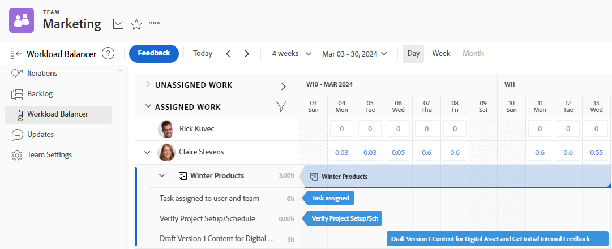

# Hantera vad teamet arbetar med

Du kan se en lista över objekt som ditt team arbetar med i [!UICONTROL Team Requests]-delen av ditt team.

Du kan tilldela ej tilldelade artiklar, justera aktuella tilldelningar, justera aktuella tilldelningar och mycket mer i [!UICONTROL Workload Balancer]-avsnittet i ditt team.

Mer information om hur du hanterar arbete som tilldelats ditt team finns i [[!UICONTROL Workload Balancer]](../../resource-mgmt/workload-balancer/assign-work-in-workload-balancer.md).

