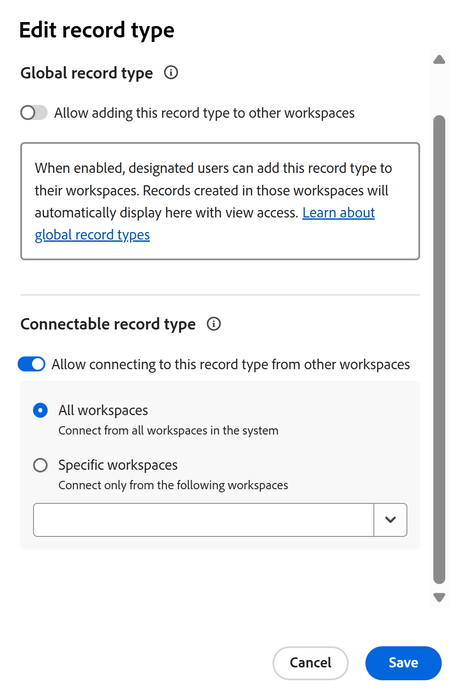

<!--*******************REPLACE THE "ADVANCED SETTINGS" SECTION IN THE "EDIT RECORD TYPES" ARTICLE WITH A LINK TO THIS ARTICLE INSTEAD AND REMOVE THE STEPS FROM THE "EDIT RECORD TYPES" ARTICLE ON HOW TO ALLOW CROSS-WORKSPACE SETTINGS FOR RECORD TYPES*************-->

# Konfigurera funktioner för olika arbetsytor för posttyper

<!--this article is linked to the UI in the Advanced settings/ Cross-workspace settings tab - do not delete or change the URL-->

{{planning-important-intro}}

Informationen som är markerad på den här sidan avser funktioner som ännu inte är allmänt tillgängliga. Det är bara tillgängligt i förhandsvisningsmiljön för alla kunder. Efter de månatliga releaserna i Production finns samma funktioner även i produktionsmiljön för kunder som aktiverat snabba releaser. 

Mer information om snabba releaser finns i [Aktivera eller inaktivera snabba releaser för din organisation](/help/quicksilver/administration-and-setup/set-up-workfront/configure-system-defaults/enable-fast-release-process.md). 

Du kan konfigurera posttyper så att de fungerar på flera arbetsytor i Adobe Workfront Planning.

Du kan ange en posttyp på något av följande sätt:

* **En global posttyp**: användare kan lägga till globala posttyper i andra arbetsytor som de kan hantera.
* **En kopplingsbar posttyp**: användare kan ansluta till den här posttypen från andra arbetsytor.

Du måste först definiera funktionerna för en posttyps arbetsyta innan arbetsytehanterare kan lägga till den eller ansluta den från andra arbetsytor.

Du definierar arbetsytefunktionerna för en posttyp när du skapar eller redigerar en posttyp.

Mer information finns i följande artiklar:

* [Skapa posttyper](/help/quicksilver/planning/architecture/create-record-types.md)
* [Redigera posttyper](/help/quicksilver/planning/architecture/edit-record-types.md)

## Åtkomstkrav

+++ Expandera om du vill visa åtkomstkraven för funktionerna i den här artikeln.

<table style="table-layout:auto"> 
<col> 
</col> 
<col> 
</col> 
<tbody> 
    <tr> 
<tr> 
</tr>   
<tr> 
   <td role="rowheader">
Adobe Workfront package
</td> 
   <td> 

Så här konfigurerar du kopplingsbara posttyper: 

<ul> 
<li>
Alla Workfront-paket och alla Planning-paket
</li>
eller
<li>Alla arbetsflöden och ett Planning Prime- eller Ultimate-paket
</li></ul>

Så här konfigurerar du globala posttyper:

<ul> 
<li>
Alla Workfront-paket och ett Planning Plus-paket
</li>
eller
<li>
Alla arbetsflöden och ett Planning Prime- eller Ultimate-paket
</li></ul>

Mer information om vad som ingår i respektive Workfront Planning-paket får du av Workfront. 

</td> 
  <tr> 
   <td role="rowheader">
Adobe Workfront-licens
</td> 
   <td>
Standard

   </td> 
  </tr> 
  <tr> 
   <td role="rowheader">
Objektbehörigheter
</td> 
   <td>   
Hantera behörigheter till en arbetsyta
  
   
Systemadministratörer har behörighet till alla arbetsytor, inklusive de som de inte skapade
  </td> 
  </tr>  
</tbody> 
</table>

Mer information om Workfront åtkomstkrav finns i [Åtkomstkrav i Workfront-dokumentationen](/help/quicksilver/administration-and-setup/add-users/access-levels-and-object-permissions/access-level-requirements-in-documentation.md).

+++   

<!--Old:

<table style="table-layout:auto"> 
<col> 
</col> 
<col> 
</col> 
<tbody> 
    <tr> 
<tr> 

  </tr>   
<tr> 
   <td role="rowheader">
Adobe Workfront package
</td> 
   <td> 
<ul><li>
Any Workfront package
</li>

And

<li>
Any Planning package to create connectable record types
</li>
<li>
A Planning Plus package to create global record types
</li>
</ul>
Or:
<ul><li>
A Workflow Prime or Ultimate package
 </li>
And
<li>
A Planning Prime or Ultimate package
</li></ul>

For more information about what is included in each Workfront Planning package, contact your Workfront account manager. 
 
   </td> 
  <tr> 
   <td role="rowheader">
Adobe Workfront license
</td> 
   <td>
Standard

   </td> 
  </tr> 
  <tr> 
   <td role="rowheader">
Object permissions
</td> 
   <td>   
Manage permissions to a workspace and to the record type</a> 
  
   
System Administrators have permissions to all workspaces, including the ones they did not create
  </td> 
  </tr>  
</tbody> 
</table> -->

## Konfigurera globala posttyper

<!--this is a UI term; don't change the title of this section-->

Som arbetsytehanterare kan du konfigurera en posttyp så att den blir en global posttyp. En global posttyp kan läggas till i andra arbetsytor.

En arbetsytehanterare kan lägga till en global posttyp på en arbetsyta som de hanterar. Posttypens originalfält läggs också till på den sekundära arbetsytan.

Användare kan lägga till poster i en global posttyp från alla arbetsytor där de har Contribute-behörigheter och där den globala posttypen läggs till, inklusive den ursprungliga arbetsytan. De kan visa poster från arbetsytor som de bara har behörigheten Visa till från den primära arbetsytan för den globala posttypen.

Mer information finns i [Posttyper för arbetsytan - översikt](/help/quicksilver/planning/architecture/cross-workspace-record-types-overview.md).

Så här konfigurerar du en posttyp som global:

{{step1-to-planning}}

1. Klicka på arbetsytan vars posttyper du vill konfigurera som globala.

   Arbetsytans sida öppnas och posttyperna visas.
1. Gör något av följande:

   * Håll pekaren över kortet för en posttyp och klicka på menyn **Mer**  i det övre högra hörnet av posttypskortet.

     

   * Klicka på ett posttypskort för att öppna posttypssidan och klicka sedan på menyn **Mer**  till höger om posttypens namn.
1. Klicka på **Redigera** eller **Inställningar**.

   >[!TIP]
   >
   >När en posttyp läggs till på en annan arbetsyta visas den som en global posttyp på den arbetsytan. I det här fallet har alternativen Redigera och Inställningar tagits bort.

1. (Villkorligt) Om du klickade på **Redigera** klickar du på fliken **Inställningar för arbetsytan** i rutan **Redigera posttyp**

   Om du klickade på **Inställningar** kan du klicka på avsnittet **Inställningar för arbetsytan mellan arbetsytor** i den vänstra panelen.
1. Aktivera inställningen **Tillåt att den här posttypen läggs till i andra arbetsytor**.

   

   >[!TIP]
   >
   >När du har lagt till en global posttyp på en annan arbetsyta kan den här inställningen inte längre inaktiveras.

1. I fältet **Välj vem som kan lägga till den här posttypen i arbetsytor som de hanterar** lägger du till entiteter som du vill tillåta att den här posttypen läggs till i arbetsytor som de hanterar.

   Ditt namn läggs automatiskt till i fältet.

   Du kan lägga till enskilda användare, grupper, team, jobbroller eller företag vars användare du vill tillåta att den här posttypen läggs till på de arbetsytor som de hanterar.

   Du kan redigera det här fältet när du har sparat posttypen.

1. (Valfritt) Ta bort ditt namn från fältet **Välj vem som kan lägga till den här posttypen i arbetsytor som de hanterar**.

   >[!TIP]
   >
   >Du måste utse minst en enhet (användare, team, grupp, roll eller företag) för att kunna aktivera den här inställningen.

1. (Villkorligt) Klicka på **Spara** i rutan **Redigera posttyp** eller klicka på bakåtpilen till vänster om avsnittet **Inställningar** i sidhuvudet för att spara ändringarna.

   Följande saker händer:

   * Posttypen och dess fält är nu tillgängliga och kan läggas till på en annan arbetsyta av de personer du har angett.

   >[!NOTE]
   >
   >Du kan bara redigera posttypens utseende och inställningar och dess ursprungliga fält från den ursprungliga arbetsytan.

   * På posttypskortet visas en **global posttyp** ikon  som anger att posttypen är tillgänglig för tillägg till andra arbetsytor.
   * Ett systemgenererat **Workspace**-fält läggs till i registervyn för posttypen och dess posterdetaljer.

     I fältet Workspace visas arbetsytan där varje post skapas.

     Det här fältet är skrivskyddat och kan inte tas bort.

     >[!TIP]
     >
     >Om fältvärdet för fältet **Workspace** är tomt skapades posten från en sekundär arbetsyta där den globala posttypen togs bort efter att posten skapades.

1. (Valfritt) Gå till en annan arbetsyta och skapa en posttyp med en befintlig posttyp. Välj den posttyp som du aktiverade i stegen ovan.

   Mer information finns i [Lägga till befintliga posttyper från en annan arbetsyta](/help/quicksilver/planning/architecture/add-existing-record-types-from-another-workspace.md).

   Posttypen som läggs till från en global posttyp på den sekundära arbetsytan visar en liknande **global posttyp** -ikon  som innehåller en pil, vilket anger att posttypen importerades från en annan arbetsyta. När du hovrar över den globala ikonen för den sekundära arbetsytan kan du lära dig namnet på den ursprungliga arbetsytan.
1. (Valfritt) Gå tillbaka till den ursprungliga arbetsytan där du skapade den globala posttypen och redigera posttypen genom att följa steg 1-4 ovan <!--ensure this stays accurate-->
1. (Valfritt) Granska listan över arbetsytor där den globala posten har lagts till i avsnittet **Arbetsytor där den här posttypen används**. Ägaren av arbetsytan visas också bredvid arbetsytans namn.

   
1. (Valfritt) Klicka på namnet på en av arbetsytorna i avsnittet **Arbetsytor där den här posttypen används** för att öppna arbetsytan.

## Konfigurera posttyper som kan anslutas

<!--this is a UI term; don't change the title of this section-->

{{step1-to-planning}}

1. Klicka på arbetsytan vars posttyper du vill konfigurera som anslutningsbara.

   Arbetsytans sida öppnas och posttyperna visas.
1. Gör något av följande:

   * Håll pekaren över kortet för en posttyp och klicka på menyn **Mer**  i det övre högra hörnet av posttypskortet

     

   * Klicka på ett posttypskort för att öppna posttypssidan och klicka sedan på menyn **Mer**  till höger om posttypens namn.
1. Klicka på **Redigera** eller **Inställningar**.

1. (Villkorligt) Om du klickade på **Redigera** klickar du på fliken **Inställningar för arbetsytan** i rutan **Redigera posttyp**

   Om du klickade på **Inställningar** kan du klicka på avsnittet **Inställningar för arbetsytan mellan arbetsytor** i den vänstra panelen.

1. Aktivera inställningen **Tillåt anslutning till den här posttypen i andra arbetsytor**. <!-- check the setting name, I sent this to Lilit to say FROM instead of IN-->

   <!-- add new screen shot with new tab name-->

   

   När det här alternativet är aktiverat är posttypen tillgänglig och kan anslutas till från andra arbetsytor.

1. Välj från vilka arbetsytor som posttypen kan nås. Välj bland följande alternativ:

   <!--check names of the setting: System wide?? OR All workspaces??-->

   * **Alla arbetsytor**: Användare kan ansluta till den här posttypen från alla arbetsytor där de har behörigheten Hantera.
   * **Specifika arbetsytor**: Lägg till namnen på arbetsytorna där arbetsytehanterare kan ansluta till den här posttypen från den nedrullningsbara menyn.
1. (Villkorligt) Klicka på **Spara** i rutan **Redigera posttyp** eller klicka på bakåtpilen till vänster om **Inställningar** i sidhuvudet för att spara ändringarna.

   Följande saker händer:

   * Posttypen och dess fält är nu tillgängliga för anslutning från de arbetsytor du har angett.
   * Posttypskortet visar en ikon av typen  som anger att posttypen är tillgänglig för anslutning från en arbetsyta som du har angett i konfigurationen.

1. (Valfritt) Gå till en annan arbetsyta och lägg till en anslutning till den posttyp som du har aktiverat för anslutningsbarhet mellan arbetsytor i stegen ovan.

   Mer information finns i [Koppla posttyper](/help/quicksilver/planning/architecture/connect-record-types.md).

