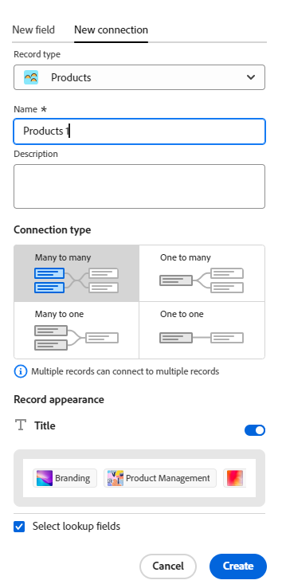

<!--keep the 30 limit verbiage in yellow til Jan 2026-->

# Översikt över anslutna posttyper

<!--The highlighted information on this page refers to functionality not yet generally available. It is available only in the Preview environment for all customers. After the monthly releases to Production, the same features are also available in the Production environment for customers who enabled fast releases.    

For information about fast releases, see [Enable or disable fast releases for your organization](/help/quicksilver/administration-and-setup/set-up-workfront/configure-system-defaults/enable-fast-release-process.md).   -->

Du kan ange att enskilda posttyper relaterar till varandra eller till objekt från andra program genom att koppla dem.

Den här artikeln är en översikt över posttypsanslutningar och beskriver de typer av anslutningar som du kan upprätta mellan post- och objekttyper.

Mer information om hur du ansluter posttyper finns i [Koppla posttyper](/help/quicksilver/planning/architecture/connect-record-types.md).

## Att tänka på när du ansluter posttyper

* För att enskilda poster eller objekt ska kunna kopplas till varandra måste posttyperna först kopplas till objekttyper.

  Du kan koppla posttyper och objekttyper till varandra på följande sätt:

   * Manuellt
   * Automatiskt

  >[!NOTE]
  >
  >Du kan ha upp till 30 anslutna fält för en posttyp i Workfront Planning.

* Tänk på följande när du ansluter post- och objekttyper:

   * Du kan lägga till ett nytt anslutningsfält från en posttyp manuellt för att ansluta följande enheter i Workfront Planning:

      * Två posttyper

        Som standard kan du koppla två posttyper från samma arbetsyta. Du kan också ställa in posttyper för att ansluta till posttyper från andra arbetsytor om din organisation har köpt ett högre Workfront- eller Planning-paket. Mer information finns i [Redigera posttyper](/help/quicksilver/planning/architecture/edit-record-types.md).
      * En posttyp och en objekttyp från ett annat program.

     Mer information om hur du kan ansluta post- och objekttyper finns i [Koppla posttyper](/help/quicksilver/planning/architecture/connect-record-types.md).

     När du har kopplat posttyper till andra post- eller objekttyper manuellt kan du koppla enskilda poster och objekt.

     Mer information finns i [Anslut poster](/help/quicksilver/planning/records/connect-records.md).

   * En anslutning mellan enheter upprättas automatiskt i följande scenarier:

      * När du använder en automatisering för att skapa poster från en posttyps sida.

        Anslutningen mellan posttyperna eller posttypen och objekttypen från ett annat program skapas automatiskt när den anslutna posten eller objektet skapas i automatiseringen.

        Mer information finns i [Konfigurera Adobe Workfront Planning Automations](/help/quicksilver/planning/records/configure-automations-to-create-records.md).

      * När du konfigurerar förfrågningsformulär för en posttyp för att skapa en post eller ett objekt.

        Anslutningen mellan posttypen och objekttypen för begäran skapas automatiskt när du skickar och godkänner en planeringsbegäran som skapar en post.

        Mer information finns i [Skicka Adobe Workfront Planning-begäranden för att skapa poster](/help/quicksilver/planning/requests/submit-requests.md).

        Du kan visa den ursprungliga begäran under Begäranden i Workfront<!--, or in the Original Request connection field in Workfront Planning.-->.

   * Du kan koppla posttyper för Workfront Planning till följande objekttyper från följande program:

      * Adobe Workfront:

         * Projekt
         * Portföljer
         * Program
         * Företag
         * Grupp

      * Adobe Experience Manager Assets:

         * Bilder
         * Mappar

      * Adobe GenStudio for Performance Marketing

         * Varumärken

        >[!IMPORTANT]
        >
        >Du måste ha följande för att kunna kontakta Adobe Experience Manager Assets och GenStudio varumärken:
        >* En Adobe Experience Manager Assets-licens
        >* En Adobe GenStudio for Performance Marketing-licens
        >* Din organisations instans av Workfront måste vara registrerad på Adobe Business Platform eller Adobe Admin Console för att kunna ansluta Workfront Planning-poster till Adobe Experience Manager Assets.
        >Mer information om Adobe Admin Console finns i [Adobe Unified Experience FAQ](/help/quicksilver/workfront-basics/navigate-workfront/workfront-navigation/unified-experience-faq.md).

* När två posttyper eller en posttyp och en objekttyp från ett annat program är sammankopplade finns följande scenarier:

   * **När du ansluter två typer av planeringspost** skapas ett länkat postfält för den posttyp som du ansluter från. Ett liknande länkat postfält skapas bara för den posttyp du ansluter till när du aktiverar inställningen Skapa motsvarande fält för länkad posttyp på fliken Ny anslutning.

     Om du till exempel ansluter posttypen&quot;Campaign&quot; med posttypen&quot;Product&quot; skapas ett länkat postfält (anslutningsfält) som du kallar&quot;Linked Product&quot; i posttypen Campaign. En länkad posttyp som automatiskt heter&quot;Campaign&quot; skapas på produktposttypen.

     Följande scenarier finns till exempel:

      * När du aktiverar fältet Skapa motsvarande för den länkade posttypsinställningen och kopplar posttypen &quot;Campaign&quot; med posttypen &quot;Product&quot;, skapas ett länkat postfält (anslutningsfält) som du namnger &quot;Linked Product&quot; för kampanjposttypen. En länkad posttyp som automatiskt heter&quot;Campaign&quot; skapas på produktposttypen.
      * När du inaktiverar fältet Skapa motsvarande för den länkade posttypsinställningen och kopplar posttypen &quot;Campaign&quot; med posttypen &quot;Product&quot;, skapas ett länkat postfält (anslutningsfält) som du kallar &quot;Linked Product&quot; för kampanjposttypen. En länkad posttyp med namnet&quot;Campaign&quot; skapas inte i produktposttypen.

     Mer information finns i [Koppla posttyper](/help/quicksilver/planning/architecture/connect-record-types.md).

   * **När du ansluter en posttyp med en objekttyp från ett annat program**:

      * Ett länkat postfält skapas för den posttyp som du ansluter från. Inget länkat postfält skapas automatiskt i det andra programmets objekttyp.
      * Planeringspostfält är inte tillgängliga från Workfront-objekt.
      * Planeringsposter visas från Workfront-objektets Planning-avsnitt. Mer information finns i [Hantera postanslutningar från Workfront-objekt](/help/quicksilver/planning/records/manage-records-in-planning-section.md).
      * Du kan skapa ett anpassat fält för planeringsanslutning och koppla det till ett Workfront-objekts anpassade formulär. Mer information finns i [Skapa ett anpassat formulär](/help/quicksilver/administration-and-setup/customize-workfront/create-manage-custom-forms/form-designer/design-a-form/design-a-form.md).
      * Du kan planera postfält från Experience Manager-resurser när Workfront-administratören konfigurerar metadatamappningen genom integrationen mellan Workfront och Adobe Experience Manager Assets. Mer information finns i [Konfigurera mappning av metadata för resurser mellan Adobe Workfront och Experience Manager Assets](https://experienceleague.adobe.com/sv/docs/experience-manager-cloud-service/content/assets/integrations/configure-asset-metadata-mapping).
      * Det går inte att komma åt planeringspostfält från varumärken i GenStudio for Performance Marketing.

   * **När du lägger till uppslagsfält från posten eller objektet som du ansluter till**: Förutom att skapa ett länkat postfält kan du även ansluta till fält från den anslutna posten eller objekttypen som kallas uppslagsfält. Ett länkat (eller sökfält) med information från den post som du ansluter till visas på den post som du ansluter från.

     Du kan koppla fält från andra posttyper eller objekt från andra program till posttypen Workfront Planning.

     Länkade fält är skrivskyddade och visar automatiskt information från anslutna poster.

     Du kan referera till uppslagsfält från andra post- eller objekttyper i formler, filter eller grupperingar.

     Om du t.ex. kopplar posttypen&quot;Campaign&quot; till ett Workfront-projekt och väljer att överföra fältet Planerat slutförandedatum för projektet till Workfront Planning-posten, skapas automatiskt ett länkat fält med namnet Planerat slutförandedatum (från projekt) för kampanjen. Du kan inte redigera det här länkade fältet manuellt. I fältet Planerat slutförandedatum (från projekt) visas det planerade slutförandedatumet för de länkade projekten.

     >[!IMPORTANT]
     >
     >Alla som har behörighet att visa eller högre på arbetsytan kan visa informationen i sökfälten, oavsett deras behörigheter eller åtkomstnivå i programmet för de länkade objekttyperna eller deras behörigheter i andra arbetsytor.

     Länkade postfält föregås av en relationsikon .

     Länkade fält föregås av en ikon som anger fälttypen. Länkade (eller uppslag) fält föregås av ikoner som anger att ett fält är ett tal, ett stycke eller ett datum.

     >[!TIP]
     >
     >Information om datumfält i Workfront-objekt visas i 24-timmarsformat i Workfront Planning, oavsett hur den visas i Workfront.
     >
     >Om till exempel ett projekts planerade startdatum visas som 3:00 PM i Workfront, visas det som 15:00 i Workfront Planning i ett importerat uppslagsfält.

   * Du måste ansluta posttyper för att kunna skapa hierarkier i Workfront Planning. När det inte finns några posttypsanslutningar skapas de automatiskt när du skapar en hierarki. Mer information finns i [Skapa arbetsytehierarkier](/help/quicksilver/planning/architecture/create-workspace-hierarchies.md).

## Anslutningstyper

När du har upprättat en anslutning mellan två posttyper eller mellan en post och en objekttyp från ett annat program, kan du lägga till poster i de anslutna postfälten.

>[!WARNING]
>
>Alternativen som beskrivs i det här avsnittet är inte tillgängliga vid anslutning av följande:
>
>* Två poster från olika arbetsytor
>
>* En posttyp och Experience Manager-resurser
>
>* En posttyp och ett Adobe GenStudio-märke

Du kan välja om du vill koppla en post till flera poster åt gången eller en post åt gången till varandra.

Följande anslutningstyper kan du välja mellan när du ansluter posttyper:

* När inställningen **Skapa motsvarande fält för den länkade posttypen** är inaktiverad kan du välja mellan:

   * [Flera val](#multi-select-connection-type)
   * [Enkelval](#single-select-connection-type)

* När inställningen **Skapa motsvarande fält för den länkade posttypen** är aktiverad kan du välja mellan:

   * [Många till många](#many-to-many-connection-type)
   * [En till många](#one-to-many-connection-type)
   * [Många till ett](#many-to-one-connection-type)
   * [En till en](#many-to-one-connection-type)

### Anslutningstyp för flera val

När du skapar en flervalsanslutning mellan posttyper kan du sedan välja flera kopplade poster i anslutningsfältet från den ursprungliga posttypen.

Om du till exempel skapar en flervalsanslutning mellan kampanjer och projekt kan du välja flera projekt för en kampanj. Ingen Campaign-ansluten posttyp skapas för projektobjekttypen.

När du har valt den här anslutningstypen kan du inte ändra anslutningstypen efter att du har sparat den till någon av följande typer:

* Enkelval
* En till många
* Många till ett
* En till en

### Anslutningstyp för ett val

När du skapar en anslutning mellan posttyperna med ett enda val kan du sedan välja en post i anslutningsfältet från den ursprungliga posttypen.

Om du t.ex. skapar en anslutning med ett enda val mellan kampanjer och företag kan du välja ett företag för en kampanj. Ingen Campaign-ansluten posttyp skapas för företagsobjekttypen.

När du har valt den här anslutningstypen kan du inte ändra anslutningstypen efter att du har sparat den till något av följande:

* En till många
* En till en

<!--
* [Many to many](#many-to-many-connection-type)
* [One to many](#one-to-many-connection-type)
* [Many to one](#many-to-one-connection-type)
* [One to one](#many-to-one-connection-type)
-->

### Anslutningstyp för många-till-många

När du skapar en många-till-många-anslutning mellan posttyper kan du sedan välja flera poster i anslutningsfältet från båda posttyperna.

Om du till exempel skapar en många-till-många-anslutning mellan kampanjer och projekt kan du välja flera projekt för varje kampanj och flera kampanjer för varje projekt.

Ett exempel på hur många-till-många-relationer är relationen mellan filmer och skådespelare. Varje film kan ha flera skådespelare och varje skådespelare kan spela upp i flera filmer.

När du väljer den här anslutningstypen kan du inte ändra anslutningstypen efter att du har sparat den.

### Anslutningstyp en till många

När du skapar en en en-till-många-anslutning mellan posttyper kan du sedan markera flera poster i anslutningsfältet i den aktuella posttypen, men det motsvarande anslutningsfältet i den posttyp som du ansluter till tillåter bara att du väljer en post. Det anslutna postfältet som skapas automatiskt för den andra posttypen ställs automatiskt in på en många-till-ett-relationstyp.

Om du till exempel skapar en en en-till-många-anslutning mellan kampanjer och projekt kan du välja flera projekt för varje kampanj, men varje projekt kan bara kopplas till en kampanj.

Ett exempel på hur en en-till-många-relation ser ut i verkligheten är relationen mellan bibliotek och böcker: ett bibliotek har många böcker i sitt lager, men en viss bok kan bara finnas i ett bibliotek vid en given tidpunkt.

När du väljer den här anslutningstypen kan du senare bara ändra den till en många-till-många-anslutningstyp.

### Anslutningstyp för många-till-ett

När du skapar en många-till-en-anslutning mellan posttyper kan du sedan koppla varje post i den aktuella posttypen med endast en post från den anslutna posttypen. Det anslutna postfältet som skapas automatiskt för den andra posttypen ställs automatiskt in på en 1:N-relationstyp.

Om du till exempel kopplar ihop kampanjer med projekt och väljer den här typen av anslutning kan du bara lägga till ett projekt i en kampanj. Men ni kan lägga till flera kampanjer i ett projekt.

Ett exempel på hur många filmer och skådespelare som finns i verkligheten är relationen mellan många filmer och en skådespelare: en skådespelare kan vara i många filmer, men varje film kan bara ha en viss skådespelare en gång i sin filmserie.

När du väljer den här anslutningstypen kan du senare bara ändra den till en många-till-många-anslutningstyp.

### En-till-en-anslutningstyp

När du skapar en en en-till-en-anslutning mellan posttyper kan du i båda posttyperna koppla varje post endast till en post från den andra posttypen.

Om du till exempel kopplar ihop kampanjer med projekt och väljer den här typen av anslutning kan du koppla samman en kampanj med ett projekt. Ett projekt kan bara kopplas till en kampanj.

Ett exempel på en personlig relation är den som finns mellan en person och det egna landets unika identifierare (som personnummer, pass-ID, lokalt ID): varje person har bara en unik identifierare för ett land och varje unik identifierare kan bara länkas till en person.

När du väljer den här anslutningstypen kan du ändra den senare till en annan anslutningstyp.
