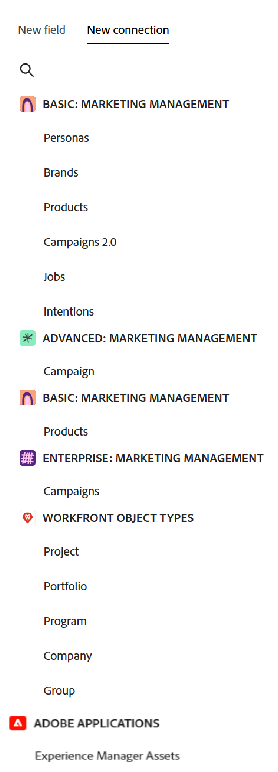

<!--keep the 30 fields limit in yellow till Jan 2026; also the global record type cross-workspace capability information-->

<!--take production and preview references out at prod-->

# Koppla posttyper

Den markerade informationen på den här sidan hänvisar till funktioner som ännu inte är allmänt tillgängliga. Det är bara tillgängligt i förhandsvisningsmiljön för alla kunder. Efter de månatliga releaserna i Production finns samma funktioner även i produktionsmiljön för kunder som aktiverat snabba releaser. 

Mer information om snabba releaser finns i [Aktivera eller inaktivera snabba releaser för din organisation](/help/quicksilver/administration-and-setup/set-up-workfront/configure-system-defaults/enable-fast-release-process.md). 

{{planning-important-intro}}

<!--
You can use Adobe Workfront Planning to design fully-customizable workspaces that contain record types needed in your organization. A way to indicate how individual record types relate to one another is to connect them. Also, you can connect Workfront Planning record types with object types from other applications to enhance your users' experience and keep their focus in one application. -->

Du kan ansluta posttyper till varandra eller koppla posttyper med objekttyper från andra program.

Det är praktiskt att koppla posttyper när du har flera typer av arbetsobjekt som påverkar varandra. Du kan till exempel arbeta med kampanjer och varje kampanj kan tillgodose flera varumärken. För att indikera relationen kan ni koppla kampanjer till varumärken. Detta skapar ett anslutningsfält för Varumärken på Campaign-posten.

Dessutom kan arbetet för varje kampanj planeras i flera projekt i Workfront. För att ange detta kan ni koppla kampanjerna till relevanta projekt. Detta skapar ett anslutningsfält för projekt på Campaign-posten.

När anslutningsfälten har skapats kan du koppla enskilda poster mellan de två posterna eller objekttyperna.

>[!NOTE]
>
>Du kan ha upp till 30 anslutningsfält för en posttyp.

I den här artikeln beskrivs hur du kan koppla två typer av Workfront Planning-poster, eller en Workfront Planning-posttyp, till ett objekt från ett annat program.

När du har upprättat anslutningen mellan poster eller objekttyper läggs ett anslutningsfält till i en Planning-posttyp. I anslutningsfältet kan du koppla enskilda poster till varandra och visa fält från den länkade posten eller objekttypen i en Workfront Planning-post.

Allmän information om anslutningstyper finns i [Översikt över anslutna posttyper](/help/quicksilver/planning/architecture/connect-record-types-overview.md).

Mer information om hur du ansluter poster eller poster med objekt från andra program finns i [Koppla poster](/help/quicksilver/planning/records/connect-records.md).

Ett exempel på hur du ansluter posttyper och poster finns i [Exempel på att ansluta posttyper och poster](/help/quicksilver/planning/architecture/example-connect-record-types-and-records.md).

<!--ensure this last linked article is right; the title and the link should have changed-->

## Åtkomstkrav

+++ Expandera om du vill visa åtkomstkraven för funktionerna i den här artikeln.

<table style="table-layout:auto"> 
<col> 
</col> 
<col> 
</col> 
<tbody> 
    <tr> 
<tr> 
</tr> 
<tr> 
   <td role="rowheader">
Adobe Workfront package
</td> 
   <td> 

Ansluta posttyper från samma arbetsyta: 

<ul> 
<li>
Alla Workfront- och Planning-paket
</li>
<li>
Alla arbetsflöden och alla planeringsdokument</li></ul>

Så här ansluter du posttyper från olika arbetsytor:

<ul> 
<li>
Alla Workfront- och Planning-paket
</li>
<li>
Alla arbetsflöden och ett Planning Prime- eller Ultimate-paket
</li></ul>

Mer information om vad som ingår i respektive Workfront Planning-paket får du av Workfront. 
 
   </td> 
<tr> 
<td> 
   
 Ytterligare produkter
 </td> 
   <td> 
   
 Förutom Adobe Workfront måste du ha följande om du vill koppla posttyper till objekt från följande program:

   <ul><li>
En Adobe Experience Manager Assets-licens och en integrering mellan AEM Assets och Workfront för att koppla AEM-material till posttyperna Planning.

   
Mer information finns i <a href="/help/quicksilver/documents/adobe-workfront-for-experience-manager-assets-essentials/workfront-for-aem-asset-essentials.md">Adobe Workfront för Experience Manager Assets och Assets Essentials: artikelindex</a>. 
</li>
   <li>
 En Adobe GenStudio for Performance Marketing-licens för att koppla posttyper till GenStudio Brands

   
Mer information finns i <a href="https://experienceleague.adobe.com/sv/docs/genstudio-for-performance-marketing/user-guide/get-started">Kom igång med Adobe GenStudio for Performance Marketing</a>.
</li></ul>
   </td> 
  </tr> 
  <tr> 
   <td role="rowheader">
Adobe Workfront-licens
</td> 
   <td>
Standard

   </td> 
  </tr> 
  <tr> 
   <td role="rowheader">
Objektbehörigheter
</td> 
   <td>   
Hantera behörigheter till en arbetsyta
  
   
Systemadministratörer har behörighet till alla arbetsytor, inklusive de som de inte skapade
  </td> 
  </tr>  
</tbody> 
</table>

Mer information om Workfront åtkomstkrav finns i [Åtkomstkrav i Workfront-dokumentationen](/help/quicksilver/administration-and-setup/add-users/access-levels-and-object-permissions/access-level-requirements-in-documentation.md).

+++

<!--Old:
<table style="table-layout:auto"> 
<col> 
</col> 
<col> 
</col> 
<tbody> 
    <tr> 
<tr> 
<td> 
   
 Products
 </td> 
   <td> 
   <ul><li>
 Adobe Workfront
</li> 
   <li>
 Adobe Workfront Planning
</li>
   <li>
 Adobe Experience Manager Assets, if you want to connect AEM assets with Planning record types

   
You must have an Adobe Experience Manager Assets license and an integration between AEM Assets and Workfront.
    For information, see <a href="/help/quicksilver/documents/adobe-workfront-for-experience-manager-assets-essentials/workfront-for-aem-asset-essentials.md">Adobe Workfront for Experience Manager Assets and Assets Essentials: article index</a>. 

   </li>
   </ul></td> 
  </tr>   
<tr> 
   <td role="rowheader">
Adobe Workfront plan*
</td> 
   <td> 

Any of the following Workfront plans:
 
<ul><li>Select</li> 
<li>Prime</li> 
<li>Ultimate</li></ul> 

Workfront Planning is not available for legacy Workfront plans
 
   </td> 
<tr> 
   <td role="rowheader">
Adobe Workfront Planning package*
</td> 
   <td> 

Any 
 

For more information about what is included in each Workfront Planning plan, contact your Workfront account manager. 
 
   </td> 
 <tr> 
   <td role="rowheader">
Adobe Workfront platform
</td> 
   <td> 

Your organization's instance of Workfront must be onboarded to the Adobe Unified Experience to be able to access Workfront Planning.
 

For more information, see <a href="/help/quicksilver/workfront-basics/navigate-workfront/workfront-navigation/adobe-unified-experience.md">Adobe Unified Experience for Workfront</a>. 
 
   </td> 
   </tr> 
  </tr> 
  <tr> 
   <td role="rowheader">
Adobe Workfront license*
</td> 
   <td> 
Standard
 
   
Workfront Planning is not available for legacy Workfront licenses
 
  </td> 
  </tr> 
  <tr> 
   <td role="rowheader">
Access level configuration
</td> 
   <td> 
There are no access level controls for Adobe Workfront Planning
   
</td> 
  </tr> 
<tr> 
   <td role="rowheader">
Object permissions
</td> 
   <td>   
Manage permissions to a workspace
  
   
System Administrators have permissions to all workspaces, including the ones they did not create.
</td> 
  </tr> 
 
</tbody> 
</table> -->

## Koppla posttyper

<!--when changes here, also update the article for "Connect records"-->

{{step1-to-planning}}

1. Klicka på arbetsytan vars posttyper du vill ansluta,

   eller

   Utöka den nedåtriktade pilen till höger om namnet på en befintlig arbetsyta i en arbetsyta, sök efter en arbetsyta och markera den när den visas i listan.
1. Klicka på kortet för en posttyp för att öppna posttypssidan.
1. Klicka på ikonen **+** i tabellvyns övre högra hörn och klicka sedan på fliken **Ny anslutning** .

   

1. Sök efter en posttyp eller välj något av följande:

   * En posttyp från den aktuella arbetsytan

     

     >[!TIP]
     >
     > 
     >Om du inte har andra posttyper i den valda arbetsytan visas inte arbetsyteavsnittet.

   * En posttyp från en annan arbetsyta som konfigurerats för anslutning från andra arbetsytor.

     >[!TIP]
     >
     >Inställningen **Tillåt anslutning till den här posttypen i andra arbetsytor** måste aktiveras för en posttyp på fliken **Inställningar för arbetsyta** i rutan **Redigera posttyp** för att en posttyp ska kunna nås från andra arbetsytor. Om det inte finns några posttyper som har konfigurerats för att ansluta från andra arbetsytor visas inte arbetsyteavsnittet.
     >
     >Mer information finns i [Konfigurera funktioner för arbetsytan mellan arbetsytor för posttyper](/help/quicksilver/planning/architecture/configure-record-type-cross-workspace-capabilities.md). <!--update screen shot at production-->
     >
     >

     <!--Old:
        [!TIP]
        The **Allow connecting to this record type in other workspaces** setting must be enabled for a record type in the **Advanced settings** tab of the **Edit record type** box, for a record type to be accessible from other workspaces. If there are no record types that are configured to connect from other workspaces, the workspace section does not display.
        
        -->

   Mer information finns i [Redigera posttyper](/help/quicksilver/planning/architecture/edit-record-types.md).

   * Ett **projekt, Portfolio, program, företag** eller **grupp** från avsnittet **Workfront-objekttyper**.

     

   

   * En **ursprunglig begärandetyp** från avsnittet **Workfront-objekttyper**.

     Det ursprungliga anslutningsfältet för begäran som skapades visar namnet på den inskickade planeringsförfrågan som skapade objektet.

     >[!NOTE]
     >
     >Du måste skapa förfrågningsformulär och göra dem offentliga för att kunna skicka in planeringsförfrågningar för att skapa poster i Workfront Planning.
     >
     >Mer information finns i följande artiklar:
     >* [Skapa och hantera ett begärandeformulär i Adobe Workfront Planning](/help/quicksilver/planning/requests/create-request-form.md)
     >* [Skicka Adobe Workfront Planning-begäranden för att skapa poster](/help/quicksilver/planning/requests/submit-requests.md).

     

   

   * **Experience Manager Assets** från avsnittet **Adobe-program**.

     

     En ny anslutningsflik öppnas för den valda posten eller objekttypen.

   * Ett **varumärke** från Adobe GenStudio for Performance Marketing i avsnittet **Adobe GenStudio**

     

1. Uppdatera fältet **Namn** med namnet på det nya anslutna fältet, så som det kommer att visas i tabellvyn eller postsidan för den ursprungliga posttypen. Då skapas den kopplade postkolumnen (eller fältet) i tabellvyn med den ursprungliga posttypen. Som standard är namnet på fältet namnet på den post eller det objekt som du ansluter till.

   >[!TIP]
   >
   >Du kan ha flera anslutningar till samma post eller objekttyp. Om du inte redigerar namnet på det anslutna fältet lägger Workfront till en siffra efter namnet på den anslutna posten för att ange antalet anslutna posttyper med samma namn.

1. Uppdatera fältet **Beskrivning** genom att lägga till information om det anslutna postfältet. Beskrivningen av ett fält visas när du hovrar över fältets kolumn i en tabell.
1. (Villkorligt) När du ansluter posttyper från två olika arbetsytor, en posttyp och ett Adobe Experience Manager-resursobjekt, eller en posttyp och ett GenStudio-märke, väljer du **Tillåt flera poster**. Genom att markera den anger du att du tillåter användare att lägga till flera poster när fältet för kopplad posttyp visas på de ursprungliga posterna. Detta är markerat som standard.

   

1. (Villkorligt) När du ansluter posttyper från samma arbetsyta, eller en Planning-posttyp med en Workfront-objekttyp, väljer du något av följande:

   * **Flerval**: Välj det här alternativet om du vill tillåta en post från den aktuella posttypen att ansluta till flera poster från anslutningsposttypen.
   * **Ett-val**: Välj det här alternativet om du vill tillåta en post från den aktuella posttypen att ansluta till en post från anslutningsposttypen.

1. Markera **Skapa motsvarande fält för den länkade posttypen**. När du väljer det här alternativet skapas ett anslutningsfält för den posttyp som du är ansluten till, förutom det anslutningsfält som läggs till den aktuella posttypen. Detta är inaktiverat som standard.

   >[!TIP]
   >
   >* Förutom gränsen på 30 anslutningsfält för en posttyp finns det en gräns på 500 fält för en posttyp. Vi rekommenderar att den här inställningen inte används, särskilt för taxonomiska posttyper, för att undvika att den här gränsen uppnås.
   >
   >* Om du väljer **Skapa motsvarande fält för den länkade posttypen** måste du skapa hierarkier.

1. (Villkorligt) Om du har aktiverat **Skapa motsvarande fält för den länkade posttypen** kan du välja bland följande alternativ för att ange hur många poster som användare kan ansluta till och från:

   * Många till många
   * En till många
   * Många till ett
   * En till en

   Mer information om anslutningstyper finns i [Översikt över anslutna posttyper](/help/quicksilver/planning/architecture/connect-record-types-overview.md).

   >[!NOTE]
   >
   >Om du väljer En till många eller En till en för anslutningstypen och senare vill ansluta en post eller ett objekt som redan är anslutet någon annanstans får du en varning om att anslutningen tar bort den från den ursprungliga anslutningen. Du kan tillåta borttagning eller välja en annan post.

1. (Villkorligt och valfritt) När du väljer att ansluta ett Workfront-objekt väljer du ett **anpassat formulär** bland **Länka endast objekt som matchar villkoren**. Endast objekt som har de markerade anpassade formulären kopplade kan länkas till den valda posttypen. Du kan markera flera formulär.

   >[!NOTE]
   >
   > Du måste skapa anpassade formulär i Workfront för de markerade objekten innan de visas i den här listan.

1. (Villkorligt) När du väljer att ansluta till Experience Manager Assets väljer du en databas i listrutan **Experience Manager-databas** i avsnittet **Länka resurser i följande databas**. Detta är ett obligatoriskt fält. Endast databaser som du har åtkomst till i Experience Manager Assets visas i det här fältet.

   >[!NOTE]
   >
   >Workfront-administratören kan mappa Workfront Planning-fält till Experience Manager Assets-fält via metadatamappningen i Workfront. Mer information finns i [Konfigurera mappning av metadata för resurser mellan Adobe Workfront och Experience Manager Assets](https://experienceleague.adobe.com/sv/docs/experience-manager-cloud-service/content/assets/integrations/configure-asset-metadata-mapping).

1. (Villkorligt) När du väljer att ansluta till Experience Manager Assets, till en post av typen Workfront Planning eller till ett GenStudio-märke, väljer du något av följande alternativ i området **Postutseende**:

   * **Namn och bild**: Både namnet och miniatyrbilden eller ikonen för de anslutna posterna visas i det anslutna postfältet. Det här är standardalternativet.
   * **Namn**: Endast namnet på de anslutna posterna visas i det anslutna postfältet.
   * **Bild**: Endast miniatyrbilden eller ikonen för de anslutna posterna visas i det anslutna postfältet.

   Poster utan miniatyrbild visar istället posttypsikonen. Ett exempel på hur de anslutna posterna visas visas i området **Postutseende**.

   >[!NOTE]
   >
   >* När du tillåter att flera poster länkas kan det hända att endast miniatyrbilden sparar utrymme i mindre områden, som i postvyer.
   >
   >* Namnet på en post är det primära fältet i posten. Mer information finns i [Översikt över primärt fält](/help/quicksilver/planning/fields/primary-field-overview.md).
   >
   >* Det går inte att välja ett postutseende när du väljer Workfront-objekttyper.
   >
   >* Det du väljer i postutseendeområdet avgör hur posterna visas i anslutningar överallt i systemet, inklusive alla vyer och informationssidor.

1. Välj **Välj uppslagsfält** om du vill lägga till fält från den posttyp som du ansluter till. Uppslagsfälten är fält som är kopplade till den post eller objekttyp som du länkar till. När du länkar dem visas information från posten eller objektet som du länkar till på posten som du länkar från. Detta är markerat som standard.

   >[!TIP]
   >
   >* Du kan inte lägga till Workfront-typsnittsfält (inklusive fält som Projektägare eller Projektsponsor) som sökfält.
   >
   >* Information om datumfält i Workfront-objekt visas i 24-timmarsformat i Workfront Planning, oavsett hur den visas i Workfront.
   >
   >   Om till exempel ett projekts planerade startdatum visas som 3:00 PM i Workfront, visas det som 15:00 i Workfront Planning i ett importerat uppslagsfält.
   >* I produktionsmiljön kan du inte lägga till personfält som sökfält. Du kan lägga till personfält som sökfält i förhandsvisningsmiljön.
   >

1. Klicka på **Skapa**.

1. (Villkorligt) Om du valde inställningen **Välj uppslagsfält** öppnas rutan **Lägg till uppslagsfält** .

   Klicka på ikonen **+** för att lägga till fält från området **Omarkerade fält**.

   eller

   Klicka på ikonen **-** för att ta bort fält från området **Markerade fält**

   

   Värdena för de anslutna fälten fylls i automatiskt när du länkar poster eller objekt.

   >[!IMPORTANT]
   >
   >    Alla som har behörighet att visa eller högre på arbetsytan kan visa informationen i de länkade fälten, oavsett behörighet eller åtkomstnivå i programmet för de länkade objekttyperna.

1. (Valfritt) Klicka på **Hoppa över** om du inte vill lägga till fält från den länkade posten eller objekttypen. Namnet eller det primära fältet för den länkade posten är det enda synliga fältet i tabellvyn för den posttyp som du ansluter från.

1. Välj en aggregator för de uppslagsfält som du lägger till.

   >[!NOTE]
   >
   >Du kan inte lägga till aggregerare för följande fälttyper:
   >
   >    * Stycke
   >    * Kryssruta

   Värdena för de länkade fälten visas antingen avgränsade med kommatecken eller som ett summerat värde enligt den aggregator du väljer, när användare markerar mer än en länkad post i det länkade postfältet.

   Om sökfältet innehåller flera värden som inte är summerade bör du tänka på följande när du använder fältet för att sortera eller gruppera i en vy:

   * Sorteringen görs med det första värdet

   * Posterna grupperas efter varje unik kombination av fältvärden

   * Tidslinjevyn byggs utifrån det första datumvärdet för den anslutna posttypen, när den visas i vyn

   >[!IMPORTANT]
   >
   > Du måste välja ett aggregeringsvärde när du lägger till sökdatumfält om du vill att fälten ska vara tillgängliga för att lägga till som start- och slutdatum för tidslinjen och kalendervyer. Du kan till exempel välja MAX eller MIN-aggregering för ett datumsökningsfält.

   

   >[!NOTE]
   >
   > Aggregatorer är inte tillgängliga när posttyper ansluts till följande:
   >* Experience Manager Assets
   >* GenStudio Brands.
   >

   Välj bland följande:

   * **Ingen**: Visar värden som kommer från flera poster avgränsade med kommatecken. Det här är standardvalet.
   * **MAX**: Visar det högsta värdet från alla värden som kommer från flera markerade poster i det länkade postfältet.
   * **MIN**: Visar det lägsta värdet från alla värden som kommer från flera markerade poster i det länkade postfältet.
   * **SUM**: Visar summan av alla värden som kommer från flera markerade poster i det länkade postfältet.
   * **AVG**: Visar medelvärdet av alla värden som kommer från flera markerade poster i det länkade postfältet.
   * **UNIQUE**: Tar bort dubbletter från sökfältsvärden och bara visar unika värden. Detta är inte tillgängligt för följande fälttyper:
      * Stycke
      * Kryssruta
      * Folk

   >[!NOTE]
   >
   >Du kan till exempel länka produktposten (länkad post) från Campaign-posten (ursprungsposten) och ge den namnet&quot;Produktfält&quot;. Du kan också välja att länka produktpostens budgetfält från kampanjposten och kalla det&quot;Produktbudget&quot;. Om du tillät att välja flera poster i fältet&quot;Produkt&quot; kan du välja Produkt 1 med en budget på 100 000 och Produkt 2 med en budget på 110 000 och Produkt 3 med en budget på 100 000 dollar. Du kan visa följande budgetinformation i det länkade fältet från den ursprungliga posten, beroende på vilken aggregator du väljer:
   >
   >* **Ingen**: $100 000, $110 000, $100 000
   >* **MAX**: 110 000 USD
   >* **MIN**: $100 000
   >* **SUM**: 310 000 USD
   >* **AVG**: $103,000.33
   >* **UNIQUE**: $100 000
   >

1. (Valfritt) Använd ikonen **sök**  för att söka efter ett fält.

1. Klicka på **Lägg till fält** för att spara ändringarna.

   Följande objekt läggs till:

   * Ett länkat postfält på posttypen som du länkar från. Det länkade postfältet visar enskilda poster av den länkade posttypen efter att du har lagt till dem manuellt. Mer information om hur du lägger till poster finns i [Koppla poster](/help/quicksilver/planning/records/connect-records.md). Namnet på det länkade postfältet är det namn du valde i steg 6. <!--accurate-->

   * Ett länkat (eller sökbart) fält (eller fält) som visar information om den länkade posten eller objekttypen efter att du manuellt har lagt till posterna eller objekten i det länkade postfältet. Uppslagsfält skapas bara när inställningen **Välj uppslagsfält** väljs när anslutningen skapas. Uppslagsfält får automatiskt namn enligt det här mönstret:

     `<Name of the original field on the linked record> (from <Name of your linked field>)`

     Om du t.ex. har länkat en kampanjposttyp med en programposttyp och namngett det programlänkade postfältet&quot;Programinformation&quot;, markerat för att även visa programmets budgetfält i kampanjens tabellvy, får det länkade fältet automatiskt namnet `Budget (from Program information)` i kampanjens tabellvy.

   * När du länkar posttyper till varandra läggs ett länkat postfält också till på den posttyp som du länkar till, bara när du aktiverar inställningen **Skapa motsvarande fält för den länkade posttypen**. Namnet på det länkade postfältet på den länkade posttypen är namnet på den posttyp som du länkar från.

     Om du t.ex. länkar posttypen &quot;Produkt&quot; från posttypen &quot;Kampanj&quot; och namnger det anslutna fältet i Campaign &quot;Länkad produkt&quot;, skapas ett &quot;Kampanjlänkat&quot; postfält för posttypen Produkt.

     >[!TIP]
     >
     > Ett länkat postfält skapas inte för objekt från ett annat program i respektive program.
     > Vi rekommenderar att du inte skapar länkar till taxonomiska posttyper, eftersom det finns en gräns på 500 fält, utöver gränsen på 30 anslutna fält för varje posttyp.

1. (Valfritt och villkorligt) Klicka på nedåtpilen i rubriken för de länkade postfälten i den ursprungliga posttypen eller i tabellvyn för den länkade posttypen och klicka sedan på något av följande:

   * **Redigera fält**: Uppdatera informationen för fältet **Namn** och **Beskrivning**.
   * **Redigera sökfält**: Lägg till eller ta bort fält för den länkade posten.

   

   Följ instruktionerna i steg 16-17 ovan för att lägga till eller ta bort uppslagsfält. <!--ensure these step numbers stay accurate-->

   >[!NOTE]
   >
   > Du kan inte lägga till uppslagsfält som tillhör posttyper som du länkar från till objekttyper från ett annat program.
   >
   > Du kan till exempel inte lägga till sökfältet för Campaign Status till ett Workfront-projekt som du länkar till från kampanjerna.

1. (Valfritt) Klicka på nedåtpilen i huvudet för ett länkat postfält eller i huvudet för ett uppslagsfält från den posttyp som du länkar från och klicka sedan på **Ta bort**.

   Postfältet eller sökfältet tas bort. Om du tar bort ett postfält tas även uppslagsfält som är kopplade till den länkade posten bort.
