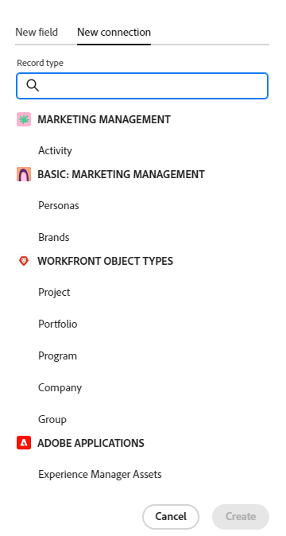

<!-----
title: Connect record types
description: A way to indicate how individual record types relate to one another is to connect them. Also, you can connect Adobe Workfront Planning record types with object types from other applications to enhance your users' experience and keep their focus in one application.
hidefromtoc: yes
hide: yes
feature: Work management
role: User
author: Alina
--->

<!--update the metadata with real information when making this avilable in TOC and in the left nav-->
<!--************ THIS MIGHT NO LONGER BE A 'RELATIONSHIP' TYPE FIELD, BECAUSE THEY WILL SHOW IT IN THE CONNECTION TAB*****************************-->

# Koppla posttyper

{{planning-important-intro}}

<!--
You can use Adobe Workfront Planning to design fully-customizable workspaces that contain record types needed in your organization. A way to indicate how individual record types relate to one another is to connect them. Also, you can connect Workfront Planning record types with object types from other applications to enhance your users' experience and keep their focus in one application. -->

Du kan koppla posttyper till varandra eller posttyper med objekttyper från andra program.

I den här artikeln beskrivs hur du kan koppla två Workfront Planning-posttyper till en Workfront Planning-posttyp med ett objekt från ett annat program.

När du har upprättat anslutningen mellan poster eller objekttyper kan du koppla enskilda poster till varandra och visa fält från den länkade posten eller objekttypen på en Workfront Planning-post.

Mer information om hur du ansluter en Workfront Planning-post till ett objekt från ett annat program finns i [Koppla poster](/help/quicksilver/planning/records/connect-records.md).

Ett exempel på hur du ansluter posttyper och poster finns i [Exempel på att ansluta posttyper och poster](/help/quicksilver/planning/architecture/example-connect-record-types-and-records.md).

<!--ensure this last linked article is right; the title and the link should have changed-->

## Åtkomstkrav

+++ Expandera om du vill visa åtkomstkraven för Workfront Planning.

<table style="table-layout:auto">
 <col>
 </col>
 <col>
 </col>
 <tbody>
    <tr>
<tr>
<td>
   
 Produkt
 </td>
   <td>
   
 Adobe Workfront
 
Om du vill ansluta Adobe Workfront Planning-posttyper till Experience Manager Assets måste du ha en Adobe Experience Manager Assets-licens och din organisations instans av Workfront måste vara registrerad på Adobe Unified Experience. Mer information finns i <a href="/help/quicksilver/workfront-basics/navigate-workfront/workfront-navigation/adobe-unified-experience.md">Adobe Unified Experience for Workfront</a>.
 </td>
  </tr>  
 <td role="rowheader">
Adobe Workfront-avtal
</td>
   <td>

Din organisation måste vara registrerad på Workfront Planning i ett tidigt skede 

   </td>
  </tr>
  <tr>
   <td role="rowheader">
Adobe Workfront
</td>
   <td>

Alla

   </td>
  </tr>
  <tr>
   <td role="rowheader">
Adobe Workfront-licens*
</td>
   <td>
   
Nytt: Standard
 
   
Aktuell: Planera

  </td>
  </tr>

<tr>
   <td role="rowheader">
Konfigurationer på åtkomstnivå
</td>
   <td> 
Det finns inga åtkomstnivåkontroller för Adobe Workfront Planning
  
</td>
  </tr>
<tr>
   <td role="rowheader">
Layoutmall
</td>
   <td> 
Workfront- eller gruppadministratören måste lägga till planeringsområdet i layoutmallen. Mer information finns i <a href="/help/quicksilver/planning/access/access-overview.md">Åtkomstöversikt</a>. 
  
</td>
  </tr>
<tr>
   <td role="rowheader">
Behörigheter
</td>
   <td> 
Hantera behörigheter till en arbetsyta </a> 
  
   
Systemadministratörer har behörighet för alla arbetsytor, inklusive de som de inte skapade.
</td>
  </tr>
 </tbody>
</table>

*Mer information finns i [Åtkomstkrav i Workfront-dokumentation](/help/quicksilver/administration-and-setup/add-users/access-levels-and-object-permissions/access-level-requirements-in-documentation.md).

+++

<!--Maybe enable this at GA - but planing is not supposed to have Access controls in the Workfront Access Level: 
>[!NOTE]
>
>If you don't have access, ask your Workfront administrator if they set additional restrictions in your access level. For information on how a Workfront administrator can change your access level, see [Create or modify custom access levels](/help/quicksilver/administration-and-setup/add-users/configure-and-grant-access/create-modify-access-levels.md). -->

<!-- Notes to add for the table: for the "Workfront plans" row: the above is only for closed beta; when going to GA - activate the following plans:    

Current plan: Prime and Ultimate

Legacy plan: Enterprise
-->

<!-- Notes for the table: for the "Workfront access" row: 
For more information, see <a href="../../administration-and-setup/add-users/access-levels-and-object-permissions/wf-licenses.md" class="MCXref xref">Adobe Workfront licenses overview</a>.
-->

## Att tänka på när du ansluter posttyper

<!--move this to the Connect record types overview article (new)-->

* Du kan ansluta följande enheter i Adobe Workfront Planning:

   * Två posttyper

     Posttyperna måste tillhöra samma arbetsyta.
   * En posttyp och en objekttyp från ett annat program.

* Du kan koppla posttyper för Workfront Planning till följande objekttyper från följande program:

   * Adobe Workfront:

      * Projekt
      * Portfolio
      * Program
      * Företag
      * Grupper

   * Adobe Experience Manager Assets:

      * Bilder
      * Mappar

     >[!IMPORTANT]
     >
     >Du måste ha en Adobe Experience Manager Assets-licens och din organisations instans av Workfront måste vara registrerad på Adobe Business Platform eller Adobe Admin Console för att kunna ansluta Workfront Planning-poster till Adobe Experience Manager Assets.
     >
     >Om du har frågor om hur du kommer igång med Adobe Admin Console kan du läsa [Adobe Unified Experience FAQ](/help/quicksilver/workfront-basics/navigate-workfront/workfront-navigation/unified-experience-faq.md).

* När du har skapat enskilda poster för en posttyp kan du välja de poster som du ansluter till från det länkade posttypsfältet. Mer information finns i [Anslut poster](/help/quicksilver/planning/records/connect-records.md).

* När du har kopplat en posttyp till en annan posttyp eller till en objekttyp från ett annat program finns följande scenarier:

   * **När du ansluter två posttyper**: Ett länkat postfält skapas för den posttyp som du ansluter från. Ett liknande länkat postfält skapas för den posttyp som du ansluter till.

     Om du till exempel ansluter posttypen&quot;Campaign&quot; till posttypen&quot;Product&quot; skapas ett länkat postfält som du kallar&quot;Linked Product&quot; för posttypen Campaign, och en länkad posttyp som automatiskt kallas&quot;Campaign&quot; skapas för posttypen Produkt.

   * **När du ansluter en posttyp med en objekttyp från ett annat program**:

      * Ett länkat postfält skapas för den posttyp som du ansluter från. Inget länkat postfält skapas automatiskt i det andra programmets objekttyp.

      * Planeringspostfält är inte tillgängliga från Workfront-objekt.
      * Du kan planera postfält från Experience Manager-resurser när Workfront-administratören konfigurerar metadatamappningen genom integrationen mellan Workfront och Adobe Experience Manager Assets. Mer information finns i [Konfigurera mappning av metadata för resurser mellan Adobe Workfront och Experience Manager Assets](https://experienceleague.adobe.com/docs/experience-manager-cloud-service/content/assets/integrations/configure-asset-metadata-mapping.html?lang=en).

   * **När du lägger till länkade (eller uppslag) fält för posten eller objektet som du ansluter till** kan du ansluta fält från det andra programmets objekt till posttypen Workfront Planning. Länkade fält är skrivskyddade och visar automatiskt information från kopplade poster eller objekt när du kopplar posterna eller objekten.

     Om du t.ex. kopplar posttypen&quot;Campaign&quot; till ett Workfront-projekt och väljer att överföra fältet Planerat slutförandedatum för projektet till Workfront Planning-posten, skapas automatiskt ett länkat fält med namnet Planerat slutförandedatum (från projekt) för kampanjen. Du kan inte redigera det här länkade fältet manuellt. I fältet Planerat slutförandedatum (från projekt) visas det planerade slutförandedatumet för de länkade projekten.

     >[!IMPORTANT]
     >
     >    Alla som har behörighet att visa eller högre på arbetsytan kan visa informationen i de länkade fälten, oavsett behörighet eller åtkomstnivå i programmet för de länkade objekttyperna.

* Länkade postfält föregås av en relationsikon .

  Länkade fält föregås av en ikon som anger fälttypen. Länkade (eller uppslag) fält föregås av ikoner som anger att ett fält är ett tal, ett stycke eller ett datum.

## Koppla posttyper

<!--when changes here, also update the article for "Connect records"-->

{{step1-to-planning}}

1. Klicka på arbetsytan vars posttyper du vill ansluta,

   eller

   Utöka den nedåtriktade pilen till höger om namnet på en befintlig arbetsyta i en arbetsyta, sök efter en arbetsyta och markera den när den visas i listan.
1. Klicka på kortet för en posttyp för att öppna posttypssidan.
1. Klicka på ikonen **+** i tabellvyns övre högra hörn och klicka sedan på fliken **Ny anslutning** .

   

1. I fältet **Posttyp** söker du efter en posttyp eller väljer något av följande:

   * En annan posttyp från den del av arbetsytan som du valde

     

     >[!TIP]
     >
     >Det går bara att ansluta till posttyper från den arbetsyta som du har valt.
     > 
     >Om du inte har andra posttyper i den valda arbetsytan visas inte arbetsyteavsnittet.

   * Ett **projekt, Portfolio, program, företag** eller **grupp** från avsnittet **Workfront-objekttyper**.

     

   * **Experience Manager Assets** från avsnittet **Adobe-program**.

     

1. Uppdatera följande information:

   * **Namn**: Namnet på det anslutna fältet, så som det kommer att visas i tabellvyn eller på postsidan för den ursprungliga posttypen. Då skapas den länkade postkolumnen i tabellvyn för den ursprungliga posttypen eller det länkade postfältet för de ursprungliga posterna. Som standard är namnet på fältet namnet på den post eller det objekt som du ansluter till.

   >[!TIP]
   >
   >Du kan ha flera anslutningar till samma post eller objekttyp. Om du inte redigerar namnet på det anslutna fältet lägger Workfront till en siffra efter namnet på den anslutna posten för att ange antalet anslutna posttyper med samma namn.

   * **Beskrivning**: Ytterligare information om det anslutna postfältet. Beskrivningen av ett fält visas när du hovrar över fältets kolumn i en tabell.
   * **Tillåt flera poster**: Välj det här alternativet om du vill ange att användare kan lägga till flera poster när fältet för den länkade posttypen visas på de ursprungliga posterna. Detta är markerat som standard.
   * **Välj uppslagsfält**: Välj det här alternativet om du vill lägga till fält från den valda posttypen. Uppslagsfälten är fält som är kopplade till den post eller objekttyp som du länkar till. När du länkar dem visas information från posten eller objektet som du länkar till på den post som du vill använda. Detta är markerat som standard.

     >[!TIP]
     >
     > Du kan inte lägga till följande fälttyper som sökfält:
     >
     >    * Folk
     >    * Skapad av
     >    * Senast ändrad av
     >    * Workfront typsnittsfält (inklusive fält som Projektägare eller Projektsponsor)

1. (Villkorligt och valfritt) Om du har valt att ansluta ett Workfront-objekt väljer du ett **anpassat formulär** bland **Länka endast objekt som matchar villkoren**. Endast objekt som har de markerade anpassade formulären kopplade kan länkas till den valda posttypen. Du kan markera flera formulär.

   >[!NOTE]
   >
   > Du måste skapa anpassade formulär i Workfront för de markerade objekten innan de visas i den här listan.

1. (Villkorligt) Om du valde att ansluta till Experience Manager Assets väljer du en databas i listrutan **Experience Manager-databas** i avsnittet **Länka resurser i följande databas**. Detta är ett obligatoriskt fält. Endast databaser som du har åtkomst till i Experience Manager Assets visas i det här fältet.

   >[!NOTE]
   >
   >Workfront-administratören kan mappa Workfront Planning-fält till Experience Manager Assets-fält via metadatamappningen i Workfront. Mer information finns i [Konfigurera mappning av metadata för resurser mellan Adobe Workfront och Experience Manager Assets](https://experienceleague.adobe.com/docs/experience-manager-cloud-service/content/assets/integrations/configure-asset-metadata-mapping.html?lang=en).

1. (Villkorligt) Om du har valt att ansluta till Experience Manager Assets eller till en post av typen Workfront Planning inaktiverar du reglaget **Titel** i området **Postutseende** om du inte vill att titeln för anslutna poster eller resurser ska visas i det länkade fältet. När det här alternativet är inaktiverat visas endast posternas miniatyrbilder i de länkade fälten. Poster utan miniatyrbild visar i stället en bildikon. Växlingsknappen är aktiverad som standard. Ett exempel på hur de anslutna posterna visas visas i området **Postutseende**.

   >[!TIP]
   >
   >    När du tillåter att flera poster länkas kan det hända att endast miniatyrbilden sparar utrymme i mindre områden, som i postvyer.
   >
   >Titeln på en post är postens primära fält. Mer information finns i [Översikt över primärt fält](/help/quicksilver/planning/fields/primary-field-overview.md).

1. Klicka på **Skapa**.

1. (Villkorligt) Om du valde inställningen **Välj uppslagsfält** öppnas rutan **Lägg till uppslagsfält** .

   Klicka på ikonen **+** för att lägga till fält från området **Omarkerade fält**.

   eller

   Klicka på ikonen **-** för att ta bort fält från området **Markerade fält**

   

   Värdena för de anslutna fälten fylls i automatiskt när du länkar poster eller objekt.

   >[!IMPORTANT]
   >
   >    Alla som har behörighet att visa eller högre på arbetsytan kan visa informationen i de länkade fälten, oavsett behörighet eller åtkomstnivå i programmet för de länkade objekttyperna.

1. (Valfritt) Klicka på **Hoppa över** om du inte vill lägga till fält från den länkade posten eller objekttypen. **Namn** eller **Titel** för den länkade posten är det enda synliga fältet i tabellvyn för den posttyp som du ansluter från.

1. (Valfritt och villkorligt) Om du väljer att länka ett tal, en valuta, en procentandel eller ett datumtypsfält, ska du också välja ett aggregeringsvärde som ska sammanfatta flera värden. Värdena för de länkade fälten visas antingen avgränsade med kommatecken eller som ett summerat värde enligt den aggregator du väljer, när användare markerar mer än en länkad post i det länkade postfältet.

   Om sökfältet innehåller flera värden som inte är summerade bör du tänka på följande när du använder fältet för att sortera eller gruppera i en vy:

   * Sorteringen görs med det första värdet

   * Posterna grupperas efter varje unik kombination av fältvärden

   * Tidslinjevyn byggs utifrån det första datumvärdet.

   >[!IMPORTANT]
   >
   >    Du måste välja ett aggregeringsvärde när du lägger till sökdatumfält om du vill att fälten ska vara tillgängliga för att lägga till som start- och slutdatum för tidslinjen och kalendervyer. Du kan till exempel välja MAX eller MIN-aggregering för ett datumsökningsfält.

   

   >[!NOTE]
   >
   > Aggregatorer är inte tillgängliga när du ansluter posttyper till Experience Manager Assets.

   Välj bland följande:

   * **Ingen**: Visar värden som kommer från flera poster avgränsade med kommatecken. Det här är standardvalet.
   * **MAX**: Visar det högsta värdet från alla värden som kommer från flera markerade poster i det länkade postfältet.
   * **MIN**: Visar det lägsta värdet från alla värden som kommer från flera markerade poster i det länkade postfältet.
   * **SUM**: Visar summan av alla värden som kommer från flera markerade poster i det länkade postfältet.
   * **AVG**: Visar medelvärdet av alla värden som kommer från flera markerade poster i det länkade postfältet.
   * **UNIQUE**: Tar bort dubbletter från sökfältsvärden och bara visar unika värden. Detta är inte tillgängligt för följande fälttyper:
      * Stycke
      * Kryssruta
      * Folk

   >[!NOTE]
   >
   >Du kan till exempel länka produktposten (den länkade posten) från Campaign-posten (den ursprungliga posten) och ge den namnet&quot;Produktfält&quot;. Du kan också välja att länka produktpostens budgetfält från kampanjposten och kalla det&quot;Produktbudget&quot;. Om du tillät att välja flera poster i produktfältet kan du välja Produkt 1 med en budget på 100 000 och Produkt 2 med en budget på 110 000 och Produkt 3 med en budget på 100 000 USD. Du kan visa följande budgetinformation i det länkade fältet från den ursprungliga posten, beroende på vilken aggregator du väljer:
   >
   >* **Ingen**: $100 000, $110 000, $100 000
   >* **MAX**: 110 000 USD
   >* **MIN**: $100 000
   >* **SUM**: 310 000 USD
   >* **AVG**: $103,000.33
   >* **UNIQUE**: $100 000
   >

1. (Valfritt) Använd ikonen **sök**  för att söka efter ett fält.

1. Klicka på **Lägg till fält** för att spara ändringarna.

   Följande objekt läggs till:

   * Ett länkat postfält på posttypen som du länkar från. Det länkade postfältet visar enskilda poster av den länkade posttypen efter att du har lagt till dem manuellt. Mer information om hur du lägger till poster finns i [Koppla poster](/help/quicksilver/planning/records/connect-records.md). Namnet på det länkade postfältet är det namn du valde i steg 7. <!--accurate-->

   * Ett länkat (eller sökbart) fält (eller fält) som visar information om den länkade posten eller objekttypen efter att du manuellt har lagt till posterna eller objekten i det länkade postfältet. Uppslagsfält skapas bara när inställningen **Välj uppslagsfält** väljs när anslutningen skapas. Uppslagsfält får automatiskt namn enligt det här mönstret:

     `<Name of the original field on the linked record> (from <Name of your linked field>)`

     Om du till exempel har länkat en kampanjposttyp med en programposttyp och namngett det programlänkade postfältet&quot;Programinformation&quot;, väljer du att även visa programmets budgetfält i kampanjens tabellvy, får det länkade fältet automatiskt namnet `Budget (from Program information)` i kampanjens tabellvy.

   * När du länkar posttyper till varandra läggs ett länkat postfält också till i den posttyp som du länkar till. Namnet på det länkade postfältet på den länkade posttypen är namnet på den posttyp som du länkar från.

     Om du t.ex. länkar posttypen &quot;Produkt&quot; från posttypen &quot;Kampanj&quot; och namnger det anslutna fältet för Campaign &quot;Länkad produkt&quot;, skapas ett &quot;Kampanjlänkat&quot; postfält för posttypen Produkt.

     >[!TIP]
     >
     > Ett länkat postfält skapas inte för objekt från ett annat program till den posttyp som du länkar från i Workfront Planning.

1. (Valfritt och villkorligt) Klicka på nedåtpilen i rubriken för de länkade postfälten i den ursprungliga posttypen eller i tabellvyn för den länkade posttypen och klicka sedan på något av följande:

   * **Redigera fält**: Du kan uppdatera informationen om fältet **Namn** och **Beskrivning**.
   * **Redigera sökfält**: Lägg till eller ta bort fält för den länkade posten.

   

   Följ instruktionerna i steg 10-14 ovan för att lägga till eller ta bort uppslagsfält. <!--ensure these step numbers stay accurate-->

   >[!NOTE]
   >
   > Du kan inte lägga till uppslagsfält som tillhör posttyper som du länkar från till objekttyper från ett annat program.
   >
   > Du kan till exempel inte lägga till sökfältet för Campaign Status till ett Workfront-projekt som du länkar till från kampanjerna.

1. (Valfritt) Klicka på nedåtpilen i huvudet för ett länkat postfält eller i huvudet för ett uppslagsfält från den posttyp som du länkar från och klicka sedan på **Ta bort**.

   Postfältet eller sökfältet tas bort. Om du tar bort ett postfält tas även uppslagsfält som är kopplade till den länkade posten bort.
