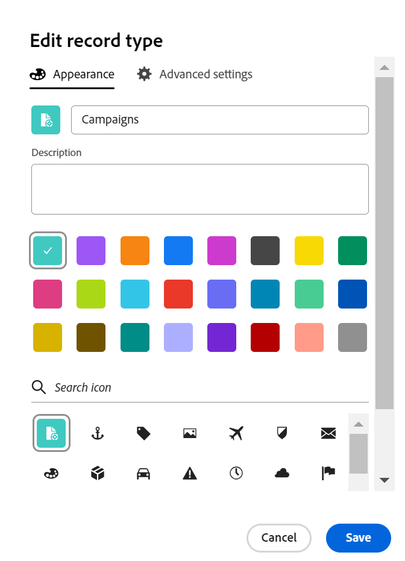

<!--update the metadata with real information when making this available in TOC and in the left nav
---
title: Edit record types
description: You can edit record types after they have been saved. Record types are the object types of Adobe Workfront Planning.
author: Alina
role: User
feature: Work Management 
topic: Architecture
hidefromtoc: yes
hide: yes
---

-->

# Redigera posttyper

{{planning-important-intro}}

Posttyperna är objekttyperna för Adobe Workfront Planning. Du kan redigera utseendet på posttyper som du eller någon annan har skapat. Mer information om hur du skapar posttyper för Workfront Planning finns i [Skapa posttyper](/help/quicksilver/planning/architecture/create-record-types.md).

## Åtkomstkrav

+++ Expandera om du vill visa åtkomstkraven för Workfront Planning.

<!--update the table to say that: Only system administrators can enable record types to connect from other workspaces.-->

<table style="table-layout:auto">
 <col>
 </col>
 <col>
 </col>
 <tbody>
    <tr>
<tr>
<td>
   
 Produkt
 </td>
   <td>
   
 Adobe Workfront
 
Om du vill ansluta posttyper för Adobe Workfront Planning till Experience Manager Assets måste du ha en Adobe Experience Manager Assets-licens och din organisations instans av Workfront måste vara registrerad på Adobe Business Platform eller Adobe Admin Console.
 </td>
  </tr>  
 <td role="rowheader">
Adobe Workfront-avtal
</td>
   <td>

Din organisation måste vara registrerad på Workfront Planning i ett tidigt skede 

   </td>
  </tr>
  <tr>
   <td role="rowheader">
Adobe Workfront
</td>
   <td>

Alla

   </td>
  </tr>
  <tr>
   <td role="rowheader">
Adobe Workfront-licens*
</td>
   <td>
   
Nytt: Standard

   
Aktuell: Planera
 
  </td>
  </tr>

<tr>
   <td role="rowheader">
Konfigurationer på åtkomstnivå
</td>
   <td> 
Det finns inga åtkomstnivåkontroller för Workfront Planning
  
</td>
  </tr>

<tr>
   <td role="rowheader">
Behörigheter
</td>
   <td> 
Hantera behörigheter till en arbetsyta </a> 
  
   
Systemadministratörer har behörighet till alla arbetsytor, inklusive de som de inte skapade
</td>
  </tr>
<tr>
   <td role="rowheader">
Layoutmall
</td>
   <td> 
Workfront- eller gruppadministratören måste lägga till planeringsområdet i layoutmallen. Mer information finns i <a href="/help/quicksilver/planning/access/access-overview.md">Åtkomstöversikt</a>. 
  
</td>
  </tr>

</tbody>
</table>

*Mer information finns i [Åtkomstkrav i Workfront-dokumentation](/help/quicksilver/administration-and-setup/add-users/access-levels-and-object-permissions/access-level-requirements-in-documentation.md).

+++

<!--Maybe enable this at GA - but Planning is not supposed to have Access controls in the Workfront Access Level: 
>[!NOTE]
>
>If you don't have access, ask your Workfront administrator if they set additional restrictions in your access level. For information on how a Workfront administrator can change your access level, see [Create or modify custom access levels](/help/quicksilver/administration-and-setup/add-users/configure-and-grant-access/create-modify-access-levels.md). -->

## Redigera posttyper

{{step1-to-planning}}

1. Klicka på arbetsytan vars posttyper du vill redigera,

   Arbetsytans sida öppnas och posttyperna visas.
1. Gör något av följande:

   * Håll muspekaren över kortet för en posttyp och klicka på menyn **Mer**  i det övre högra hörnet av posttypskortet och klicka sedan på **Redigera**
eller
   * Klicka på ett posttypskort för att öppna posttypssidan, klicka på menyn **Mer**  till höger om posttypens namn och klicka sedan på **Redigera**.

   

   <!--replace everything below with the commented out text below-->

1. Uppdatera följande information i rutan **Redigera posttyp**:

   * Redigera posttypens namn om det behövs. <!--did they add a field label for this? -->
   * **Beskrivning**: Redigera eller lägg till en beskrivning för posttypen med mer information om den.
   * Redigera färg och form för ikonen som är associerad med posttypen. Gör följande:
      * Välj en färg som identifierar posttypen. Det här är färgen på ikonen för posttyp. Grått är markerat som standard.
      * Välj en ikon i listan eller börja skriva namnet på en ikon för att beskriva vad den representerar och markera den sedan när den visas. Det här är ikonen för posttypen. Som standard är en filikon markerad.

     

1. Klicka på **Spara**.
1. (Valfritt) Klicka på posttypskortet i arbetsytan för att öppna posttypens sida.
1. Klicka på menyn **Mer** till höger om posttypens namn och klicka sedan på **Redigera** för att uppdatera information om posttypen.

   >[!TIP]
   >
   >   Du kan byta namn på posttypen i rubriken.

   

   <!--check this screen shot - not sure this is valid ???-->

1. (Valfritt) Om du vill redigera en annan posttyp expanderar du den nedåtriktade pilen till höger om ett posttypsnamn, söker efter en posttyp och markerar den när den visas i listan.

<!--*******************For GA - replace the above with this:

1. In the **Edit record type** box, click the **Appearance** tab and update the following information: (*******copy the screen shot above here and update it with the Appearance tab**********)

    * Edit the record type name, if needed. (*****did they add a field label for this?******)
    * **Description**: Edit or add a description for the record type with more information about it. 
    * Edit the color and shape of the icon associated with the record type. Do the following: 
        * Select a color to identify the record type. This is the color of the record type icon. Gray is selected by default.
        * Select an icon from the list, or start typing the name of an icon to describe what it represents, then select it when it displays. This is the icon of the record type. A file icon is selected by default.

        

1. (Conditional) If you are a system administrator, click the **Advanced settings** tab in the **Edit record type** box and update the following information: 

   * **Connect from other workspaces**: Select this toggle to allow users to connect to this record type from other workspaces. This is deselected by default.
   * **System wide**: Select this option to allow users to connect to this record from all workspaces in the system.
   * **Specific workspaces**: Select this option to restrict the workspaces from which users can connect to this record type, then expand the drop down menu and select the workspaces you want users to connect to this record type from. You can start typing the name of a workspace, and select it when it displays in the list. 

   

   The record type card displays a connectivity icon  in the upper-right corner to indicate that the record is now accessible from other workspaces. 

1. Click **Save**.
1. (Optional) Click the record type card from the workspace area to open the record type's page, then rename the record type in the header.  

1. (Optional) To edit another record type, from the record type page, expand the downward-pointing arrow to the right of a record type name, search for a record type, then select it when it displays in the list.

   

   -->