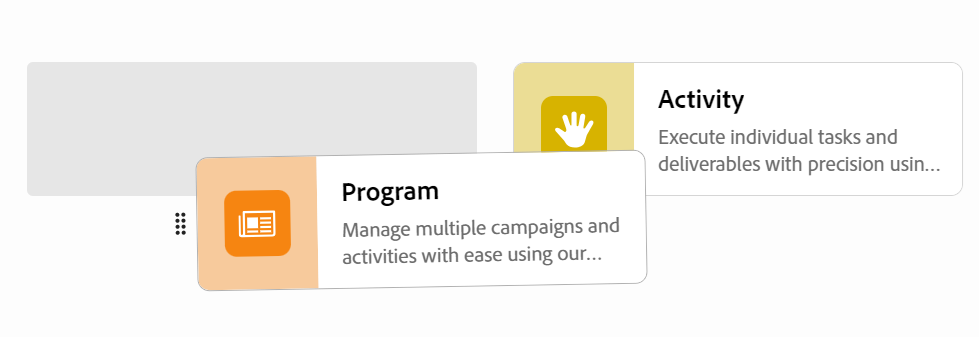

# Redigera arbetsytor

{{planning-important-intro}}

I Adobe Workfront Planning är arbetsytorna centraliserade platser där team kan planera arbetet.

En arbetsyta är en samling posttyper som används av ett team och representerar teamets arbetslivscykel. Du kan anpassa arbetsytorna helt i Adobe Workfront Planning.

Mer information om hur du skapar arbetsytor finns i [Skapa arbetsytor](/help/quicksilver/planning/architecture/create-workspaces.md).

Alla ändringar du gör på en arbetsyta är synliga för alla som har minst behörigheten Visa på arbetsytan.

## Åtkomstkrav

+++ Expandera om du vill visa åtkomstkraven för Workfront Planning.

Du måste ha följande åtkomst för att kunna utföra stegen i den här artikeln:

<table style="table-layout:auto"> 
<col> 
</col> 
<col> 
</col> 
<tbody> 
    <tr> 
<tr> 
<td> 
   
 Produkter
 </td> 
   <td> 
   <ul><li>
 Adobe Workfront
</li> 
   <li>
 Adobe Workfront Planning
</li></ul></td> 
  </tr>   
<tr> 
   <td role="rowheader">
Adobe Workfront-plan*
</td> 
   <td> 

Något av följande Workfront-planer:
 
<ul><li>Välj</li> 
<li>Prime</li> 
<li>Ultimate</li></ul> 

Workfront Planning är inte tillgängligt för tidigare Workfront-planer
 
   </td> 
<tr> 
   <td role="rowheader">
Adobe Workfront Planning*
</td> 
   <td> 

Alla 
 

Kontakta din kontoansvarige på Workfront om du vill ha mer information om vad som ingår i respektive Workfront Planning-plan. 
 
   </td> 
 <tr> 
   <td role="rowheader">
Adobe Workfront
</td> 
   <td> 

Din organisations instans av Workfront måste integreras med Adobe Unified Experience för att få tillgång till alla funktioner i Workfront Planning.
 

Mer information finns i <a href="/help/quicksilver/workfront-basics/navigate-workfront/workfront-navigation/adobe-unified-experience.md">Adobe Unified Experience for Workfront</a>. 
 
   </td> 
   </tr> 
  </tr> 
  <tr> 
   <td role="rowheader">
Adobe Workfront-licens*
</td> 
   <td>
 Standard

   
Workfront Planning är inte tillgängligt för tidigare Workfront-licenser
 
  </td> 
  </tr> 
  <tr> 
   <td role="rowheader">
Åtkomstnivåkonfiguration
</td> 
   <td> 
Det finns inga åtkomstnivåkontroller för Adobe Workfront Planning
   
</td> 
  </tr> 
<tr> 
   <td role="rowheader">
Objektbehörigheter
</td> 
   <td>  
Hantera behörigheter på arbetsytan 
   </td> 
  </tr> 
<tr> 
   <td role="rowheader">
Layoutmall
</td> 
   <td> 
Alla användare, inklusive Workfront-administratörer, måste tilldelas en layoutmall som innehåller planeringsområdet på huvudmenyn. 
 </td> 
  </tr> 
</tbody> 
</table>

*Mer information om Workfront åtkomstkrav finns i [Åtkomstkrav i Workfront-dokumentation](/help/quicksilver/administration-and-setup/add-users/access-levels-and-object-permissions/access-level-requirements-in-documentation.md).

+++

<!--OLD

<table style="table-layout:auto">
 <col>
 </col>
 <col>
 </col>
 <tbody>
    <tr>
<tr>
<td>
   
 Product
 </td>
   <td>
   
 Adobe Workfront
 </td>
  </tr>  
 <td role="rowheader">
Adobe Workfront agreement
</td>
   <td>

Your organization must be enrolled in the early access stage for Workfront Planning 

   </td>
  </tr>
  <tr>
   <td role="rowheader">
Adobe Workfront plan
</td>
   <td>

Any

   </td>
  </tr>
  <tr>
   <td role="rowheader">
Adobe Workfront license*
</td>
   <td>
   
New: Standard

   
Current: Plan
 
  </td>
  </tr>
  
  <tr>
   <td role="rowheader">
Access level configuration
</td>
   <td> 
There are no access level controls for Workfront Planning

</td>
  </tr>

<tr>
   <td role="rowheader">
Permissions
</td>
   <td> 
Manage permissions to the workspace 
  
</td>
  </tr>

<tr>
   <td role="rowheader">
Layout template
</td>
   <td> 
You must add the Planning area to your layout template. For information, see <a href="/help/quicksilver/planning/access/access-overview.md">Access overview</a>. 
  
</td>
  </tr>

 </tbody>
</table>

For more information about access requirements, see [Access requirements in Workfront documentation](/help/quicksilver/administration-and-setup/add-users/access-levels-and-object-permissions/access-level-requirements-in-documentation.md). 

-->

## Redigera en arbetsyta

{{step1-to-planning}}

1. (Villkorligt) Om du är Workfront-administratör klickar du på **Arbetsytor som jag är på** för att komma åt arbetsytor som du har skapat, eller **Andra arbetsytor** för att komma åt arbetsytor som andra delar med dig.

<!--***********Replace the steps from the next below till the "Update the following information in the Edit workspace box:" (but keep this last step)*******-->

1. (Valfritt) Klicka på **Visa alla** om du vill visa ytterligare arbetsytor. Länken **Visa alla** visas bara när du har fler än två rader med arbetsytekort.
1. (Valfritt) Klicka på **Visa färre** om du vill begränsa antalet arbetsytor som visas på skärmen.
1. Gör något av följande om du vill redigera en arbetsyta:

   * Håll pekaren över arbetsytans kort och klicka sedan på menyn **Mer**  i kortets övre högra hörn
eller
   * Klicka på ett arbetsytekort för att öppna arbetsytan och klicka sedan på menyn **Mer**  till höger om arbetsytans namn.
1. Klicka på **Redigera**.

   Rutan **Arbetsytan för redigering** visas.

   

1. Uppdatera följande information i rutan **Redigera arbetsyta**:

   * Lägg till ett namn för arbetsytan. <!--did they add a label for this field?-->
   * **Beskrivning**: Lägg till information om arbetsytan.
   * Välj en ikon som du vill associera med arbetsytan.

1. Klicka på **Spara** för att stänga arbetsyterutan för redigering och tillämpa ändringarna.

1. (Valfritt) Gör något av följande om du vill lägga till ett nytt avsnitt i arbetsytan:

   * Klicka på **Lägg till avsnitt** längst ned på arbetsytan.
   * Håll muspekaren över namnet på ett avsnitt och klicka på menyn **Mer** . Klicka sedan på **Lägg till avsnitt ovanför** eller **Lägg till avsnitt nedan**.

1. (Valfritt) Gör något av följande om du vill ändra platsen för ett avsnitt:

   * Håll muspekaren över namnet på ett avsnitt och klicka på ikonen **gripning** . Dra och släpp den sedan på den högra platsen.
   * Håll muspekaren över namnet på ett avsnitt och klicka på menyn **Mer** . Klicka sedan på **Flytta upp** eller **Flytta ned**. Avsnittet flyttas uppåt eller nedåt i arbetsytan.

1. (Valfritt) Så här tar du bort ett avsnitt på arbetsytan:

   1. Håll muspekaren över namnet på ett avsnitt, klicka på menyn **Mer**  och klicka sedan på **Ta bort**. <!--add screen shot when UI is final?-->
   1. Markera ett nytt avsnitt om du vill flytta alla posttyper till det och klicka sedan på **Ta bort**. <!--check the button name; logged a bug to change it to "Delete" from "Delete section".-->

      Alla posttyper flyttas till urvalssektionen och avsnittet tas bort.

1. (Valfritt) Klicka på **Lägg till posttyp** för att lägga till posttyper på arbetsytan.

   Mer information finns i [Skapa posttyper](/help/quicksilver/planning/architecture/create-record-types.md).

1. (Valfritt) Håll markören över ett posttypskort, klicka på menyn **Mer**  i det övre högra hörnet och klicka sedan på **Redigera** för att ändra utseendet på en posttyp.

   Mer information finns i [Redigera posttyper](/help/quicksilver/planning/architecture/edit-record-types.md).

1. (Valfritt) Håll markören över ett posttypskort, klicka på menyn **Mer**  i det övre högra hörnet och klicka sedan på **Ta bort** för att ta bort en posttyp.

   Mer information finns i [Ta bort posttyper](/help/quicksilver/planning/architecture/delete-record-types.md).

1. (Valfritt) Tryck på ett posttypskort för att dra det och släppa det på en ny plats. Du kan dra och släppa posttyper från ett avsnitt på arbetsytan till ett annat.

   

1. (Valfritt) Klicka på **Dela** i det övre högra hörnet av arbetsytan om du vill dela arbetsytan med andra.

   Mer information finns i [Dela arbetsytor](/help/quicksilver/planning/access/share-workspaces.md).
