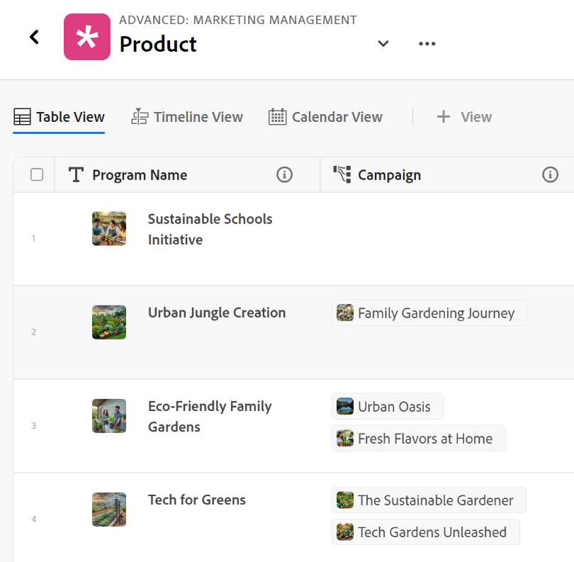
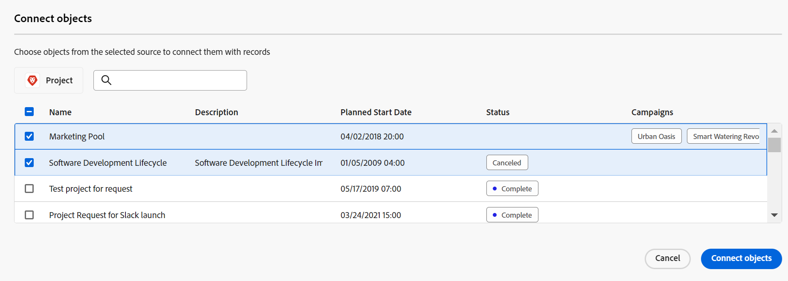

# Exempel på att ansluta posttyper och poster

{{planning-important-intro}}

I den här artikeln beskrivs ett exempel på följande:

* Så här skapar du en anslutning mellan två posttyper i Workfront Planning och två poster.

* Så här skapar du en anslutning mellan en Workfront Planning-posttyp och en Workfront-projektobjekttyp samt en anslutning mellan en post och ett projekt.

Mer information finns i följande artiklar:

* [Koppla posttyper](/help/quicksilver/planning/architecture/connect-record-types.md)
* [Koppla poster](/help/quicksilver/planning/records/connect-records.md)

## Koppla samman två posttyper och poster i Workfront Planning (exempel)

Du har till exempel posttypen Campaign som ursprunglig posttyp.

Du har också en annan posttyp som heter Produkt, som har ett valutafält som heter Budget.

Du vill skapa ett fält på posttypen för Campaign där du kan visa värdena i budgetfältet för posttypen Produkt.

Så här gör du:

1. Öppna tabellvyn för Campaign-posttypen på en arbetsyta.
1. Klicka på ikonen **+** i tabellvyns övre högra hörn för att lägga till ett nytt fält, klicka sedan på **Ny anslutning** och klicka sedan på **Produkt** i det markerade arbetsyteavsnittet.
1. Lägg till följande information, till exempel:

   * **Posttyp**: Produkt <!--did they change the casing here?-->
   * **Namn**: Ge det nya fältet ett namn. Till exempel&quot;Produktinformation&quot;. Det här är namnet på det länkade postfältet.
   * **Beskrivning**: Lägg till en beskrivning för det nya fältet. Exempel:&quot;Det här är de produkter som jag vill att mina kampanjer ska vara kopplade till.&quot; Beskrivningen av fältet visas när du hovrar över fältet i kolumnrubriken.
   * **Anslutningstyp**: Välj bland följande alternativ:
      * **Många till många**: Användare kan koppla en kampanj till flera produkter och en produkt till flera kampanjer.
      * **En till många**: Användare kan koppla en kampanj till flera produkter och en produkt till en kampanj.
      * **Många till en**: Användare kan koppla en kampanj till en produkt och en produkt till många kampanjer.
      * **En till en**: Användarna kan koppla en kampanj till en produkt och en produkt till en kampanj.

     >[!NOTE]
     >
     >Alternativet **Anslutningstyp** är inte tillgängligt vid anslutning av poster från olika arbetsytor eller vid anslutning av Experience Manager-resurser. Mer information finns i [Översikt över anslutna posttyper](/help/quicksilver/planning/architecture/connect-record-types-overview.md).

   * **Postutseende**: Avmarkera alternativet **Titel** om du inte vill visa produktnamn när du lägger till dem i kampanjens produktinformationsfält. Om det här alternativet är aktiverat visas både miniatyrbilden och titeln. Växlingsknappen är aktiverad som standard.
   * **Markera uppslagsfält**: Om du låter det här alternativet vara markerat öppnas rutan **Lägg till uppslagsfält** så att du kan länka produktfält med kampanjposttypen. Du kan klicka på **Hoppa över** om du vill hoppa över det här steget och lägga till produktfält senare.

   

1. (Villkorligt) Om du valde alternativet **Välj uppslagsfält** i föregående steg klickar du på ikonen **+** för fältet **Budget** i listan med fält som är associerade med posttypen **Produkt** och sedan på **Lägg till fält**. Detta skapar ett fält med namnet **Budget (från produktinformation)**, som är namnet på det länkade fältet. All information för produktbudgeten visas i det här fältet för kampanjposterna.

   

   >[!TIP]
   >
   >    Om du vill visa budgeten för alla valda produkter som ett totalt tal väljer du **SUM** i listrutan till höger om fältnamnet. När användare väljer flera produkter i det länkade postfältet **Produktinformation** läggs alla deras budgetvärden ihop i fältet **Budget (från produktinformation)** och summan visas. <!-- check the shot below - added a bug with a couple of UI changes here-->
   >
   > Om du väljer **Inget** visas de enskilda budgetarna för de valda produkterna åtskilda med kommatecken i stället för **SUM**.

   Detta genererar följande fält:

   * I registervyn Campaign och på kampanjpostsidan för en kampanj:

      * **Produktinformation** (det länkade postfältet): Här visas namnen på produkterna när du lägger till dem.
      * **Budget (från produktinformation)** (det länkade fältet): Här visas budgetarna för de produkter som valts i fältet Produktinformation.

   * I produktposttabellvyn och på produktpostsidan för en produkt:

      * **Kampanj**: Detta indikerar att produktposttypen är länkad från posttypen Campaign.

     

   >[!TIP]
   >
   >    Länkade postfält föregås av relationsikonen .

1. Skapa en kampanj genom att lägga till en ny rad i posttypssidans tabell från posttypvyn **Campaign** .

1. Dubbelklicka i kolumnen **Produktinformation** för den nya kampanjen.

   

1. Gör något av följande:

   * Klicka på en ansluten produkts namn i listan för att lägga till den till den valda posten. Produkten läggs till automatiskt.
   * Börja skriva namnet på en produkt och klicka på den när den visas i listan. Produkten läggs till automatiskt.
   * Klicka på **Visa alla** om du vill visa alla produkter.

1. (Villkorligt) Om du klickade på **Visa alla** i föregående steg visas rutan **Anslut objekt** .

   

1. Börja skriva namnet på en produkt i sökrutan och markera den sedan när den visas i listan

   eller

   Markera de produktposter som du vill ansluta till Campaign-posterna och klicka sedan på **Anslut objekt**.

   >[!TIP]
   >
   >    Du kan öppna en Campaigns postsida, hitta det länkade postfältet och klicka på ikonen **+** i fältet för att lägga till produkter från den anslutna produktposttypen.

   Följande kolumner är ifyllda i posttyptabellen för Campaign:
   * Fältet **Produktinformation** fylls i för Campaign-posten med de valda produkterna.
   * **Fältet Budget (från produktinformation)** fylls i med budgetvärdet för varje vald produkt, eller med summan av alla budgetar för de valda produkterna (om du valde SUM för aggregatorn).

   

   >[!TIP]
   >
   >Om du inte väljer en aggregator för de flera värdena visas alla värden från de valda produkterna avgränsade med kommatecken.

1. Om du vill fylla i fältet **Kampanj** från tabellvyn **Produkt** upprepar du steg 5-7 med början från tabellvyn för produktposttyper och väljer kampanjinformation. Detta uppdaterar även produktinformationsfältet i posttypssidans register för Campaign. <!--ensure the step numbers remain correct-->

## Koppla en Workfront Planning-posttyp till en Workfront-projektobjekttyp och koppla en post till enskilda projekt

>[!IMPORTANT]
>
>    Alla som har behörighet att visa eller högre på arbetsytan kan visa informationen i de länkade fälten, oavsett behörighet eller åtkomstnivå i Workfront.

Du har till exempel posttypen Campaign som ursprunglig posttyp.

Du har också projekt i Workfront med ett fält som heter&quot;Planerad intäkt&quot;.

Du vill skapa ett anslutningsfält för posttypen Campaign där du kan visa värdena i fältet Planerad intäkt för de projekt i Workfront som är kopplade till kampanjer i Workfront Planning.

Så här gör du:

1. Gå till en Workspace där du vill koppla posttypen Campaign till Workfront-projekt.
1. Öppna tabellvyn för Campaign-posttypen på den valda arbetsytan.
1. Klicka på ikonen **+** i tabellvyns övre högra hörn för att lägga till ett nytt fält, klicka sedan på **Ny anslutning** och klicka sedan på **Projekt** i avsnittet **Workfront-objekttyper** .
1. Lägg till följande information, till exempel:

   * **Posttyp**: Projekt (från Workfront underavsnitt)
   * **Namn**: Ge det nya fältet ett namn, till exempel &quot;Projektinformation&quot;.
   * **Beskrivning**: Lägg till en beskrivning för det nya fältet. Exempel:&quot;Detta är de projekt som jag vill att mina kampanjer ska vara kopplade till.&quot; Beskrivningen visas i tabellvyn när du hovrar över fältnamnet i kolumnrubriken.
   * **Anslutningstyp**: Välj bland följande alternativ:
      * **Många till många**: Användare kan koppla en kampanj till flera produkter och en produkt till flera kampanjer.
      * **En till många**: Användare kan koppla en kampanj till flera produkter och en produkt till en kampanj.
      * **Många till en**: Användare kan koppla en kampanj till en produkt och en produkt till många kampanjer.
      * **En till en**: Användarna kan koppla en kampanj till en produkt och en produkt till en kampanj.
   * **Länka endast objekt som matchar det här villkoret**: Välj ett anpassat formulär i listrutan **Eget formulär**. Endast projekt som är kopplade till de angivna formulären är tillgängliga för att kopplas till kampanjer. Du kan välja flera formulär.
   * **Markera uppslagsfält**: Om du låter det här alternativet vara markerat öppnas rutan **Lägg till uppslagsfält** så att du kan länka projektfält med kampanjposttypen. Du kan klicka på **Hoppa över** om du vill hoppa över det här steget och lägga till projektfält senare.

   

1. (Villkorligt) Om du valde alternativet **Välj uppslagsfält** i föregående steg klickar du på ikonen **+** för fältet **Planerad intäkt** i listan med fält som är associerade med objekttypen **och sedan på** Lägg till fält **.** Detta skapar ett fält med namnet **Planerad intäkt (från projektinformation)**, som är namnet på det länkade fältet. All information från fältet Planerad intäkt för projekt visas automatiskt i det här fältet för kampanjposterna.

   >[!TIP]
   >
   >    Om du vill visa planerad intäkt för alla valda projekt som ett totalt tal väljer du **SUM** i listrutan till höger om fältnamnet. När användare väljer flera projekt i det länkade objektfältet **Projektinformation** läggs alla värden samman i fältet **Planerad intäkt (från produktinformation)** och det totala antalet visas. <!-- check the shot below - added a bug with a couple of UI changes here-->
   >
   > Om du väljer **Ingen**, i stället för **SUM**, visas de enskilda planerade intäkterna avgränsade med kommatecken.

   

   Detta genererar följande fält:

   * I posttabellvyn för Campaign och på kampanjpostsidan:

      * **Projektinformation** (det länkade objektfältet): Detta visar namnet eller namnen på projekten.
      * **Planerad intäkt (från projektinformation)** (det länkade fältet): Här visas planerad intäkt för de projekt som valts i fältet Projektinformation.

   >[!TIP]
   >
   >    Länkade objektfält föregås av relationsikonen .

1. Skapa en kampanj genom att lägga till en ny rad i tabellen från posttypsvyn **Campaign** .

1. Dubbelklicka i kolumnen med projektinformation** i den nya kampanjen.

   

1. Gör något av följande:

   * Klicka på ett projektnamn i listan för att lägga till det i den valda posten. Projektet läggs till automatiskt.
   * Börja skriva namnet på ett projekt och klicka på det när det visas i listan. Projektet läggs till automatiskt.
   * Klicka på **Visa alla** om du vill visa alla projekt.

1. (Villkorligt) Om du klickade på **Visa alla** i föregående steg visas rutan **Anslut objekt** .

   

1. Börja skriva namnet på ett projekt i sökrutan och markera det sedan när det visas i listan

   eller

   Markera de projektposter som du vill ansluta till Campaign-posterna och klicka sedan på **Anslut objekt**.

   >[!TIP]
   >
   >    Du kan öppna sidan för en kampanj, hitta det länkade projektfältet och klicka på ikonen **+** i fältet för att lägga till projekt från den anslutna produktposttypen.

   Detta lägger till följande på den markerade arbetsytan:

   * I registret Kampanjposttyp:
      * Fältet **Projektinformation** fylls i för Campaign-posten med de valda projekten.
      * Fältet **Planerad intäkt (från produktinformation)** fylls i med budgetvärdet för varje vald produkt. Det här är ett skrivskyddat fält.

   

   >[!TIP]
   >
   >Om du inte väljer en aggregator för de flera värdena och du markerar flera objekt i det objektlänkade fältet, visas alla värden avgränsade med kommatecken.

1. Klicka på namnet på ett projekt i det anslutna postfältet.

   Då öppnas projektet i Workfront, om du har minst behörigheten Visa för projektet.
1. (Valfritt) Uppdatera information om projektet i Workfront, om du har behörighet att göra det.

1. (Valfritt) Håll markören över fälthuvudet **Projektinformation** i Campaign-tabellvyn och klicka på nedåtpilen och klicka sedan på **Redigera uppslagsfält.**
1. Klicka på ikonen **+** för alla projektfält som du vill lägga till i projektets Workfront Planning-post i avsnittet **Omarkerade fält**.
1. Klicka på ikonen **-** för de projektfält som du vill ta bort från Workfront Project Planning-posten i avsnittet **Markerade fält**.
1. Klicka på **Spara**.

   Ytterligare länkade fält läggs till i Campaign-posttypen.
