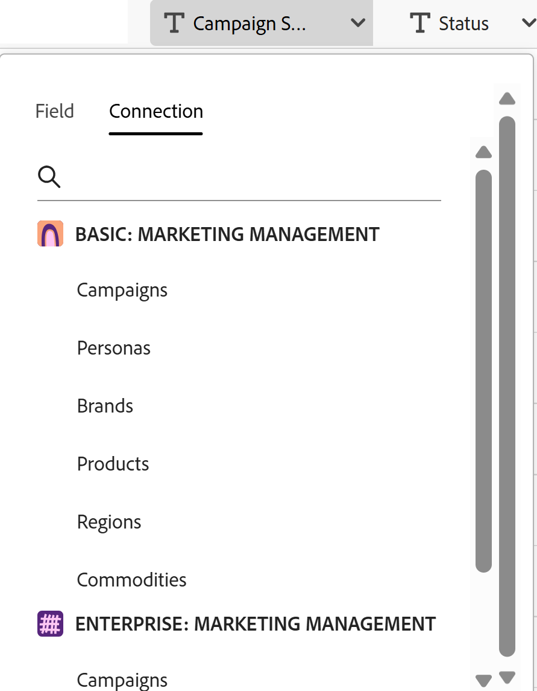

# Skapa posttyper genom att importera information från en CSV- eller Excel-fil

Informationen på den här sidan hänvisar till funktioner som ännu inte är allmänt tillgängliga. Det är bara tillgängligt i förhandsvisningsmiljön för alla kunder. Efter de månatliga releaserna i Production finns samma funktioner även i produktionsmiljön för kunder som aktiverat snabba releaser. 

Mer information om snabba releaser finns i [Aktivera eller inaktivera snabba releaser för din organisation](/help/quicksilver/administration-and-setup/set-up-workfront/configure-system-defaults/enable-fast-release-process.md). 

{{planning-important-intro}}

Posttyperna är objekttyperna för Adobe Workfront Planning. I Workfront Planning kan du skapa anpassade posttyper som illustrerar vilka arbetsobjekt som behövs i organisationens livscykel genom att importera information från en CSV- eller Excel-fil.

## Åtkomstkrav

+++ Expandera om du vill visa åtkomstkraven.

<table style="table-layout:auto"> 
<col> 
</col> 
<col> 
</col> 
<tbody> 
    <tr> 
<tr> 
<td> 
   
 Produkter
 </td> 
   <td> 
   <ul><li>
 Adobe Workfront
</li> 
   <li>
 Adobe Workfront Planning
</li></ul></td> 
  </tr>   
<tr> 
   <td role="rowheader">
Adobe Workfront-plan*
</td> 
   <td> 

Något av följande Workfront-planer:
 
<ul><li>Välj</li> 
<li>Prime</li> 
<li>Ultimate</li></ul> 

Workfront Planning är inte tillgängligt för tidigare Workfront-planer
 
   </td> 
<tr> 
   <td role="rowheader">
Adobe Workfront Planning-paket*
</td> 
   <td> 

Alla 
 

Kontakta din kontoansvarige på Workfront om du vill ha mer information om vad som ingår i respektive Workfront Planning-plan. 
 
   </td> 
 <tr> 
   <td role="rowheader">
Adobe Workfront
</td> 
   <td> 

Din organisations instans av Workfront måste vara registrerad på Adobe Unified Experience för att få tillgång till Workfront Planning.
 

Mer information finns i <a href="/help/quicksilver/workfront-basics/navigate-workfront/workfront-navigation/adobe-unified-experience.md">Adobe Unified Experience for Workfront</a>. 
 
   </td> 
   </tr> 
  </tr> 
  <tr> 
   <td role="rowheader">
Adobe Workfront-licens*
</td> 
   <td>
 Standard

   
Workfront Planning är inte tillgängligt för tidigare Workfront-licenser
 
  </td> 
  </tr> 
  <tr> 
   <td role="rowheader">
Åtkomstnivåkonfiguration
</td> 
   <td> 
Det finns inga åtkomstnivåkontroller för Adobe Workfront Planning
   
</td> 
  </tr> 
<tr> 
   <td role="rowheader">
Objektbehörigheter
</td> 
   <td>   
Hantera behörigheter till en arbetsyta </a> 
  
   
Systemadministratörer har behörighet till alla arbetsytor, inklusive de som de inte skapade
  </td> 
  </tr>

</tbody> 
</table>

*Mer information om Workfront åtkomstkrav finns i [Åtkomstkrav i Workfront-dokumentation](/help/quicksilver/administration-and-setup/add-users/access-levels-and-object-permissions/access-level-requirements-in-documentation.md).

+++

## Att tänka på när du importerar posttyper med hjälp av en Excel- eller CSV-fil

* Varje blad i Excel-filen blir en posttyp. Kalkylbladets namn blir posttypens namn.
* Om det bara finns ett blad, eller om du importerar en CSV-fil, får filen namnet som posttyp.
* Kolumnrubrikerna i varje blad blir de fält som är kopplade till varje posttyp.
* Fält är unika för respektive posttyp.
* Varje rad i varje blad blir en unik post som är kopplad till respektive posttyp.
* Varje blad i Excel-filen får inte överskrida följande:
   * 25 000 rader
   * 500 kolumner
* Filen får inte vara större än 5 MB.
* Tomma blad stöds inte.
* Fält av följande typer stöds inte och kan inte mappas till fält på importbladet:

   * Anslutningsfält till objekttyperna Workfront och AEM Assets.
   * Sök efter fält från anslutna Planning-poster eller Workfront- och AEM Assets-objekt
   * Formelfält
   * Skapad den, skapad av
   * Senast ändrat den
   * Godkänt den 
   * Folk

Så här importerar du posttyper med en Excel- eller CSV-fil:

{{step1-to-planning}}

1. Klicka på arbetsytan där du vill skapa posttyper,

   eller

   Utöka den nedåtriktade pilen till höger om namnet på en befintlig arbetsyta i en arbetsyta, sök efter en arbetsyta och markera den när den visas i listan.
1. Klicka på **Lägg till posttyp**.
1. Klicka på **Överför från fil**.
1. Dra och släpp en Excel- eller CSV-fil som du tidigare har sparat på datorn eller klicka på **Välj en CSV- eller Excel-fil** om du vill bläddra efter en fil och markera den.
1. Klicka på **Förhandsgranska och redigera**.

   Rutan **Förhandsgranska och redigera** visas med följande information:

   * Namnen på arken eller de framtida posttyperna visas på den vänstra panelen. I Workfront Planning väljs en ikon och en färg för varje ny posttyp som standard.
   * Den första arks- eller posttypen markeras och namnen på de fält som är kopplade till den visas som kolumnrubriker. Som standard väljs typen för varje fält.
   * Varje rad representerar en ny post. Endast de första 10 posterna visas i rutan Förhandsgranska och redigera.

   

1. (Valfritt) Klicka på namnet på varje blad i den vänstra panelen för att granska informationen som det innehåller.

   >[!NOTE]
   >
   >Blad som är tomma stöds inte och är nedtonade.

1. (Valfritt) Avmarkera de blad som du inte vill importera från den vänstra panelen.

   

   Blad som du avmarkerat visas med grå bakgrund.

1. (Valfritt) Klicka på den nedåtriktade pilen till höger om en kolumnrubrik om du vill göra något av följande på fliken **Fält**:

   

   * Byt namn på ett av fälten
   * Ändra **fälttypen**
   * Uppdatera fältet **Beskrivning**

1. (Valfritt) Klicka på fliken **Anslutning** för att mappa informationen i kolumnen till ett anslutet fält från andra posttyper.

   

   >[!TIP]
   >
   >Du kan bara mappa till fält från Workfront Planning-anslutna poster. Du kan inte mappa till fält från Workfront- eller AEM Assets-anslutningar. Mer information finns i avsnittet [Att tänka på när du importerar posttyper med hjälp av en Excel- eller CSV-fil](#considerations-about-importing-record-types-using-an-excel-or-csv-file) i den här artikeln.

1. (Villkorligt) När du har uppdaterat informationen om fältet klickar du på **Spara**.

1. Klicka på **Importera** när du är klar att importera filen.

   Följande information importeras till Workfront Planning:

   * Nya posttyper
   * Nya fält som är associerade med varje posttyp
   * Nya poster associerade med varje posttyp

   Du kan börja hantera fält och poster på posttypssidorna.

   Alla som har tillgång till Workfront Planning och arbetsytan kan nu visa och redigera de importerade posttyperna och deras information.
