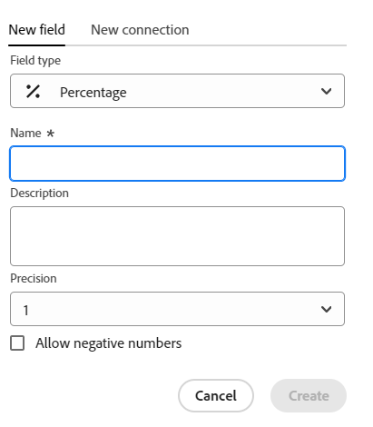

<!--update the metadata with real information when making this available in TOC and in the left nav-->

<!---
title: Create fields
description: In Adobe Workfront Planning, you can create custom fields for each kind of operational record type or taxonomy. You can then associate the field with records.
hidefromtoc: yes
hide: yes
author: Alina
feature: (*******************WE NEED A NEW ONE*******************)
role: User, Administrator (************is this right???************)
recommendations: noDisplay, noCatalog
--->

<!--Should the structure of this article be like this one: https://experienceleague.adobe.com/docs/workfront/using/administration-and-setup/customize/custom-forms/custom-form-builder/use-the-custom-form-builder/add-a-custom-field-to-a-custom-form.html?lang=en ??-->

<!--will they add a way to create fields elsewhere than in a table?! - how will that change the structure of this article? -->

<!--Do we need this for FORMULAS: when we release permissions to RECORDS and we release referring lookup fields in a formula field, update considerations to say that lookup fields from linked records depends on the permissions to the record; if they have no permissions to view a linked record, they won't be able to use that records's lookup fields in a formula - not sure is needed??-->

# Skapa fält

{{planning-important-intro}}

I Adobe Workfront Planning kan du skapa anpassade fält för posttyper. Du kan sedan associera fälten med Workfront Planning-poster för att förbättra postinformationen.

Du måste skapa posttyper innan du kan skapa fält som ska kopplas till dem. Mer information finns i [Skapa posttyper](/help/quicksilver/planning/architecture/create-record-types.md).

Du kan skapa fält på följande sätt i Workfront Planning:

* Från början
* Genom att ansluta posttyper
* Importera posttyper med en Excel- eller CSV-fil
* Genom att skapa en posttyp
* Skapa en arbetsyta från en mall

Mer information om Workfront Planning-fält finns i [Fältöversikt](/help/quicksilver/planning/fields/fields-overview.md).

## Åtkomstkrav

+++ Expandera om du vill visa åtkomstkraven för Workfront Planning.

<table style="table-layout:auto">
 <col>
 </col>
 <col>
 </col>
 <tbody>
    <tr>
<tr>
<td>
   
 Produkt
 </td>
   <td>
   
 Adobe Workfront
 </td>
  </tr>  
 <td role="rowheader">
Adobe Workfront-avtal
</td>
   <td>

Din organisation måste vara registrerad på Workfront Planning i ett tidigt skede 

   </td>
  </tr>
  <tr>
   <td role="rowheader">
Adobe Workfront
</td>
   <td>

Alla

   </td>
  </tr>
  <tr>
   <td role="rowheader">
Adobe Workfront-licens*
</td>
   <td>
   
Nytt: Standard
 
   
Aktuell: Planera

  </td>
  </tr>

<tr>
   <td role="rowheader">
Konfigurationer på åtkomstnivå
</td>
   <td> 
Det finns ingen åtkomstnivåkontroll för Workfront Planning
  
</td>
  </tr>

<tr>
   <td role="rowheader">
Behörigheter
</td>
   <td> 
Hantera behörigheter till en arbetsyta </a> 
  
   
Systemadministratörer har behörighet för alla arbetsytor, inklusive de som de inte skapade.

</td>
  </tr>
<tr>
   <td role="rowheader">
Layoutmall
</td>
   <td> 
Workfront- eller gruppadministratören måste lägga till planeringsområdet i layoutmallen. Mer information finns i <a href="/help/quicksilver/planning/access/access-overview.md">Åtkomstöversikt</a>. 
  
</td>
  </tr>

</tbody>
</table>

*Mer information finns i [Åtkomstkrav i Workfront-dokumentation](/help/quicksilver/administration-and-setup/add-users/access-levels-and-object-permissions/access-level-requirements-in-documentation.md).

+++

<!--Maybe enable this at GA - but Planning is not supposed to have Access controls in the Workfront Access Level: 
>[!NOTE]
>
>If you don't have access, ask your Workfront administrator if they set additional restrictions in your access level. For information on how a Workfront administrator can change your access level, see [Create or modify custom access levels](/help/quicksilver/administration-and-setup/add-users/configure-and-grant-access/create-modify-access-levels.md). -->

## Skapa fält från grunden {#create-fields-from-scratch}

<!--in a table (not sure if this can be done elsewhere?!-->

{{step1-to-planning}}

1. Klicka på arbetsytan vars poster du vill skapa fält för.

   Arbetsytan öppnas och posttyperna visas.

1. Klicka på kortet för en posttyp.

   Alla befintliga poster som är associerade med posttypen visas i tabellvyns rader.

   >[!TIP]
   >
   >    Om inga poster visas kanske du inte har några poster än, eller så kanske du har ett filter som begränsar det som visas på skärmen.

   Alla befintliga fält som är associerade med posttypen visas i kolumnerna i tabellvyn.

   >[!TIP]
   >
   >    Vissa fält kan vara dolda. Klicka på Fält och aktivera växlingen mellan de fält som du vill visa som kolumner i tabellvyn.

1. Klicka på ikonen **+** i tabellvyns övre högra hörn

   eller

   Håll markören över en kolumnrubrik, klicka på den nedåtriktade pilen efter fältnamnet och klicka sedan på **Infoga vänster** eller **Infoga höger** för att lägga till det nya fältet.
1. På fliken **Nytt fält** söker du efter en fälttyp i rutan **Fälttyp** eller väljer någon av följande fälttyper:

   * [Enkelradig text](#single-line-text)
   * [Stycke](#paragraph)
   * [Flera val](#multi-select)
   * [Enkelval](#single-select)
   * [Datum](#date)
   * [Number](#number)
   * [Procent](#percentage)
   * [Valuta](#currency)
   * [Kryssruta](#checkbox)
   * [Formel](#formula)
   * [Folk](#people)
   * [Skapad av](#created-by)
   * [Skapad den](#created-date)
   * [Senast ändrad av](#last-modified-by)
   * [Senast ändrat den](#last-modified-date)

   >[!IMPORTANT]
   >
   >    Du kan inte ändra fälttypen när du har sparat den.

1. Fortsätt med att lägga till varje fält enligt beskrivningen i avsnitten nedan.

### Enkelradig text {#single-line-text}

Enkelradiga textfält fångar begränsad alfanumerisk information. Du kan till exempel samla information om ägare, intressenter, team eller organisationsenheter i ett textfält med en rad. Innehållet i ett textfält med en rad kan innehålla upp till 250 tecken. <!-- asked Lilit if we can change this to "Single-line" since this can have numbers and text.-->

1. Börja skapa ett fält enligt beskrivningen i avsnittet [Skapa fält från grunden](#create-fields-from-scratch) i den här artikeln och välj sedan fälttypen **Enkelradig text**.

   

1. Lägg till följande information på fliken **Nytt fält**:
   * **Namn**: Namnet på fälttypen så som den kommer att visas i en tabell eller på postens detaljsida. <!--ensure they updated this; and update the screen shot: it used to be "Label"-->
   * **Beskrivning**: Ytterligare information om fältet. Beskrivningen av ett fält visas när du hovrar över fältets kolumnrubrik i en tabell.
1. Klicka på **Skapa**.

   Det nya enradiga fältet läggs till som en kolumn till posttypen och dess värden kan kopplas till poster.

### Stycke {#paragraph}

Styckefält hämtar ytterligare alfanumerisk information om en post, som liknar fältet Beskrivning.

>[!TIP]
>
>* Innehållet i ett styckefält kan innehålla upp till 1 000 tecken.
>
>* Du kan använda RTF-formatering för att förbättra innehållet i styckefält när de visas i tabellvyn eller på detaljsidan för en post. Mer information finns i [Redigera poster](/help/quicksilver/planning/records/edit-records.md).

1. Börja skapa ett fält enligt beskrivningen i avsnittet [Skapa fält från grunden](#create-fields-from-scratch) i den här artikeln och välj sedan fälttypen **Stycke**.

   

1. Lägg till följande information på fliken **Nytt fält**:
   * **Namn**: Namnet på fälttypen så som den kommer att visas i en tabell eller på postens detaljsida. <!--ensure they updated this; and update the screen shot: it used to be "Label"-->
   * **Beskrivning**: Ytterligare information om fältet. Beskrivningen av ett fält visas när du hovrar över fältets kolumn i en tabell.
1. Klicka på **Skapa**.

   Det nya styckefältet läggs till som en kolumn till posttypen och dess värden kan kopplas till poster.

### Flera val {#multi-select}

Du kan använda ett flervalsfält för att hämta ytterligare information i valfritt format genom att välja mer än ett alternativ i en listruta.

1. Börja skapa ett fält enligt beskrivningen i avsnittet [Skapa fält från grunden](#create-fields-from-scratch) i den här artikeln och välj sedan fälttypen **Flera val**.

   

1. Lägg till följande information på fliken **Nytt fält**:
   * **Namn**: Namnet på fälttypen så som den kommer att visas i en tabell eller på postens detaljsida. <!--ensure they updated this; and update the screen shot: it used to be "Label"-->
   * **Beskrivning**: Ytterligare information om fältet. Beskrivningen av ett fält visas när du hovrar över fältets kolumn i en tabell.
   * **Alternativ**: De alternativ som är tillgängliga att välja på den nedrullningsbara menyn när fältet har sparats. Du kan ha både siffror och bokstäver för namnet på varje val.
1. Klicka på **Lägg till alternativ** om du vill lägga till så många alternativ som behövs. Det finns ingen gräns för hur många alternativ du kan lägga till i ett flervalsfält.
1. (Valfritt) Dra och släpp varje alternativ manuellt i önskad ordning, eller välj
   **Sorteringsalternativ A-Z** om du vill att valen automatiskt ska visas i alfabetisk ordning. <!--Add this if they added this functionality: You cannot edit this option after you save the field.-->
1. (Valfritt) Om du vill ta bort ett alternativ klickar du på ikonen **x** till höger om den.
1. Klicka på färgrutan till vänster om ett alternativ för att utöka färgväljaren och anpassa färgen för varje alternativ.
1. Klicka på **Skapa**.

   Det nya flervalsfältet läggs till som en kolumn till posttypen och dess värden kan kopplas till poster.

### Enkelval {#single-select}

Med envalsfält hämtas ytterligare information i valfritt format genom att du väljer ett alternativ i en nedrullningsbar meny.

1. Börja skapa ett fält enligt beskrivningen i avsnittet [Skapa fält från grunden](#create-fields-from-scratch) i den här artikeln och välj sedan fälttypen **Enkelval**.

   

1. Lägg till följande information på fliken **Nytt fält**:
   * **Namn**: Namnet på fälttypen så som den kommer att visas i en tabell eller på postens detaljsida. <!--ensure they updated this; and update the screen shot: it used to be "Label"-->
   * **Beskrivning**: Ytterligare information om fältet. Beskrivningen av ett fält visas när du hovrar över fältets kolumn i en tabell.
   * **Alternativ**: De alternativ som är tillgängliga att välja på den nedrullningsbara menyn när fältet har sparats. Du kan ha både siffror och bokstäver för namnet på varje val.

1. Klicka på **Lägg till alternativ** om du vill lägga till så många alternativ som behövs. Det finns ingen gräns för hur många alternativ du kan lägga till i ett envalsfält.
1. (Valfritt) Dra och släpp varje alternativ manuellt i önskad ordning eller markera alternativet **Sorteringsalternativ A-Z** om du vill att valen automatiskt ska visas i alfabetisk ordning. <!--Add this if they added this functionality: You cannot edit this option after you save the field.-->
1. (Valfritt) Om du vill ta bort ett alternativ klickar du på ikonen **x** till höger om den.
1. Klicka på färgrutan till vänster om ett alternativ för att utöka färgväljaren och anpassa färgen för varje alternativ.
1. Klicka på **Skapa**.

   Det nya envalsfältet läggs till som en kolumn till posttypen och dess värden kan kopplas till poster.

### Datum {#date}

Du kan använda ett datumfält för att samla in ytterligare information i datum- och tidsformat.

1. Börja skapa ett fält enligt beskrivningen i avsnittet [Skapa fält från grunden](#create-fields-from-scratch) i den här artikeln och välj sedan fälttypen **Datum**.

   

1. Lägg till följande information på fliken **Nytt fält**:
   * **Namn**: Namnet på fälttypen så som den kommer att visas i en tabell eller på postsidan. <!--ensure they updated this; and update the screen shot: it used to be "Label"-->
   * **Beskrivning**: Ytterligare information om fältet. Beskrivningen av ett fält visas när du hovrar över fältets kolumn i en tabell.
   * **Datumformat**: Den typ av datumformat som du vill visa i det här fältet. <!--update this casing - submitted bug for it-->

     Välj bland följande format:
      * **Språk**: Matchar språkområdet i webbläsaren.
      * **Standard**: 05/16/2023
      * **Lång**: 16 maj 2023
      * **Europeisk**: 16/05/2023
      * **ISO**: 2023-05-16
   * **Inkludera ett tidsfält**: Välj det här alternativet om du vill inkludera en tidsstämpel. Detta är som standard omarkerat. <!--update this setting name - submitted bug for it to be changed-->

     Välj bland följande alternativ:

      * **24hr**: Till exempel: 18:00
      * **12hr**: Exempel: 6:00 PM

1. Klicka på **Skapa**.

   Det nya datumfältet läggs till som en kolumn till posttypen och dess värden kan kopplas till poster.

### Nummer {#number}

Nummerfälttyper samlar in information i talformat.

1. Börja skapa ett fält enligt beskrivningen i avsnittet [Skapa fält från grunden](#create-fields-from-scratch) i den här artikeln och välj sedan fälttypen **Number**.

   
1. Lägg till följande information på fliken **Nytt fält**:

   * **Namn**: Namnet på fälttypen så som den kommer att visas i en tabell eller på postsidan.
   * **Beskrivning**: Ytterligare information om fältet. Beskrivningen av ett fält visas när du hovrar över fältets kolumn i en tabell.
   * **Precision**: Antalet decimaler som du vill registrera för fältet. Du kan visa upp till 6 decimaler.
   * **Tillåt negativa tal**: Välj det här alternativet om du vill tillåta negativa tal i det här fältet. Det här alternativet är som standard avmarkerat.

   >[!NOTE]
   >
   >    Om du väljer Tillåt negativa tal och negativa värden lagras på posterna som fältet är kopplat till, kan du inte längre avmarkera inställningen i framtiden.

1. Klicka på **Skapa**.

   Det nya nummerfältet läggs till som en kolumn till posttypen och dess värden kan kopplas till poster.

### Procent {#percentage}

Procentfälttyper samlar in information i talformat följt av ett procenttecken.

1. Börja skapa ett fält enligt beskrivningen i avsnittet [Skapa fält från grunden](#create-fields-from-scratch) i den här artikeln och välj sedan fälttypen **Procent**.

   

1. Lägg till följande information på fliken **Nytt fält**:
   * **Namn**: Namnet på fälttypen så som den kommer att visas i en tabell eller på postsidan.
   * **Beskrivning**: Ytterligare information om fältet. Beskrivningen av ett fält visas när du hovrar över fältets kolumn i en tabell.
   * **Precision**: Antalet decimaler som du vill registrera för fältet. Du kan visa upp till 6 decimaler.
   * **Tillåt negativa tal**: Välj det här alternativet om du vill tillåta negativa procentvärden i det här fältet. Det här alternativet är som standard avmarkerat.

   >[!NOTE]
   >
   >    Om du väljer Tillåt negativa tal och negativa värden lagras på posterna som fältet är kopplat till, kan du inte längre avmarkera inställningen i framtiden.

1. Klicka på **Skapa**.

   Det nya procentfältet läggs till som en kolumn till posttypen och dess värden kan kopplas till poster.

### Valuta {#currency}

Valutafälttyper samlar in information i ett talformat som föregås av en valutasymbol.

1. Börja skapa ett fält enligt beskrivningen i avsnittet [Skapa fält från grunden](#create-fields-from-scratch) i den här artikeln och välj sedan fälttypen **Valuta**.

   

1. Lägg till följande information på fliken **Nytt fält**:
   * **Namn**: Namnet på fälttypen så som den kommer att visas i en tabell eller på postsidan. <!--ensure they updated this; and update the screen shot: it used to be "Label"-->
   * **Beskrivning**: Ytterligare information om fältet. Beskrivningen av ett fält visas när du hovrar över fältets kolumn i en tabell.
   * **Valuta**: Den typ av valuta som du vill visa i det här fältet. Detta är en lista över valutor enligt ISO (International Organization of Standardization).
   * **Precision**: Antalet decimaler som du vill registrera för fältet. Du kan visa upp till 6 decimaler.
   * **Tillåt negativa tal**: Välj det här alternativet om du vill tillåta negativa valutavärden i det här fältet. Det här alternativet är som standard avmarkerat.

   >[!NOTE]
   >
   >    Om du väljer Tillåt negativa tal och negativa värden lagras på posterna som fältet är kopplat till, kan du inte längre avmarkera inställningen i framtiden.

1. Klicka på **Skapa**.

   Det nya valutafältet läggs till som en kolumn till posttypen och dess värden kan kopplas till poster.

### Kryssruta

Du kan använda fälttypen Kryssruta för att lägga till en kryssruta till en post. Du kan använda det här fältet för att ange ett specifikt attribut eller en specifik status för den aktuella posten. Du kan till exempel använda den som en flagga för att spåra slutförande, godkännande eller andra binära attribut för varje post.

1. Börja skapa ett fält enligt beskrivningen i avsnittet [Skapa fält från grunden](#create-fields-from-scratch) i den här artikeln och välj sedan fälttypen **Kryssruta**.

   

1. Lägg till följande information på fliken **Nytt fält**:
   * **Namn**: Namnet på fälttypen så som den kommer att visas i en tabell eller på postsidan. <!--ensure they updated this; and update the screen shot: it used to be "Label"-->
   * **Beskrivning**: Ytterligare information om fältet. Beskrivningen av ett fält visas när du hovrar över fältets kolumn i en tabell.
1. Klicka på **Skapa**.

   Det nya kryssrutefältet läggs till som en kolumn till posttypen och dess värden kan kopplas till poster.

### Formel

Formelfält genererar ett nytt värde med hjälp av befintliga värden från andra fält i en posttyp och en funktion som anger hur befintliga värden ska beräknas.

Mer information finns i [Översikt över formelfält](/help/quicksilver/planning/fields/formula-fields.md).

1. Börja skapa ett fält enligt beskrivningen i avsnittet [Skapa fält från grunden](#create-fields-from-scratch) i den här artikeln och välj sedan fälttypen **Formel**.

   

1. Lägg till följande information på fliken **Nytt fält**:

   * **Namn**: Ange ett namn för det nya fältet.
   * **Beskrivning**: Lägg till information om det nya fältet.
   * **Formel**: Börja skriva minst ett tecken för att komma åt ett uttryck och markera det sedan när det visas i listan.

1. Klicka på det markerade uttrycket för att visa definitionen och dess formatering.

   

   Mer information om vilka uttryck som stöds finns i [Översikt över formelfält](/help/quicksilver/planning/fields/formula-fields.md).

1. Lägg till fältnamn som de visas i Workfront Planning för att referera till dem i en formel.

   >[!NOTE]
   >
   >* Du kan inte lägga till flervalsfält i en formel.
   >
   >* Du kan referera till ett fält som ligger upp till fyra nivåer från den aktuella posttypen. Om du till exempel skapar ett formelfält för en aktivitetsposttyp och aktiviteten är kopplad till produktposttypen som är kopplad till kampanjposttypen som är kopplad till ett Workfront-projekt, kan du referera till projektets budget i formeln som du skapar för aktivitetsposttypen.

<!--1. In the **Format** field, select from the following choices to identify the format of the result displayed in the formula-type field:

    * **Text**: The result of the formula field displays as plain text. 
    * **Number**: The result of the formula field displays as a number. 
    * **Percent**: The result of the formula field displays as a number followed by a percentage symbol.  
    * **Currency**: The result of the formula field displays as a number preceded or followed by a currency symbol.  
    * **Tags**: The result of the formula field displays as a tag with the object's name. 
    * **Date**: The result of the formula field displays as a date. 

        A preview of what the result will look like displays under the **Format** field. 

        

        >[!WARNING]
        >
        >If the result of the formula does not match the selected format, the field will show an error message where it displays. 

-->
1. Klicka på **Skapa**.

   Det nya formelfältet läggs till som en kolumn till posttypen och dess värden kan kopplas till poster.

### Folk

Du kan använda fälttypen Personer för att lägga till en användare <!--, job role, or team--> i en post. Det här är ett type-ahead-fält och du kan bara lägga till användare <!--, roles, or teams--> som redan finns i din Workfront-instans.

1. Börja skapa ett fält enligt beskrivningen i avsnittet [Skapa fält från grunden](#create-fields-from-scratch) i den här artikeln och välj sedan fälttypen **Personer**.

   

1. Lägg till följande information på fliken **Nytt fält**:
   * **Namn**: Namnet på fälttypen så som den kommer att visas i en tabell eller på postsidan.
   * **Beskrivning**: Ytterligare information om fältet. Beskrivningen av ett fält visas när du hovrar över fältets kolumn i en tabell.
   * **Tillåt flera värden**: Välj det här alternativet om du vill tillåta användare att lägga till fler än en användare i det här fältet. Det här alternativet är som standard avmarkerat.

   >[!NOTE]
   >
   >    Om du väljer Tillåt flera värden och flera användare lagras på de poster som fältet är kopplat till, kan du inte längre avmarkera inställningen när du redigerar det här fältet.

1. Klicka på **Skapa**.

   Det nya fältet av typen Personer läggs till som en kolumn till posttypen och dess värden kan kopplas till poster.

### Skapad av

Du kan använda fälttypen Skapad av för att lägga till användaren som skapade posten i en post. Det här är ett skrivskyddat fält och fyller automatiskt i med namnet på den användare som var inloggad när posten skapades.

1. Börja skapa ett fält enligt beskrivningen i avsnittet [Skapa fält från grunden](#create-fields-from-scratch) i den här artikeln och välj sedan fälttypen **Skapad av**.

   

1. Lägg till följande information på fliken **Nytt fält**:

   * **Namn**: Namnet på fälttypen så som den kommer att visas i en tabell eller på postsidan. <!--this might change and they might prepopulate it with "Created by"-->
   * **Beskrivning**: Ytterligare information om fältet. Beskrivningen av ett fält visas när du hovrar över fältets kolumn i en tabell.

1. Klicka på **Skapa**.

   Det nya fältet Skapat efter typ läggs till som en kolumn till posttypen och dess värden är förifyllda med namnet på den användare som skapade varje post.

### Skapad den

Du kan använda fälttypen Skapat för att lägga till datumet då posten skapades i en post. Det här är ett skrivskyddat fält som automatiskt fylls i med datumet (och eventuellt med tiden) när posten skapades.

1. Börja skapa ett fält enligt beskrivningen i avsnittet [Skapa fält från grunden](#create-fields-from-scratch) i den här artikeln och välj sedan fälttypen **Skapad**.

   

   <!--check the image above - added bug fix for UI text changes-->

1. Lägg till följande information på fliken **Nytt fält**:

   * **Namn**: Namnet på fälttypen så som den kommer att visas i en tabell eller på postsidan. <!--this might change and they might prepopulate it with "Created date"-->
   * **Beskrivning**: Ytterligare information om fältet. Beskrivningen av ett fält visas när du hovrar över fältets kolumn i en tabell.
   * **Datumformat**: Välj bland följande format:

      * **Språk**: Matchar språkområdet i webbläsaren.
      * **Standard**: 05/16/2023
      * **Lång**: 16 maj 2023
      * **Europeisk**: 16/05/2023
      * **ISO**: 2023-05-16
   * **Inkludera ett tidsfält**: Välj det här alternativet om du vill inkludera en tidsstämpel. Detta är som standard omarkerat. <!--submitted a UI text change for this - check the UI-->

     Välj bland följande alternativ:

      * **24hr**: Till exempel: 18:00
      * **12hr**: Exempel: 6:00 PM

1. Klicka på **Skapa**.

   Det nya fältet Skapad av-datum läggs till som en kolumn till posttypen och dess värden är förifyllda med datumet (eller datum och tid) när posten skapades.

### Senast ändrad av

Du kan använda fälttypen Senast ändrad av för att lägga till användaren som senast ändrade posten till en post. Det här är ett skrivskyddat fält och fyller automatiskt i med namnet på den användare som var inloggad när posten senast uppdaterades.

1. Börja skapa ett fält enligt beskrivningen i avsnittet [Skapa fält från grunden](#create-fields-from-scratch) i den här artikeln och välj sedan fälttypen **Senast ändrad av**.

   

1. Lägg till följande information på fliken **Nytt fält**:

   * **Namn**: Namnet på fälttypen så som den kommer att visas i en tabell eller på postsidan. <!--this might change and they might prepopulate it with "Created by"-->
   * **Beskrivning**: Ytterligare information om fältet. Beskrivningen av ett fält visas när du hovrar över fältets kolumn i en tabell.

1. Klicka på **Skapa**.

   Det nya fältet Senast ändrad efter typ läggs till som en kolumn till posttypen och dess värden är förifyllda med namnet på den användare som senast ändrade varje post.

### Senast ändrat den

Du kan använda fälttypen Senaste ändringsdatum för att lägga till datumet när en post senast ändrades till en post. Det här är ett skrivskyddat fält som automatiskt fylls i med datumet (och eventuellt med tiden) när posten senast ändrades.

1. Börja skapa ett fält enligt beskrivningen i avsnittet [Skapa fält från grunden](#create-fields-from-scratch) i den här artikeln och välj sedan fälttypen **Skapad**.

   

   <!--check the image above - added bug fix for UI text changes-->

1. Lägg till följande information på fliken **Nytt fält**:

   * **Namn**: Namnet på fälttypen så som den kommer att visas i en tabell eller på postsidan. <!--this might change and they might prepopulate it with "Created date"-->
   * **Beskrivning**: Ytterligare information om fältet. Beskrivningen av ett fält visas när du hovrar över fältets kolumn i en tabell.
   * **Datumformat**: Välj bland följande format:

      * **Språk**: Matchar språkområdet i webbläsaren.
      * **Standard**: 05/16/2023
      * **Lång**: 16 maj 2023
      * **Europeisk**: 16/05/2023
      * **ISO**: 2023-05-16
   * **Inkludera ett tidsfält**: Välj det här alternativet om du vill inkludera en tidsstämpel. Detta är som standard omarkerat. <!--submitted a UI text change for this - check the UI-->

     Välj bland följande alternativ:

      * **24hr**: Till exempel: 18:00
      * **12hr**: Exempel: 6:00 PM

1. Klicka på **Skapa**.

   Det nya fältet Senast ändrad datumtyp läggs till som en kolumn till posttypen och dess värden är förifyllda med datumet (eller datum och tid) när posten senast ändrades.

## Skapa fält genom att ansluta posttyper

Du kan skapa länkade postfält när du lägger till en ny anslutning mellan två posttyper, eller en posttyp och en objekttyp från andra program.

Mer information om hur du ansluter posttyper för Workfront Planning finns i [Koppla posttyper](/help/quicksilver/planning/architecture/connect-record-types.md)

## Skapa fält genom att importera posttyper med en Excel- eller CSV-fil

Mer information finns i [Skapa posttyper](/help/quicksilver/planning/architecture/create-record-types.md).

## Skapa fält genom att skapa en posttyp

När du skapar en posttyp skapas även flera fält som är kopplade till den nya posttypen som standard. Mer information finns i [Skapa posttyper](/help/quicksilver/planning/architecture/create-record-types.md).

## Skapa fält genom att skapa en arbetsyta från en mall

I Adobe Workfront Planning skapas fält för posttyper när du skapar en arbetsyta från en mall.

Mer information finns i [Skapa arbetsytor](/help/quicksilver/planning/architecture/create-workspaces.md).