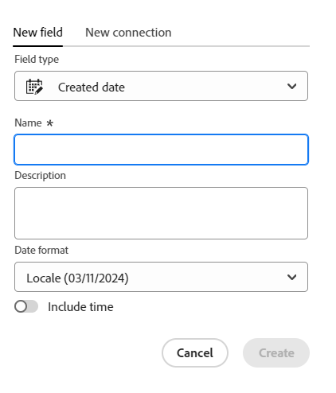

<!--Should the structure of this article be like this other one: https://experienceleague.adobe.com/docs/workfront/using/administration-and-setup/customize/custom-forms/custom-form-builder/use-the-custom-form-builder/add-a-custom-field-to-a-custom-form.html?lang=en ??-->

<!--will they add a way to create fields elsewhere than in a table?! - how will that change the structure of this article? -->

<!--Do we need this for FORMULAS: when we release permissions to RECORDS and we release referring lookup fields in a formula field, update considerations to say that lookup fields from linked records depends on the permissions to the record; if they have no permissions to view a linked record, they won't be able to use that records's lookup fields in a formula - not sure is needed??-->

# Skapa fält

<!--information about choice values must stay in yellow till Jan 2026-->

<span class="preview">Den markerade informationen på den här sidan hänvisar till funktioner som ännu inte är allmänt tillgängliga. Det är bara tillgängligt i förhandsvisningsmiljön för alla kunder. Efter de månatliga releaserna i Production finns samma funktioner även i produktionsmiljön för kunder som aktiverat snabba releaser. </span>

<span class="preview">Mer information om snabba releaser finns i [Aktivera eller inaktivera snabba releaser för din organisation](/help/quicksilver/administration-and-setup/set-up-workfront/configure-system-defaults/enable-fast-release-process.md). </span>


{{planning-important-intro}}

I Adobe Workfront Planning kan du skapa anpassade fält för posttyper. Du kan sedan associera fälten med Workfront Planning-poster för att förbättra postinformationen.

Du måste skapa posttyper innan du kan skapa fält som ska kopplas till dem. Mer information finns i [Skapa posttyper](/help/quicksilver/planning/architecture/create-record-types.md).

Du kan skapa fält på följande sätt i Workfront Planning:

* [Från början](#create-fields-from-scratch)
* [Genom att ansluta posttyper](#create-fields-by-connecting-record-types)
* [Genom att skapa en posttyp](#create-fields-by-creating-a-record-type)
* [Skapa en arbetsyta från en mall](#create-fields-by-creating-a-workspace-from-a-template)
* [Importera posttyper med en Excel- eller CSV-fil](#create-fields-when-importing-record-types-from-a-csv-or-excel-file)
* [Genom att importera kopior av befintliga Workfront-fält](#create-fields-by-importing-them-from-workfront)

Mer information om Workfront Planning-fält finns i [Fältöversikt](/help/quicksilver/planning/fields/fields-overview.md).

## Åtkomstkrav

+++ Expandera om du vill visa åtkomstkraven för funktionerna i den här artikeln. 

<table style="table-layout:auto"> 
<col> 
</col> 
<col> 
</col> 
<tbody> 
    <tr> 
<tr> 
</tr>   
<tr> 
   <td role="rowheader"><p>Adobe Workfront package</p></td> 
   <td> 
<ul> 
<li><p>Alla Workfront- och Planning-paket</p></li>
eller
<li><p>Alla arbetsflöden och alla planeringsdokument</p></li></ul>
<p>Mer information om vad som ingår i respektive Workfront Planning-paket får du av Workfront. </p> 
   </td> 
  <tr> 
   <td role="rowheader"><p>Adobe Workfront-licens</p></td> 
   <td><p>Standard</p>
   </td> 
  </tr> 
  <tr> 
   <td role="rowheader"><p>Objektbehörigheter</p></td> 
   <td>   <p>Hantera behörigheter till en arbetsyta</p>  
   <p>Systemadministratörer har behörighet till alla arbetsytor, inklusive de som de inte skapade</p>  </td> 
  </tr>  
</tbody> 
</table>

Mer information om Workfront åtkomstkrav finns i [Åtkomstkrav i Workfront-dokumentationen](/help/quicksilver/administration-and-setup/add-users/access-levels-and-object-permissions/access-level-requirements-in-documentation.md).

+++   

<!--Old:

 <table style="table-layout:auto"> 
<col> 
</col> 
<col> 
</col> 
<tbody> 
    <tr> 
<tr> 
<td> 
   <p> Products</p> </td> 
   <td> 
   <ul><li><p> Adobe Workfront</p></li> 
   <li><p> Adobe Workfront Planning<p></li></ul></td> 
  </tr>   
<tr> 
   <td role="rowheader"><p>Adobe Workfront plan*</p></td> 
   <td> 
<p>Any of the following Workfront plans:</p> 
<ul><li>Select</li> 
<li>Prime</li> 
<li>Ultimate</li></ul> 
<p>Workfront Planning is not available for legacy Workfront plans</p> 
   </td> 
<tr> 
   <td role="rowheader"><p>Adobe Workfront Planning package*</p></td> 
   <td> 
<p>Any </p> 
<p>For more information about what is included in each Workfront Planning plan, contact your Workfront account manager. </p> 
   </td> 
 <tr> 
   <td role="rowheader"><p>Adobe Workfront platform</p></td> 
   <td> 
<p>Your organization's instance of Workfront must be onboarded to the Adobe Unified Experience to be able to access Workfront Planning.</p> 
<p>For more information, see <a href="/help/quicksilver/workfront-basics/navigate-workfront/workfront-navigation/adobe-unified-experience.md">Adobe Unified Experience for Workfront</a>. </p> 
   </td> 
   </tr> 
  </tr> 
  <tr> 
   <td role="rowheader"><p>Adobe Workfront license*</p></td> 
   <td><p> Standard </p>
   <p>Workfront Planning is not available for legacy Workfront licenses</p> 
  </td> 
  </tr> 
  <tr> 
   <td role="rowheader"><p>Access level configuration</p></td> 
   <td> <p>There are no access level controls for Adobe Workfront Planning</p>   
</td> 
  </tr> 
<tr> 
   <td role="rowheader"><p>Object permissions</p></td> 
   <td>   <p>Manage permissions to a workspace and record type</a> </p>  
   <p>System Administrators have permissions to all workspaces, including the ones they did not create.</p> </td> 
  </tr> 
</tbody> 
</table> -->

## Skapa fält genom att ansluta posttyper

Du kan skapa länkade postfält när du lägger till en ny anslutning mellan två posttyper, eller en posttyp och en objekttyp från andra program.

Mer information om hur du ansluter posttyper för Workfront Planning finns i [Koppla posttyper](/help/quicksilver/planning/architecture/connect-record-types.md).

<!--## Create fields by importing record types using an Excel or CSV file

For more information, see [Create record types](/help/quicksilver/planning/architecture/create-record-types.md).-->

## Skapa fält genom att skapa en posttyp

När du skapar en posttyp skapas även flera fält som är kopplade till den nya posttypen som standard. Mer information finns i [Skapa posttyper](/help/quicksilver/planning/architecture/create-record-types.md).

## Skapa fält genom att skapa en arbetsyta från en mall

I Adobe Workfront Planning skapas fält för posttyper när du skapar en arbetsyta från en mall.

Mer information finns i [Skapa arbetsytor](/help/quicksilver/planning/architecture/create-workspaces.md).


## Skapa fält när du importerar posttyper från en CSV- eller Excel-fil

Du kan importera fält när du importerar posttyper med hjälp av en CSV- eller Excel-fil.

Mer information finns i [Skapa posttyper](/help/quicksilver/planning/architecture/create-record-types.md).

## Skapa fält genom att importera dem från Workfront

Du kan importera kopior av befintliga Workfront-fält.

När du importerar fält från Workfront skapas en kopia av varje fält för en posttyp av Workfront Planning.

När du har kopierat fälten är fälten oberoende av varandra och de utbyter inte information.

Mer information finns i [Importera fält från Workfront](/help/quicksilver/planning/fields/import-fields-from-workfront.md).


## Skapa fält från grunden {#create-fields-from-scratch}

<!--in a table (not sure if this can be done elsewhere?!-->

<!--the first 3 steps are the same as in Import fields from Workfront-->

{{step1-to-planning}}

1. Klicka på arbetsytan vars poster du vill skapa fält för.

   Arbetsytan öppnas och posttyperna visas.

1. Klicka på kortet för en posttyp.

   Alla befintliga poster som är associerade med posttypen visas i tabellvyns rader.

   >[!TIP]
   >
   >    Om inga poster visas kanske du inte har några poster än, eller så kanske du har ett filter som begränsar det som visas på skärmen.

   Alla befintliga fält som är associerade med posttypen visas i kolumnerna i tabellvyn.

   >[!TIP]
   >
   >    Vissa fält kan vara dolda. Klicka på Fält och aktivera växlingen mellan de fält som du vill visa som kolumner i tabellvyn.

1. Klicka på ikonen **+** i tabellvyns övre högra hörn

   eller

   Håll markören över en kolumnrubrik, klicka på den nedåtriktade pilen efter fältnamnet och klicka sedan på **Infoga vänster** eller **Infoga höger** för att lägga till det nya fältet.
1. På fliken **Nytt fält** söker du efter en fälttyp i rutan **Fälttyp** eller väljer någon av följande fälttyper:

   På fliken **Nytt fält** kan du söka efter en fälttyp i rutan **Fälttyp** med hjälp av ett relaterat nyckelord, eller välja bland de fälttyper som listas nedan.

   >[!TIP]
   >
   >    Du kan skriva &quot;Budget&quot; och fälttyperna &quot;Number&quot; och &quot;Currency&quot; i en kort lista.


   * [Enkelradig text](#single-line-text)
   * [Stycke](#paragraph)
   * [Flera val](#multi-select)
   * [Enkelval](#single-select)
   * [Datum](#date)
   * [Number](#number)
   * [Procent](#percentage)
   * [Valuta](#currency)
   * [Kryssruta](#checkbox)
   * [Formel](#formula)
   * [Folk](#people)
   * [Skapad av](#created-by)
   * [Skapad den](#created-date)
   * [Senast ändrad av](#last-modified-by)
   * [Senast ändrat den](#last-modified-date)
   * [Godkänt den](#approved-date)
   * [Godkänd av](#approved-by)
     <!--* [Object](#object-field-type)-->

   >[!IMPORTANT]
   >
   >Du kan inte ändra fälttypen när du har sparat den.

   <!--Add this to the IMPORTANT above and make it a NOTE - should do directly to Prod:
    * You can use any keyword that might be related to any of the field type names. For example, a search for "Budget" will display the Number or Currency field type.-->

1. Fortsätt med att lägga till varje fält enligt beskrivningen i avsnitten nedan.

### Enkelradig text {#single-line-text}

Enkelradiga textfält fångar begränsad alfanumerisk information. Du kan till exempel samla information om ägare, intressenter, team eller organisationsenheter i ett textfält med en rad. Innehållet i ett textfält med en rad kan innehålla upp till 1 000 tecken. <!-- used to be 250 but just tested with 1000 and it allowed this as a maximum. -->

1. Börja skapa ett fält enligt beskrivningen i avsnittet [Skapa fält från grunden](#create-fields-from-scratch) i den här artikeln och välj sedan fälttypen **Enkelradig text**.

   

1. Lägg till följande information på fliken **Nytt fält**:
   * **Namn**: Fältets namn, så som det kommer att visas i en tabell eller på postens informationssida. <!--ensure they updated this; and update the screen shot: it used to be "Label"-->
   * **Beskrivning**: Ytterligare information om fältet. Beskrivningen av ett fält visas när du hovrar över fältets kolumnrubrik i en tabell eller när du klickar på informationsikonen bredvid fältnamnet på postens informationssida.
1. Klicka på **Skapa**.

   Det nya enradiga fältet läggs till som en kolumn till posttypen och dess värden kan kopplas till poster.


### Stycke {#paragraph}

Styckefält hämtar ytterligare alfanumerisk information om en post, som liknar fältet Beskrivning.

>[!TIP]
>
>* Du kan ha högst 20 styckefält för en posttyp.
>
>* Innehållet i ett styckefält kan innehålla upp till 10 000 tecken.
>* Du kan använda RTF-formatering för att förbättra innehållet i styckefält när de visas i tabellvyn eller på detaljsidan för en post. Mer information finns i [Redigera poster](/help/quicksilver/planning/records/edit-records.md).
>


1. Börja skapa ett fält enligt beskrivningen i avsnittet [Skapa fält från grunden](#create-fields-from-scratch) i den här artikeln och välj sedan fälttypen **Stycke**.

   


1. Lägg till följande information på fliken **Nytt fält**:
   * **Namn**: Fältets namn, så som det kommer att visas i en tabell eller på postens informationssida. <!--ensure they updated this; and update the screen shot: it used to be "Label"-->
   * **Beskrivning**: Ytterligare information om fältet. Beskrivningen av ett fält visas när du håller markören över fältets kolumn i en tabell eller när du klickar på informationsikonen bredvid fältnamnet på postens informationssida.
1. Klicka på **Skapa**.

   Det nya styckefältet läggs till som en kolumn till posttypen och dess värden kan kopplas till poster.


### Flera val {#multi-select}

Du kan använda ett flervalsfält för att hämta ytterligare information i valfritt format genom att välja mer än ett alternativ i en listruta.

>[!NOTE]
>
>Förutom de funktioner som beskrivs i det här avsnittet kan du lägga till nya alternativ när du redigerar en posts flervalsfältvärde infogat i tabellvyn. Mer information finns i avsnittet&quot;Redigera information om envalsfält eller flervalsfält&quot; i artikeln [Redigera poster](/help/quicksilver/planning/records/edit-records.md).
>

1. Börja skapa ett fält enligt beskrivningen i avsnittet [Skapa fält från grunden](#create-fields-from-scratch) i den här artikeln och välj sedan fälttypen **Flera val**.

   


1. Lägg till följande information på fliken **Nytt fält**:
   * **Namn**: Fältets namn, så som det kommer att visas i en tabell eller på postens informationssida. <!--ensure they updated this; and update the screen shot: it used to be "Label"-->
   * **Beskrivning**: Ytterligare information om fältet. Beskrivningen av ett fält visas när du håller markören över fältets kolumn i en tabell eller när du klickar på informationsikonen bredvid fältnamnet på postens informationssida.
   * **Alternativ**: De alternativ som användare kan välja när fältet uppdateras. Du kan använda både siffror och bokstäver som namn på varje val.
1. Klicka på **Lägg till alternativ** om du vill lägga till fler alternativ. Det finns ingen gräns för hur många alternativ du kan lägga till i ett flervalsfält.
1. (Valfritt) Dra och släpp varje alternativ manuellt i önskad ordning, eller välj
   **Sorteringsalternativ A-Z** om du vill att valen automatiskt ska visas i alfabetisk ordning. <!--Add this if they added this functionality: You cannot edit this option after you save the field.-->
1. (Valfritt) Om du vill ta bort ett alternativ klickar du på ikonen **x** till höger om den.
1. Klicka på färgrutan till vänster om ett alternativ för att utöka färgväljaren och anpassa färgen för varje alternativ.

1. Klicka på **Färgrutor** för att välja en fördefinierad färg

   eller

   Klicka på **Egen** om du vill välja en egen färg med hjälp av en färgväljare eller en hexadecimal kod.
1. Klicka utanför färgrutan för att stänga den.
1. Klicka på **Skapa**.

   Det nya flervalsfältet läggs till som en kolumn till posttypen och dess värden kan kopplas till poster.

1. (Valfritt) Håll markören över fältnamnet i tabellvyn, klicka på den nedrullningsbara menyn till höger om fältnamnet och klicka sedan på **Redigera fält**.
1. Aktivera inställningen **Visa värden** om du vill visa värdena för varje val. Värdena är namnen på de olika alternativen, så som de visas i Workfront-databasen.

   >[!NOTE]
   >
   >* Workfront tilldelar unika värden för varje val.
   >
   >* Värdena matchar urvalsnamnet i gemener. Flera ord avgränsas med ett understreck.
   >
   >* Värden kan upprepas mellan flera fält, men de måste vara unika för ett fält.
   >
   > 

1. (Valfritt) Använd valvärden i API-anrop och andra integreringar.

### Enkelval {#single-select}

Med envalsfält hämtas ytterligare information i valfritt format genom att du väljer ett alternativ i en nedrullningsbar meny.

>[!NOTE]
>
>Förutom de funktioner som beskrivs i det här avsnittet kan du lägga till nya alternativ när du redigerar en posts envalsfältvärde infogat i tabellvyn. Mer information finns i avsnittet&quot;Redigera information om envalsfält eller flervalsfält&quot; i artikeln [Redigera poster](/help/quicksilver/planning/records/edit-records.md).
>

1. Börja skapa ett fält enligt beskrivningen i avsnittet [Skapa fält från grunden](#create-fields-from-scratch) i den här artikeln och välj sedan fälttypen **Enkelval**.

   

1. Lägg till följande information på fliken **Nytt fält**:
   * **Namn**: Fältets namn, så som det kommer att visas i en tabell eller på postens informationssida. <!--ensure they updated this; and update the screen shot: it used to be "Label"-->
   * **Beskrivning**: Ytterligare information om fältet. Beskrivningen av ett fält visas när du håller markören över fältets kolumn i en tabell eller när du klickar på informationsikonen bredvid fältnamnet på postens informationssida.
   * **Alternativ**: De alternativ som är tillgängliga att välja på den nedrullningsbara menyn när fältet har sparats. Du kan ha både siffror och bokstäver för namnet på varje val.

1. Klicka på **Lägg till alternativ** om du vill lägga till fler alternativ. Det finns ingen gräns för hur många alternativ du kan lägga till i ett envalsfält.
1. (Valfritt) Dra och släpp varje alternativ manuellt i önskad ordning eller markera alternativet **Sorteringsalternativ A-Z** om du vill att valen automatiskt ska visas i alfabetisk ordning. <!--Add this if they added this functionality: You cannot edit this option after you save the field.-->
1. (Valfritt) Om du vill ta bort ett alternativ klickar du på ikonen **x** till höger om den.
1. Klicka på färgrutan till vänster om ett alternativ för att utöka färgväljaren och anpassa färgen för varje alternativ.
1. Klicka på **Färgrutor** för att välja en fördefinierad färg

   eller

   Klicka på **Egen** om du vill välja en egen färg med hjälp av en färgväljare eller en hexadecimal kod.

1. Klicka utanför färgrutan för att stänga den.
1. Klicka på **Skapa**.

   Det nya envalsfältet läggs till som en kolumn till posttypen och dess värden kan kopplas till poster.

1. (Valfritt) Håll markören över fältnamnet i tabellvyn, klicka på den nedrullningsbara menyn till höger om fältnamnet och klicka sedan på **Redigera fält**.
1. Aktivera inställningen **Visa värden** om du vill visa värdena för varje val. Värdena är namnen på de olika alternativen, så som de visas i Workfront-databasen.

   >[!NOTE]
   >
   >* Workfront tilldelar unika värden för varje val.
   >
   >* Värdena matchar urvalsnamnet i gemener. Flera ord avgränsas med ett understreck.
   >
   >* Värden kan upprepas mellan flera fält, men de måste vara unika för ett fält.
   >
   > 

1. (Valfritt) Använd valvärden i API-anrop och andra integreringar.

### Datum {#date}

Du kan använda ett datumfält för att samla in ytterligare information i datum- och tidsformat.

1. Börja skapa ett fält enligt beskrivningen i avsnittet [Skapa fält från grunden](#create-fields-from-scratch) i den här artikeln och välj sedan fälttypen **Datum**.

   


1. Lägg till följande information på fliken **Nytt fält**:
   * **Namn**: Fältets namn, så som det kommer att visas i en tabell eller på postsidan. <!--ensure they updated this; and update the screen shot: it used to be "Label"-->
   * **Beskrivning**: Ytterligare information om fältet. Beskrivningen av ett fält visas när du håller markören över fältets kolumn i en tabell eller när du klickar på informationsikonen bredvid fältnamnet på postens informationssida.
   * **Datumformat**: Den typ av datumformat som du vill visa i det här fältet. <!--update this casing - submitted bug for it-->

     Välj bland följande format:
      * **Språk**: Matchar språkområdet i webbläsaren.
      * **Standard**: 05/16/2023
      * **Lång**: 16 maj 2023
      * **Europeisk**: 16/05/2023
      * **ISO**: 2023-05-16
   * **Inkludera tid**: Välj det här alternativet om du vill inkludera en tidsstämpel. Detta är som standard omarkerat. Du kan inte ange en tid när du har sparat fältet.

     Välj bland följande alternativ:

      * **24hr**: Till exempel: 18:00
      * **12hr**: Exempel: 6:00 PM

1. Klicka på **Skapa**.

   Det nya datumfältet läggs till som en kolumn till posttypen och dess värden kan kopplas till poster.

### Nummer {#number}

Nummerfälttyper samlar in information i talformat.

>[!TIP]
>
>Nummerfält visas som en typ av enradigt textfält i en formulärbyggare för begäran.
>
>Fältformatet bevaras dock och värdena i dessa fält visas som siffror efter att begäran har skickats, på posttypen och på sidan med information om begäran.
>Mer information finns i [Skapa och hantera ett begärandeformulär i Adobe Workfront Planning](/help/quicksilver/planning/requests/create-request-form.md).


1. Börja skapa ett fält enligt beskrivningen i avsnittet [Skapa fält från grunden](#create-fields-from-scratch) i den här artikeln och välj sedan fälttypen **Number**.

   
1. Lägg till följande information på fliken **Nytt fält**:

   * **Namn**: Fältets namn, så som det kommer att visas i en tabell eller på postsidan.
   * **Beskrivning**: Ytterligare information om fältet. Beskrivningen av ett fält visas när du håller markören över fältets kolumn i en tabell eller när du klickar på informationsikonen bredvid fältnamnet på postens informationssida.
   * **Precision**: Antalet decimaler som du vill registrera för fältet. Du kan visa upp till 6 decimaler.
   * **Tillåt negativa tal**: Välj det här alternativet om du vill tillåta negativa tal i det här fältet. Det här alternativet är som standard avmarkerat.

   >[!NOTE]
   >
   >    Om du väljer Tillåt negativa tal och negativa värden lagras på posterna som fältet är kopplat till, kan du inte längre avmarkera inställningen i framtiden.

1. Klicka på **Skapa**.

   Det nya nummerfältet läggs till som en kolumn till posttypen och dess värden kan kopplas till poster.

### Procent {#percentage}

Procentfälttyper samlar in information i talformat följt av ett procenttecken.

>[!TIP]
>
>Procentfält visas som en enkelradig textfälttyp i ett formulärbyggare för begäran.
>
>Fältformatet bevaras dock och värdena för dessa fält visas som procenttal efter att begäran har skickats, på posttypen och på sidan med information om begäran.
>Mer information finns i [Skapa och hantera ett begärandeformulär i Adobe Workfront Planning](/help/quicksilver/planning/requests/create-request-form.md).


1. Börja skapa ett fält enligt beskrivningen i avsnittet [Skapa fält från grunden](#create-fields-from-scratch) i den här artikeln och välj sedan fälttypen **Procent**.

   

1. Lägg till följande information på fliken **Nytt fält**:
   * **Namn**: Fältets namn, så som det kommer att visas i en tabell eller på postsidan.
   * **Beskrivning**: Ytterligare information om fältet. Beskrivningen av ett fält visas när du håller markören över fältets kolumn i en tabell eller när du klickar på informationsikonen bredvid fältnamnet på postens informationssida.
   * **Precision**: Antalet decimaler som du vill registrera för fältet. Du kan visa upp till 6 decimaler.
   * **Tillåt negativa tal**: Välj det här alternativet om du vill tillåta negativa procentvärden i det här fältet. Det här alternativet är som standard avmarkerat.

     >[!NOTE]
     >
     >Om du väljer Tillåt negativa tal och negativa värden lagras på posterna som fältet är kopplat till, kan du inte längre avmarkera inställningen i framtiden.

   * **Visa som**: Välj hur du vill att procentvärdena ska visas i tabellvyn i den nedrullningsbara menyn. Välj bland följande alternativ:
      * **Number**: Procentvärdet visas som ett tal följt av procenttecknet.
      * **Bar**: Procentvärdet visas som en stapel bredvid procenttalet. Fältets fyllningsfärg anger procentvärdet. Det här är standardvalet.
      * **Cirkel**: Procentvärdet visas som konturen för en cirkel bredvid procenttalet. Fyllningsfärgen för cirkelns kontur anger procentvärdet.

   >[!NOTE]
   >
   >* Den markering du gör i fältet Visa som gäller endast det procentvärde som är synligt i tabellvyn. Procentvärdet för fältet visas som ett tal följt av procenttecknet överallt i Workfront Planning. Detta gäller även för fältet av procenttyp när det visas som ett uppslagsfält i andra posters tabellvyer.
   >* Du kan ändra Visa som markering när du redigerar fältet senare.

1. Klicka på **Skapa**.

   Det nya procentfältet läggs till som en kolumn till posttypen och dess värden kan kopplas till poster.

### Valuta {#currency}

Valutafälttyper samlar in information i ett talformat som föregås av en valutasymbol.

>[!TIP]
>
>Valutafält visas som en enkelradig textfälttyp i en formulärbyggare för begäran.
>
>Fältformatet bevaras dock och värdena i dessa fält visas som valuta efter att begäran har skickats, på posttypen och på sidan med information om begäran.
>Mer information finns i [Skapa och hantera ett begärandeformulär i Adobe Workfront Planning](/help/quicksilver/planning/requests/create-request-form.md).

1. Börja skapa ett fält enligt beskrivningen i avsnittet [Skapa fält från grunden](#create-fields-from-scratch) i den här artikeln och välj sedan fälttypen **Valuta**.

   

1. Lägg till följande information på fliken **Nytt fält**:
   * **Namn**: Fältets namn, så som det kommer att visas i en tabell eller på postsidan. <!--ensure they updated this; and update the screen shot: it used to be "Label"-->
   * **Beskrivning**: Ytterligare information om fältet. Beskrivningen av ett fält visas när du håller markören över fältets kolumn i en tabell eller när du klickar på informationsikonen bredvid fältnamnet på postens informationssida.
   * **Valuta**: Den typ av valuta som du vill visa i det här fältet. Detta är en lista över valutor enligt ISO (International Organization of Standardization).
   * **Precision**: Antalet decimaler som du vill registrera för fältet. Du kan visa upp till 6 decimaler.
   * **Tillåt negativa tal**: Välj det här alternativet om du vill tillåta negativa valutavärden i det här fältet. Det här alternativet är som standard avmarkerat.

   >[!NOTE]
   >
   >    Om du väljer Tillåt negativa tal och negativa värden lagras på posterna som fältet är kopplat till, kan du inte längre avmarkera inställningen i framtiden.

1. Klicka på **Skapa**.

   Det nya valutafältet läggs till som en kolumn till posttypen och dess värden kan kopplas till poster.

### Kryssruta

Du kan använda fälttypen Kryssruta för att lägga till en kryssruta till en post. Du kan använda det här fältet för att ange ett specifikt attribut eller en specifik status för den aktuella posten. Du kan till exempel använda den som en flagga för att spåra slutförande, godkännande eller andra binära attribut för varje post.

1. Börja skapa ett fält enligt beskrivningen i avsnittet [Skapa fält från grunden](#create-fields-from-scratch) i den här artikeln och välj sedan fälttypen **Kryssruta**.

   

1. Lägg till följande information på fliken **Nytt fält**:
   * **Namn**: Fältets namn, så som det kommer att visas i en tabell eller på postsidan. <!--ensure they updated this; and update the screen shot: it used to be "Label"-->
   * **Beskrivning**: Ytterligare information om fältet. Beskrivningen av ett fält visas när du håller markören över fältets kolumn i en tabell eller när du klickar på informationsikonen bredvid fältnamnet på postens informationssida.
1. Klicka på **Skapa**.

   Det nya kryssrutefältet läggs till som en kolumn till posttypen och dess värden kan kopplas till poster.

### Formel

Formelfält genererar ett nytt värde med hjälp av befintliga värden från andra fält i en posttyp och en funktion som anger hur befintliga värden ska beräknas.

Mer information finns i [Översikt över formelfält](/help/quicksilver/planning/fields/formula-fields.md).

1. Börja skapa ett fält enligt beskrivningen i avsnittet [Skapa fält från grunden](#create-fields-from-scratch) i den här artikeln och välj sedan fälttypen **Formel**.

   

1. Lägg till följande information på fliken **Nytt fält**:

   * **Namn**: Ange ett namn för det nya fältet.
   * **Beskrivning**: Lägg till information om det nya fältet. Beskrivningen av ett fält visas när du håller markören över fältets kolumn i en tabell eller när du klickar på informationsikonen bredvid fältnamnet på postens informationssida.
   * **Formel**: Börja skriva minst ett tecken för att komma åt ett uttryck och markera det sedan när det visas i listan.

1. Klicka på det markerade uttrycket för att visa definitionen och dess formatering.

   

   Mer information om vilka uttryck som stöds finns i [Översikt över formelfält](/help/quicksilver/planning/fields/formula-fields.md).


   >[!TIP]
   >
   >Du får ett varningsmeddelande när du redigerar eller skapar ett formelfält som kan orsaka en cirkelreferens till sig själv eller delade fält. Du kan inte spara ett formelfält som antingen refererar till sig själv eller till artiklar som refereras i beräkningen.


1. Lägg till fältnamn som de visas i Workfront Planning för att referera till dem i en formel.

   >[!NOTE]
   >
   >* Du kan inte lägga till flervalsfält i en formel.
   >
   >
   >* Du måste stava namnet på fälten som du inkluderar i formlerna så som du ser dem i Workfront Planning. Workfront textlägessyntax och jokertecken stöds inte i Workfront Planning-formler.
   >
   >* Du kan referera till ett fält som är upp till fyra fält (och objekt) utanför den aktuella posttypen. Om du till exempel skapar ett formelfält för en aktivitetsposttyp (1) och aktiviteten är kopplad till kampanjposttypen (2) som är kopplad till ett Workfront-projekt (3), kan du referera till projektets budgetfält (4) i formeln som du skapar för aktivitetsposttypen.
   >
   >
   >

1. (Valfritt) Klicka på **Maximera** för att öppna formelrutan i ett större område.

   Formelrutan öppnas i ett större fönster.
1. (Valfritt och villkorligt) Om du har öppnat rutan Formel i ett större område klickar du på **Minimera** för att återgå till den ursprungliga formelfältet.

1. I fältet **Format** väljer du bland följande alternativ för att identifiera formatet på resultatet som visas i formeltypsfältet:

   * **Text**: Resultatet av formelfältet visas som oformaterad text.
   * **Number**: Resultatet av formelfältet visas som ett tal.
   * **Procent**: Resultatet av formelfältet visas som ett tal följt av en procentsymbol.
   * **Valuta**: Resultatet av formelfältet visas som ett tal som föregås eller följs av en valutasymbol.
   * **Taggar**: Resultatet av formelfältet visas som en tagg med objektets namn.

     >[!TIP]
     >
     >Vi rekommenderar taggar för fält som visar arrayer. I det här fallet visas varje arraymedlem som en separat tagg.

     

   * **Datum**: Resultatet av formelfältet visas som ett datum.

     En förhandsgranskning av hur resultatet kommer att se ut visas under fältet **Format**.

     >[!WARNING]
     >
     >Om formelresultatet inte matchar det valda formatet visas ett felmeddelande där det visas.

1. Klicka på **Skapa**.

   Det nya formelfältet läggs till som en kolumn till posttypen och dess värden kan kopplas till poster.

### Folk

Du kan använda fälttypen Personer för att lägga till en användare <!--, job role, or team--> i en post. Det här är ett type-ahead-fält och du kan bara lägga till användare <!--, roles, or teams--> som redan finns i din Workfront-instans.

>[!TIP]
>
>* När du lägger till namnet på en användare i ett personfält visas även den primära jobbrollen <span class="preview"> och användarens e-postadress</span> i fältet. Du måste ha inställningen Visa kontaktinformation aktiverad för objektet Användare på din åtkomstnivå för att kunna se användarens e-post.
>
>* Personfält visas som en referens (eller anslutningstyp) i en formulärbyggare för begäran.
>
>Mer information finns i [Skapa och hantera ett begärandeformulär i Adobe Workfront Planning](/help/quicksilver/planning/requests/create-request-form.md).

1. Börja skapa ett fält enligt beskrivningen i avsnittet [Skapa fält från grunden](#create-fields-from-scratch) i den här artikeln och välj sedan fälttypen **Personer**.

   

1. Lägg till följande information på fliken **Nytt fält**:
   * **Namn**: Fältets namn, så som det kommer att visas i en tabell eller på postsidan.
   * **Beskrivning**: Ytterligare information om fältet. Beskrivningen av ett fält visas när du håller markören över fältets kolumn i en tabell eller när du klickar på informationsikonen bredvid fältnamnet på postens informationssida.
   * **Tillåt flera värden**: Välj det här alternativet om du vill tillåta användare att lägga till fler än en användare i det här fältet. Det här alternativet är som standard avmarkerat.

   >[!NOTE]
   >
   >    Om du väljer Tillåt flera värden och flera användare lagras på de poster som fältet är kopplat till, kan du inte längre avmarkera inställningen när du redigerar det här fältet.

1. Klicka på **Skapa**.

   Det nya fältet av typen Personer läggs till som en kolumn till posttypen och dess värden kan kopplas till poster.

### Skapad av

Du kan använda fälttypen Skapad av för att lägga till användaren som skapade posten i en post. Det här är ett skrivskyddat fält och fyller automatiskt i med namnet på den användare som var inloggad när posten skapades.

1. Börja skapa ett fält enligt beskrivningen i avsnittet [Skapa fält från grunden](#create-fields-from-scratch) i den här artikeln och välj sedan fälttypen **Skapad av**.

   

1. Lägg till följande information på fliken **Nytt fält**:

   * **Namn**: Fältets namn, så som det kommer att visas i en tabell eller på postsidan. <!--this might change and they might prepopulate it with "Created by"-->
   * **Beskrivning**: Ytterligare information om fältet. Beskrivningen av ett fält visas när du håller markören över fältets kolumn i en tabell eller när du klickar på informationsikonen bredvid fältnamnet på postens informationssida.

1. Klicka på **Skapa**.

   Det nya fältet Skapat efter typ läggs till som en kolumn till posttypen och dess värden är förifyllda med namnet på den användare som skapade varje post.


### Skapad den

Du kan använda fälttypen Skapat för att lägga till datumet då posten skapades i en post. Det här är ett skrivskyddat fält som automatiskt fylls i med datumet (och eventuellt med tiden) när posten skapades.

1. Börja skapa ett fält enligt beskrivningen i avsnittet [Skapa fält från grunden](#create-fields-from-scratch) i den här artikeln och välj sedan fälttypen **Skapad**.

   

   <!--check the image above - added bug fix for UI text changes-->

1. Lägg till följande information på fliken **Nytt fält**:

   * **Namn**: Fältets namn, så som det kommer att visas i en tabell eller på postsidan. <!--this might change and they might prepopulate it with "Created date"-->
   * **Beskrivning**: Ytterligare information om fältet. Beskrivningen av ett fält visas när du håller markören över fältets kolumn i en tabell eller när du klickar på informationsikonen bredvid fältnamnet på postens informationssida.
   * **Datumformat**: Välj bland följande format:

      * **Språk**: Matchar språkområdet i webbläsaren.
      * **Standard**: 05/16/2023
      * **Lång**: 16 maj 2023
      * **Europeisk**: 16/05/2023
      * **ISO**: 2023-05-16
   * **Inkludera tid**: Välj det här alternativet om du vill inkludera en tidsstämpel. Detta är som standard omarkerat. Du kan inte ange en tid när du har sparat fältet.

     Välj bland följande alternativ:

      * **24hr**: Till exempel: 18:00
      * **12hr**: Exempel: 6:00 PM

1. Klicka på **Skapa**.

   Det nya fältet Skapad av-datum läggs till som en kolumn till posttypen och dess värden är förifyllda med datumet (eller datum och tid) när posten skapades.

### Senast ändrad av

Du kan använda fälttypen Senast ändrad av för att lägga till användaren som senast ändrade posten till en post. Det här är ett skrivskyddat fält och fyller automatiskt i med namnet på den användare som var inloggad när posten senast uppdaterades.

1. Börja skapa ett fält enligt beskrivningen i avsnittet [Skapa fält från grunden](#create-fields-from-scratch) i den här artikeln och välj sedan fälttypen **Senast ändrad av**.

   

1. Lägg till följande information på fliken **Nytt fält**:

   * **Namn**: Fältets namn, så som det kommer att visas i en tabell eller på postsidan. <!--this might change and they might prepopulate it with "Created by"-->
   * **Beskrivning**: Ytterligare information om fältet. Beskrivningen av ett fält visas när du håller markören över fältets kolumn i en tabell eller när du klickar på informationsikonen bredvid fältnamnet på postens informationssida.

1. Klicka på **Skapa**.

   Det nya fältet Senast ändrad efter typ läggs till som en kolumn till posttypen och dess värden är förifyllda med namnet på den användare som senast ändrade varje post.

### Senast ändrat den

Du kan använda fälttypen Senaste ändringsdatum för att lägga till datumet när en post senast ändrades till en post. Det här är ett skrivskyddat fält som automatiskt fylls i med datumet (och eventuellt med tiden) när posten senast ändrades.

1. Börja skapa ett fält enligt beskrivningen i avsnittet [Skapa fält från grunden](#create-fields-from-scratch) i den här artikeln och välj sedan fälttypen **Skapad**.

   

   <!--check the image above - added bug fix for UI text changes-->

1. Lägg till följande information på fliken **Nytt fält**:

   * **Namn**: Fältets namn, så som det kommer att visas i en tabell eller på postsidan. <!--this might change and they might prepopulate it with "Created date"-->
   * **Beskrivning**: Ytterligare information om fältet. Beskrivningen av ett fält visas när du håller markören över fältets kolumn i en tabell eller när du klickar på informationsikonen bredvid fältnamnet på postens informationssida.
   * **Datumformat**: Välj bland följande format:

      * **Språk**: Matchar språkområdet i webbläsaren.
      * **Standard**: 05/16/2023
      * **Lång**: 16 maj 2023
      * **Europeisk**: 16/05/2023
      * **ISO**: 2023-05-16
   * **Inkludera tid**: Välj det här alternativet om du vill inkludera en tidsstämpel. Detta är som standard omarkerat. Du kan inte ange en tid när du har sparat fältet.

     Välj bland följande alternativ:

      * **24hr**: Till exempel: 18:00
      * **12hr**: Exempel: 6:00 PM

1. Klicka på **Skapa**.

   Det nya fältet Senast ändrad datumtyp läggs till som en kolumn till posttypen och dess värden är förifyllda med datumet (eller datum och tid) när posten senast ändrades.

### Godkänt den

Du kan använda fälttypen Godkänt datum för att lägga till datumet när en begäran godkändes och det resulterade i att posten skapades. Det här är ett skrivskyddat fält och fyller automatiskt i med datumet (och eventuellt med tiden) när begäran godkändes av den senaste godkännaren. I det här fallet bör godkännandedatumet sammanfalla med datumet då posten skapades.

>[!TIP]
>
>Fältet Godkänt datum fylls endast i med information för poster som har skapats genom att skicka ett begärandeformulär som är associerat med godkännare.
>
>Om formuläret är kopplat till mer än en godkännare registreras endast datumet för det senaste godkännandebeslutet i fältet Godkänt datum.

1. Börja skapa ett fält enligt beskrivningen i avsnittet [Skapa fält från grunden](#create-fields-from-scratch) i den här artikeln och välj sedan fälttypen **Skapad**.

   

   1. Lägg till följande information på fliken **Nytt fält**:

   * **Namn**: Fältets namn, så som det kommer att visas i en tabell eller på postsidan.
   * **Beskrivning**: Ytterligare information om fältet. Beskrivningen av ett fält visas när du håller markören över fältets kolumn i en tabell eller när du klickar på informationsikonen bredvid fältnamnet på postens informationssida.
   * **Datumformat**: Välj bland följande format:

      * **Språk**: Matchar språkområdet i webbläsaren.
      * **Standard**: 05/16/2023
      * **Lång**: 16 maj 2023
      * **Europeisk**: 16/05/2023
      * **ISO**: 2023-05-16

   * **Inkludera tid**: Välj det här alternativet om du vill inkludera en tidsstämpel. Detta är som standard omarkerat. Du kan inte ange en tid när du har sparat fältet.

     Välj bland följande alternativ:

      * **24hr**: Till exempel: 18:00
      * **12hr**: Exempel: 6:00 PM

1. Klicka på **Skapa**.

   Det nya fältet Godkänd datumtyp läggs till som en kolumn till posttypen och dess värden är förifyllda med datumet (eller datum och tid) när postbegäran godkändes, om posten skapades genom att en begäran som är associerad med godkännare skickades.

### Godkänd av

Du kan använda fälttypen Godkänd av för att lägga till den användare som senast godkände begäran för att skapa en post. Det här är ett skrivskyddat fält och det fylls automatiskt i med namnet på den användare som godkände begäran för att skapa posten.

>[!TIP]
>
>Fältet Godkänd av fylls bara i med information för poster som har skapats genom att skicka ett begärandeformulär som är associerat med godkännare.
>
>Om formuläret är associerat med mer än en godkännare registreras namnet på alla godkännare i fältet Godkänt datum, avgränsat med kommatecken.

1. Börja skapa ett fält enligt beskrivningen i avsnittet [Skapa fält från grunden](#create-fields-from-scratch) i den här artikeln och välj sedan fälttypen **Godkänd av**.

   

1. Lägg till följande information på fliken **Nytt fält**:

   * **Namn**: Fältets namn, så som det kommer att visas i en tabell eller på postsidan.
   * **Beskrivning**: Ytterligare information om fältet. Beskrivningen av ett fält visas när du håller markören över fältets kolumn i en tabell eller när du klickar på informationsikonen bredvid fältnamnet på postens informationssida.

1. Klicka på **Skapa**.

   Det nya fältet Godkänd efter typ läggs till som en kolumn till posttypen och dess värden är förifyllda med namnet på den användare som senast ändrade varje post.

<!--

## Object field type

You can use the Object field type when you need to store several fields that might include several pieces of information. For example, you can store the source, code, error message, or details of an object in one field. In this case, instead of having several separate single-line text fields for that, you can use an Object field to store all information in one place. 

For example, when using an Object-type field, you can store the following type of information: 

```
"{
""source"": ""string"",
""code"": ""string"",
""subCode"": ""string"",
""message"": ""string"",
""details"": ""string""
}"

```

You can also store an array of values in one field and you would rather rely on user input for each element of the array, instead of using a multi-select field type for the same purpose. For example, you can store information in the following format: 

`["EMEA", "APAC"] `

Consider the following when using Object-type fields:

* In addition to strings and arrays, you can store other value formats like HTML.
* There is no format validation for this field. 
* Object-type fields have a limit of 10,000 characters.

Create an Object field: 

1. Start creating a field as described in the section [Create fields from scratch](#create-fields-from-scratch) in this article, then select the **Created date** field type.

    

1. Add the following information in the **New field** tab:

     * **Name**: The name of the field, as it will appear in a table or the record page. (***********this might change and they might prepopulate it with "Created date"********)
     * **Description**: Additional information about the field. The description of a field displays when you hover over the field's column in a table, or when you click the information icon next to the field name in the record's details page.

1. Click **Create**.

    The new Object-type field is added as a column to the record type.

-->


