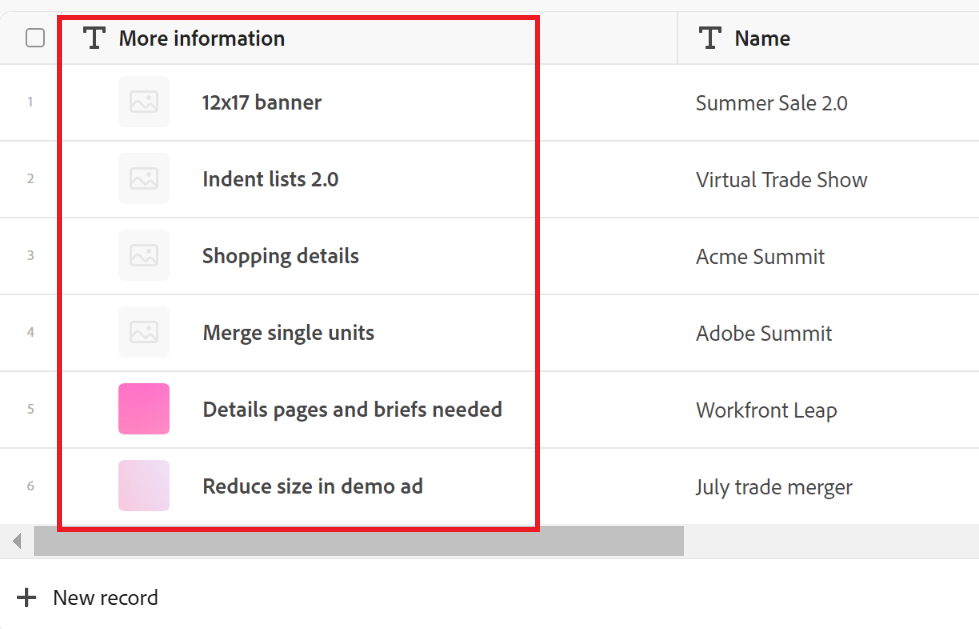

# Översikt över primärt fält

<!--The highlighted information on this page refers to functionality not yet generally available. It is available only in the Preview environment for all customers. After the monthly releases to Production, the same features are also available in the Production environment for customers who enabled fast releases.    

For information about fast releases, see [Enable or disable fast releases for your organization](/help/quicksilver/administration-and-setup/set-up-workfront/configure-system-defaults/enable-fast-release-process.md). -->

{{planning-important-intro}}

Det primära fältet är det fält som visas i den första kolumnen i en tabellvy av posttyp i Adobe Workfront Planning.

Som standard är fältet Namn det primära fältet. Du kan dock ange alla fält av följande typer som primära fält i posterna:

* Textfält med en rad
* Nummer
* Formel

Mer information om hur du anger ett fält som primärt fält finns i [Hantera tabellvyn](/help/quicksilver/planning/views/manage-the-table-view.md).

## Översikt över primära fält

* Informationen i det fält som anges som primärt blir en upptecknings titel.

  >[!NOTE]
  >
  >    Namnen &quot;primärt fält&quot; och &quot;posttitel&quot; är synonyma i Workfront Planning. &quot;Primärt fält&quot; är att föredra när du visar posten i tabellvyn.

* En posts titel visas i följande områden:

   * Rubrikområdet på postens sida och förhandsgranskningsruta
   * Anslutna postfält
   * Visningar
* Du kan inte flytta, dölja eller ta bort det primära fältet i tabellvyn, såvida du inte anger ett annat fält som primärt fält.
* Det primära fältet är alltid låst och är inte en del av den vågräta rullningen i tabellvyn.
* Om du ändrar det primära fältet i tabellvyn påverkas vyn för alla andra användare som väljer det.
* Om du ändrar det primära fältet i en tabellvy påverkas alla tabellvyer av posttypen.
* Värdet som anges i det primära fältet är alltid hyperlänkat till postens sida.
* Om du har behörigheten Delta eller högre till en arbetsyta och posttyp kan du redigera värdet för primära fält, med undantag för formelfält. Formler är beräkningar som uppdateras automatiskt.
