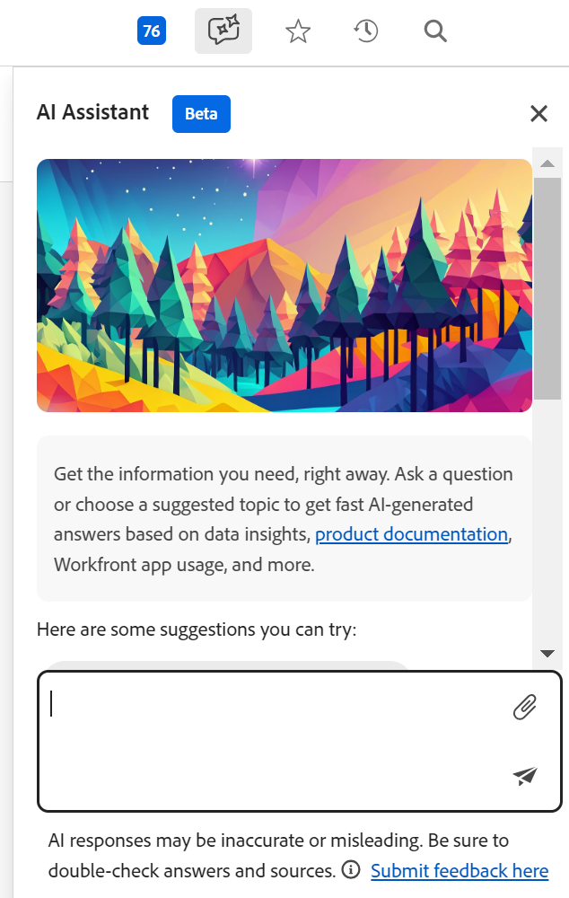

# Adobe Workfront Planning AI Assistant - översikt

Den markerade informationen på den här sidan hänvisar till funktioner som ännu inte är allmänt tillgängliga. Det är bara tillgängligt i förhandsvisningsmiljön för alla kunder. Efter de månatliga releaserna i Production finns samma funktioner även i produktionsmiljön för kunder som aktiverat snabba releaser. 

Mer information om snabba releaser finns i [Aktivera eller inaktivera snabba releaser för din organisation](/help/quicksilver/administration-and-setup/set-up-workfront/configure-system-defaults/enable-fast-release-process.md). 

{{planning-important-intro}}

Du kan använda AI-assistenten för att generera, uppdatera eller ta bort poster baserat på den aktuella sidkontexten och poststrukturen.

Användarens kommandon och AI:ns körning av dessa kommandon fungerar tillsammans för att se till att ändringar som görs av AI återspeglas korrekt i din miljö.

## Överväganden om AI-assistenten

* AI-assistenten måste aktiveras för din organisation innan den är tillgänglig för användare i ditt företag. Mer information finns i [Översikt över AI-assistenten](/help/quicksilver/workfront-basics/ai-assistant/ai-assistant-overview.md).
* När Workfront har aktiverat AI-assistenten för din organisation är den tillgänglig för den huvudsakliga Workfront-administratören. Mer information finns i [Konfigurera grundläggande information för systemet](/help/quicksilver/administration-and-setup/get-started-wf-administration/configure-basic-info.md).

* Workfront-administratören måste aktivera AI-assistenten för alla andra användare. Mer information finns i [Aktivera eller inaktivera AI-assistenten](/help/quicksilver/workfront-basics/ai-assistant/enable-or-disable-assistant.md).

* AI-assistenten fungerar för varje sida. De förfrågningar du skickar för AI-assistenten måste referera till funktioner som är tillgängliga på den sida som du har öppnat.

* De åtgärder som AI-assistenten utför i Planning-området hänger ihop med dina Workfront Planning-behörigheter och din åtkomstnivå i Workfront. Mer information finns i följande artiklar:

   * [Översikt över delningsbehörigheter i Adobe Workfront Planning](/help/quicksilver/planning/access/sharing-permissions-overview.md)
   * [Översikt över licenstyper vid användning av Adobe Workfront Planning](/help/quicksilver/planning/access/license-type-overview.md)

* Ändringar som AI-assistenten gör för användarens räkning spåras i postens historikpanel.

* Du kan använda kommandon för att ångra åtgärder. Du kan t.ex. skriva &quot;Ångra den senaste ändringen&quot; för att ångra ändringen.

*  När du skapar, uppdaterar eller tar bort ett objekt med hjälp av AI Assistant, visas de tänkta åtgärderna och en bekräftelse begärs. Du kan sedan bekräfta eller avbryta åtgärderna. 

## Funktioner som är tillgängliga för AI-assistenten

AI Assistant finns för närvarande i Planning-delen av Workfront för följande sidor:

* Workspace page
* Posttypsida
* Postsida

Du kan nu använda AI-assistenten för att utföra följande åtgärder:

* Sök efter poster. Du kan söka efter information i alla postfält.
* Skapa poster. Ett ID med en länk till den nya posten visas när posten har skapats. Du kan ange de fält som du vill uppdatera när du skapar, t.ex. datum eller beskrivning.
* Skapa poster baserat på ett dokument som du överför. Workfront stöder följande dokumentformat för AI-assistenten:

  PPTX, PDF, DOCX, XLSX, PPT, DOC, TXT och de flesta bildformat
* Uppdatera fält för de poster som visas på skärmen
* Ta bort poster
* Återställ poster som du just har tagit bort

## Hitta AI-assistenten i Workfront Planning

AI-assistenten finns i följande områden i Workfront Planning:

* Huvudnavigeringsfältet i skärmens övre högra hörn.
* I området med information för en post när du har öppnat posten i förhandsgranskningen eller efter att du öppnat postens sida.

## Gå till AI-assistenten i Planning Area

1. Logga in på Workfront och klicka sedan på ikonen **Huvudmeny**  i skärmens övre högra hörn eller på ikonen **Huvudmeny**  i det övre vänstra hörnet, om den är tillgänglig.

. Klicka på **Planering**. Planeringsområdet öppnas.

1. Klicka på ett **arbetsytekort**.

1. (Valfritt) Klicka på ett **posttypskort**.

1. (Valfritt) Klicka på en **post** för att öppna postens **informationssida**.

1. Klicka på ikonen **AI Assistant** i det övre högra hörnet av skärmen i det globala navigeringsfältet eller i det övre högra hörnet av postens förhandsgranskning eller sida.

   

1. Börja skriva kommandon för AI-assistenten och klicka sedan på Enter när du är klar.

   

   Du kan t.ex. skriva något av följande:

   * Skapa en kampanj med startdatumet 4 juli och slutdatumet 30 juli
   * Uppdatera fältet Beskrivning för posten för sommarkampanjen med datumet som ska fastställas
   * Ta bort den sista posten
   * Återställ posten

   En visuell indikator visas medan AI-assistenten bearbetar kommandon och anger förväntad svarstid.

   När du har fått ett svar följer du länkarna eller ser ändringarna till vänster.

