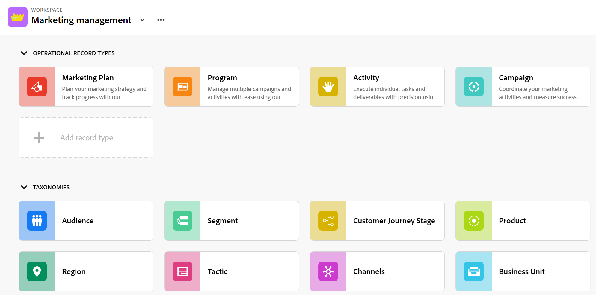

# Adobe Workfront Planning - översikt

<!--this article is linked to the WF Planning landing page - do not change URL or move it; send the team a new URL after we add the redirects for this page-->

<!--update the metadata with real information when making this available in TOC and in the left nav-->

<!-- remove the references to closed beta from the entire article-->

<!--update the video in the IMPORTANT below, when we have something better, especially after Open Beta - remove it-->

>[!IMPORTANT]
>
>Informationen i den här artikeln handlar om Adobe Workfront Planning, ett nytt erbjudande från Adobe Workfront.
>
>Workfront Planning är för närvarande i ett tidigt skede som är öppet för ett begränsat antal kunder.
>
>Du måste vara kund hos Workfront för att kunna använda dessa funktioner.
>
>Din kontorepresentant skulle ha informerat dig om du var en del av det här steget.
>
>En fullständig lista över alla avsnitt och artiklar som dokumenterar Workfront Planning finns i [Adobe Workfront Planning: artikelindex](/help/quicksilver/planning/planning-information.md).

<!--[View a video demonstration of Adobe Workfront Planning capabilities.](https://video.tv.adobe.com/v/3424253/){target=_blank}-->

## Introduktion till Adobe Workfront Planning

Adobe Workfront Planning är ett nytt erbjudande från Adobe Workfront. Syftet med Workfront Planning är att ge en heltäckande inblick i en organisations operativa information och besvara viktiga affärsfrågor i varje fas av arbetshanteringens livscykel.

Team och ledarskap behöver tydliga svar på frågor som:

* Hur många kampanjer anordnas i EMEA under det fjärde kvartalet?
* Finns det någon publiköverlappning mellan samtidiga kampanjer?
* Hur bra fungerar medvetandeprogrammen just nu?
* Hur ser resurserna ut för en viss kampanj? Vilka av dem måste fortfarande godkännas?

För att svara på dessa frågor behöver ledningen en lösning som ger en helhetsbild av alla arbetsmoment, från planering till genomförande, från leverans till mätning av resultaten. För närvarande har organisationer verktyg som kan täcka vissa delar av processen, men många har inte bra kopplingar till alla faser av arbetet och kan inte heller ge resultat på ett tillförlitligt sätt.

Nedan följer några av de viktigaste funktionerna:

* Lös problemet med att hantera arbetet i alla faser och för alla intressenter som deltar i arbetsprocessen.
* Anpassa arbetsflödena helt och hållet, från att bestämma vilka objekttyper (eller posttyper) organisationen använder till att konfigurera hur dessa objekt länkar till varandra.
* Länka till objekttyper från andra system och skapa ett sammanhängande ramverk för alla era processer.

## Adobe Workfront Planning-funktioner

I följande tabell visas huvudfunktionerna som kommer att vara tillgängliga i Workfront Planning och en tidslinje för deras tillgänglighet. Listan innehåller inte alla funktioner.

Mer information om nya funktioner och när de släpps finns i [Adobe Workfront Planering - aktuell versionsaktivitet](/help/quicksilver/planning/general/release-activity.md).

| Funktion | Ute nu | Tillgänglig snart | Forskning |
|----------------------------------------------------|:-----------------------------:|:--------------------------------:|:----------------:|
| Skapa arbetsytor | ✓ |                                  |                  |
| Skapa posttyper | ✓ |                                  |                  |
| Skapa anpassade postfält | ✓ |                                  |                  |
| Importera posttyper och fält med en Excel- eller CSV-fil* | ✓ |                                  |                  |
| Länka poster | ✓ |                                  |                  |
| Visa poster i en tabell | ✓ |                                  |                  |
| Visa poster på en tidslinje | ✓ |                                  |                  |
| Visa poster i en kalender | ✓ |                                  |                  |
| Filtrera poster | ✓ |                                  |                  |
| Gruppera poster i tidslinjevyn | ✓ |                                  |                  |
| Gruppera poster i tabellvyn | ✓ |                                 |                  |
| Sortera poster i tabellvyn | ✓ |                                 |                  |
| Sortera poster i tidslinjevyn |                               | ✓ |                  |
| Sortera grupperingar i tabellvyn |                               | ✓ |                  |
| Sortera grupperingar i tidslinjevyn |                               | ✓ |                  |
| Ansluta arbetsytor |                               | ✓ |                  |
| Söka efter poster i tabellvyn | ✓ |   |
| Söka efter poster i tidslinjevyn | ✓ |   |
| Koppla samman Workfront Planning-poster med Workfront-projekt, program, portfolior, företag, grupper | ✓ |                                 |                  |
| Koppla Workfront Planning-poster till Adobe Experience Manager-resurser | ✓ |                                  |                 |
| Spela in sida med detaljerad information | ✓ |                                  |                  |
| Uppdatera layouten för postens sida | ✓ |                                 |                  |
| Dela arbetsytor | ✓ | |  |
| Visa | ✓ | |  |
| Duplicera vyer | ✓ | |  |
| Skicka begäranden |                               |                                  | ✓ |
| Kreativ översikt |                               |                                  | ✓ |
| Anpassa färg och ikon för en post | ✓ |                                  |                 |
| Lägga till kommentarer i poster | ✓ |                                  |                 |
| Få meddelanden i appen | ✓ |                                  |                 |
| Ta emot e-postmeddelanden | ✓ |                                  |                 |
| Lägga till miniatyrbilder i poster | ✓ |                                  |                 |
| Visa ändringshistorik för en post | ✓ |                                  |                 |
| RTF-formatering för styckefält | ✓ |                                  |                 |
| Adobe Workfront Planning modules for Adobe Workfront Fusion | ✓ |                                  |                 |
| Kopiera och klistra in information från ett fält till ett annat | ✓ |                                  |                 |
| Få åtkomst till planeringsposter från Workfront-objekt | ✓ |                                  |                 |
| Anslut planeringsposter från Workfront-objekt | ✓ |                                  |                 |
| Workfront Planning Public API | ✓ |                                  |                 |

## Aktivera Adobe Workfront Planning för användare i din Workfront-instans

Organisationen måste registrera sig i Adobe Workfront Planning Program innan du får tillgång till dess funktioner. Din kontorepresentant bör ha gett dig information om registrering i detta program, om du är berättigad.

Mer information om hur du beviljar åtkomst till och aktiverar andra för att använda Workfront Planning finns i [Åtkomstöversikt](/help/quicksilver/planning/access/access-overview.md).

## Adobe Workfront Planning - terminologi

Även om Workfront Planning är en del av Workfront innehåller den egna koncept och terminologi. Se till att du känner till de nya koncepten innan du börjar konfigurera Workfront Planning för din organisation.

Ramverket för Workfront Planning är helt anpassningsbart. Du kan skapa alla posttyper, deras attribut och alla fält som är kopplade till dem för att passa din organisations behov.

Följande är de viktigaste Workfront Planning-objekten och -begreppen:

* **Workspace**: En samling posttyper som definierar den operativa livscykeln för en viss organisation. En arbetsyta är en arbetsyta i en organisationsenhet.

  En Workfront-instans kan ha högst 1 000 arbetsytor.

  

  Mer information finns i [Skapa arbetsytor](/help/quicksilver/planning/architecture/create-workspaces.md).

* **Posttyp**: Objekttypen eller Workfront Planning.

  Till skillnad från Workfront, där objekttyperna är fördefinierade, kan du skapa egna objekttyper i Workfront Planning.

  I Workfront har till exempel objekttyperna Program, Portfolio, Projekt, Uppgift eller Utgåva redan skapats.

  I Workfront Planning kan du skapa alla posttyper som passar organisationens arbetsflöden. Senare kan du definiera hur posttyperna relaterar till varandra eller formulärberoenden.

  Mer information finns i [Översikt över posttyper](/help/quicksilver/planning/architecture/overview-of-record-types.md).

* **Post**: En instans av en posttyp.

  

  När du har lagt till en posttyp på en arbetsyta kan du börja lägga till poster av den typen på posttypens sida.

  Till exempel kan&quot;Campaign&quot; vara en posttyp och&quot;Sommarkampanj för EMEA&quot; är ett register över posttypen Campaign

  Mer information finns i [Skapa poster](/help/quicksilver/planning/records/create-records.md).

* **Workspace-mall**: Du kan skapa en arbetsyta med fördefinierade mallar. Du kan använda de fördefinierade posttyperna och fälten som finns i en mall eller lägga till egna.

  

  Adobe Workfront Planning innehåller en arbetsyta för försäljning, marknadsföring och produkthantering.

  Mer information finns i [Skapa arbetsytor](/help/quicksilver/planning/architecture/create-workspaces.md).

* **Fält**: Fält är attribut som du kan lägga till i posttyper. Fält innehåller information om posttypen. <!--check the shot below, "Connection" needs to be in lowercase-->

  

  Att tänka på när det gäller postfält:

   * De fält som du lägger till för en posttyp kopplas automatiskt till alla poster av den typen och kan användas för att samla in data om dessa poster.

   * Fält visas som kolumner i tabellvyn som används på en posttypssida. De visas också på postens sida.

   * Fält är unika för en posttyp och överförs inte från en posttyp till en annan.

   * Fälten är helt anpassningsbara och går bara att komma åt i Workfront Planning. Du har inte åtkomst till Workfront Planning-fält från Workfront.

  Mer information finns i [Skapa fält](/help/quicksilver/planning/fields/create-fields.md).

  En ny posttyp är som standard associerad med följande fördefinierade fält:

   * Namn
   * Beskrivning
   * Startdatum
   * Slutdatum
   * Status

  Du kan skapa anpassade fält av följande typer:

   * Enkelradig text
   * Stycke
   * Flera val
   * Enkelval
   * Datum
   * Nummer
   * Procent
   * Valuta
   * Kryssruta
   * Formel
   * Folk
   * Skapad av
   * Skapad den
   * Senast ändrad av
   * Senast ändrat den

* **Länkade posttyper**, **Länkade poster** och **Länkade postfält** eller **Anslutna posttyper**, **Anslutna poster** och **Anslutna fält**: Du kan skapa en anslutning mellan följande entiteter i Workfront Planning:

   * Två posttyper.
   * En posttyp och en Workfront-objekttyp, program-, portfölj-, företag- eller gruppobjekttyp.
   * En posttyp och en Adobe Experience Manager-resurs eller mapp.

     Du måste ha en Adobe Experience Manager-licens för att kunna länka posttyper med Experience Manager-objekt.

     

  När du har upprättat en anslutning mellan posttyperna kan du koppla enskilda poster av dessa typer till varandra. Anslutningen mellan posterna visas som ett länkat postfält.

* **Länkade fält** (eller sökfält): När du har upprättat anslutningen mellan två posttyper och länkat enskilda poster tillsammans, kan du referera till de länkade posternas fält i den post du ansluter från.

  Om du till exempel kopplar en Campaign-posttyp till en Workfront Project-objekttyp kan du visa budgetfältet för anslutna projekt på kampanjposterna.

  

  >[!TIP]
  >
  > Du kan inte lägga till följande fälttyper som sökfält:
  >
  >* Folk
  >* Skapad av
  >* Senast ändrad av
  >* Workfront typsnittsfält (inklusive fält som Projektägare eller Projektsponsor)

  Mer information om hur du länkar posttyper, poster och skapar länkade fält finns i följande artiklar:

   * [Koppla posttyper](/help/quicksilver/planning/architecture/connect-record-types.md)
   * [Koppla poster](/help/quicksilver/planning/records/connect-records.md)

<!--not yet:* Fields are reusable across Record Types.  -->

* **Vyer**: Poster visas under respektive posttypssida i olika typer av vyer.

  

  Vyer innehåller anpassade inställningar för en viss vytyp, till exempel listan med fält (kolumner), en lista med poster (rader), deras ordning (sortering), ett tillämpat eller tillämpligt filter och gruppering.

  Här följer några vytyper som du kan använda på posttypssidan:

   * **Tabellvy**: Visar poster och deras fält i ett tabellformat. Raderna i tabellen är de enskilda posterna och kolumnerna är postfälten. Det här är standardvyn.

     

   * **Tidslinjevy**: Visar poster som har minst två datumtypsfält på en kronologisk tidslinje.

     

   * **Kalendervy**: Visar poster som har minst två datumtypsfält i ett kalenderformat.
     

Mer information finns i [Hantera postvyer](/help/quicksilver/planning/views/manage-record-views.md).

## Begränsningar för Adobe Workfront Planning-objekt

I följande tabell visas gränserna för hur många objekt du kan skapa i Workfront Planning. Begränsningarna kan komma att ändras när vi går vidare till nästa utvecklingsfas.

<!--consider making the table view a stand-alone article when we go to GA-->

| Adobe Workfront Planning-objekt | Gräns |
|-------------------------------------------------------------------------------|:---------------------------------------------------------------------------------------------------------------:|
| Antal arbetsytor för en Workfront-instans | 1 000 |
| Antal avsnitt för en arbetsyta | 50 |
| Antal posttyper för en arbetsyta | 1 000 (inkluderar posttyper från alla avsnitt och de som skapas när en arbetsytemall används) |
| Antal poster för en posttyp | 50 000 |
| Antal fält för en posttyp eller taxonomi | 500 |
| Antal tecken för ett textfält | 1 000 tecken |
| Storlek på fil som du kan klistra in i en posttypstabell | 1 MB |
| Storlek på fil som du kan importera via API för en posttypstabell | 1,5 MB |
| Frekvensen med vilken API-begäranden kan göras | 200 begäranden per minut |
| Storlek på Excel-fil som du kan importera* | 5 MB |
| Antal vyer som en användare kan skapa för en posttyp | 100 |

<!--add to the table above: Maximum number of views created by one use 100 -->

>[!IMPORTANT]
>
>*Den här funktionen har inaktiverats tillfälligt och kommer att finnas tillgänglig vid ett senare tillfälle.

## Hitta Adobe Workfront Planning

Kontrollera att din organisation har fått tillgång till Workfront Planning och att din system- eller gruppadministratör har lagt till Planning-området på huvudmenyn. Mer information finns i [Åtkomstöversikt](/help/quicksilver/planning/access/access-overview.md).

Så här hittar du Workfront Planning:

1. Logga in på Adobe Workfront.

{{step1-click-main-menu}}

1. Klicka på **Planering** .

   Startsidan för Workfront Planning öppnas.

   

   >[!TIP]
   >
   >    Din Workfront-administratör kan lägga till Planning-området till alternativet Välj landningssida i layoutmallen, så att du kan öppna Planning när du loggar in på Workfront. Mer information finns i [Anpassa landningssidan med en layoutmall](/help/quicksilver/administration-and-setup/customize-workfront/use-layout-templates/customize-landing-page.md).

1. (Villkorligt och valfritt) Om du är Workfront-administratör klickar du på någon av följande flikar:
   * **Mina arbetsytor**: Visar arbetsytor som du har skapat.
   * **Andra arbetsytor**: Visar alla andra arbetsytor i systemet, inklusive de som delas med dig.

   För alla andra användare visas alla arbetsytor som de har skapat eller har delat med dem i området **Arbetsytor** .

1. (Valfritt och rekommenderas) Fortsätt med några av följande åtgärder för att skapa din arbetsstruktur:

   1. Skapa en arbetsyta från grunden eller med en mall. Mer information finns i [Skapa arbetsytor](/help/quicksilver/planning/architecture/create-workspaces.md).

   1. Lägg till avsnitt på den nya arbetsytan. Mer information finns i [Redigera arbetsytor](/help/quicksilver/planning/architecture/edit-workspaces.md).
   1. Byt namn på befintliga avsnitt på den nya arbetsytan.
   1. Lägg till posttyper på den nya arbetsytan. Mer information finns i [Skapa posttyper](/help/quicksilver/planning/architecture/create-record-types.md).

   1. Klicka på namnet på en posttyp för att öppna posttypens sida. Posttypssidan öppnas som standard i tabellvyn.

      Du kan också skapa en tidslinje eller en kalendervy. Mer information finns i [Hantera postvyer](/help/quicksilver/planning/views/manage-record-views.md).

   1. Börja lägga till poster i tabellvyn genom att lägga till rader

      eller

      Börja lägga till postfält genom att lägga till kolumner.

      Mer information finns i följande artiklar:

      * [Skapa poster](/help/quicksilver/planning/records/create-records.md)
      * [Skapa fält](/help/quicksilver/planning/fields/create-fields.md).

## Adobe Workfront Planning - lanseringsaktivitet

Vi lanserar regelbundet nya funktioner i Workfront Planning.

En uppdaterad lista över släppta funktioner finns i [Aktuell versionsaktivitet för Adobe Workfront Planning](/help/quicksilver/planning/general/release-activity.md)

