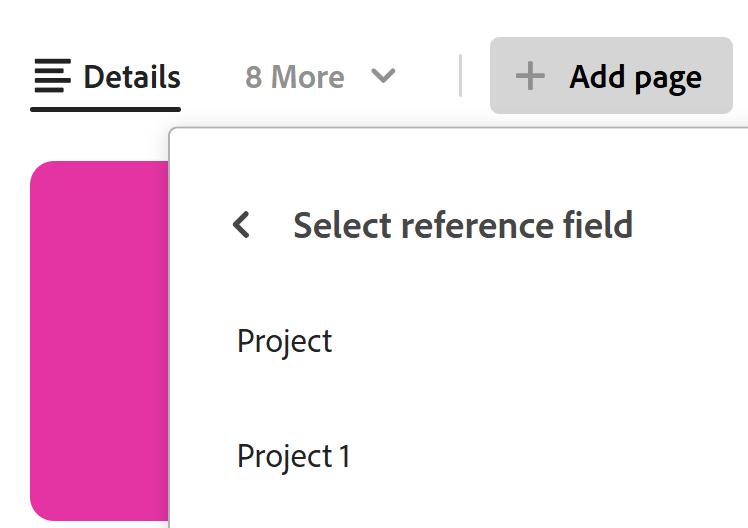
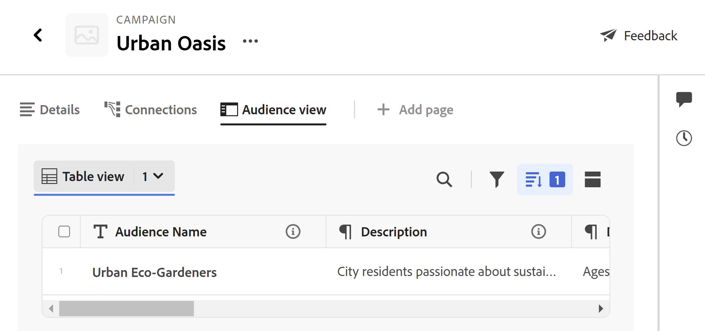
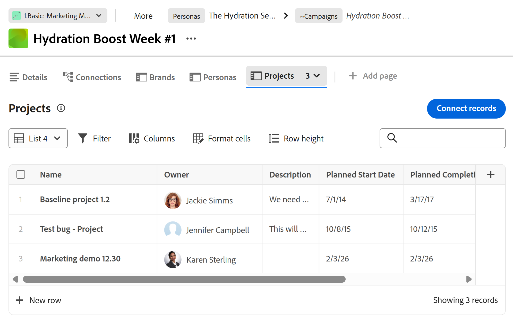

# Lägga till en sida med kopplade poster i en post

<!--
The highlighted information on this page refers to functionality not yet generally available. It is available only in the Preview environment for all customers. After the monthly releases to Production, the same features are also available in the Production environment for customers who enabled fast releases.    

For information about fast releases, see [Enable or disable fast releases for your organization](/help/quicksilver/administration-and-setup/set-up-workfront/configure-system-defaults/enable-fast-release-process.md). 
-->

Du kan visa information från anslutna poster eller objekt genom att lägga till en flik för en sida med kopplade poster till en post i Adobe Workfront Planning. Då läggs de kopplade posterna i en tabellvy till på fliken.

Tänk på följande när du lägger till en sida med kopplade poster till en post:

* Du kan lägga till en sida med kopplade poster till en post efter att du har kopplat post- eller objekttyper till posttypen från dess tabellvy.

* Du kan lägga till en sida med kopplade poster från en posts förhandsgranskningsområde eller postens sida.

* Du kan bara ha en ansluten postsida för en viss posttyp.

  Om du t.ex. skapar en sida med anslutna poster för en kampanj och vill visa de anslutna personerna, kan du bara ha en sida med anslutna poster för personas.

* Anslutna postsidor visar endast anslutna objekt eller poster från ett objekt eller en posttyp. På sidan visas inte alla poster av den typen.

* Beroende på vilket objekt eller vilken posttyp du visar på sidan med anslutna poster kan du visa dem i följande vyer:

   * Du kan visa anslutna Planning-poster i följande typer av vyer:
      * Tabell
      * Tidslinje
      * Kalender
   * Du kan visa anslutna Workfront-projekt i en listvy.

* Du kan lägga till sidor med kopplade poster för följande anslutna post- eller objekttyper:

   * Workfront Planning - posttyper
   * Workfront-projekt

     Du kan visa de anslutna Workfront-projekten även om du inte har behörighet att komma åt dem i Workfront.

## Åtkomstkrav

+++ Expandera om du vill visa åtkomstkraven för funktionerna i den här artikeln. 

<table style="table-layout:auto"> 
<col> 
</col> 
<col> 
</col> 
<tbody> 
    <tr> 
<tr> 
</tr>   
<tr> 
   <td role="rowheader">
Adobe Workfront package
</td> 
   <td> 

Alla Workfront- och Planning-paket

Alla arbetsflöden och alla planeringsdokument

Mer information om vad som ingår i respektive Workfront Planning-paket får du av Workfront. 
 
   </td> 
<tr>
<td> 
   
 Ytterligare produkter
 </td> 
   <td> 
   
 Förutom Adobe Workfront måste du ha följande om du vill lägga till en ansluten postsida för objekt från följande program:

   <ul><li>
En Adobe Experience Manager-licens och en integrering mellan Adobe Experience Manager och Workfront för att koppla ihop AEM-objekt med posttyperna Planning.

   
Mer information finns i <a href="/help/quicksilver/documents/adobe-workfront-for-experience-manager-assets-essentials/workfront-for-aem-asset-essentials.md">Adobe Workfront för Experience Manager Assets och Assets Essentials: artikelindex</a>. 
</li>
   <li>
 En Adobe GenStudio for Performance Marketing-licens för att koppla posttyper till GenStudio Brands

   
Mer information finns i <a href="https://experienceleague.adobe.com/en/docs/genstudio-for-performance-marketing/user-guide/get-started">Kom igång med Adobe GenStudio for Performance Marketing</a>.
</li></ul>
   </td> 
  </tr>

<tr> 
   <td role="rowheader">
Adobe Workfront-licens
</td> 
   <td>
Standard

   </td> 
  </tr> 
  <tr>
   <td role="rowheader">
Objektbehörigheter
</td>
   <td>
   
Contribute eller högre behörighet för en arbetsyta och en posttyp 
  
   
Systemadministratörer har behörighet till alla arbetsytor, inklusive de som de inte skapade
 
  </td>
  </tr>   
</tbody> 
</table>

Mer information om Workfront åtkomstkrav finns i [Åtkomstkrav i Workfront-dokumentationen](/help/quicksilver/administration-and-setup/add-users/access-levels-and-object-permissions/access-level-requirements-in-documentation.md).

+++   

## Lägga till en sida med kopplade poster i en post

Du måste först koppla posttyper till andra posttyper eller Workfront-projekt innan du lägger till en ansluten postsida till en post.

1. Klicka på postens namn för att öppna den från en vy av en posttypssida.
1. Klicka på **Lägg till sida** i något av följande områden:

   * Postens förhandsgranskningsfönster
   * Postens informationssida när du har klickat på ikonen **Öppna på ny flik**  i det övre högra hörnet på förhandsvisningssidan.

   Rutan **Skapa sida** öppnas.

   

1. Lägg till **sidnamnet**, klicka på **Sidan för kopplade poster** för **sidtypen** och klicka sedan på **Skapa**.
1. (Valfritt) Klicka på namnet på en ansluten post eller objekttyp i listan eller sök efter den och klicka sedan på den när den visas i listan för att skapa sidan för den posten eller objekttypen.

   >[!TIP]
   >
   >Du kan skapa en ansluten postsida per posttyp. Om en ansluten posttyp redan har en sida visas den inte längre som ett alternativ.
   >

1. (Valfritt och villkorligt) Om det finns fler än ett anslutet fält av post- eller objekttypen som du skapar sidan för visas klickar du på det fält vars poster eller objekt du vill visa på sidan med kopplade poster i listan **Välj referensfält** .

   

   En av följande sidor läggs till på sidan med anslutna poster:

   * Registervyn för en posttyp
   * Listvyn för en projektobjekttyp

   Poster eller projekt som är kopplade till den aktuella posten visas i tabell- eller listvyn.

   >[!TIP]
   >
   >Du måste lägga till kopplade poster i tabellen eller i området Detaljer för en post innan du kan visa dem på en ansluten postsida. Annars är tabellen eller listan tom.

   De första fem fälten i de anslutna posterna visas som standard. Inga sökfält visas som standard.

   

1. (Villkorligt) Beroende på vilken typ av poster du visar på den anslutna postsidan gör du något av följande:

   * Hantera planeringsposter
Mer information finns i avsnittet [Hantera de anslutna posterna för planeringsposter](#manage-the-connected-records-page-for-planning-records) i den här artikeln.
   * Hantera Workfront-projekt
Mer information finns i avsnittet [Hantera den anslutna postsidan för Workfront-projekt](#manage-the-connected-records-page-for-workfront-projects) i den här artikeln.

1. (Valfritt) Dubbelklicka på namnet på fliken **Anslutna poster**

   eller

   Håll muspekaren över namnet på fliken, klicka sedan på **Mer**  och klicka sedan på **Byt namn** för att byta namn på sidan med nya anslutna poster.

1. (Valfritt) Håll pekaren över namnet på sidan med anslutna poster, klicka på **Mer**  och klicka sedan på **Ta bort** för att ta bort fliken.

### Hantera den anslutna postsidan för planeringsposter

<!--

#### Manage the connected records page for Planning records in the Production environment

When you create a connected records page for  connected Planning records in the Production environment, do the following: (****or AEM Assets - AEM is not available yet?? see note below********)

1. Go to a record type page and click the name of a record. This opens the record's preview page.
1. Click the tab for a connected records page that display Planning records.
   The records connected to the record you selected display in the table view. 
1. Click **Connect** at the bottom of the table view to connect existing records, select them from the connection box, then click outside the box to close it. The records are automatically added to the table and connected to the record you selected. The records must exist before you can add them.

   For more information, see [Connect records](/help/quicksilver/planning/records/connect-records.md).

1. Edit any information from the connected records inline in the table view. 
1. Hover over a connected record's name, then click the **More** menu 

   Or 
   
   Select one of the records, then click one of the following options in the blue bar at the bottom of the list: 

   * **View** to open the record page in a new tab
   * **Copy link** to copy a link to the record page
   * **Edit thumbnail** to open the **Record thumbnail** box and edit the record's thumbnail image
   * **Duplicate** to duplicate the connected record. The duplicated record is also connected to the current record.
   * **Insert record above or below** to add new records to the connected record type. New records added here are also connected to the current record. This option is not available in the blue bar when selecting a record in the table.
   * **Delete** to delete the record. Deleting a connected record deletes it from its record type and from everywhere where the record is connected. The deleted records move to the **Recently deleted** bin of their record type.

      For information about editing records in the table view, see [Edit records](/help/quicksilver/planning/records/edit-records.md). 

      >[!TIP]
      >
      >You can select more than one record or object to delete them.
      >

1. Inline edit any of the records in the table on the connected records page.
1. Use any of the following view elements in the toolbar of a connected record page to manage the table view:

   * **Filters**
   * **Sort**
   * **Grouping**
   * **Fields**, to display, hide, or rearrange fields
   * **Row height**
   * **Search**

   For information, see [Manage the table view](/help/quicksilver/planning/views/manage-the-table-view.md). 

   >[!NOTE]
   >
   >You cannot create, edit, or delete fields in the table view of a connected record's tab.
   >

#### Manage the connected records page for Planning records in the Preview environment

When you create a connected records page for connected Planning records in the Preview environment, do the following: (***********or AEM Assets -- AEM is not available yet?? see note below**********)

-->

1. Gå till en posttypssida och klicka på postens namn. Då öppnas postens förhandsgranskningssida.
1. Klicka på fliken för en ansluten postsida som visar Planning-poster.
Posterna som är kopplade till den post du har markerat visas i tabellvyn.
1. Klicka på **Anslut poster** i det övre högra hörnet på den anslutna postsidan om du vill koppla befintliga poster, markera dem i anslutningsrutan och klicka sedan utanför rutan för att stänga den. Posterna läggs automatiskt till i tabellen och kopplas till den post du har valt. Posterna måste finnas innan du kan lägga till dem.

   Mer information finns i [Anslut poster](/help/quicksilver/planning/records/connect-records.md).

1. Klicka på **Ny rad** längst ned i tabellen om du vill lägga till nya poster. De nya posterna kopplas automatiskt till de poster som du har valt.
1. Redigera all information från de anslutna posterna i tabellvyn.
1. Håll muspekaren över namnet på en ansluten post och klicka sedan på menyn **Mer** 

   eller

   Markera en av posterna och klicka sedan på något av följande alternativ i det blå fältet längst ned i listan:

   * **Visa** om du vill öppna postsidan på en ny flik
   * **Kopiera länk** för att kopiera en länk till postsidan
   * **Redigera miniatyrbild** för att öppna rutan **Spela in miniatyrbild** och redigera postens miniatyrbild
   * **Duplicera** om du vill duplicera den anslutna posten. Den duplicerade posten är även ansluten till den aktuella posten.
   * **Infoga posten ovanför eller under** om du vill lägga till nya poster till den anslutna posttypen. Nya poster som läggs till här är också kopplade till den aktuella posten. Det här alternativet är inte tillgängligt i det blå fältet när du markerar en post i tabellen.
   * **Ta bort** om du vill ta bort posten. Om du tar bort en ansluten post tas den bort från sin posttyp och från alla ställen där posten är ansluten. De borttagna posterna flyttas till **Nyligen borttagna**-behållaren av sin posttyp.

     Mer information om hur du redigerar poster i tabellvyn finns i [Redigera poster](/help/quicksilver/planning/records/edit-records.md).

     >[!TIP]
     >
     >Du kan markera flera poster eller objekt som du vill ta bort.

1. Redigera alla poster i tabellen på den anslutna postsidan.
1. Använd något av följande vyelement i verktygsfältet på en ansluten postsida för att hantera tabellvyn:

   * **Filter**
   * **Sortera**
   * **Gruppering**
   * **Fält**, för att visa, dölja eller ordna om fält
   * **Radhöjd**
   * **Sök**

   Mer information finns i [Hantera tabellvyn](/help/quicksilver/planning/views/manage-the-table-view.md).

   >[!NOTE]
   >
   >Du kan inte skapa, redigera eller ta bort fält i tabellvyn på fliken för en ansluten post.
   >

1. Klicka på listrutan Vyer i det övre högra hörnet på sidan med anslutna poster och klicka på **Ny vy** för att lägga till en ny vy för sidan. Gör sedan följande:

   1. Lägg till ett **visningsnamn**.
   1. Välj någon av följande typer av vyer i området **Vytyp**:

      * Tabell
Mer information finns i [Hantera tabellvyn](/help/quicksilver/planning/views/manage-the-table-view.md)
      * Tidslinje
Mer information finns i [Hantera tidslinjevyn](/help/quicksilver/planning/views/manage-the-timeline-view.md).
      * Kalender
Mer information finns i [Hantera kalendervyn](/help/quicksilver/planning/views/manage-the-calendar-view.md).

        Mer information finns i avsnittet [Hantera flera vyer från sidan med anslutna poster](#manage-multiple-views-from-the-connected-records-page) i den här artikeln.

   1. Klicka på **Skapa**.
En ny vy läggs till i listrutan Vyer.

   1. (Valfritt) Håll muspekaren över namnet på en vy som du har skapat och klicka på menyn **Mer** . Klicka sedan på något av följande alternativ:

      * **Byt namn på** om du vill lägga till ett nytt namn för vyn.
      * **Dela**

        Mer information finns i [Dela vyer](/help/quicksilver/planning/access/share-views.md).
      * **Exportera**

      * **Ta bort**
Mer information finns i [Ta bort postvyer](/help/quicksilver/planning/views/delete-record-views.md).

        

        >[!NOTE]
        >
        >Du kan inte ta bort en systemvy som har skapats av Workfront.

### Hantera den anslutna postsidan för Workfront-projekt

När du skapar en ansluten postsida för anslutna Workfront-projekt gör du följande för att hantera sidan:

1. Gå till en posttypssida och klicka på postens namn. Då öppnas postens förhandsgranskningssida.
1. Klicka på fliken för en sida med anslutna poster som visar Workfront-projekt.

   

   De projekt som är kopplade till den valda posten visas i listvyn.

   Mer information om hur du hanterar eller redigerar objekt i listvyn finns i [Hantera listvyn](/help/quicksilver/planning/views/manage-the-list-view.md).

<!-- 
removed this part, so we won't have to have duplicate information to keep up with for the list view in Planning: 
1. Click **Connect records** in the upper-right corner of the connected record page to connect existing projects.

   For information, see [Connect records](/help/quicksilver/planning/records/connect-records.md).
1. Double-click inside a cell in the list view to edit a project's fields. Some fields are read-only. 
1. Do one of the following to edit the list view: 

   * Click **New row** to create a project without a template. The new project is automatically connected to the current record.

      For more information, see [Create Workfront objects from Workfront Planning as you connect them to records](/help/quicksilver/planning/records/create-workfront-objects-from-workfront-planning.md).
   * Click **Create records **in the upper-right corner of the view to add existing projects. Projects are immediately connected to the selected record. 

   * Hover over a project name in the list and click the **More** menu [More menu](assets/more-menu.png) and click **View** to open the project in another tab
     
      Or

      Select one or more projects, and from the actions bar at the bottom of the list, click **Delete** or **Disconnect** to remove the item from the list.
      

   * Click the views dropdown menu, and click **New view** to add a new view for the page, then do the following, or click the **More** menu  to the right of a new name, then **Rename**, **Share**, or **Delete** the view. 

      You cannot rename, share or delete System Views or views you do not have Manage permissions to.

      

   * Click one of the following to update the view's elements: 

      * **Filter** to limit the amount of information in the list
      * **Columns** to hide columns or change their order
      * The **+** icon in the upper-right corner of the table view to add existing fields to the list. Fields must exist before you can add them. 

   For more information about managing objects in a list view, see [Manage the list view](/help/quicksilver/planning/views/manage-the-list-view.md).
-->

<!--
 this is repetitive from an earlier section above: 

## Manage multiple views from the connected records page

You can add and manage multiple view types from the connected records page of a record. 

The views you create in the Connected records page of a record type are available everywhere in Workfront Planning where that record type page displays. Views created for the same record type anywhere else in Workfront Planning are also accessible in all connected records pages of that record type. 

To manage multiple views from the connected records page: 

1. (Conditional) When displaying Planning records in the connected records page, click the dropdown menu to the right of the view name, then click **New view** to add a view, then select from the following options: 

   * **Table**. For more information, see [Manage the table view](/help/quicksilver/planning/views/manage-the-table-view.md). 
   * **Timeline**. For more information, see [Manage the timeline view](/help/quicksilver/planning/views/manage-the-timeline-view.md).
   * **Calendar**. For more information, see [Manage the calendar view](/help/quicksilver/planning/views/manage-the-calendar-view.md). 

1. (Optional) Hover over the name of a view in the Connected records page, then click the **More** menu , then click one of the following: 

   * **Rename**
   * **Share**. For more information, see [Share views](/help/quicksilver/planning/access/share-views.md).

   >[!TIP]
   >
   >Sharing views from Connected records pages makes them accessible to users in all areas of Workfront Planning where the view displays. 
   >Also, if a view is shared from any other area of Workfront Planning, it is also available to the same users in Connected records pages. 

   * **Export** 
   * **Delete**

   <!--
   not possible right now: * **Duplicate**. For more information, see [Duplicate record views](/help/quicksilver/planning/views/duplicate-record-views.md).
      >[!TIP]
      >
      >Duplicating a view from Connected records pages makes it available in all other areas of Workfornt planning, when viewing the same record types.
      -->

<!--
No longer possible: 1. (Optional and conditional) When you create a connected records page for the following Workfront object types:
         * Portfolios
         * Programs
         * Groups
         * Companies
      Do any of the following in the table view of the connected records page: 
      * Click the name of a object. This opens the object's page in a new tab. 
      * Click **Connect** at the bottom of the table view to connect existing objects, select them from the connection box, then click outside the box to close it. The objects are automatically added to the table. The objects must exist before you can add them.
      For more information, see [Connect records](/help/quicksilver/planning/records/connect-records.md).
      * Select one of the objects in the table view, then click one of the following options in the blue bar at the bottom of the list: 
      * **View** to open the record page in a new tab
      * **Copy link** to copy a link to the record page
      * **Disconnect** to disconnect the object from the record you are viewing. 
      TIP      
      You can select more than one record or object to disconnect them.
      -->
