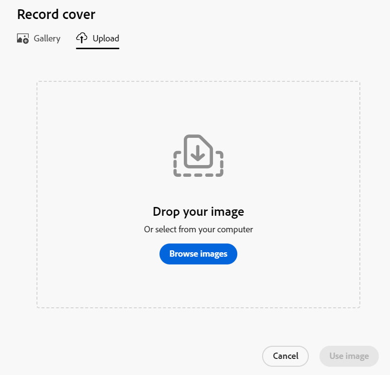

# Lägga till en omslagsbild till en post

<!--The highlighted information on this page refers to functionality not yet generally available. It is available only in the Preview environment for all customers. After the monthly releases to Production, the same features are also available in the Production environment for customers who enabled fast releases.    

For information about fast releases, see [Enable or disable fast releases for your organization](/help/quicksilver/administration-and-setup/set-up-workfront/configure-system-defaults/enable-fast-release-process.md). -->

{{planning-important-intro}}

Du kan anpassa poster genom att lägga till en omslagsbild på postsidan i Adobe Workfront Planning när du redigerar en post.

Mer information om hur du redigerar poster finns i [Redigera poster](/help/quicksilver/planning/records/edit-records.md).

Du måste skapa posttyper innan du kan börja skapa och redigera poster.

Mer information finns i [Skapa posttyper](/help/quicksilver/planning/architecture/create-record-types.md).

## Åtkomstkrav

+++ Expandera om du vill visa åtkomstkraven för funktionerna i den här artikeln. 

<table style="table-layout:auto"> 
<col> 
</col> 
<col> 
</col> 
<tbody> 
    <tr> 
<tr> 
</tr>   
<tr> 
   <td role="rowheader">
Adobe Workfront package
</td> 
   <td> 
<ul> 
<li>
Alla Workfront- och Planning-paket
</li>
eller
<li>
Alla arbetsflöden och alla planeringsdokument
</li></ul>

Mer information om vad som ingår i respektive Workfront Planning-paket får du av Workfront. 
 
   </td> 
  <tr> 
   <td role="rowheader">
Adobe Workfront-licens
</td> 
   <td>
Standard

   </td> 
  </tr> 
  <tr> 
   <td role="rowheader">
Objektbehörigheter
</td> 
   <td>   
Contribute eller högre behörighet för en arbetsyta och en posttyp  
  
   
Systemadministratörer har behörighet till alla arbetsytor, inklusive de som de inte skapade
 </td> 
  </tr>   
</tbody> 
</table>

Mer information om Workfront åtkomstkrav finns i [Åtkomstkrav i Workfront-dokumentationen](/help/quicksilver/administration-and-setup/add-users/access-levels-and-object-permissions/access-level-requirements-in-documentation.md).

+++   

<!--Old:

<table style="table-layout:auto"> 
<col> 
</col> 
<col> 
</col> 
<tbody> 
    <tr> 
<tr> 
<td> 
   
 Products
 </td> 
   <td> 
   <ul><li>
 Adobe Workfront
</li> 
   <li>
 Adobe Workfront Planning
</li></ul></td> 
  </tr>   
<tr> 
   <td role="rowheader">
Adobe Workfront plan*
</td> 
   <td> 

Any of the following Workfront plans:
 
<ul><li>Select</li> 
<li>Prime</li> 
<li>Ultimate</li></ul> 

Workfront Planning is not available for legacy Workfront plans
 
   </td> 
<tr> 
   <td role="rowheader">
Adobe Workfront Planning package*
</td> 
   <td> 

Any 
 

For more information about what is included in each Workfront Planning package, contact your Workfront account manager. 
 
   </td> 
 <tr> 
   <td role="rowheader">
Adobe Workfront platform
</td> 
   <td> 

Your organization's instance of Workfront must be onboarded to the Adobe Unified Experience to be able to access Workfront Planning.
 

For more information, see <a href="/help/quicksilver/workfront-basics/navigate-workfront/workfront-navigation/adobe-unified-experience.md">Adobe Unified Experience for Workfront</a>. 
 
   </td> 
   </tr> 
  </tr> 
  <tr> 
   <td role="rowheader">
Adobe Workfront license*
</td> 
   <td>
 Standard

   
Workfront Planning is not available for legacy Workfront licenses
 
  </td> 
  </tr> 
  <tr> 
   <td role="rowheader">
Access level configuration
</td> 
   <td> 
There are no access level controls for Adobe Workfront Planning
   
</td> 
  </tr> 
<tr> 
   <td role="rowheader">
Object permissions
</td> 
   <td>   
Contribute or higher permissions to a workspace and record type  
  
   
System Administrators have permissions to all workspaces, including the ones they did not create
 </td> 
  </tr> 
</tbody> 
</table> -->

## Att tänka på när det gäller omslagsbilder för postsidor

Du kan anpassa postens sida genom att lägga till en omslagsbild.

Tänk på följande:

* En omslagsbild är unik för en post och gäller inte för alla poster av samma typ.
* Du kan bara lägga till bildfiler som omslagsbilder.
  <!--above: when you know exactly what type of files are allowed, add the exact extensions above-->
* Du kan lägga till en omslagsbild till enskilda poster från postförhandsvisningen i valfri vy eller från postsidan.
* Du kan inte lägga till omslagsbilder från en postvy.
* Workfront laddar automatiskt upp en omslagsbild varje gång du skapar en post. Du kan ändra den här bilden senare.

## Lägga till en omslagsbild till en post

Du kan anpassa en post genom att lägga till en omslagsbild högst upp i postens förhandsvisning eller sida.

{{step1-to-planning}}

1. Klicka på arbetsytan vars poster du vill anpassa,

   eller

   Utöka den nedåtriktade pilen till höger om namnet på en befintlig arbetsyta i en arbetsyta, sök efter en arbetsyta och markera den när den visas i listan.

   Arbetsytan öppnas och posttyperna visas.

1. Klicka på ett posttypskort.

   Posttypssidan öppnas.

1. Klicka på en post i en vy av valfri typ

   eller

   I tabellvyn klickar du på ikonen **Öppna detaljer**  i den första kolumnen.

   Postens förhandsgranskning öppnas i vyn.

   

1. (Valfritt) Klicka på ikonen **Öppna på ny flik**  <!--check the icon; they are changing it--> i det övre högra hörnet av postförhandsvisningen för att öppna postens sida på en ny flik.

   Postsidan öppnas.

   

1. Håll markören över utrymmet ovanför postens namn på sidan för förhandsgranskning eller information av poster och klicka sedan på **Lägg till omslag**.

   eller

   Håll pekaren över en befintlig omslagsbild, klicka på menyn **Mer**  och klicka sedan på **Överför**. <!--check the casing here; I logged a bug for this-->
Rutan **Postomslag** öppnas på fliken **Överför** .

   

1. Klicka på **Bläddra bland bilder** och bläddra efter en bild på datorn för att markera och lägga till den.

1. (Valfritt) Om du vill ta bort bilden innan den sparas klickar du på ikonen **Överför ny bild**  och överför en ny bild.

1. (Valfritt) Klicka på fliken **Galleri** och sedan på en bild i bildgalleriet. Det går inte att ändra bildgalleriet.

   

1. Klicka på **Använd bild**.

   Bilden överförs högst upp på sidan för förhandsgranskning av post eller information och ändringarna sparas automatiskt.

   

1. (Valfritt) Hovra över bilden, klicka sedan på menyn **Mer**  i det nedre högra hörnet av omslagsbilden och gör något av följande:

   * Klicka på **Överför** om du vill ersätta omslagsbilden och upprepa steg 6 för att överföra och spara en ny bild.
   * Klicka på **Flytta** och använd verktyget **Flytta**  för att centrera omslagsbilden. Klicka sedan på **Spara** när du är klar.
   * Klicka på **Ta bort** för att ta bort omslagsbilden.

   Workfront sparar automatiskt ändringarna.
