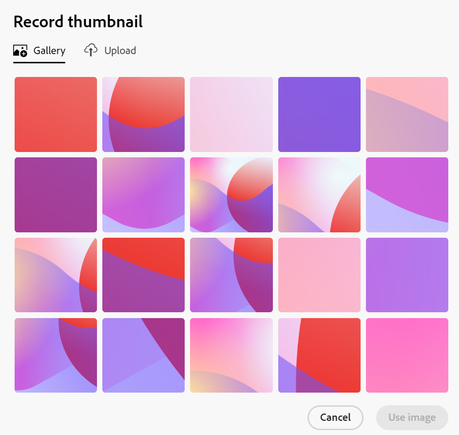

# Lägga till en miniatyrbild i en post

<!--The highlighted information on this page refers to functionality not yet generally available. It is available only in the Preview environment for all customers. After the monthly releases to Production, the same features are also available in the Production environment for customers who enabled fast releases.    

For information about fast releases, see [Enable or disable fast releases for your organization](/help/quicksilver/administration-and-setup/set-up-workfront/configure-system-defaults/enable-fast-release-process.md). -->

{{planning-important-intro}}

Du kan associera poster med unika miniatyrbilder i Adobe Workfront Planning för att göra dem lätta att känna igen.

Du måste skapa posttyper innan du kan börja skapa och redigera poster.
Mer information finns i [Skapa posttyper](/help/quicksilver/planning/architecture/create-record-types.md).

## Åtkomstkrav

<!--************double-check permissions here - asking Isk and Lilit what permissions users need for adding thumbnails-->

+++ Expandera om du vill visa åtkomstkraven för Workfront Planning.

Du måste ha följande åtkomst för att kunna utföra stegen i den här artikeln:

<table style="table-layout:auto"> 
<col> 
</col> 
<col> 
</col> 
<tbody> 
    <tr> 
<tr> 
<td> 
   
 Produkter
 </td> 
   <td> 
   <ul><li>
 Adobe Workfront
</li> 
   <li>
 Adobe Workfront Planning
</li></ul></td> 
  </tr>   
<tr> 
   <td role="rowheader">
Adobe Workfront-plan*
</td> 
   <td> 

Något av följande Workfront-planer:
 
<ul><li>Välj</li> 
<li>Prime</li> 
<li>Ultimate</li></ul> 

Workfront Planning är inte tillgängligt för tidigare Workfront-planer
 
   </td> 
<tr> 
   <td role="rowheader">
Adobe Workfront Planning-paket*
</td> 
   <td> 

Alla 
 

Kontakta din kontoansvarige på Workfront om du vill ha mer information om vad som ingår i respektive Workfront Planning-plan. 
 
   </td> 
 <tr> 
   <td role="rowheader">
Adobe Workfront
</td> 
   <td> 

Din organisations instans av Workfront måste integreras med Adobe Unified Experience för att få tillgång till alla funktioner i Workfront Planning.
 

Mer information finns i <a href="/help/quicksilver/workfront-basics/navigate-workfront/workfront-navigation/adobe-unified-experience.md">Adobe Unified Experience for Workfront</a>. 
 
   </td> 
   </tr> 
  </tr> 
  <tr> 
   <td role="rowheader">
Adobe Workfront-licens*
</td> 
   <td>
 Standard 

   
Workfront Planning är inte tillgängligt för tidigare Workfront-licenser
 
  </td> 
  </tr> 
  <tr> 
   <td role="rowheader">
Åtkomstnivåkonfiguration
</td> 
   <td> 
Det finns inga åtkomstnivåkontroller för Adobe Workfront Planning
   
</td> 
  </tr> 
<tr> 
   <td role="rowheader">
Objektbehörigheter
</td> 
   <td>   
Hantera behörigheter till en arbetsyta 
  
   
Systemadministratörer har behörighet till alla arbetsytor, inklusive de som de inte skapade
 </td> 
  </tr> 
<tr> 
   <td role="rowheader">
Layoutmall
</td> 
   <td> 
Alla användare, inklusive Workfront-administratörer, måste tilldelas en layoutmall som innehåller planeringsområdet på huvudmenyn. 
 </td> 
  </tr> 
</tbody> 
</table>

*Mer information om Workfront åtkomstkrav finns i [Åtkomstkrav i Workfront-dokumentation](/help/quicksilver/administration-and-setup/add-users/access-levels-and-object-permissions/access-level-requirements-in-documentation.md).

+++

## Att tänka på när du spelar in miniatyrbilder

Om du vill skilja mellan posterna i en tabellvy kan du koppla en unik miniatyrbild till varje post.

Tänk på följande:

* En miniatyrbild är unik för en post och gäller inte för alla poster av samma typ.
* Du kan bara lägga till bildfiler som miniatyrer.
  <!--above: when you know exactly what type of files are allowed, add the exact extensions above-->
* Du kan lägga till en miniatyrbild till enskilda poster i tabellvyn eller från postens sida eller förhandsvisningsruta.
* Workfront laddar automatiskt upp en miniatyrbild varje gång du skapar en post. Du kan ändra den här bilden senare.
* Miniatyrbilder tillhör postinformationen och visas i områden där posterna visas. Miniatyrbilder visas till exempel tillsammans med postinformation i följande områden:

   * Det primära fältet för en post i tabellvyn
   * Postfältet i tidslinjevyn.
   * Postens förhandsgranskning och sida med information.

## Lägga till en miniatyrbild i en post

Du kan lägga till en miniatyrbild på följande sätt:

* [Lägga till en miniatyrbild till en post från tabellvyn](#add-a-thumbnail-to-a-record-from-the-table-view)
* [Lägga till en miniatyrbild till en post från informationssidan](#add-a-thumbnail-to-a-record-from-the-details-page)

### Lägga till en miniatyrbild till en post från tabellvyn

{{step1-to-planning}}

1. Klicka på arbetsytan för vars poster du vill lägga till miniatyrbilder och klicka sedan på posttypskortet.

   Då öppnas posttypssidan.
1. Välj en tabellvy i listrutan **Visa**. Alla poster av den typ som du har markerat visas i en tabell.
1. Håll markören över informationen för det primära fältet, klicka på menyn **Mer**  och klicka sedan på **Miniatyrbild**.

   

   >[!TIP]
   >
   >   Det primära fältet är det fält som visas i den första kolumnen i en tabellvy. Det primära fältet är alltid fryst och kan inte döljas eller flyttas. Alternativet Miniatyrbilder är inte tillgängligt på menyn Mer när det primära fältet är ett formelfält.

   Fliken **Överför** öppnas som standard i rutan **Spela in miniatyrbild**.

   Mer information om hur du överför miniatyrbilden finns i avsnittet [Lägg till en miniatyrbild till en post från informationssidan](#add-a-thumbnail-to-a-record-from-the-details-page) i den här artikeln, med början från steg 6. <!--see if this is accurate-->

<!--
    

  *****update screen shot with correct casing****

1. Drag and drop a file to add as a thumbnail
   
   Or
   
   Click **Browse images**, then browse for an image file to add. The file must be saved on your computer. 
1. (Optional) After the image uploads in the **Record thumbnail** box, use the sizing tool to crop and resize the image.
1. (Optional) Click the **Upload new image** icon  to upload another image. 
1. (Optional) To remove a thumbnail before it is saved, click  **Remove uploaded image** icon  to the right of the image. 
1. (Optional) Click the **Gallery** tab, then click an image. The gallery of images cannot be modified.

   
1. Click **Use image** to add the image as a thumbnail. 
   This closes the **Record thumbnail** box.
   The thumbnail displays in areas of Workfront Planning where the record displays. 

   >[!TIP]
   >
   >   You must enable the Thumbnail field in the table view to display thumbnails in this view. It is disabled by default.

1. (Optional) To remove the thumbnail after it is saved, hover over the primary field and click the **More** menu > **Thumbnail** > the **Remove** icon , then click **Save changes**. -->

### Lägga till en miniatyrbild till en post från informationssidan

{{step1-to-planning}}

1. Klicka på arbetsytan för vars poster du vill lägga till miniatyrbilder och klicka sedan på posttypskortet.

   Då öppnas posttypssidan.
1. Öppna en post genom att klicka på den i valfri vy.

   Förhandsvisningsrutan med information visas.
1. (Valfritt) Klicka på ikonen **Öppna på ny flik**  i det övre högra hörnet.

   Postens informationssida öppnas.

1. (Villkorligt) Håll markören över miniatyrbilden eller ikonen  på sidan för förhandsgranskning av post eller på informationssidan, hovra över utrymmet ovanför postnamnet och klicka sedan på **Lägg till miniatyrbild** eller **Redigera miniatyrbild** .

   Fliken **Överför** öppnas som standard i rutan **Spela in miniatyrbild**.

   

1. Dra och släpp en fil som du vill lägga till som miniatyrbild

   eller

   Klicka på **Bläddra bland bilder** och bläddra sedan efter en bildfil som du vill lägga till. Filen måste sparas på datorn.

1. (Valfritt) När bilden har överförts i rutan **Spela in miniatyrbild** använder du storleksförändringsverktyget för att beskära och ändra storlek på bilden.
1. (Valfritt) Klicka på ikonen **Överför ny bild**  om du vill överföra en annan bild.
1. (Valfritt) Klicka på fliken **Galleri** och sedan på en bild. Det går inte att ändra bildgalleriet.

   

1. (Valfritt) Om du vill ta bort miniatyrbilden innan den sparas klickar du på ikonen **Ta bort**  till höger om bilden.

1. Klicka på **Använd bild** om du vill lägga till bilden som en miniatyrbild.
Då stängs rutan **Spela in miniatyrbild**.
Miniatyrbilden visas i områden i Workfront Planning där posten visas.

   >[!TIP]
   >
   >   Du måste aktivera fältet Miniatyrbilder i tabellvyn om du vill visa miniatyrbilder i den här vyn. Det är inaktiverat som standard.

1. (Valfritt) Om du vill ta bort miniatyrbilden när den har sparats klickar du på en post i valfri vy för att öppna informationssidan, håller pekaren över miniatyrbilden och klickar på **Mer**-menyn > **Ta bort** -ikonen  . Miniatyrbilden tas bort.

<!--
### Generate a thumbnail for a record

{{step1-to-planning}}

1. Click the workspace for whose records you want to add thumbnails, then click the record type card. 

   This opens the record type page. 
1. Select a table view from the **View** drop-down menu. All records of the type you selected display in a table. 
1. Hover over the primary field information, click the **More** menu , then click **Thumbnail**. 

   

      >[!TIP]
      >
      >   The primary field is the field that displays in the first column of a table view. The primary field is always frozen and cannot be hidden or relocated. 

   The **Record thumbnail** box opens.

(*************** update the screenshot below*************)
    

1. Click the **Generate** tab, and type a prompt describing the type of image you want to add in the space provided. 
1. Click **Generate**. 

   A set of four suggested images displays. 

1. Click an image to select it, then click **Use image**. 

   The Record thumbnail box closes and the thumbnail is attached to the record. All users who can view the records can now see the selected thumbnail. 
1. (Optional) Click the **More** menu  to the right of the record name in the table view, then click **Thumbnail**. 

   The generated image opens in the **Upload** tab where you can modify or remove it, as described in the section [Upload a thumbnail to a record](#upload-a-thumbnail-to-a-record) in this article. 
-->