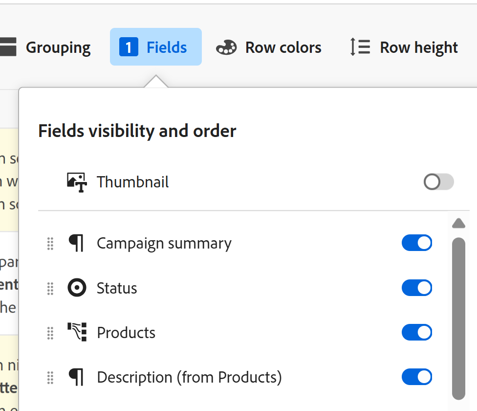

<!--update the metadata with real information-->

# Lägga till en miniatyrbild i en post

{{planning-important-intro}}

Du kan associera poster med unika miniatyrbilder i Adobe Workfront Planning för att göra dem lätta att känna igen.

Du måste skapa posttyper innan du kan börja skapa och redigera poster.
Mer information finns i [Skapa posttyper](/help/quicksilver/planning/architecture/create-record-types.md).

## Åtkomstkrav

<!--************double-check permissions here - asking Isk and Lilit what permissions users need for adding thumbnails-->

Du måste ha följande åtkomst för att kunna utföra stegen i den här artikeln:

<table style="table-layout:auto">
 <col>
 </col>
 <col>
 </col>
 <tbody>
    <tr>
<tr>
<td>
   
 Produkt
 </td>
   <td>
   
 Adobe Workfront
 </td>
  </tr>  
 <td role="rowheader">
Adobe Workfront-avtal
</td>
   <td>

Din organisation måste vara registrerad på Workfront Planning i ett tidigt skede 

   </td>
  </tr>
  <tr>
   <td role="rowheader">
Adobe Workfront
</td>
   <td>

Alla

   </td>
  </tr>
  <tr>
   <td role="rowheader">
Adobe Workfront-licens
</td>
   <td>
   
Alla
 
  </td>
  </tr>

<tr>
   <td role="rowheader">
Konfigurationer på åtkomstnivå
</td>
   <td> 
Det finns inga åtkomstkontroller för Workfront Planning 
  
</td>
  </tr>
<tr>
   <td role="rowheader">
Behörigheter
</td>
   <td> 
Contribute eller högre behörighet till en arbetsyta 
  
   
Systemadministratörer har behörighet till alla arbetsytor, inklusive de som de inte skapade

</td>
  </tr>
<tr>
   <td role="rowheader">
Layoutmall
</td>
   <td>  
Alla användare, inklusive Workfront-administratörer, måste tilldelas en layoutmall som innehåller planeringsområdet på huvudmenyn. 
 
Mer information finns i <a href="/help/quicksilver/planning/access/access-overview.md">Åtkomstöversikt</a>. 
  
</td>
  </tr>

</tbody>
</table>

## Att tänka på när du spelar in miniatyrbilder

Om du vill skilja mellan posterna i en tabellvy kan du koppla en unik miniatyrbild till varje post.

Tänk på följande:

* Du kan bara lägga till bildfiler som miniatyrer.
  <!--above: when you know exactly what type of files are allowed, add the exact extensions above-->
* Du kan lägga till en miniatyrbild till enskilda poster i tabellvyn.
* Miniatyrbilder tillhör postinformationen och visas i vyer där posterna visas. Miniatyrbilder visas till exempel tillsammans med postinformation i följande områden:

   * Det primära fältet för en post i tabellvyn
   * Postfältet i tidslinjevyn.
* Du kan inte lägga till postminiatyrer från postens sida eller från en annan typ av vy.
* Miniatyrbilder visas inte på postens sida.

## Lägga till en miniatyrbild i en post

{{step1-to-planning}}

1. Välj den arbetsyta vars poster du vill lägga till miniatyrbilder för och klicka sedan på posttypskortet.

   Då öppnas posttypssidan.
1. Välj en tabellvy på menyn **Visa** listruta. Alla poster av den typ som du har markerat visas i en tabell.
1. Håll markören över informationen i det primära fältet och klicka på **Mer** meny och sedan klicka **Miniatyrbild**.

   

   >[!TIP]
   >
   >   Det primära fältet är det fält som visas i den första kolumnen i en tabellvy. Det primära fältet är alltid fryst och kan inte döljas eller flyttas.

   The **Spela in miniatyrbild** öppnas.

   

   <!--update screen shot with correct casing-->

1. I **Överför** dra och släpp en fil som du vill lägga till som miniatyrbild eller klicka på **Välj att överföra** och bläddra sedan efter en bildfil att lägga till. Filen måste sparas på datorn.
1. (Valfritt) Använd storleksförändringsverktyget för att beskära och ändra storlek på bilden.
1. Klicka **Använd bild** om du vill lägga till bilden som en miniatyrbild.
Detta stänger **Spela in miniatyrbild** box.
1. (Villkorligt) Om du har minst Contribute-behörighet till tabellvyn klickar du på **Fält** i tabellvyns övre högra hörn.
1. Välj **Miniatyrbild** för att visa miniatyrbilden. Detta är som standard avmarkerat.

   

   Miniatyrbilden visas till vänster om det primära fältvärdet.
1. (Valfritt och villkorligt) Om du inte har Contribute eller högre behörighet för vyn väljer du en ny vy i **Visa** eller skapa en vy.
1. (Valfritt) Om du vill ta bort miniatyrbilden håller du pekaren över det primära fältet och klickar på knappen **Mer** meny > **Miniatyrbild** > **Ta bort** icon och sedan klicka **Spara ändringar**.

<!--
Replace the section above with the following when we release generate thumbnails:

## Add a thumbnail to a record

You can add a thumbnail to a record in the following ways:

* Upload a file from your computer
* Generate an image with a prompt

### Upload a thumbnail to a record

{{step1-to-planning}}

1. Select the workspace for whose records you want to add thumbnails, then click the record type card. 

   This opens the record type page. 
1. Select a table view from the **View** drop-down menu. All records of the type you selected display in a table. 
1. Hover over the primary field information, click the **More** menu , then click **Thumbnail**. 

   

      >[!TIP]
      >
      >   The primary field is the field that displays in the first column of a table view. The primary field is always frozen and cannot be hidden or relocated. 

   The **Record thumbnail** box opens.

    

1. Click the **Upload** tab, and drag and drop a file to add as a thumbnail
   Or
   Click **Select to upload**, then browse for an image file to add. The file must be saved on your computer. 
1. (Optional) Use the sizing tool to crop and resize the image.
1. Click **Use image** to add the image as a thumbnail. 
   This closes the **Record thumbnail** box.
1. (Conditional) If you have at least Contribute permissions to the table view, click **Fields** in the upper-right corner of the table view. 
1. Select the **Thumbnail** toggle to display the thumbnail. This is deselected by default. 

   

   The thumbnail displays to the left of the primary field value. 
1. (Optional and conditional) If you do not have Contribute or higher permissions to the view, select a new view from the **View** drop-down menu, or create a view. 
1. (Optional) To remove the thumbnail, hover over the primary field and click the **More** menu > **Thumbnail** > the **Remove** icon , then click **Save changes**.

### Generate a thumbnail for a record

{{step1-to-planning}}

1. Select the workspace for whose records you want to add thumbnails, then click the record type card. 

   This opens the record type page. 
1. Select a table view from the **View** drop-down menu. All records of the type you selected display in a table. 
1. Hover over the primary field information, click the **More** menu , then click **Thumbnail**. 

   

      >[!TIP]
      >
      >   The primary field is the field that displays in the first column of a table view. The primary field is always frozen and cannot be hidden or relocated. 

   The **Record thumbnail** box opens.

(*************** update the screenshot below*************)
    

1. Click the **Generate** tab, and type a prompt describing the type of image you want to add in the space provided. 
1. Click **Generate**. 

   A set of four suggested images displays. 

1. Click an image to select it, then click **Use image**. 

   The Record thumbnail box closes and the thumbnail is attached to the record. All users who can view the records can now see the selected thumbnail. 
1. (Optional) Click the **More** menu  to the right of the record name in the table view, then click **Thumbnail**. 

   The generated image opens in the **Upload** tab where you can modify or remove it, as described in the section [Upload a thumbnail to a record](#upload-a-thumbnail-to-a-record) in this article. 
-->