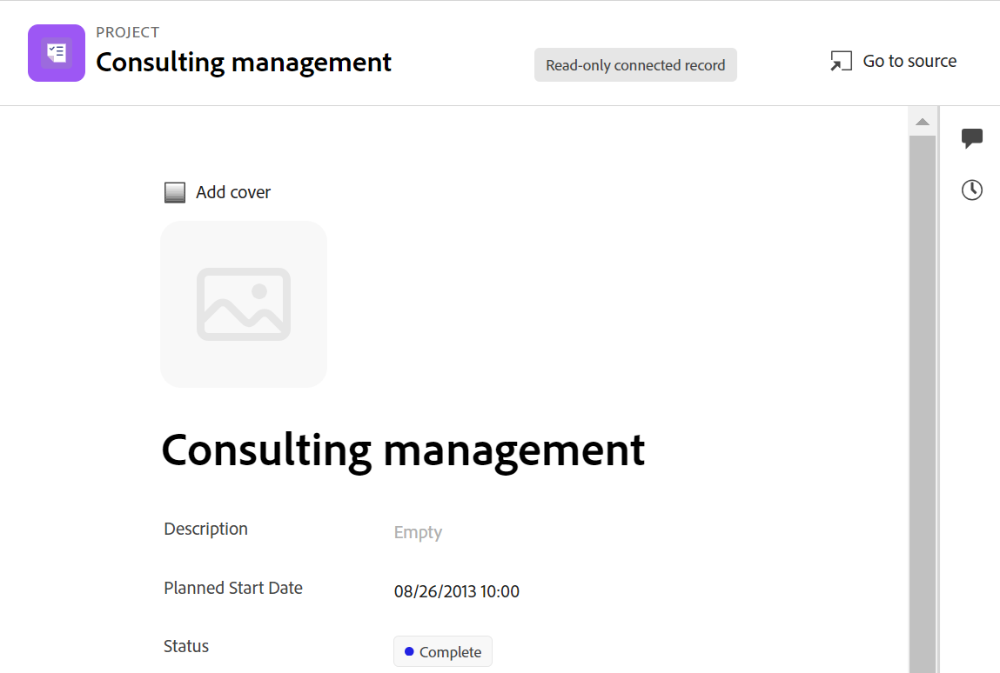

<!--when you make this live, update the metadata above to this: 
---
title: Connect records and objects
description: In addition to connecting records to one another, you can also connect records to objects from other applications.  
topic: Architecture
role: User
hidefromtoc: yes
hide: yes
---
-->
<!--update the metadata with real information when making this available in TOC and in the left nav-->

<!--if you change steps here, also update steps in the "Connect records" article-->

# Koppla poster

{{planning-important-intro}}

Du kan ansluta Adobe Workfront Planning-poster till varandra eller till objekt från andra program.

Du måste först koppla två posttyper till varandra, eller en posttyp till en objekttyp från ett annat program. Då skapas länkade postfält. Du kan sedan koppla poster till varandra eller till andra objekt från andra program med hjälp av de länkade postfälten.

Att ansluta poster liknar att ansluta poster till objekt från ett annat program.

Mer information om hur du ansluter posttyper till varandra eller till objekttyper från andra program finns i [Koppla posttyper](/help/quicksilver/planning/architecture/connect-record-types.md).

Ett exempel på hur du ansluter posttyper finns i [Exempel på att ansluta posttyper och poster](/help/quicksilver/planning/architecture/example-connect-record-types-and-records.md).

Du kan ansluta följande:

* Adobe Workfront Planning - poster
* Adobe Workfront Planning registrerar med objekt från andra program.

  Du kan koppla poster till objekt av den typ som listas nedan från följande program:

   * Adobe Workfront

      * Projekt
      * Portfolio
      * Program
      * Företag
      * Grupp

   * Adobe Experience Manager Assets

      * Bildfiler
      * Mappar

  <!--when you add more objects, fix the Access Requirements below which right now refer only to projects-->

## Åtkomstkrav

Du måste ha följande åtkomst för att kunna utföra stegen i den här artikeln:

<table style="table-layout:auto">
 <col>
 </col>
 <col>
 </col>
 <tbody>
    <tr>
<tr>
<td>Produkt
 </td>
   <td>
   
 Adobe Workfront
 
   
För att kunna koppla ihop Adobe Workfront Planning-poster med Experience Manager Assets måste ni ha en Adobe Experience Manager Assets-licens och instansen av Workfront måste ingå i Adobe Unified Experience. Mer information finns i <a href="/help/quicksilver/workfront-basics/navigate-workfront/workfront-navigation/adobe-unified-experience.md">Adobe enhetliga upplevelse för Workfront</a>.

   </td>
  </tr>  
 <td role="rowheader">
Adobe Workfront-avtal
</td>
   <td>

Din organisation måste vara registrerad på Workfront Planning i ett tidigt skede 

   </td>
  </tr>
  <tr>
   <td role="rowheader">
Adobe Workfront
</td>
   <td>

Alla

   </td>
  </tr>
  <tr>
   <td role="rowheader">
Adobe Workfront-licens
</td>
   <td>
   
Alla
 
  </td>
  </tr>

<tr>
   <td role="rowheader">
Åtkomstnivåkonfiguration
</td>
   <td> 
Det finns inga åtkomstnivåkontroller för Workfront Planning
  
</td>
  </tr>
<tr>
   <td role="rowheader">
Behörigheter
</td>
   <td> 
Hantera behörigheter till en arbetsyta för att ansluta poster 
  
   
Visa eller högre behörigheter på en arbetsyta för att visa alla anslutningar till objekt och fält från andra program, oavsett om du har åtkomst till dem i andra program. 

   
Systemadministratörer har behörighet för alla arbetsytor, inklusive de som de inte skapade.

</td>
  </tr>

<tr>
   <td role="rowheader">
Layoutmall
</td>
   <td> 
Workfront- eller gruppadministratören måste lägga till planeringsområdet i layoutmallen. Mer information finns i <a href="/help/quicksilver/planning/access/access-overview.md">Åtkomstöversikt</a>. 
  
</td>
  </tr>

</tbody>
</table>

<!--Maybe enable this at GA - but Planning is not supposed to have Access controls in the Workfront Access Level: 
>[!NOTE]
>
>If you don't have access, ask your Workfront administrator if they set additional restrictions in your access level. For information on how a Workfront administrator can change your access level, see [Create or modify custom access levels](/help/quicksilver/administration-and-setup/add-users/configure-and-grant-access/create-modify-access-levels.md). -->

## Att tänka på när det gäller att ansluta poster

* När du har anslutit posttyper visas de kopplade posttyperna som länkade postfält i tabellen med de posttyper som de är länkade från och på posternas sidor.
* Du kan bläddra bland och lägga till poster och objekt för den länkade posten och objekttyperna från de länkade postfälten.
* Du kan lägga till fält av de länkade posttyperna i tabellen med den posttyp som du länkar från.
* Du kan inte uppdatera värdena för länkade fält manuellt på de poster som du länkar från.

  Värdena för de länkade fälten för de länkade posterna fyller i den Workfront Planning-post som du länkar från automatiskt från den ursprungliga posten eller det ursprungliga objektet.

* Alla som har åtkomst till Workfront Planning och View eller högre behörighet till arbetsytan kan se anslutningarna mellan posterna eller mellan poster och andra programobjekt. De kan visa anslutna poster och objekt oavsett deras behörigheter i de program du ansluter till.
* Du kan visa och redigera alla andras anslutningar om du har behörigheten Hantera på arbetsytan där de anslutna posterna finns.
* Du kan koppla en post till ett eller flera objekt från ett annat program.
* Om du vill länka poster till andra poster eller objekt måste du ha följande:

   * Minst en arbetsyta, posttyp och post.

     Mer information finns i följande artiklar:

      * [Skapa arbetsytor](/help/quicksilver/planning/architecture/create-workspaces.md)
      * [Skapa posttyper](/help/quicksilver/planning/architecture/create-record-types.md)
      * [Skapa poster](/help/quicksilver/planning/records/create-records.md)

   * Kopplingar mellan posttyper eller mellan posttyper och objekt från andra program. Mer information finns i [Koppla posttyper](/help/quicksilver/planning/architecture/connect-record-types.md)
* Du kan koppla objekt från Workfront till Workfront Planning-poster i följande områden:
   * Från en planeringspost i Workfront Planning.
   * Under Planning för ett Workfront-objekt.

## Koppla ihop poster från Workfront Planning

### Anslut Adobe Workfront Planning-poster

{{step1-to-planning}}

1. Klicka på arbetsytan vars poster du vill ansluta

   Arbetsytan öppnas och posttyperna visas som kort.
1. Klicka på kortet för en posttyp för att öppna posttypssidan.
1. Välj en **Tabell** visa från **Visa** nedrullningsbar meny i det övre högra hörnet på posttypssidan.
1. (Valfritt) Lägg till poster till den posttyp du valde genom att lägga till en ny rad i tabellen. Mer information finns i [Skapa poster](/help/quicksilver/planning/records/create-records.md).
1. (Villkorligt) När du har kopplat den markerade posttypen till en annan posttyp går du till den länkade postkolumnen och dubbelklickar på cellen som motsvarar den post som du vill länka till andra poster.

   

1. Gör något av följande:

   * Klicka på namnet på en ansluten post i listan för att lägga till den till den valda posten. Posten läggs till automatiskt.
   * Börja skriva namnet på en post och klicka på den när den visas i listan. Posten läggs till automatiskt.
   * Klicka **Se alla** för att visa alla poster.

1. (Villkorligt) Om du klickade **Markera alla** i föregående steg **Koppla objekt** visas.

   

1. Börja skriva namnet på en post i sökrutan och markera den när den visas i listan

   eller

   Markera namnet på en eller flera poster i rutan och klicka sedan på **Koppla objekt** i det övre högra hörnet av rutan Anslut objekt.

   >[!TIP]
   >
   >    Du kan öppna en postsida, leta upp det länkade postfältet och klicka **Koppla poster** i fältet för att lägga till poster från den anslutna posten eller objekttypen.
   >
   >

   Följande ska läggas till:

   * De länkade posterna visas i det länkade postfältet för den post som du valde i steg 6. <!--accurate?-->
   * De länkade fälten fylls i med informationen från de länkade posterna om du lade till länkade sökfält när du kopplade posttyperna.

   När du uppdaterar de länkade posterna uppdateras de länkade fälten för de poster som du länkar från automatiskt. Du kan inte redigera länkade fält manuellt.

   >[!TIP]
   >
   >* Vi använder länkade fält och sökfält omväxlande.
   >
   >* Om du har aktiverat **Tillåt flera poster** när du kopplar ihop posttyperna visas fältvärdena för de markerade objekten antingen separerade med kommatecken eller aggregeras enligt den aggregator du väljer.

1. (Valfritt) Stäng sidan med posttyper och gå till den arbetsyta du valt.
1. Klicka på kortet för den posttyp som du länkade till.

   Om du till exempel har anslutit **Campaign** med produktposten klickar du på **Produkt** kort.

   Posttypkortet ska öppnas i tabellvyn. Om inte, väljer du en tabellvy.

   Observera att **Campaign** I det länkade postfältet visas namnen på de kampanjer du har länkat till produkter på sidan Produktposttyp. Om du uppdaterar Campaign-informationen uppdateras automatiskt det Campaign-länkade postfältet för produktposttypen.

### Koppla Adobe Workfront Planning-poster till Workfront-objekt

<!--when we will have more applications to link to from Planning, change the title to something like: Connect Workfront Planning records to objects from other applications-->

När du har skapat en anslutning mellan en posttyp och en Workfront-objekttyp kan du koppla enskilda poster till objekt i Workfront. De Workfront-fält som du har anslutit fylls automatiskt i på de poster som du länkar objekten från.

>[!NOTE]
>
>Du kan inte koppla Workfront-objekttyper till posttyper för Workfront Planning från Workfront.

{{step1-to-planning}}

1. Klicka på arbetsytan vars poster du vill ansluta.

   Arbetsytan öppnas och posttyperna visas som kort.
1. Klicka på kortet för en posttyp för att öppna posttypssidan.
1. Välj en **Tabell** visa från **Visa** listruta.

1. Klicka **Ny post**  om du vill lägga till enskilda poster till den posttyp som du har valt. Mer information finns i [Skapa poster](/help/quicksilver/planning/records/create-records.md).
1. (Villkorligt) När du har kopplat den markerade posttypen till en Workfront-objekttyp går du till kolumnen för det länkade objektet och dubbelklickar på cellen för den post som du vill länka till objekt från Workfront.

   

1. Gör något av följande:

   * Klicka på ett objekt i listan för att lägga till det i den markerade posten. Objekten listas i bokstavsordning. Objektet läggs till automatiskt.
   * Börja skriva namnet på ett objekt och klicka på det när det visas i listan. Objektet läggs till automatiskt.
   * Klicka **Se alla** om du vill visa alla objekt som du har minst behörighet att visa.

1. (Villkorligt) Om du klickade **Se alla** i föregående steg **Koppla objekt** visas.

   

1. Börja skriva namnet på ett Workfront-objekt i sökrutan och markera det sedan när det visas i listan

   eller

   Markera namnet på ett eller flera objekt i rutan och klicka sedan på **Koppla objekt** i det övre högra hörnet av rutan Anslut objekt.

   >[!IMPORTANT]
   >
   >* Du kan bara lägga till Workfront-objekt som du har åtkomst till för att visa.
   >
   >* När du lägger till Workfront-objekt kan alla med behörigheten Visa eller högre på arbetsytan visa Workfront-objekt och deras fältinformation, oavsett deras behörigheter eller åtkomst i Workfront.

   Följande ska läggas till:

   * De markerade Workfront-objekten läggs till i det länkade postfältet.
   * Om du lade till dem när du kopplade posttypen med Workfront fylls de länkade fälten (eller sökfälten) för Workfront-objekten automatiskt i med information från Workfront.

   >[!TIP]
   >
   >Du kan öppna en postsida, leta upp det länkade postfältet och klicka på **+** -ikonen i fältet om du vill lägga till objekt från den anslutna objekttypen.

   Mer information om hur du ansluter posttyper med objekt från ett annat program finns i [Koppla posttyper](/help/quicksilver/planning/architecture/connect-record-types.md).

1. (Valfritt) Klicka på namnet på ett Workfront-objekt som är anslutet till en Workfront Planning-post i det länkade fältet i en tabellvy eller från det länkade fältet på postsidan.

   Då öppnas den skrivskyddade postsidan för Workfront Planning för det länkade Workfront-objektet. De fält som du markerade som uppslagsfält när du kopplade posttypen med Workfront-objektet visas på postsidan för Workfront Planning.

   >[!TIP]
   >
   >* När du aktiverar inställningen Tillåt flera poster visas värdena i uppslagsfälten avgränsade med kommatecken eller aggregeras enligt den aggregator du väljer.
   >
   >* Inget länkat postfält skapas för de länkade Workfront-objekten i Workfront.

1. (Valfritt) Om du vill öppna det länkade Workfront-objektet i Workfront klickar du på **Gå till källa** i det övre högra hörnet på Workfront-objektets postsida.

   

   Då öppnas Workfront objektsida, om du har minst behörigheten Visa för att visa objektet. Du kan redigera information om Workfront-objektet om du har behörighet att göra det.

1. (Valfritt) I posttypens tabellvy för du markören över kolumnrubriken för det länkade Workfront-objektet och klickar på listrutan och sedan på **Redigera sökfält**.

1. Lägg till Workfront-objektfält från **Omarkerade fält** area

   eller

   Ta bort Workfront-objektfält från **Markerade fält** område.

   Detta lägger till eller tar bort länkade fält från Workfront Planning-poster. Informationen som är kopplad till de borttagna fälten finns kvar i Workfront.

### Koppla Workfront Planning-poster till Adobe Experience Manager-objekt

<!--when we will have more applications to link to from Planning, change the title to something like: Connect Workfront Planning records to objects from other applications-->

>[!IMPORTANT]
>
>Du måste ha en Adobe Experience Manager Assets-licens och din organisations instans av Workfront måste vara registrerad på Adobe Business Platform eller Adobe Admin Console för att kunna ansluta Workfront Planning-poster till Adobe Experience Manager Assets.
>
>Om du har frågor om hur du kommer igång med Adobe Admin Console kan du läsa [Adobe - frågor och svar om enhetliga upplevelser](/help/quicksilver/workfront-basics/navigate-workfront/workfront-navigation/unified-experience-faq.md).

När du har skapat en anslutning mellan en posttyp och Adobe Experience Manager Assets kan du koppla enskilda poster till Experience Manager-resurser. De resursfält som du anslöt från Experience Manager Assets när du skapade anslutningen fylls automatiskt i på den posttyp som du länkade från.

{{step1-to-planning}}

1. Klicka på arbetsytan vars poster du vill ansluta.

   Arbetsytan öppnas och posttyperna visas.
1. Klicka på kortet för en posttyp för att öppna posttypssidan.
1. Välj en **Tabell** visa från **Visa** nedrullningsbar meny i det övre högra hörnet på posttypssidan.

1. (Valfritt) Klicka på **Ny post** om du vill lägga till nya poster till den posttyp som du har valt. Mer information finns i [Skapa poster](/help/quicksilver/planning/records/create-records.md).
1. (Villkorligt) När du har anslutit den markerade posttypen med Experience Manager Assets går du till kolumnen för det länkade objektet och för markören över cellen som motsvarar den post som du vill länka till andra objekt från Experience Manager. Klicka sedan på **+** -ikon.

   >[!TIP]
   >
   >  Du kan lägga till klicka på **+** -ikonen i fältet för länkade objekt på postsidan för att koppla resurser till posten.

   The **Välj resurser** visas. <!--we might change this to Connect assets-->

   

1. Klicka för att välja någon av följande typer av resurser:

   * Bilder
   * Mappar

   Du kan välja flera resurser.

   >[!IMPORTANT]
   >
   > Du kan bara ansluta resurser som du har tillgång till för att visa i Experience Manager. När du är ansluten kan alla användare av Workfront Planning se resurserna i Workfront Planning, oavsett vilken åtkomst de har i Experience Manager Assets.

1. Klicka **Välj**. <!-- we might change this to Connect-->

   Följande ska läggas till:

   * De markerade Experience Manager-resurserna läggs till i det länkade postfältet.
   * De länkade fälten (eller sökfälten) fylls i med information från de Experience Manager-anslutna resurserna.

     All befintlig information från fälten för resurserna i Experience Manager visas automatiskt i de länkade fälten eller sökfälten.

     >[!TIP]
     >
     >* Om du har aktiverat inställningen Tillåt flera poster visas värdena för de olika objekten antingen separerade med kommatecken eller aggregerade enligt den aggregator du har valt.
     >
     >* Ett länkat postfält till de länkade posterna för Workfront Planning skapas inte för de länkade Experience Manager-resurserna i Experience Manager Assets-programmet.

1. (Valfritt) Gå till den posttyp som du länkade till Experience Manager Assets från och klicka på namnet på en resurs i det länkade postfältet. Information om resursen Experience Manager i ett popup-fönster. <!--update screen shot with hi-rez picture-->

   

   Följande fält visas för en bildfil:

   * En miniatyrbild av bilden
   * Bildfilens namn
   * Dimensioner
   * Storlek
   * Beskrivning
   * Filsökvägen i Experience Manager
   * Tillgångstypen
   * Skapad den
   * Ändrat den

1. (Valfritt) Om du vill öppna postsidan för resursposter i Experience Manager i Experience Manager går du till posttypssidan för den post du länkar från, klickar på namnet på en resurs i det länkade postfältet för att öppna popup-fönstret och klickar sedan på **Öppna** icon  för att öppna resursen.

   Då öppnas Experience Manager-resursen i Adobe Experience Manager Assets.

1. (Valfritt) Håll markören över kolumnrubriken för den länkade Experience Manager-resursen i tabellvyn för posttypen och klicka sedan på listrutan. **Redigera sökfält**.

1. Lägg till Experience Manager Assets-objektfält från **Omarkerade fält** area

   eller

   Ta bort Workfront-objektfält från **Markerade fält** område.

   Då läggs länkade fält till eller tas bort från posterna. Informationen som är kopplad till de borttagna fälten finns kvar i Adobe Experience Assets.

## Koppla ihop poster från Workfront-objekt

Du måste ha följande för att kunna ansluta Workfront Planning-poster från Workfront-objekt:

* Anslutningar mellan posttyper och Workfornt-objekttyper.
* Minst en anslutning mellan en post och ett Workfront-objekt.
* Din Workfront- eller gruppadministratör måste lägga till planeringsavsnittet till de Workfront-objekttyper som kan ansluta till Planning-posttyper.

Mer information finns i [Hantera poster i Planning-delen av Adobe Workfront-objekt](/help/quicksilver/planning/records/manage-records-in-planning-section.md).
