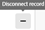

# Koppla poster

<!--The highlighted information on this page refers to functionality not yet generally available. It is available only in the Preview environment for all customers. After the monthly releases to Production, the same features are also available in the Production environment for customers who enabled fast releases.    

For information about fast releases, see [Enable or disable fast releases for your organization](/help/quicksilver/administration-and-setup/set-up-workfront/configure-system-defaults/enable-fast-release-process.md). -->

{{planning-important-intro}}

Du kan ansluta Adobe Workfront Planning-poster till varandra eller till objekt från andra program. Du kan visa information från en post i en annan post när du ansluter dem.

I den här artikeln beskrivs hur du kan ansluta poster. Mer allmän information om att ansluta poster finns i [Översikt över anslutna poster](/help/quicksilver/planning/records/connected-records-overview.md).

Du måste först koppla två posttyper till varandra, eller en posttyp till en objekttyp från ett annat program. Då skapas kopplade postfält. Du kan sedan koppla poster till varandra eller poster till andra objekt från andra program i de anslutna postfälten.

Att ansluta poster liknar att ansluta poster till objekt från ett annat program.

Mer information om hur du ansluter posttyper till varandra eller till objekttyper från andra program finns i [Koppla posttyper](/help/quicksilver/planning/architecture/connect-record-types.md).

Ett exempel på hur du ansluter posttyper finns i [Exempel på hur du ansluter posttyper och poster](/help/quicksilver/planning/architecture/example-connect-record-types-and-records.md).

Du kan ansluta följande:

* Adobe Workfront Planning spelar in med varandra
* Adobe Workfront Planning registrerar med objekt från andra program.

  Du kan koppla poster med objekt av den typ som anges nedan från följande program:

   * Adobe Workfront

      * Projekt
      * Portföljer
      * Program
      * Företag
      * Grupper

   * Adobe Experience Manager Assets

      * Bildfiler
      * Mappar

  <!--when you add more objects, fix the Access Requirements below which right now refer only to projects-->

## Åtkomstkrav

+++ Expandera om du vill visa åtkomstkraven för funktionerna i den här artikeln. 

<table style="table-layout:auto"> 
<col> 
</col> 
<col> 
</col> 
<tbody> 
    <tr> 
<tr> 
</tr>   
<tr> 
   <td role="rowheader">
Adobe Workfront package
</td> 
   <td> 

Alla Workfront- och Planning-paket

Alla arbetsflöden och alla planeringsdokument

Mer information om vad som ingår i respektive Workfront Planning-paket får du av Workfront. 
 
   </td> 
<tr> 
<td> 
   
 Ytterligare produkter
 </td> 
   <td> 
   
 Förutom Adobe Workfront måste du ha följande om du vill koppla poster till objekt från följande program:

   <ul><li>
En Adobe Experience Manager Assets-licens och en integrering mellan AEM Assets och Workfront för att koppla ihop AEM-material med Planning-typer.

   
Mer information finns i <a href="/help/quicksilver/documents/adobe-workfront-for-experience-manager-assets-essentials/workfront-for-aem-asset-essentials.md">Adobe Workfront för Experience Manager Assets och Assets Essentials: artikelindex</a>. 
</li>
   <li>
 En Adobe GenStudio for Performance Marketing-licens för att koppla posttyper till GenStudio Brands

   
Mer information finns i <a href="https://experienceleague.adobe.com/en/docs/genstudio-for-performance-marketing/user-guide/get-started">Kom igång med Adobe GenStudio for Performance Marketing</a>.
</li></ul>
   </td> 
  </tr>   
<tr> 
  <tr> 
   <td role="rowheader">
Adobe Workfront-licens
</td> 
   <td>
Standard

   </td> 
  </tr> 
   <tr> 
   <td role="rowheader">
Åtkomstnivåkonfiguration
</td> 
   <td> 
Det finns inga åtkomstnivåkontroller för Adobe Workfront Planning
 
   
Visa eller ge senare åtkomst för de objekttyper vars objekt du vill ansluta till i Workfront och AEM Assets. 
  
</td> 
  </tr>
  <tr> 
   <td role="rowheader">
Objektbehörigheter
</td> 
   <td>   
Contribute eller högre behörighet till en arbetsyta och posttyp för att ansluta poster. 
  
   
Visa eller högre behörighet till en arbetsyta och posttyp om du vill visa alla anslutningar till objekt och fält från andra program, oavsett vilken åtkomst du har i det andra programmet. 

   
Visa eller ange högre behörigheter för de objekt som du vill länka från Workfront eller Experience Manager Assets. 

   
Systemadministratörer har behörighet för alla arbetsytor, inklusive de som de inte skapade.
 </td> 
  </tr>   
</tbody> 
</table>

Mer information om Workfront åtkomstkrav finns i [Åtkomstkrav i Workfront-dokumentationen](/help/quicksilver/administration-and-setup/add-users/access-levels-and-object-permissions/access-level-requirements-in-documentation.md).

+++   

<!--Old:

<table style="table-layout:auto"> 
<col> 
</col> 
<col> 
</col> 
<tbody> 
    <tr> 
<tr> 
<td> 
   
 Products
 </td> 
   <td> 
   <ul><li>
 Adobe Workfront
</li> 
   <li>
 Adobe Workfront Planning
</li>
   <li>
Adobe Experience Manager Assets, if you want to connect AEM assets with Planning records

   
You must have an Adobe Experience Manager Assets license and an integration between AEM Assets and Workfront.
    For information, see <a href="/help/quicksilver/documents/adobe-workfront-for-experience-manager-assets-essentials/workfront-for-aem-asset-essentials.md">Adobe Workfront for Experience Manager Assets and Assets Essentials: article index</a>. 

   </li>  
   </ul></td> 
  </tr>   
<tr> 
   <td role="rowheader">
Adobe Workfront plan*
</td> 
   <td> 

Any of the following Workfront plans:
 
<ul><li>Select</li> 
<li>Prime</li> 
<li>Ultimate</li></ul> 

Workfront Planning is not available for legacy Workfront plans
 
   </td> 
<tr> 
   <td role="rowheader">
Adobe Workfront Planning package*
</td> 
   <td> 

Any 
 

For more information about what is included in each Workfront Planning plan, contact your Workfront account manager. 
 
   </td> 
 <tr> 
   <td role="rowheader">
Adobe Workfront platform
</td> 
   <td> 

Your organization's instance of Workfront must be onboarded to the Adobe Unified Experience to be able to access Workfront Planning.
 

For more information, see <a href="/help/quicksilver/workfront-basics/navigate-workfront/workfront-navigation/adobe-unified-experience.md">Adobe Unified Experience for Workfront</a>. 
 
   </td> 
   </tr> 
  </tr> 
  <tr> 
   <td role="rowheader">
Adobe Workfront license*
</td> 
   <td> Standard
   
Workfront Planning is not available for legacy Workfront licenses
 
  </td> 
  </tr> 
  <tr> 
   <td role="rowheader">
Access level configuration
</td> 
   <td> 
There are no access level controls for Adobe Workfront Planning objects
 
   
View or higher permissions to the object types you want to link from Workfront.
   
</td> 
  </tr> 
<tr> 
   <td role="rowheader">
Object permissions
</td> 
   <td>   
Contribute or higher permissions to a workspace and record type to connect records 
  
   
View or higher permissions to a workspace and record type to view all connections to objects and fields from other applications, regardless of your access in the other application. 

   
View or higher permissions to the objects you want to link from Workfront or Experience Manager Assets. 

   
System Administrators have permissions to all workspaces, including the ones they did not create.
 </td> 
  </tr> 
</tbody> 
</table> -->

## Att tänka på vid anslutning av poster

* Om du vill koppla poster till andra poster eller objekt måste du ha följande:

   * Minst en arbetsyta, posttyp och post.

     Mer information finns i följande artiklar:

      * [Skapa arbetsytor](/help/quicksilver/planning/architecture/create-workspaces.md)
      * [Skapa posttyper](/help/quicksilver/planning/architecture/create-record-types.md)
      * [Skapa poster](/help/quicksilver/planning/records/create-records.md)

   * Kopplingar mellan posttyper eller mellan posttyper och objekt från andra program. Mer information finns i [Koppla posttyper](/help/quicksilver/planning/architecture/connect-record-types.md).

* Du kan koppla en eller flera poster eller objekt till varandra. Detta beror på vilken anslutningstyp du valde när du kopplar posten eller objekttyperna. Mer information finns i [Översikt över posttyper för anslutning](/help/quicksilver/planning/architecture/connect-record-types-overview.md).

## Koppla ihop poster från Workfront Planning

Du kan koppla poster från Workfront Planning i följande områden i en Planning-post:

* De kopplade postfälten i tabellvyn.
* Postens förhandsvisningsruta eller sida i de kopplade postfälten på fliken Information.
* Postens förhandsvisningsruta eller sida på fliken Anslutningar.
* Postens sida på en flik på sidan Anslutna poster.

### Koppla ihop Workfront Planning-poster från tabellvyn eller detaljområdet för en post

{{step1-to-planning}}

1. Klicka på arbetsytan vars poster du vill ansluta.

   Arbetsytan öppnas och posttyperna visas som kort.
1. Klicka på kortet för en posttyp för att öppna posttypssidan.
1. Klicka på namnet på en tabellvy för att öppna den.
1. (Valfritt) Lägg till poster till den posttyp du valde genom att lägga till en ny rad i tabellen. Mer information finns i [Skapa poster](/help/quicksilver/planning/records/create-records.md).
1. (Villkorligt) När du har kopplat den valda posttypen till en annan posttyp går du till det anslutna fältet för en post och klickar inuti fältet eller klickar på **Anslut** för att lägga till posten.

   

1. Gör något av följande:

   * Klicka på namnet på en ansluten post i listan för att lägga till den till den valda posten. Posten läggs till automatiskt.
   * Börja skriva namnet på en post och klicka på den när den visas i listan. Posten läggs till automatiskt.

   >[!TIP]
   >
   >Om bara bilden av posten markerades för att visas när posttyperna var anslutna, visas bara miniatyrbilden eller ikonen för posten i det anslutna fältet. Mer information finns i [Koppla posttyper](/help/quicksilver/planning/architecture/connect-record-types.md).
   >

1. (Villkorligt) Om du valde En till många eller En till en för anslutningstypen när du anslöt posttyperna, och du försöker ansluta en post eller ett objekt som redan är anslutet någon annanstans, får du ett varningsmeddelande om att anslutningen tar bort den från den ursprungliga anslutningen igen. Klicka på **Anslut** för att tillåta borttagning och anslutning av posten, eller **Avbryt** för att gå tillbaka till fältet och välja en annan post.
1. (Valfritt) Om du inte kan hitta något objekt att ansluta och du vill lägga till det klickar du på **+ Lägg till**

   eller

   Börja skriva ett namn för objektet och klicka sedan på **+ Lägg till** för att skapa och lägga till det.

   Mer information finns i avsnittet Skapa poster när du ansluter dem från andra poster i artikeln [Skapa poster](/help/quicksilver/planning/records/create-records.md).

   >[!TIP]
   >
   >    Du kan öppna en posts sida och koppla andra poster genom att göra följande i tabellvyn:
   >1. Klicka på postens namn i vyn.
   >1. Leta reda på det länkade postfältet och dubbelklicka på fältet (om det redan finns poster anslutna)
   >eller
   >Klicka på **Anslut poster** (om fältet är tomt) om du vill lägga till poster från den anslutna posten eller objekttypen.
   >
   >

1. (Valfritt) Klicka på **Visa alla** om du vill visa alla poster.

1. (Villkorligt) Om du klickade på **Visa alla** i föregående steg visas rutan **Anslut objekt** .

   

1. Börja skriva namnet på en post i sökrutan och markera den när den visas i listan

   eller

   Markera namnet på en eller flera poster i rutan och klicka sedan på **Anslut objekt**.

   Följande ska läggas till:

   * De länkade posterna visas i det länkade postfältet för den post som du valde i ett tidigare steg.
   * De länkade fälten fylls i med informationen från de länkade posterna om du lade till länkade sökfält när du kopplade posttyperna.

   När du uppdaterar de länkade posterna uppdateras de länkade fälten för de poster som du länkar från automatiskt. Du kan inte redigera länkade fält manuellt.

   >[!TIP]
   >
   >* Vi använder länkade fält och sökfält omväxlande.
   >
   >* När du väljer att koppla ihop flera poster när du kopplar ihop posttyperna, visas fältvärdena från de olika objekten antingen separerade med kommatecken eller aggregeras enligt den aggregator du valde när du kopplade posttyperna.
   >* Du kan inte lägga till Workfront-typsnittsfält (inklusive fält som Projektägare eller Projektsponsor) som sökfält.
   >
   >* Information om datumfält i Workfront-objekt visas i 24-timmarsformat i Workfront Planning, oavsett hur den visas i Workfront.
   >
   >   Om till exempel ett projekts planerade startdatum visas som 3:00 PM i Workfront, visas det som 15:00 i Workfront Planning i ett importerat uppslagsfält.

1. (Valfritt) Stäng sidan med posttyper och gå till den arbetsyta du valt.
1. Klicka på kortet för den posttyp som du länkade till.

   Om du till exempel har anslutit **Campaign**-posten med produktposten klickar du på **Product**-kortet.

   Posttypkortet ska öppnas i tabellvyn. Om inte, väljer du en tabellvy.

   Observera att det **Campaign**-länkade postfältet visar namnen på de kampanjer som du länkade till produkter på sidan Produkttyp. Om du uppdaterar Campaign-informationen uppdateras automatiskt det Campaign-länkade postfältet för produktposttypen.

### Koppla Workfront Planning-poster till Workfront-objekt från tabellvyn eller från informationsområdet för en post

<!--when we will have more applications to link to from Planning, change the title to something like: Connect Workfront Planning records to objects from other applications-->

När du har skapat en anslutning mellan en posttyp och en Workfront-objekttyp kan du koppla enskilda poster till objekt i Workfront. De Workfront-fält som du har anslutit fylls automatiskt i på de poster som du länkar objekten från.

>[!NOTE]
>
>Du kan inte koppla Workfront-objekttyper till posttyper för Workfront Planning från Workfront.

{{step1-to-planning}}

1. Klicka på arbetsytan vars poster du vill ansluta.

   Arbetsytan öppnas och posttyperna visas som kort.
1. Klicka på kortet för en posttyp för att öppna posttypssidan.
1. Välj en **tabellvy** i listrutan **Visa**.

1. Klicka på **Ny post** om du vill lägga till enskilda poster till den posttyp som du har valt. Mer information finns i [Skapa poster](/help/quicksilver/planning/records/create-records.md).

1. (Villkorligt) När du har anslutit den valda posttypen till en Workfront-objekttyp går du till det anslutna fältet på en post och antingen klickar på fältet eller klickar på **Anslut** för att lägga till Workfront-objekt.

   

1. Gör något av följande:

   * Klicka på ett objekt i listan för att lägga till det i den markerade posten. Objekten listas i bokstavsordning. Objektet läggs till automatiskt.
   * Börja skriva namnet på ett objekt och klicka på det när det visas i listan. Objektet läggs till automatiskt.

   >[!TIP]
   >
   >Du kan öppna en postsida från vyn, dubbelklicka på det länkade postfältet eller klicka på **Anslut** i fältet för att lägga till objekt från den anslutna objekttypen.

1. (Valfritt) Om du inte kan hitta något objekt att ansluta och du vill lägga till det klickar du på **+ Lägg till**

   eller

   Börja skriva ett namn för objektet och klicka sedan på **+ Lägg till** för att skapa och lägga till ett nytt projekt, en ny portfölj eller ett nytt program.

   Mer information finns i [Skapa Workfront-objekt från Workfront Planning](/help/quicksilver/planning/records/create-workfront-objects-from-workfront-planning.md)

1. (Valfritt) Klicka på **Visa alla** om du vill visa alla objekt som du har minst behörighet att visa.

   Om du klickade på **Visa alla** i föregående steg visas rutan **Anslut objekt** .

   

1. Börja skriva namnet på ett Workfront-objekt i sökrutan och markera det sedan när det visas i listan

   eller

   Markera namnet på ett eller flera objekt i rutan och klicka sedan på **Anslut objekt**.

   >[!IMPORTANT]
   >
   >* Du kan bara lägga till Workfront-objekt som du har åtkomst till för att visa.
   >
   >* När du lägger till Workfront-objekt kan alla med behörigheten Visa eller högre på arbetsytan visa Workfront-objekt och deras fältinformation, oavsett deras behörigheter eller åtkomst i Workfront.

   Följande ska läggas till:

   * De markerade Workfront-objekten läggs till i det länkade postfältet.
   * Om du lade till dem när du kopplade posttypen med Workfront fylls de länkade fälten (eller sökfälten) för Workfront-objekten automatiskt i med information från Workfront.

   Mer information om hur du ansluter posttyper med objekt från ett annat program finns i [Koppla posttyper](/help/quicksilver/planning/architecture/connect-record-types.md).

1. (Valfritt) Klicka på namnet på ett Workfront-objekt som är anslutet till en Workfront Planning-post i det länkade fältet i en tabellvy eller från det länkade fältet på postsidan.

   Då öppnas Workfront-objektet i Workfront, om du har minst behörigheten Visa för objektet.

   >[!TIP]
   >
   >* När du väljer att koppla ihop flera poster när du kopplar ihop posttyperna visas värdena i uppslagsfälten antingen separerade med kommatecken eller aggregeras enligt den aggregator du väljer.
   >
   >* Inget länkat postfält skapas för de länkade Workfront-objekten i Workfront.

1. (Valfritt) I posttypens tabellvy för du markören över kolumnrubriken för det länkade Workfront-objektet, klickar på listrutan och sedan på **Redigera uppslagsfält**.

1. Lägg till Workfront-objektfält från området **Omarkerade fält**

   eller

   Ta bort Workfront-objektfält från området **Markerade fält**.

   Detta lägger till eller tar bort länkade fält från Workfront Planning-poster. Informationen som är kopplad till de borttagna fälten finns kvar i Workfront.

### Koppla Workfront Planning-poster till Adobe Experience Manager-objekt från tabellvyn eller från informationsområdet för en post

<!--when we will have more applications to link to from Planning, change the title to something like: Connect Workfront Planning records to objects from other applications-->

>[!IMPORTANT]
>
>Du måste ha en Adobe Experience Manager Assets-licens och din organisations instans av Workfront måste vara registrerad på Adobe Business Platform eller Adobe Admin Console för att kunna ansluta Workfront Planning-poster till Adobe Experience Manager Assets.
>
>Om du har frågor om introduktion till Adobe Admin Console kan du läsa [Adobe Unified Experience FAQ](/help/quicksilver/workfront-basics/navigate-workfront/workfront-navigation/unified-experience-faq.md).

När du har skapat en anslutning mellan en posttyp och Adobe Experience Manager Assets kan du koppla enskilda poster till Experience Manager-resurser. De resursfält som du anslöt från Experience Manager Assets när du skapade anslutningen fylls automatiskt i på den posttyp som du länkade från.

>[!NOTE]
>
>Planeringsposter och deras fält är tillgängliga från Experience Manager Assets när Workfront-administratören konfigurerar metadatamappningen genom integrationen mellan Workfront och Adobe Experience Manager Assets. Mer information finns i [Konfigurera mappning av metadata för resurser mellan Adobe Workfront och Experience Manager Assets](https://experienceleague.adobe.com/en/docs/experience-manager-cloud-service/content/assets/integrations/configure-asset-metadata-mapping).

Så här ansluter du poster med Experience Manager-resurser:

{{step1-to-planning}}

1. Klicka på arbetsytan vars poster du vill ansluta.

   Arbetsytan öppnas och posttyperna visas.
1. Klicka på kortet för en posttyp för att öppna posttypssidan.
1. Välj en **tabellvy** på den nedrullningsbara menyn **Visa** i det övre högra hörnet på posttypssidan.

1. (Valfritt) Klicka på **Ny post** om du vill lägga till nya poster till den posttyp du valde. Mer information finns i [Skapa poster](/help/quicksilver/planning/records/create-records.md).
1. (Villkorligt) När du har anslutit den valda posttypen till Experience Manager Assets går du till det anslutna fältet på en post och klickar antingen på fältet, eller klickar på **Anslut** för att lägga till Experience Manager-resurser till posten och klickar sedan på ikonen **+** .

   >[!TIP]
   >
   >  Du kan lägga till klicka på ikonen **+** i fältet för länkade objekt på postsidan för att ansluta resurser till posten.

   Rutan **Välj Assets** visas. <!--we might change this to Connect assets-->

   

1. Klicka för att välja någon av följande typer av resurser:

   * Bilder
   * Mappar

   Du kan välja flera resurser.

   >[!IMPORTANT]
   >
   > Du kan bara ansluta resurser som du har tillgång till för att visa i Experience Manager. När du är ansluten kan alla användare av Workfront Planning se resurserna i Workfront Planning, oavsett vilken åtkomst de har i Experience Manager Assets.

1. Klicka på **Markera**. <!-- we might change this to Connect-->

   Följande ska läggas till:

   * De valda Experience Manager-resurserna läggs till i det länkade postfältet.
   * De länkade fälten (eller sökfälten) innehåller information från de Experience Manager-anslutna resurserna.

     All befintlig information från fälten för Experience Manager-resurserna visas automatiskt i de länkade fälten eller sökfälten.

     >[!TIP]
     >
     >* När du väljer att koppla ihop flera poster när du kopplar ihop posttyperna, visas värdena för de olika objekten antingen avgränsade med kommatecken eller aggregerade enligt den aggregator du väljer.
     >
     >* Ett länkat postfält till de länkade posterna för Workfront Planning skapas inte för de länkade Experience Manager-resurserna i Experience Manager Assets-programmet.

1. (Valfritt) Gå till den posttyp som du länkade till Experience Manager Assets från och klicka på namnet på en resurs i det länkade postfältet. Information om resursen visas i ett popup-fönster i Experience Manager.

   

   Följande fält visas för en bildfil:

   * En miniatyrbild av bilden
   * Bildfilens namn
   * Dimensioner
   * Storlek
   * Beskrivning
   * Filsökvägen i Experience Manager
   * Tillgångstypen
   * Skapad den
   * Ändrat den

1. (Valfritt) Om du vill öppna Experience Manager resurspostsida i Experience Manager går du till posttypssidan för den post du länkar från, klickar på namnet på en resurs i det länkade postfältet för att öppna popup-fönstret och klickar sedan på ikonen **Öppna i AEM**  för att öppna resursen.

   Då öppnas Experience Manager-resursen i Adobe Experience Manager Assets.

1. (Valfritt) Håll markören över kolumnrubriken för den länkade Experience Manager-resursen i tabellvyn för posttypen och klicka sedan på **Redigera uppslagsfält**.

1. Lägg till Experience Manager Assets-objektfält från området **Omarkerade fält**

   eller

   Ta bort Workfront-objektfält från området **Markerade fält**.

   Då läggs länkade fält till eller tas bort från posterna. Informationen som är kopplad till de borttagna fälten finns kvar i Adobe Experience Assets.

### Koppla Workfront Planning-poster till andra poster eller objekt från fliken Anslutningar på postsidan

1. Gå till en vy av en posttyp som har kopplats till andra typer av Planning-poster eller objekttyper från andra program.
1. Följ stegen som beskrivs i de föregående underavsnitten för att hitta en post i vyn som du vill koppla till andra poster eller objekt.
1. Klicka på namnet på en post.

   Förhandsgranskningssidan öppnas.
1. (Valfritt) Klicka på ikonen **Öppna på ny flik**  för att öppna postens sida på en ny flik i webbläsaren.
1. (Valfritt och villkorligt) Klicka på namnet på en posttyp i sidhuvudet för att komma åt en annan posttyp i samma hierarki. Hierarkier måste finnas för posttypen för den post du ansluter innan du kan visa dem i den synliga sökvägen. Mer information finns i [Skapa arbetsytehierarkier](/help/quicksilver/planning/architecture/create-workspace-hierarchies.md).
1. Klicka på fliken **Anslutningar** på postens förhandsgranskning eller sida.

   

   Alla post- eller objekttyper som är länkade till den valda posttypen visas som avsnitt. Kopplade poster eller objekt visas under sina post- eller objekttyper på kort.

   >[!TIP]
   >
   >    Endast kopplade poster som har enskilda poster anslutna visas som standard.

1. (Valfritt) Klicka på **Visa alla anslutningar** om du vill visa alla anslutna posttyper, inklusive de utan anslutna poster.

1. (Valfritt) Klicka på nedåtpilen till vänster om ett avsnitt för att komprimera det.

1. (Villkorligt) Klicka på **Anslut** om du vill lägga till fler poster eller objekt av samma typ.
1. (Valfritt) Om du inte kan hitta en post eller ett objekt att ansluta och du vill lägga till den klickar du på **+ Lägg till**

   eller

   Börja skriva ett namn för objektet och klicka sedan på **+ Lägg till** för att skapa och lägga till det i posten.

   Mer information finns i avsnittet Skapa poster när du ansluter dem från andra poster i artikeln [Skapa poster](/help/quicksilver/planning/records/create-records.md).
1. Följ stegen som beskrivs i de föregående avsnitten för att ansluta poster från Workfront Planning eller objekt från Workfront eller Experience Manager Assets.
Posterna och objekten läggs till omedelbart.
1. (Valfritt) Hovra över det anslutna kortet för en post eller ett objekt och klicka sedan på ikonen **Koppla från post**  för att koppla från den markerade posten.

   

   Posten kopplas omedelbart bort från alla områden i Workfront Planning eller från andra program där den kan visas som ansluten. Alla värden för sökfält tas också bort.

### Koppla poster från sidan Anslutna poster i en post

1. Gå till en vy av en posttyp som har kopplats till andra typer av Planning-poster eller objekttyper från andra program.
1. Följ stegen som beskrivs i de föregående underavsnitten för att hitta en post i vyn som du vill koppla till andra poster eller objekt.
1. Klicka på namnet på en post.

   Förhandsgranskningssidan öppnas.
1. (Valfritt) Klicka på ikonen **Öppna på ny flik**  för att öppna postens sida.
1. Klicka på en befintlig **flik för kopplade poster** på postens sida. Du måste först skapa sidan **Anslutna poster**.

   En sida med kopplad posttyp visas i tabellvyn.

   Alla sammankopplade poster av en typ visas i tabellen.

   >[!TIP]
   >
   >Du måste lägga till anslutna poster i den aktuella posten för att kunna visa dem på sidan med anslutna poster.

1. Klicka på **Anslut** i en lista över poster eller **Anslut poster** i en lista över projekt om du vill lägga till eller ta bort befintliga poster eller projekt.

   

   Mer information finns i [Lägga till en kopplad postsida i en post](/help/quicksilver/planning/records/add-a-connected-records-page-to-a-record.md).
1. Klicka på **Ny rad** i en lista med projekt om du vill skapa ett projekt utan mall. De nya projekten ansluts automatiskt till den aktuella posten.
1. (Valfritt) Om du inte kan hitta någon ansluten post klickar du på **+ Lägg till** för att skapa och ansluta den.

## Koppla ihop poster från Workfront-objekt

Du måste ha följande för att kunna ansluta Workfront Planning-poster från Workfront-objekt:

* Anslutningar mellan posttyper och Workfront-objekttyper som har upprättats i Workfront Planning.
* Din Workfront- eller gruppadministratör måste lägga till något av följande till en Workfront-objekttyp:

   * Avsnittet Planering för Workfront-projekt, portföljer och program i layoutmallen.

   * Det anpassade fältet Planning ansluter till ett anpassat formulär för något av följande objekt:

      * Projekt
      * Portfolio
      * Program
      * Grupp
      * Företag

  Mer information finns i [Hantera postanslutningar från Workfront-objekt](/help/quicksilver/planning/records/manage-records-in-planning-section.md).
