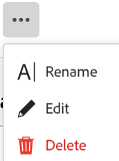

# Ta bort poster

<!--take Preview and Production references out at release-->

<!--The highlighted information on this page refers to functionality not yet generally available. It is available only in the Preview environment for all customers. After the monthly releases to Production, the same features are also available in the Production environment for customers who enabled fast releases.    

For information about fast releases, see [Enable or disable fast releases for your organization](/help/quicksilver/administration-and-setup/set-up-workfront/configure-system-defaults/enable-fast-release-process.md). -->

{{planning-important-intro}}

Du kan ta bort poster som inte längre är relevanta i Adobe Workfront Planning. Du kan återställa borttagna poster i 30 dagar efter att de tagits bort. Mer information om hur du återställer borttagna poster finns i [Återställa borttagna poster](/help/quicksilver/planning/records/restore-deleted-records.md).

## Åtkomstkrav

+++ Expandera om du vill visa åtkomstkraven för Workfront Planning.

Du måste ha följande åtkomst för att kunna utföra stegen i den här artikeln:

<table style="table-layout:auto"> 
<col> 
</col> 
<col> 
</col> 
<tbody> 
    <tr> 
<tr> 
<td> 
   
 Produkter
 </td> 
   <td> 
   <ul><li>
 Adobe Workfront
</li> 
   <li>
 Adobe Workfront Planning
</li></ul></td> 
  </tr>   
<tr> 
   <td role="rowheader">
Adobe Workfront-plan*
</td> 
   <td> 

Något av följande Workfront-planer:
 
<ul><li>Välj</li> 
<li>Prime</li> 
<li>Ultimate</li></ul> 

Workfront Planning är inte tillgängligt för tidigare Workfront-planer
 
   </td> 
<tr> 
   <td role="rowheader">
Adobe Workfront Planning-paket*
</td> 
   <td> 

Alla 
 

Kontakta din kontoansvarige på Workfront om du vill ha mer information om vad som ingår i respektive Workfront Planning-plan. 
 
   </td> 
 <tr> 
   <td role="rowheader">
Adobe Workfront
</td> 
   <td> 

Din organisations instans av Workfront måste integreras med Adobe Unified Experience för att få tillgång till alla funktioner i Workfront Planning.
 

Mer information finns i <a href="/help/quicksilver/workfront-basics/navigate-workfront/workfront-navigation/adobe-unified-experience.md">Adobe Unified Experience for Workfront</a>. 
 
   </td> 
   </tr> 
  </tr> 
  <tr> 
   <td role="rowheader">
Adobe Workfront-licens*
</td> 
   <td>
 Standard

   
Workfront Planning är inte tillgängligt för tidigare Workfront-licenser
 
  </td> 
  </tr> 
  <tr> 
   <td role="rowheader">
Åtkomstnivåkonfiguration
</td> 
   <td> 
Det finns inga åtkomstnivåkontroller för Adobe Workfront Planning
   
</td> 
  </tr> 
<tr> 
   <td role="rowheader">
Objektbehörigheter
</td> 
   <td>   
Contribute eller högre behörighet till en arbetsyta </a> 
  
   
Systemadministratörer har behörighet till alla arbetsytor, inklusive de som de inte skapade
 </td> 
  </tr> 
<tr> 
   <td role="rowheader">
Layoutmall
</td> 
   <td> 
Alla användare, inklusive Workfront-administratörer, måste tilldelas en layoutmall som innehåller planeringsområdet på huvudmenyn. 
 </td> 
  </tr> 
</tbody> 
</table>

*Mer information om Workfront åtkomstkrav finns i [Åtkomstkrav i Workfront-dokumentation](/help/quicksilver/administration-and-setup/add-users/access-levels-and-object-permissions/access-level-requirements-in-documentation.md).

+++

## Att tänka på när du tar bort poster

* Du kan ta bort poster som du eller någon annan användare har skapat.
* Du kan inte återställa borttagna poster i produktionsmiljön. Du kan återställa borttagna poster i förhandsgranskningsmiljön.
* Om de borttagna posterna är länkade till andra poster tas de länkade posterna inte bort, men informationen från den borttagna posten tas också bort.
* Du kan inte ta bort poster från tidslinjen eller kalendervyer.

## Ta bort poster

Du kan ta bort en post från följande områden:

* [Från postens sida](#delete-a-record-from-the-records-page)
* [Från tabellvyn för en posttyp](#delete-a-record-from-the-record-type-table-view)

### Ta bort en post från postens sida

{{step1-to-planning}}

1. Klicka på arbetsytan vars poster du vill ta bort.

   Arbetsytan öppnas och posttyperna visas som kort.

1. Klicka på ett posttypskort.

   Posttypssidan öppnas.
1. Gör något av följande:

   * Klicka på en posts namn i en tabellvy.
   * Håll markören över namnet på en post i tabellvyn, klicka på menyn **Mer**  och sedan på **Visa**

     
   * Klicka på ett postfält i en tidslinjevy.

   Postsidan öppnas.

1. Klicka på menyn **Mer**  till höger om postnamnet, klicka sedan på **Ta bort** och sedan på **Ta bort** igen för att bekräfta.

    <!--ensure the options have not changed or been renamed-->
Posten tas bort.
1. (Valfritt och villkorligt) Om du tar bort posten i förhandsvisningsmiljön går du till postsidans tabellvy och klickar på ikonen **Ångra**  i vyns övre högra hörn. Klicka sedan på **Senast borttagen** för att återställa de borttagna posterna.

Mer information om hur du återställer borttagna poster finns i [Återställa borttagna poster](/help/quicksilver/planning/records/restore-deleted-records.md).

### Ta bort en post från posttyptabellvyn

{{step1-to-planning}}

1. Klicka på arbetsytan vars poster du vill ta bort.

   Arbetsytan öppnas och posttyperna visas som kort.

1. Klicka på ett posttypskort.

   Posttypssidan öppnas.
1. (Villkorligt) Välj en tabellvy på den nedrullningsbara menyn **Visa** i tabellens övre vänstra hörn. Detta bör vara standardvyn, såvida du inte har visat posttypen i tidslinjevyn när du senast öppnade den.

   Posterna som är associerade med den valda posttypen visas i tabellvyn.
1. Gör något av följande:

   * Högerklicka på en postrad och klicka sedan på **Ta bort**.
   * Klicka på menyn **Mer**  till höger om postnamnet och klicka sedan på **Ta bort**.

     

   * Klicka på ikonen **Öppna detaljer**  för att öppna rutan med postens detaljerade information, och klicka på **Mer**  till höger om postnamnet och sedan på **Ta bort**.

   Posten tas bort.

1. (Valfritt) Gör något av följande om du vill ångra eller göra om borttagning av en post:

   * Klicka på ikonen **Ångra**  och sedan på **Senast borttagen** för att återställa de borttagna posterna. Mer information om hur du återställer borttagna poster finns i [Återställa borttagna poster](/help/quicksilver/planning/records/restore-deleted-records.md).
   * Använd följande kortkommandon för att ångra eller göra om borttagning av en post:

      * CTRL + Z ( ⌘ + Z för Mac) för att ångra borttagning av en post
      * CTRL + Skift + Z ( ⌘ + Skift + Z för Mac) för att göra om radering av post

