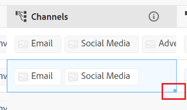
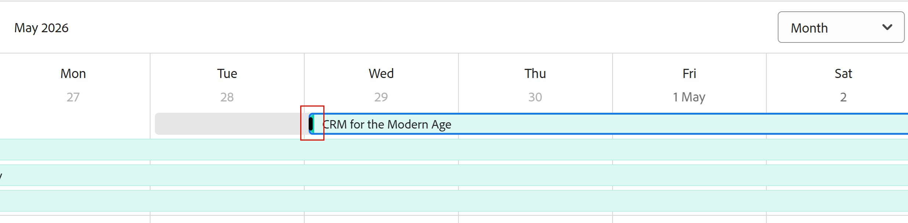

# Redigera poster

<!--The highlighted information on this page refers to functionality not yet generally available. It is available only in the Preview environment for all customers. After the monthly releases to Production, the same features are also available in the Production environment for customers who enabled fast releases.    

For information about fast releases, see [Enable or disable fast releases for your organization](/help/quicksilver/administration-and-setup/set-up-workfront/configure-system-defaults/enable-fast-release-process.md). -->

{{planning-important-intro}}

Du kan redigera postinformation i Adobe Workfront Planning genom att redigera värdena i fälten som är kopplade till posterna.

Du måste skapa posttyper innan du kan börja skapa och redigera poster.

Mer information finns i [Skapa posttyper](/help/quicksilver/planning/architecture/create-record-types.md).

Mer information om hur du skapar poster finns i [Skapa poster](/help/quicksilver/planning/records/create-records.md).

&lt;!— här anger du att fälten i detaljvyn är desamma som fälten i tabellvyn - den här artikeln är länkad från vyerna Hantera post för att referera till den här informationen—>

## Åtkomstkrav

+++ Expandera om du vill visa åtkomstkraven för funktionerna i den här artikeln. 

<table style="table-layout:auto"> 
<col> 
</col> 
<col> 
</col> 
<tbody> 
    <tr> 
<tr> 
</tr>   
<tr> 
   <td role="rowheader">
Adobe Workfront package
</td> 
   <td> 

Alla Workfront- och Planning-paket
 
Alla arbetsflöden och alla planeringsdokument

Mer information om vad som ingår i respektive Workfront Planning-paket får du av Workfront. 
 
   </td> 
  <tr> 
   <td role="rowheader">
Adobe Workfront-licens
</td> 
   <td>
Standard

   </td> 
  </tr> 
  <tr> 
   <td role="rowheader">
Objektbehörigheter
</td> 
   <td>   
Contribute eller högre behörighet för en arbetsyta och en posttyp  
  
   
Systemadministratörer har behörighet till alla arbetsytor, inklusive de som de inte skapade
 </td> 
  </tr>   
</tbody> 
</table>

Mer information om Workfront åtkomstkrav finns i [Åtkomstkrav i Workfront-dokumentationen](/help/quicksilver/administration-and-setup/add-users/access-levels-and-object-permissions/access-level-requirements-in-documentation.md).

+++   

<!--Old:
<table style="table-layout:auto"> 
<col> 
</col> 
<col> 
</col> 
<tbody> 
    <tr> 
<tr> 
<td> 
   
 Products
 </td> 
   <td> 
   <ul><li>
 Adobe Workfront
</li> 
   <li>
 Adobe Workfront Planning
</li></ul></td> 
  </tr>   
<tr> 
   <td role="rowheader">
Adobe Workfront plan*
</td> 
   <td> 

Any of the following Workfront plans:
 
<ul><li>Select</li> 
<li>Prime</li> 
<li>Ultimate</li></ul> 

Workfront Planning is not available for legacy Workfront plans
 
   </td> 
<tr> 
   <td role="rowheader">
Adobe Workfront Planning package*
</td> 
   <td> 

Any 
 

For more information about what is included in each Workfront Planning plan, contact your Workfront account manager. 
 
   </td> 
 <tr> 
   <td role="rowheader">
Adobe Workfront platform
</td> 
   <td> 

Your organization's instance of Workfront must be onboarded to the Adobe Unified Experience to be able to access Workfront Planning.
 

For more information, see <a href="/help/quicksilver/workfront-basics/navigate-workfront/workfront-navigation/adobe-unified-experience.md">Adobe Unified Experience for Workfront</a>. 
 
   </td> 
   </tr> 
  </tr> 
  <tr> 
   <td role="rowheader">
Adobe Workfront license*
</td> 
   <td> 
Standard
 
   
Workfront Planning is not available for legacy Workfront licenses
 
  </td> 
  </tr> 
  <tr> 
   <td role="rowheader">
Access level configuration
</td> 
   <td> 
There are no access level controls for Adobe Workfront Planning
   
</td> 
  </tr> 
<tr> 
   <td role="rowheader">
Object permissions
</td> 
   <td>  
Contribute or higher permissions to a workspace and record type </a> 
  
   
System Administrators have permissions to all workspaces, including the ones they did not create
  </td> 
  </tr> -->

## Att tänka på när du redigerar poster

* Du kan redigera poster som du har skapat eller poster som har skapats av andra, om du har fått behörighet till arbetsytan.
* Du kan redigera postfält från följande områden:

   * Postens förhandsgranskning i en postvy
   * Postens informationssida
   * Textbunden i en tabellvy.
   * Kalender- och tidslinjevyn när du ändrar storlek på eller drar och släpper posterna. Detta uppdaterar posternas datum.

* När en användare redigerar en post i en vy visas ändringarna omedelbart i alla vyer och postsidorna för alla andra användare.

* Följande typer av fält uppdateras automatiskt och du kan inte redigera deras värden manuellt:
   * Länkade fält från andra poster
   * Formelfält
   * Systemfält (Skapat av, Skapat den, Senast ändrat av, Senast ändrat den, Godkänt den, Godkänd av)
* Om de poster som du visar är länkade till andra poster, återspeglas den nya informationen om de poster som du redigerar på de länkade posterna på alla arbetsytor där posten är länkad.
* Du kan inte redigera flera poster samtidigt. <!--this will probably change-->
* URL-adresser känns bara igen som länkar i enradiga textfält när de börjar med följande: http://, https://, ftp:// eller www. .
* Du kan lägga till en omslagsbild till varje post. Bilden är unik för varje post och gäller inte för alla poster samtidigt. Mer information finns i [Lägga till en omslagsbild till en post](/help/quicksilver/planning/records/add-a-cover-image-to-a-record.md).
* Du kan redigera fältordningen på en posts informationssida. Mer information finns i [Hantera postsidans layout](/help/quicksilver/planning/records/manage-the-record-page.md).
* Du kan redigera postens Start- och slutdatum genom att ändra storlek på eller flytta posterna i tidslinjen och kalendervyn.

  Du kan inte ändra storlek på eller flytta poster när start- och slutdatumet som du valde för posten är skrivskyddade. Du kan till exempel inte ändra storlek på eller flytta posten i en tidslinje och kalendervy när du använder uppslags- eller formelfält för start- och slutdatumet för en post. <!--this also repeats below, for the timeline and the calendar views; also update there, if this changes-->

  Om du vill redigera posternas datum kan du läsa något av följande avsnitt i den här artikeln:

   * [Redigera en post i kalendervyn för en posttyp](#edit-a-record-in-the-calendar-view-of-a-record-type)
   * [Redigera en post i tidslinjevyn för en posttyp](#edit-a-record-in-the-timeline-view-of-a-record-type)

## Redigera poster

Du kan redigera en post i följande områden:

* [Tabellvyn](#edit-a-record-inline-in-the-table-view-of-a-record-type)
* [Tidslinjevyn](#edit-a-record-in-the-timeline-view-of-a-record-type)
* [Kalendervyn](#edit-a-record-in-the-calendar-view-of-a-record-type)
* [Postens förhandsgranskning i en vy](#edit-a-record-from-the-records-preview-in-a-view)
* [Postens sida](#edit-a-record-from-the-records-page)
* [Ett Workfront-objekt i Planning-avsnittet](#edit-a-record-from-a-workfront-object-in-the-planning-section)

### Redigera en post textbundet i tabellvyn för en posttyp

När du redigerar poster från tabellvyn visas en indikation på vilket fält som redigeras av andra användare när du visar posten.

Mer information finns i [Hantera postvyer](/help/quicksilver/planning/views/manage-record-views.md).

När du lägger till en ny post efter den sista posten i en gruppering eller delgruppering, uppdaterar Workfront automatiskt de fält som ingår i grupperingarna för de nya posterna. Du kan redigera dessa fält manuellt om det behövs och posterna kan tas bort från grupperingen.

Mer information finns i [Skapa poster](/help/quicksilver/planning/records/create-records.md).

{{step1-to-planning}}

1. Klicka på arbetsytan vars poster du vill redigera

   Arbetsytan öppnas och posttyperna visas som kort.
1. Klicka på ett posttypskort.

   Posttypssidan öppnas.
1. (Villkorligt) Klicka på fliken i en tabellvy eller klicka på **+-vy** för att skapa en tabellvy. Tabellvyn ska vara standardvy, såvida du inte har visat posttypen i en annan typ av vy när du senast öppnade den.

   Posterna som är associerade med den valda posttypen visas i tabellvyn.
1. Klicka inuti en post för att börja redigera information om den infogade posten.

   

   >[!TIP]
   >
   >  Du kan inte redigera information för följande fält eftersom de är skrivskyddade och Workfront uppdaterar dem automatiskt:
   >  
   >  * Länkade fält som skapas genom att koppla posttyper. Mer information finns i [Koppla posttyper](/help/quicksilver/planning/architecture/connect-record-types.md).
   >  * Fält av följande typer: Skapat av, Skapat den, Senast ändrat av, Senast ändrat den, Formelfält.

1. (Valfritt och villkorligt) Använd följande formateringsalternativ för **RTF** när du redigerar ett stycketextfält:

   * Fet
   * Kursiv
   * Understruken
   * Lägg till en länk
   * Lägga till en punktlista
   * Lägga till en numrerad lista

   

1. (Valfritt) Dubbelklicka på ett kopplat postfält för att lägga till kopplade poster eller objekt till en annan post. Mer information finns i [Anslut poster](/help/quicksilver/planning/records/connect-records.md).
1. Tryck på **Enter** på tangentbordet eller klicka utanför en rad för att spara ändringarna. Ändringarna sparas automatiskt. En **sparad**-indikator visas kort i tabellvyns övre högra hörn för att visa att ändringarna sparades.

1. (Valfritt) Om du vill kopiera och klistra in information från ett fält till ett annat gör du något av följande:

   * Kopiera ett eller flera befintliga värden för ett fält och klistra sedan in dem i ett fält av samma typ på en annan post
   * Klicka på kolumnrubriken för en kolumn för att markera den och kopiera den, klicka sedan på kolumnrubriken för en annan kolumn och klistra in innehållet i den kopierade kolumnen. Kolumnerna måste innehålla liknande fälttyper.
   * Med Skift-tangenten nedtryckt klickar du för att markera flera rader i en tabell, kopierar informationen i de markerade raderna, klickar på en annan rad och klistrar in den markerade informationen på den nya raden och efterföljande rader.
   * Kopiera informationen från en cell, markera flera celler och klistra in samma information i flera celler. Du kan markera flera celler och klistra in samma information i flera celler från närliggande rader och kolumner.
   * Markera det nedre högra hörnet i en befintlig cell som innehåller den information som du vill kopiera och dra och släpp den sedan över de angränsande cellerna där du vill klistra in samma information. Alla celler måste innehålla samma typ av information.

     

   * Kopiera en eller flera celler från en extern källa (till exempel en Excel-fil) och klistra sedan in dem i någon av följande fälttyper:

      * Workfront Planning-anslutningsfält.
      * Personfält. Endast fält med ett värde stöds.

     Du kan inte kopiera information från en extern källa och klistra in den i andra fälttyper, inklusive Workfront eller andra programs anslutningsfält.

   >[!NOTE]
   >
   >Tänk på följande:
   >
   >* Använd följande kortkommandon för att kopiera och klistra in information:
   >   * Copy: CTRL + C (⌘ + C för Mac)
   >   * Klistra in: CTRL + V (⌘ + V för Mac)
   >
   >* Du kan inte kopiera och klistra in fältvärden på postsidan. Den här funktionen stöds bara i tabellvyn för en posttyp.
   >* Du kan inte kopiera och klistra in fältvärden för följande fälttyper:
   >
   >    * Uppslagsfält som skapas när posttyper ansluts. Du kan kopiera och klistra in länkade postfält. Mer information finns i [Koppla posttyper](/help/quicksilver/planning/architecture/connect-record-types.md).
   >    * Fält av följande typer: Skapad av, Skapad, Senast ändrad av, Senast ändrad

1. (Valfritt) Använd följande kortkommandon för att ångra eller göra om redigering eller kopiering och inklistring av postinformation:

   * CTRL + Z (⌘ + Z för Mac) för att ångra en ändring
   * CTRL + Skift + Z (⌘ + Skift + Z för Mac) för att göra om en ändring

   >[!TIP]
   >
   >    Du kan använda kortkommandona flera gånger i rad för att ångra flera ändringar.

1. (Valfritt) Lägg till en miniatyrbild till en post. Mer information finns i [Lägga till en miniatyrbild i en post](/help/quicksilver/planning/records/add-thumbnails-to-records.md).

### Redigera en post i tidslinjevyn för en posttyp

<!--add another step about drag and drop here when that is available-->

1. Öppna posttypssidan i en tidslinjevy. Mer information finns i [Hantera tidslinjevyn](/help/quicksilver/planning/views/manage-the-timeline-view.md).

1. Håll muspekaren över ändarna av en posts fält, klicka, dra och släpp marginalen till ett annat datum. Detta uppdaterar automatiskt postens start- eller slutdatum.

   

1. Klicka och håll ned ett postfält och dra och släpp det på en annan plats för att uppdatera dess tidslinje och datum. Start- och slutdatum för posten uppdateras automatiskt.

   >[!IMPORTANT]
   >
   >Du kan inte dra och släppa ändarna av ett postfält eller dra och släppa posten till ett annat datum när start- och slutdatumet som du valde för posten är skrivskyddade. Du kan till exempel inte ändra storlek på eller flytta posten i en tidslinjevy när du använder uppslags- eller formelfält för start- och slutdatumet för en post. <!--this also repeats in Considerations and in editing in the calendar view; also update there, if this changes-->

1. Klicka på fältet för en post för att öppna dess informationsområde och redigera alla fält.

   Mer information finns i avsnittet [Redigera en post från postens förhandsgranskning i vyn ](#edit-a-record-from-the-records-preview-in-a-view) i den här artikeln.

### Redigera en post i kalendervyn för en posttyp

1. Öppna posttypssidan i en kalendervy. Mer information finns i [Hantera kalendervyn](/help/quicksilver/planning/views/manage-the-calendar-view.md).
1. (Villkorligt) Håll markören över ändarna på en posts fält i kalendervyn och klicka sedan på, dra och släpp marginalerna till ett annat datum. Detta uppdaterar automatiskt postens start- eller slutdatum.

   

1. Klicka och håll ned ett postfält och dra och släpp det på en annan plats för att uppdatera dess tidslinje och datum. Start- och slutdatum för posten uppdateras automatiskt.

   >[!IMPORTANT]
   >
   >Du kan inte dra och släppa ändarna av ett postfält eller dra och släppa posten till ett annat datum när start- och slutdatumet som du valde för posten är skrivskyddade. Du kan till exempel inte ändra storlek på eller flytta posten i en kalendervy när du använder uppslags- eller formelfält för start- och slutdatumet för en post. <!--this also repeats in Considerations and in editing in the timeline view; also update there, if this changes-->

1. Klicka på fältet för en post för att öppna dess informationsområde och redigera alla fält.

   Mer information finns i avsnittet [Redigera en post från postens förhandsgranskning i vyn ](#edit-a-record-from-the-records-preview-in-a-view) i den här artikeln.

### Redigera en post från postens förhandsgranskning i en vy

{{step1-to-planning}}

1. Klicka på arbetsytan vars poster du vill redigera

   Arbetsytan öppnas och posttyperna visas som kort.

1. Klicka på ett posttypskort.

   Posttypssidan öppnas.

1. Klicka på posten i en vy av valfri typ

   eller

   I tabellvyn klickar du på ikonen **Öppna detaljer**  i den första kolumnen. Postens förhandsgranskning öppnas i vyn.

   

1. (Valfritt) Klicka på menyn **Mer** till höger om postens titel och klicka sedan på **Byt namn**. Detta uppdaterar fältet som visas som postens titel.

   Postens rubrik är det primära fältet i posten när den visas i en tabellvy. Mer information finns i [Översikt över primärt fält](/help/quicksilver/planning/fields/primary-field-overview.md).

1. Börja redigera fältinformationen i postens förhandsgranskning.

   >[!TIP]
   >
   >  Du kan inte redigera information för följande fält eftersom de är skrivskyddade och Workfront uppdaterar dem automatiskt:
   >  
   >  * Sök efter fält från andra poster som har skapats genom att koppla posttyper. Mer information finns i [Koppla posttyper](/help/quicksilver/planning/architecture/connect-record-types.md).
   >  * Fält av följande typer: Skapat av, Skapat den, Senast ändrat av, Senast ändrat den, Formelfält.

1. (Valfritt) Klicka på **Lägg till omslag** om du vill lägga till en omslagsbild i posten. Mer information finns i [Lägga till en omslagsbild till en post](/help/quicksilver/planning/records/add-a-cover-image-to-a-record.md).

1. (Valfritt) Håll pekaren över miniatyrbildikonen och klicka sedan på **Mer**  > **Redigera miniatyrbild** för att lägga till en miniatyrbild. Mer information finns i [Lägga till en miniatyrbild i en post](/help/quicksilver/planning/records/add-thumbnails-to-records.md).

   Workfront sparar automatiskt ändringarna.

1. (Valfritt) Klicka på **realtidsindikatorn**  i det övre högra hörnet av postens förhandsvisningsruta och aktivera sedan inställningen **Visa medarbetare** för att markera de fält som redigeras av andra i realtid.

   I det här området visas namnen på och avatarerna för alla användare som använder posten samtidigt.

   När inställningen är inaktiverad visas avatarerna och namnen i realtidsindikatorområdet, och fälten som redigeras markeras inte.

   

1. (Valfritt) Klicka på **Exportera**-menyn  om du vill exportera postens information. Mer information finns i [Exportera information för en post](/help/quicksilver/planning/records/export-the-record-page.md).

1. (Valfritt) Klicka på ikonen **Öppna på ny flik**  <!--check the icon; they are changing it--> i det övre högra hörnet av postens förhandsgranskning för att öppna postens sida på en ny flik. Fortsätt redigera posten enligt beskrivningen i [Redigera en post från postens sidavsnitt](#edit-a-record-from-the-records-page) i den här artikeln.

### Redigera en post från postens sida

{{step1-to-planning}}

1. Klicka på arbetsytan vars poster du vill redigera

   Arbetsytan öppnas och posttyperna visas som kort.

1. Klicka på ett posttypskort.

   Posttypssidan öppnas.

1. Gör något av följande:

   * Från vilken vy som helst öppnar du postens förhandsgranskning enligt beskrivningen i [Redigera en post från postens förhandsgranskning i en vy](#edit-a-record-from-the-records-preview-in-a-view) i den här artikeln och klickar sedan på ikonen **Öppna i ny flik**  <!--check the icon; they are changing it--> i det övre högra hörnet av postens förhandsgranskning för att öppna postens sida på en ny flik.

   * I vyn **Tabell** för du muspekaren över namnet på en post, klickar på menyn **Mer**  och sedan på **Visa**

     

     Postsidan öppnas.

     

1. (Valfritt) Klicka på menyn **Mer** till höger om postens titel och klicka sedan på **Byt namn**. Detta uppdaterar fältet som visas som postens titel.

   Postens rubrik är det primära fältet i posten när den visas i en tabellvy. Mer information finns i [Hantera tabellvyn](/help/quicksilver/planning/views/manage-the-table-view.md).

1. Klicka på ett redigerbart fält på postsidan för att redigera det.

   >[!TIP]
   >
   >  Du kan inte redigera information för följande fält eftersom de är skrivskyddade och Workfront uppdaterar dem automatiskt:
   >  
   >  * Länkade fält som skapas genom att koppla posttyper. Mer information finns i [Koppla posttyper](/help/quicksilver/planning/architecture/connect-record-types.md).
   >  * Fält av följande typer: Skapat av, Skapat den, Senast ändrat av, Senast ändrat den, Formelfält.

1. (Valfritt) Klicka på informationsikonen till höger om ett fält som visar den för att visa beskrivningen av ett fält.
1. (Valfritt) Klicka på **Lägg till omslag** om du vill lägga till en omslagsbild i posten

   eller

   Håll pekaren över den befintliga omslagsbilden och klicka sedan på menyn **Mer**  > **Överför** för att lägga till en ny omslagsbild för posten.

   Mer information finns i [Lägga till en omslagsbild till en post](/help/quicksilver/planning/records/add-a-cover-image-to-a-record.md).

1. (Valfritt) Hovra över en befintlig miniatyrbild eller ikonen **miniatyrbild**  och klicka sedan på menyn **Mer**  > **Redigera miniatyrbild** för att lägga till en miniatyrbild för posten.

   Mer information finns i [Lägga till en miniatyrbild i en post](/help/quicksilver/planning/records/add-thumbnails-to-records.md).

   Workfront sparar automatiskt ändringarna.

1. (Valfritt) Klicka på **realtidsindikatorn**  i det övre högra hörnet av postens sida och aktivera sedan inställningen **Visa medarbetare** för att markera de fält som redigeras av andra i realtid.

   I det här området visas namnen på och avatarerna för alla användare som använder posten samtidigt.

   När inställningen är inaktiverad visas avatarerna och namnen i realtidsindikatorområdet, och fälten som redigeras markeras inte.

   

1. (Valfritt) Klicka på **Exportera**-menyn  om du vill exportera postens information. Mer information finns i [Exportera information för en post](/help/quicksilver/planning/records/export-the-record-page.md).

## Redigera en post från ett Workfront-objekt i planeringsavsnittet

När du har kopplat poster till Workfront-objekt kan du redigera Workfront Planning-poster i Workfront från objektets Planning-avsnitt.

Mer information finns i [Hantera postanslutningar från Workfront-objekt](/help/quicksilver/planning/records/manage-records-in-planning-section.md).

## Redigera envals- eller flervalsfältsinställningar när deras värden uppdateras

<!--some of this information is also available in Edit fields article - update both when necessary-->

När du uppdaterar information i ett envalsfält eller flervalsfält kan du lägga till nya alternativ i fältet, utan att behöva redigera fältet.

>[!IMPORTANT]
>
>De funktioner som beskrivs i det här avsnittet är bara tillgängliga i tabellvyn. Den är inte tillgänglig i andra områden där ett eller flera fält visas.

**EXEMPEL**

Du kan ha ett envalsfält med namnet Status som har alternativen Nytt och Stängt, och du vill lägga till ett alternativ för statusen Pågående. Du kan lägga till valet genom att göra något av följande:

* Redigerar fältet. Mer information finns i [Redigera fält](/help/quicksilver/planning/fields/edit-fields.md)
* Lägga till ett nytt alternativ när du redigerar posten i tabellvyn, enligt beskrivningen nedan.

Så här lägger du till ett nytt val i ett befintligt markeringsfält när du redigerar en post:

1. Gå till en posttypssida och öppna tabellvyn.
1. Lägg till det envalsfält eller flervalsfält som du vill lägga till som en ny kolumn i tabellvyn. Mer information finns i [Skapa fält](/help/quicksilver/planning/fields/create-fields.md).
1. Börja redigera fältet textbundet genom att dubbelklicka på cellen för fältet.
1. Skriv namnet på det alternativ som du vill lägga till och klicka sedan på **Lägg till alternativ**.

   

   Det nya alternativet läggs omedelbart till i fältet för en markering.

   Ett nytt urvalsvärde läggs också till för varje val. Du kan använda valvärden i API-anrop eller andra integreringar. Mer information finns i [Skapa fält](/help/quicksilver/planning/fields/create-fields.md).

