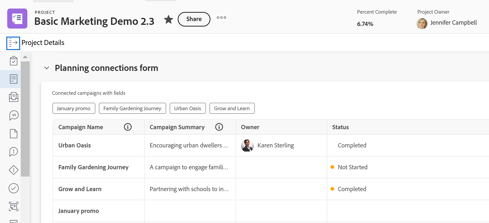

<!--add also Group and Company when they are available-->

# Hantera postanslutningar från Workfront-objekt

Den markerade informationen på den här sidan hänvisar till funktioner som ännu inte är allmänt tillgängliga. Det är bara tillgängligt i förhandsvisningsmiljön för alla kunder. Efter de månatliga releaserna i Production finns samma funktioner även i produktionsmiljön för kunder som aktiverat snabba releaser. 

Mer information om snabba releaser finns i [Aktivera eller inaktivera snabba releaser för din organisation](/help/quicksilver/administration-and-setup/set-up-workfront/configure-system-defaults/enable-fast-release-process.md).

{{planning-important-intro}}

Du kan visa Workfront Planning-poster i Workfront i följande områden av objekten som är kopplade till dem:

* Avsnittet Planning för ett Workfront-objekt: Visar alla posttyper som är kopplade till ett objekt och deras respektive anslutna poster.
* Ett anpassat fält för planeringsanslutning: Visar en posttyp, dess respektive anslutna poster,  och upp till 7 sökfält för de anslutna posterna.

## Åtkomstkrav

+++ Expandera för att visa åtkomstkrav..

Du måste ha följande åtkomst för att kunna utföra stegen i den här artikeln:

<table style="table-layout:auto">
 <col>
 </col>
 <col>
 </col>
 <tbody>
    <tr>
<tr>
<td>
   
 Produkter
 </td>
   <td>
   <ul><li>
 Adobe Workfront
</li>
   <li>
 Adobe Workfront Planning
</li></ul></td>
  </tr>  
 <tr>
   <td role="rowheader">
Adobe Workfront-plan*
</td>
   <td>

Något av följande Workfront-planer:

<ul><li>Välj</li>
<li>Prime</li>
<li>Ultimate</li></ul>

Workfront Planning är inte tillgängligt för tidigare Workfront-planer

   </td>

<tr>
   <td role="rowheader">
Adobe Workfront Planning-paket*
</td>
   <td>

Alla

Kontakta din kontoansvarige på Workfront om du vill ha mer information om vad som ingår i respektive Workfront Planning-plan. 

   </td>

<tr>
   <td role="rowheader">
Adobe Workfront
</td>
   <td>

Din organisations instans av Workfront måste integreras med Adobe Unified Experience för att få tillgång till alla funktioner i Workfront Planning.

Mer information finns i <a href="/help/quicksilver/workfront-basics/navigate-workfront/workfront-navigation/adobe-unified-experience.md">Adobe Unified Experience for Workfront</a>. 

   </td>

</tr>
  </tr>
  <tr>
   <td role="rowheader">
Adobe Workfront-licens*
</td>
   <td>
   
Standard

   
Workfront Planning är inte tillgängligt för tidigare Workfront-licenser

  </td>
  </tr>
  <tr>
   <td role="rowheader">
Åtkomstnivåkonfiguration
</td>
   <td> 
Visa eller öka åtkomsten till projekt, program och portföljer
  
   
Det finns ingen åtkomstnivåkonfiguration för Workfront Planning. 

</td>
  </tr>
<tr>
   <td role="rowheader">
Objektbehörigheter
</td>
   <td>
   
I Workfront: Visa eller högre behörigheter för ett projekt, en portfölj eller ett program </a> 
 
   
I Workfront Planning:
   <ul><li>
   Visa behörigheter till en arbetsyta <!--and record type--> för att visa alla anslutna poster </li>
   eller
   <li> Contribute eller högre behörighet till en arbetsyta <!--and record type--> för att ansluta till eller koppla från poster</a></li></ul> 
  
   
Systemadministratörer har behörighet till alla Workfront Planning-arbetsytor, inklusive de som de inte skapade
 
  </td>
  </tr>
<tr>
   <td role="rowheader">
Layoutmall
</td>
   <td> 
Om du vill visa Planning-området eller Planning-avsnittet för ett Workfront-objekt måste alla användare, inklusive Workfront-administratörer, tilldelas en layoutmall som innehåller Planning-området på Main Menu (Huvudmeny) och Planning-området för projekt, portföljer och program. 
 Mer information finns i <a href="/help/quicksilver/planning/access/access-overview.md">Åtkomstöversikt för Adobe Planning</a>. 
  
  
</td>
  </tr>
 </tbody>
</table>

*Mer information om Workfront åtkomstkrav finns i [Åtkomstkrav i Workfront-dokumentation](/help/quicksilver/administration-and-setup/add-users/access-levels-and-object-permissions/access-level-requirements-in-documentation.md).

+++

## Hantera poster i planeringsavsnittet

Du kan använda Planning-avsnittet för ett Workfront-objekt för att visa alla posttyper och deras respektive poster som är kopplade till Workfront-objektet.
Planeringsavsnittet är tillgängligt för följande Workfront-objekt:

* Projekt
* Portfolio
* Program
<!--* Group
* Company-->

### Att tänka på när det gäller planeringsavsnittet för Workfront-objekt

Tänk på följande när du visar Workfront Planning-poster från Planning-delen av ett Workfront-objekt:

* Workfront Planning-posttyper måste först anslutas till Workfront-objekttyper.

  Mer information finns i följande artiklar:

   * [Koppla posttyper](/help/quicksilver/planning/architecture/connect-record-types.md)
   * [Koppla poster](/help/quicksilver/planning/records/connect-records.md)
* Du kan visa Planning-avsnittet från ett Workfront-objekt, även när det inte finns några poster kopplade till Workfront-objektet.

### Hantera postanslutningar från planeringsavsnittet

{{step1-to-planning}}

1. Klicka på kortet för en arbetsyta.

   Arbetsytan öppnas och posttyperna visas som kort.

1. Klicka på kortet för en posttyp som är kopplad till ett Workfront-projekt, en portfölj eller ett program.
1. Gå till ett anslutet postfält som har en anslutning till ett Workfront-objekt, antingen i tabellvyn eller från postens informationssida. Mer information finns i [Anslut poster](/help/quicksilver/planning/records/connect-records.md).
1. Klicka på namnet på ett Workfront-objekt i det anslutna postfältet.
Objektets sida öppnas i Workfront.

   >[!NOTE]
   >
   >  Om du känner till ett Workfront-objekt som redan är anslutet till en Planning-post kan du navigera till Planning-avsnittet från Workfront-objektet.

1. Klicka på **Planering** i den vänstra panelen.

   >[!NOTE]
   >
   >   Workfront- eller gruppadministratören måste lägga till planeringsavsnittet i layoutmallen innan den visas för ett Workfront-projekt, en portfölj eller ett program.

   Planeringsavsnittet visas med följande information:

   * De kopplade posterna visas på enskilda kort som innehåller följande information:
      * Postens namn
      * Postens miniatyrbild
      * Namnet på det anslutna postfältet så som det visas i Workfront Planning.
   * Poster visas under respektive arbetsyta och posttyp.

   

1. (Valfritt) Klicka på **Visa alla anslutningar** om du vill visa alla anslutna posttyper, inklusive de utan anslutna poster. Som standard visas inte posttyper utan kopplade poster.
1. Klicka på ett postkort om du vill visa mer information om posten. Postens förhandsvisningsruta visas.
1. (Valfritt) Börja ändra fält i postens förhandsvisningsruta. Ändringarna sparas automatiskt.
1. (Valfritt) Klicka på ikonen **Öppna på en ny flik**  i det övre högra hörnet av förhandsvisningsrutan för att öppna postens informationssida. Postens informationssida öppnas i Workfront Planning.
1. (Valfritt) Hovra över ett postkort, klicka på ikonen för att koppla från post **-** och klicka sedan på **Koppla från**.
Följande saker händer:
   * Posten är inte längre ansluten till Workfront-objektet.
   * Workfront-objektet tas också bort från postens anslutna fält från Workfront Planning.
   * Värdena för Workfront sökfält som är kopplade till Planning-posten tas också bort.
1. Klicka på **Anslut** för att ansluta fler poster för de anslutna posttyperna.

   Mer information finns i [Anslut poster](/help/quicksilver/planning/records/connect-records.md).
1. (Valfritt) Om du inte kan hitta någon post att ansluta och du vill lägga till den klickar du på **+ Lägg till** för att lägga till en ny post. Mer information finns i avsnittet Skapa poster när du ansluter dem från andra poster i artikeln [Skapa poster](/help/quicksilver/planning/records/create-records.md).

   Följande saker händer:

   * Posterna är omedelbart kopplade till Workfront-objektet och visas i planeringsavsnittet.
   * Workfront-objektet läggs till i Workfront Planning-postens anslutna fält.
   * Värdena för Workfront sökfält som är kopplade till Planning-posten fylls i i Workfront Planning.

## Hantera poster i fältet Planering-anslutning

Du kan använda ett anpassat fält för planeringsanslutning på ett Workfront-objekt för att visa en posttyp och dess respektive poster som är kopplade till Workfront-objektet.

Du kan styra vilka Planning-posttyper som ska visas för Workfront-objektet när du skapar anpassade fält för Planning-anslutningen.

* I fältet Planering-anslutning visas Planning-poster när en anslutning har upprättats och när fältet är kopplat till formulär för följande Workfront-objekt:

   * Projekt
   * Portfolio
   * Program
   * Grupp
   * Företag

Mer information finns i [Skapa ett formulär](/help/quicksilver/administration-and-setup/customize-workfront/create-manage-custom-forms/form-designer/design-a-form/design-a-form.md).

### Överväganden om typen av anslutningsfält för planering

Tänk på följande när du visar Workfront Planning-poster från ett Planning-anslutningsfält för ett Workfront-objekt:

* Ett Planning-anslutningsfält visas på följande sätt i ett Workfront-objekts anpassade formulär, efter det att Planning-poster har anslutits till Workfront-objektet:

   * Om endast det primära fältet för den anslutna posten är markerat visas anslutningsfältet Planering som ett fält med flera värden, om anslutningen tillåter att flera poster länkas. Mer information finns i [Översikt över posttyper för anslutning](/help/quicksilver/planning/architecture/connect-record-types-overview.md).
   * Om din Workfront- eller gruppadministratör har lagt till ytterligare sökfält från den anslutna posten i det anpassade formuläret visas fältet Planering-anslutning som en tabell. Upp till 7 fält kan väljas för anslutningsfältet Planning. Tabellvyn är skrivskyddad.  

* Du kan bara associera en posttyp med ett Planning-anslutningsfält. Det finns ingen gräns för hur många planeringsanslutningsfält du har i ett formulär.
* Du måste ha korrekt åtkomst och behörighet till objektet, posten och Workfront Planning för att kunna koppla ett anpassat formulär med ett anpassat fält för planeringsanslutning till ett Workfront-objekt.
* Du måste ha Contribute-behörighet för en arbetsyta i Workfront Planning för att kunna ansluta till eller koppla från poster från planeringsanslutningsfältet för ett Workfront-objekt.
* Workfront Planning-posttyper måste först anslutas till Workfront-objekttyper. Mer information finns i [Koppla samman posttyper](/help/quicksilver/planning/architecture/connect-record-types.md). Detta gör att Workfront Planning-posterna kan nås från Workfront.
* Du kan ansluta till eller koppla från poster från planeringsanslutningsfältet för ett Workfront-objekt endast för objekt som kan ha Workfront Planning-anslutningar.

  Du kan till exempel koppla ett anpassat formulär med ett Planning-anslutningsfält till aktiviteter, men du kan inte koppla Workfront Planning-objekt till aktiviteter.
* Du kan inte redigera ett planeringsanslutningsfält när du redigerar flera Workfront-objekt samtidigt.

### Hantera postanslutningar från anslutningstypen Planering

1. Gå till någon av följande objekttyper som har kopplats till en Workfront Planning-posttyp:

   * Projekt
   * Portfolio
   * Program
   * Företag
   * Grupp

1. Klicka på **&lt; Objekt > Detaljer** i den vänstra panelen.
1. (Villkorligt) Lägg till ett anpassat formulär med minst ett Planning-anslutningsfält för det markerade objektet, om det inte finns något.

   >[!NOTE]
   >
   >Workfront- eller gruppadministratören måste först skapa formuläret och lägga till ett planeringsanslutningsfält innan du kan lägga till det i ett objekt.

1. Klicka i fältet för att lägga till kopplade poster och klicka sedan på nedåtpilen i fältet för att välja poster från listan.

   

   >[!TIP]
   >
   >Du kan inte lägga till poster i planeringsanslutningsfält som är kopplade till andra Workfront-objekt än det objekt som du markerade när fältet konfigurerades.
   >
   >Du kan till exempel inte lägga till poster i ett planeringsanslutningsfält som skapats för en Portfolio-anslutning från ett anpassat projektformulär.
   >
   >Det finns en indikation på att objektet i fältet och det markerade objektet inte matchar.
   >
   >

1. Klicka utanför listan för att stänga den.

   Följande saker händer:

   * Posterna är omedelbart kopplade till Workfront-objektet och visas i anslutningsfältet Planning samt planeringsavsnittet för Workfront-objektet.
   * Workfront-objektet läggs till i Workfront Planning-postens anslutna fält.
   * Värdena för Workfront sökfält som är kopplade till Planning-posten fylls i i Workfront Planning.
   * Om din Workfront- eller gruppadministratör lade till postsökningsfält när de skapade det anpassade formuläret fylls postens sökfält i automatiskt i i en tabellvy. Tabellvyn i planeringsanslutningsfältet är skrivskyddad

     

1. (Valfritt) Klicka på namnet på en post  eller hovra över namnet på posten i tabellen och klicka sedan på ikonen **Öppna post**  i fältet Planning-anslutning för att öppna den i Workfront Planning.
Förhandsgranskningsrutan med information om Workfront Planning-posten öppnas.
1. Granska eller redigera information om posten eller klicka på ikonen **Öppna på en ny flik**  för att öppna sidan med postinformation.

1. (Valfritt) I det anpassade formuläret i Workfront klickar du på ikonen **Ta bort**  för en post för att ta bort den från anslutningsfältet för planering och koppla bort den från Workfront-objektet.
Workfront-objektet kopplas bort från Planning-posten och all sökinformation från Workfront tas bort från posten.

1. Klicka på **Spara ändringar** om du vill spara det anpassade formuläret och alla andra ändringar du har gjort i Workfront-objektet.