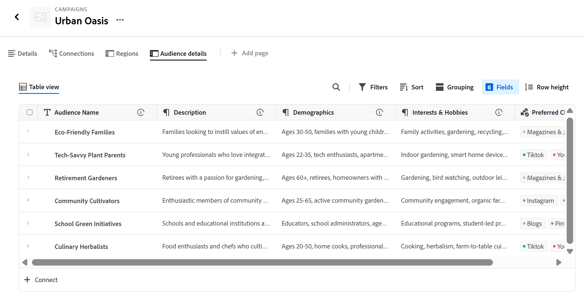

# Hantera postsidans layout

Informationen som är markerad på den här sidan avser funktioner som ännu inte är allmänt tillgängliga. Det är bara tillgängligt i förhandsvisningsmiljön för alla kunder. Efter de månatliga releaserna i Production finns samma funktioner även i produktionsmiljön för kunder som aktiverat snabba releaser. 

Mer information om snabba releaser finns i [Aktivera eller inaktivera snabba releaser för din organisation](/help/quicksilver/administration-and-setup/set-up-workfront/configure-system-defaults/enable-fast-release-process.md). 

{{planning-important-intro}}

Du kan redigera layouten för postförhandsgranskning och -sida i Adobe Workfront Planning.

Förhandsgranskningen av posten är en mindre vy av postsidan som visas i vyn av en posttyp.

När du ändrar layouten för en postförhandsgranskning och sida påverkar ändringarna förhandsvisningsrutorna och informationssidorna för alla poster av samma typ.

I den här artikeln beskrivs hur du kan ändra layouten och utseendet på en postförhandsvisningsruta eller en postsida. Mer information om hur du redigerar poster finns i [Redigera poster](/help/quicksilver/planning/records/edit-records.md).

Du måste skapa posttyper och poster innan du kan börja redigera postsidor.

Mer information finns i följande artiklar:

* [Skapa posttyper](/help/quicksilver/planning/architecture/create-record-types.md)

* [Skapa poster](/help/quicksilver/planning/records/create-records.md)

## Åtkomstkrav

+++ Expandera om du vill visa åtkomstkraven för funktionerna i den här artikeln. 

<table style="table-layout:auto"> 
<col> 
</col> 
<col> 
</col> 
<tbody> 
    <tr> 
<tr> 
</tr>   
<tr> 
   <td role="rowheader">
Adobe Workfront package
</td> 
   <td> 

Alla Workfront- och Planning-paket

Alla arbetsflöden och alla planeringsdokument

Mer information om vad som ingår i respektive Workfront Planning-paket får du av Workfront. 
 
   </td> 
  <tr> 
   <td role="rowheader">
Adobe Workfront-licens
</td> 
   <td>
Standard

   </td> 
  </tr> 
  <tr>
   <td role="rowheader">
Objektbehörigheter
</td>
   <td>
   
Contribute eller högre behörighet för en arbetsyta och en posttyp 
  
   
Systemadministratörer har behörighet till alla arbetsytor, inklusive de som de inte skapade
 
  </td>
  </tr>   
</tbody> 
</table>

Mer information om Workfront åtkomstkrav finns i [Åtkomstkrav i Workfront-dokumentationen](/help/quicksilver/administration-and-setup/add-users/access-levels-and-object-permissions/access-level-requirements-in-documentation.md).

+++   

<!--Old:
<table style="table-layout:auto">
 <col>
 </col>
 <col>
 </col>
 <tbody>
    <tr>
<tr>
<td>
   
 Products
 </td>
   <td>
   <ul><li>
 Adobe Workfront
</li>
   <li>
 Adobe Workfront Planning
</li></ul></td>
  </tr>  
 <tr>
   <td role="rowheader">
Adobe Workfront plan*
</td>
   <td>

Any of the following Workfront plans:

<ul><li>Select</li>
<li>Prime</li>
<li>Ultimate</li></ul>

Workfront Planning is not available for legacy Workfront plans

   </td>

<tr>
   <td role="rowheader">
Adobe Workfront Planning package*
</td>
   <td>

Any

For more information about what is included in each Workfront Planning plan, contact your Workfront account manager. 

   </td>

<tr>
   <td role="rowheader">
Adobe Workfront platform
</td>
   <td>

Your organization's instance of Workfront must be onboarded to the Adobe Unified Experience to be able to access Workfront Planning.

For more information, see <a href="/help/quicksilver/workfront-basics/navigate-workfront/workfront-navigation/adobe-unified-experience.md">Adobe Unified Experience for Workfront</a>. 

   </td>

  </tr>
  </tr>
  <tr>
   <td role="rowheader">
Adobe Workfront license*
</td>
   <td>
   
Standard

   
Workfront Planning is not available for legacy Workfront licenses

  </td>
  </tr>
  <tr>
   <td role="rowheader">
Access level configuration
</td>
   <td> 
There are no access level controls for Adobe Workfront Planning
  
</td>
  </tr>
<tr>
   <td role="rowheader">
Object permissions
</td>
   <td>
   
Contribute or higher permissions to a workspace and record type </a> 
  
   
System Administrators have permissions to all workspaces, including the ones they did not create
 
  </td>
  </tr>
 </tbody>
</table>-->

## Att tänka på när du arbetar med postsidor

* Som standard visar informationssidan för en post alla fält som är kopplade till posten.

* Du kan inte lägga till nya fält för en post på förhandsgransknings- eller informationssidan. Du måste lägga till nya fält i tabellvyn för att kunna visa dem på förhandsgransknings- och informationssidorna.

* Du kan lägga till avsnitt på en förhandsgransknings- eller informationssida för att ordna informationen utifrån vanliga kriterier och göra den lättare att hitta.

* Följande ändringar påverkar alla poster av samma typ och är synliga för alla användare som använder dessa poster:

   * Ordna om fält
   * Lägga till eller ta bort avsnitt
   * Lägga till eller ta bort anslutna postsidor

* Visningsändringar som du gör i postförhandsgranskningen visas direkt på postinformationssidan. Ändringar som görs på postsidan visas också i rutan Förhandsgranska post.

* Att lägga till en omslagsbild eller en miniatyrbild i en post ingår inte i den övergripande layouten för postförhandsvisningen eller -sidan. Du kan lägga till unika omslagsbilder eller miniatyrbilder till varje post. Mer information finns i [Lägga till en omslagsbild i en post](/help/quicksilver/planning/records/add-a-cover-image-to-a-record.md) och [Lägga till en miniatyrbild i en post](/help/quicksilver/planning/records/add-thumbnails-to-records.md).

* Du kan lägga till ytterligare sidor av följande typer på en postsida:

   * Sidan Anslutna poster

     Mer information finns i avsnittet [Lägg till en kopplad post till en post](#add-a-connected-records-page-to-a-record).

## Lägga till avsnitt i en postförhandsgranskning eller sida

Tänk på följande när du lägger till avsnitt på en postsida:

* Det finns ingen gräns för hur många avsnitt du kan ha på en sida.
* Du kan inte ha ett tomt avsnitt. Du måste ha minst ett fält i ett avsnitt.
* Du kan dra och släppa fält från ett avsnitt till ett annat. Mer information finns i avsnittet [Hantera fält på sidan för postförhandsgranskning eller information](#manage-fields-in-the-records-details-tab) i den här artikeln.
* När du tar bort alla fält från ett avsnitt tas avsnittet automatiskt bort och kan inte återställas.

Så här lägger du till ett avsnitt i en postförhandsgranskning eller sida:

{{step1-to-planning}}

1. Klicka på kortet för en arbetsyta.

   Arbetsytan öppnas och posttyperna visas som kort.

1. Klicka på ett posttypskort.

   Posttypssidan öppnas.

1. Klicka på en post i en vy av valfri typ

   eller

   I tabelltabellvyn klickar du på ikonen **Öppna detaljer**  i den första kolumnen.

   Postens förhandsgranskning öppnas i vyn.

   

1. (Valfritt) Klicka på ikonen **Öppna på ny flik**  i det övre högra hörnet av postförhandsvisningen för att öppna postens sida på en ny flik.

   Postsidan öppnas. Fliken Detaljer öppnas som standard.

   

1. På fliken **Detaljer** i postförhandsgranskningen eller på sidan för du pekaren över det tomma utrymmet till vänster om fälten och klickar sedan på ikonen **Lägg till avsnitt**  för att lägga till ett avsnitt.
1. Klicka i avsnittets namn och ersätt **Namnlöst avsnitt** med ett namn. Klicka sedan på Retur. Fälten som visas under avsnittet är automatiskt en del av det nya avsnittet.
1. Börja dra och släppa fält till det nya avsnittet, vilket beskrivs i avsnittet [Hantera fält i postförhandsgranskningen eller informationssidan](#manage-fields-in-the-records-details-tab) i den här artikeln.

1. (Valfritt) Håll pekaren över namnet på ett avsnitt och klicka på menyn **Mer** .

   
1. (Valfritt) Gör något av följande om du vill redigera avsnittet:

   * Klicka på **Byt namn på** om du vill byta namn på avsnittet

     >[!TIP]
     >
     > Du kan byta namn på ett avsnitt genom att klicka på namnet.

   * Klicka på **Flytta upp** för att flytta avsnittet uppåt en position

     eller

     Klicka på **Flytta nedåt** om du vill flytta avsnittet nedåt en position.
Alla fält i avsnittet flyttas tillsammans med avsnittet.

   * Klicka på **Ta bort** för att ta bort avsnittet. Avsnittet tas bort och kan inte återställas. Alla användare som har åtkomst till poster av den här typen kommer inte längre att visa det borttagna avsnittet.

1. Klicka på den nedåtriktade pilen till vänster om avsnittsnamnet för att komprimera det, eller på den högerriktade pilen för att expandera det.
Alla avsnitt expanderas som standard.

1. (Valfritt) Klicka på ikonen **Ta**  till vänster om ett avsnittsnamn och dra och släpp den på önskad plats.

   Avsnittets nya position uppdateras både i förhandsgranskningen och på sidan med alla poster av samma typ för alla användare som visar posterna.

   Alla ändringar i avsnitt och fältordning sparas automatiskt.

1. (Valfritt) Klicka på **Exportera**-menyn  för att exportera detaljfliken till en Word- eller PDF-fil. Mer information finns i [Exportera information för en post](/help/quicksilver/planning/records/export-the-record-page.md).

1. (Valfritt) Klicka på fliken **Anslutningar** bredvid fliken **Detaljer** . Du kan behöva klicka på **Mer** innan du klickar på fliken **Anslutningar**.

   Alla poster eller objekt som är kopplade till den valda posten visas under namnen på posttypen, eller i det program de tillhör.

   

1. (Valfritt) Välj inställningen **Visa alla poster** i det övre högra hörnet på fliken Anslutningar. Alla anslutna posttyper visas, inklusive de som ännu inte har några kopplade poster. Som standard är alternativet avmarkerat och posttyper utan kopplade poster är dolda.

1. (Valfritt) Klicka på **Anslut** för att lägga till fler poster till de anslutna posttyperna. Mer information finns i [Anslut poster](/help/quicksilver/planning/records/connect-records.md).

1. (Valfritt) Hovra över ett postkort, klicka på ikonen för att koppla från post **-** och klicka sedan på **Koppla från**. <!--this is copied to the Manage the Planning page in Workfront article; update in both articles-->
Följande saker händer:
   * Posten är inte längre ansluten till Workfront-objektet.
   * Workfront-objektet tas också bort från postens anslutna fält från Workfront Planning.
   * Värdena för Workfront sökfält som är kopplade till Planning-posten tas också bort.

## Hantera fält på fliken Detaljer för posten

{{step1-to-planning}}

1. Klicka på kortet för en arbetsyta.

   Arbetsytan öppnas och posttyperna visas som kort.

1. Klicka på ett posttypskort.

   Posttypssidan öppnas.

1. Klicka på en post i en vy av valfri typ

   eller

   I tabelltabellvyn klickar du på ikonen **Öppna detaljer**  i den första kolumnen.

   Postens förhandsgranskning öppnas i vyn.

   

1. (Valfritt) Klicka på ikonen **Öppna på ny flik**  <!--check the icon; they are changing it--> i det övre högra hörnet av postens förhandsgranskning för att öppna postens sida på en ny flik.

   Fliken **Detaljer** i posten öppnas som standard.

   

1. (Valfritt och villkorligt) Beroende på vilka fält du vill visa på detaljsidan gör du något av följande:

   

   * Välj inställningen **Visa tabellfält** om du bara vill visa fält som inte är dolda i postens tabellvy. Det här är standardinställningen
   * Avmarkera inställningen **Visa tabellfält** om du vill visa fält från postens tabellvy, inklusive dolda fält.

   <!--replace with this when they fix the UI text:
   * Select the **Show all fields** setting to include all the record's fields in the **Details** page. This is the default setting. 
   * Deselect the **Show all fields** setting to exclude the record's fields that are hidden in the table view of the record from the **Details** page.
   -->

   

1. På fliken **Detaljer** klickar du på ikonen **Ta**  till vänster om fältnamnet och drar och släpper den på önskad plats.

   >[!TIP]
   >
   >Du kan dra och släppa fält till ett annat avsnitt.
   >Du måste ha minst ett fält i ett avsnitt.
   >

   Den nya positionen för fältet uppdateras både i förhandsvisningen och på sidan med alla poster av samma typ för alla användare som visar posterna.

   Alla ändringar av layouten för postförhandsgranskningen eller sidan sparas automatiskt.

## Lägga till en sida med kopplade poster i en post

Du kan visa information från anslutna poster eller objekt genom att lägga till en flik för en sida med kopplade poster i en posts informationsområde. Då läggs de kopplade posterna i en tabell- eller listvy till på fliken.

Mer information finns i [Lägga till en kopplad postsida till en post](/help/quicksilver/planning/records/add-a-connected-records-page-to-a-record.md).

<!--this content has been moved to the page linked above
Consider the following when adding a Connected records page to a record: 

* You can add a Connected records page to a record after you connected record or object types to the record type from the table view of a record type.

* You can add a Connected records page from a record's preview area or the record's page.

* Connected records pages display only the connected objects or records from one object or record type in a table view. The page does not display all records of that type. 

* You can add Connected records pages for the following connected record or object types:

   * Workfront Planning record types
   * Workfront projects, programs, portfolios, groups, or companies. You can view the connected Workfront objects even when you do not have permissions to access them in Workfront. 

To add a Connected records page:

1. Click the name of the record to open it from any view of a record type page. 
1. Click **Add page** from one of the following areas: 

   * The record's preview window
   * The record's details page, after clicking the **Open in new tab** icon  in the upper-right corner of the preview page.  

   The **Create page** box opens.

    

1. Add the **Page name**, click **Connected records page**, then click **Create**.

   A new connected records page is added as a new tab to the record's page.
   
   The records that are connected to the current record display in the table view.  

      >[!TIP]
      >
      >You must add connected records in the table or Details area of a record before you can display them in a connected records page.

   (^^^^^^All fields of the connected record display in the table view of the connected record's tab.^^^^^^^^)
   
   The first five fields of the connected records display by default. (^^^^No lookup fields display by default.^^^^^^^)

   

1. (Optional) Search for or click the name of a connected record or object type in the list.

1. (Optional and conditional) In the table view of the connected records page, do any of the following when viewing connected Planning records or any Workfront objects except for projects: 

   * Click the name of a record. This opens the record's page in a new tab. 

   * Click **Connect** at the bottom of the table view to connect more records, then click outside the connection box to close it. The new records are automatically added to the table. 

      For information, see [Connect records](/help/quicksilver/planning/records/connect-records.md).
   * Edit any information from the connected records inline in the table view. 

   * Hover over a connected record's name, then click the **More** menu 
   
      Or 
      
      Select one of the records, then click one of the following options in the blue bar at the bottom of the list: 

      * **View** to open the record page in a new tab
      * **Copy link** to copy a link to the record page
      * **Edit thumbnail** to open the **Record thumbnail** box and edit the record's thumbnail image
      * **Duplicate** to duplicate the connected record. The duplicated record is also connected to the current record.
      * **Insert record above or below** to add new records to the connected record type. New records added here are also connected to the current record. This option is not available in the blue bar when selecting a record in the table.
      * **Delete** to delete the record. Deleting a connected record deletes it from its record type and from everywhere where the record is connected.

      For information about editing records in the table view, see [Edit records](/help/quicksilver/planning/records/edit-records.md). 

      >[!TIP]
      >
      >You can select more than one record or object to delete them.

   * Inline edit any of the Planning records in the table on the Connected records page. 
   
      All other Workfront objects display in a read-only table view and you cannot edit them. 
   
1. (Optional and conditional) In the table view of the connected records page, do any of the following when viewing connected Workfront projects:

     * Click **Connect records** in the upper-right corner of the connected record page to connect existing projects.

      For information, see [Connect records](/help/quicksilver/planning/records/connect-records.md).
     * Inline edit project information in the table.
     * Click **New row** to create a project without a template. The new project is connected to the current record immediately.

         For more information, see [Create Workfront objects from Workfront Planning as you connect them to records](/help/quicksilver/planning/records/create-workfront-objects-from-workfront-planning.md)
     * Hover over a project and click the **More** menu [More menu](assets/more-menu.png)
     
         Or

         Select one or more projects, and notice the blue bar at the bottom of the list, then click one of the following:
         
         * **Delete** to delete the project. Deleting a project disconnects it from the record and moves it to the Workfront's Recycle Bin. 
         * **Disconnect** to disconnect the project from the record. Disconnecting a project removes it and all the values of its lookup fields from the current record.
      
1. (Optional) Double-click the name of the **Connected records page** tab

   Or

   Hover over the name of the tab, then click **More** , then click **Rename** to rename to new Connected view tab.
1. (Optional) Use any of the following view elements in the toolbar of a connected record page to manage the table view:

   * Filters
   * Sort
   * Grouping
   * Fields, to display, hide, or rearrange fields
   * Row height
   * Search

   For information, see [Manage the table view](/help/quicksilver/planning/views/manage-the-table-view.md). 

   >[!NOTE]
   >
   >You cannot create, edit, or delete fields in the table view of a connected record's tab.
   
1. (Optional)  Hover over the name of the Connected records page tab, click **More** , then click **Delete** to remove to tab.-->

<!--
## Add a Brief page to a record

(^^^^^^^^^^move this content to its own article, like you did above - leave the header here with a link^^^^^^^^^^^^)

You can add a Brief page to the record's preview or pages. 

Brief pages contain the same information as the Details tab, in a read-only format. <!--edit this when we can remove fields from this page-->

<!--
1. From a record's page view, click the name of a record to open its preview or page.
1. Click **Add page** > **Brief**. 
1. Add the **Page name**, then click **Create**. 
-->

